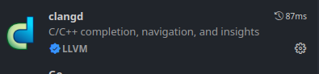
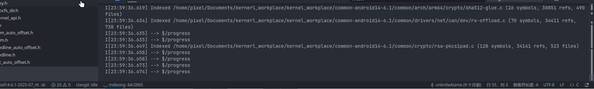

# Clangd
Clangd是一个C++的语言服务器，他为C++语言提供了代码完成、编译错误、转到定义等功能。
## Clangd 安装
## VScode安装Clangd插件

安装即可

setting中可以制定clangd的path
# 生成compile\_commands.json
​`compile_commands.json`​ 是一个用于描述项目中每个源文件的编译信息的 JSON 文件，能够帮助clangd理解我们的代码
安卓内核有两种编译系统，make 和 bazel，两个构建系统均内置了生成compile\_commands.json的工具
## make
脚本位于`common/scripts/clang-tools/gen_compile_commands.py`​
执行时需要注意`使用-d参数来指定目录`​
例如：
​`common/scripts/clang-tools/gen_compile_commands.py -d ./out/android13-5.10/common/`​
## bazel
在bazel构建系统中则内置了`kernel_compile_commands`​这样一个target，专门用来生成`compile_commands.json`​
直接在内核根目录下执行
​`tools/bazel run //common:kernel_x86_64_compile_commands`​
# compile\_commands.json的使用
VScode直接打开内核根目录
这时VScode的clangd插件便会自动识别`compile_commands.json`​，然后进行索引，等待索引完成
索引完成后，代码错误基本消除，代码提示和符号跳转也可以正常使用
