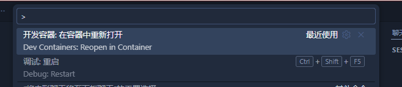

[Ylarod/ddk: 内核驱动开发工具包 (Kernel Driver Development Kit)](https://github.com/Ylarod/ddk/)

DDK预编译了所有GKI版本的内核，并且封装为docker Image以便使用

下面介绍下DDK在本地使用的几种方法

# 使用ddk script

DDK提供了一个便携脚本ddk，封装了常用的docker命令

​`ddk build命令实际上是在容器内执行make，记得写好Makefile和Kbuild`

安装（macOS/Linux）：

```shell
# 将 ddk 安装到 /usr/local/bin 并赋予可执行权限
sudo curl -fsSL https://raw.githubusercontent.com/Ylarod/ddk/main/scripts/ddk -o /usr/local/bin/ddk
sudo chmod +x /usr/local/bin/ddk
```

用法示例：

```shell
# 拉取镜像
ddk pull android12-5.10

# 进入项目目录
cd /path/to/source

# 构建
ddk build --target android12-5.10

# 传递 make 参数
ddk build --target android12-5.10 -- CFLAGS=-O2

# 清理
ddk clean --target android12-5.10

# 交互式 shell
ddk shell --target android12-5.10
```

如果你不想在每次命令中传入 target，可以设置环境变量 `DDK_TARGET`：

```shell
export DDK_TARGET=android12-5.10
ddk build   # 会使用 DDK_TARGET
```

# 使用 Dev Container 开发环境

> Dev containers 是一种用于开发的容器化环境，通常用于在一致的开发环境中运行项目。它是通过 Docker 容器技术实现的，能够将开发所需的所有依赖（如工具、库、环境变量等）封装在一个容器中，从而保证不同开发者之间环境的一致性。

需要VSCode安装 Dev Container 插件


之后在打开包含`.devcontainer/devcontainer.json`的项目时就可以选择在容器中打开



对于这种方法，ddk自带了一个模板

[Ylarod/ddk-module-template: DDK 内核模块开发模块](https://github.com/Ylarod/ddk-module-template)

## 使用打包好的image

ddk自带的模板就是这种形式，只需要修改 `.devcontainer/devcontainer.json`​ 中的 `android12-5.10` 即可

​`这种情况下，所需的环境变量已经被内置，无需执行source envsetup.sh`

```json
{
  "name": "ddk-module-dev",
  "image": "ghcr.io/ylarod/ddk:android12-5.10",
  "remoteUser": "root",
  "postCreateCommand": "echo Devcontainer ready",
  "customizations": {
    "vscode": {
      "extensions": [
        "github.copilot",
        "github.copilot-chat",
        "github.vscode-github-actions",
        "llvm-vs-code-extensions.vscode-clangd",
        "ms-azuretools.vscode-containers",
        "ms-azuretools.vscode-docker",
        "ms-ceintl.vscode-language-pack-zh-hans"
      ]
    }
  }
}
```

## 使用 ddk-builder 自行组装镜像

​`注意：这种方法会在不同项目中重复构建镜像，即使features的内容是完全相同的`

官方同样给了示例，在[ddk/module_template at main · Ylarod/ddk](https://github.com/Ylarod/ddk/tree/main/module_template) 中使用的就是这个方式

我们需要修改 `features` 中的内容来组装镜像，可以添加多个版本的clang和内核src

两者均会被放到 `/opt/ddk` 目录下

```json
{
  "name": "ddk-module-dev",
  "image": "docker.cnb.cool/ylarod/ddk/ddk-builder:latest",
  "features": {
    "ghcr.io/ylarod/ddk/features/ddk-clang:latest": {
      "clangVer": "clang-r416183b",
      "setDefault": true
    },
    "ghcr.io/ylarod/ddk/features/ddk-src:latest": {
      "androidVer": "android12-5.10",
      "withKdir": true,
      "setDefault": true
    }
  },
  "remoteUser": "root",
  "postCreateCommand": "echo Devcontainer ready",
  "customizations": {
    "vscode": {
      "extensions": [
        "github.copilot",
        "github.copilot-chat",
        "github.vscode-github-actions",
        "llvm-vs-code-extensions.vscode-clangd",
        "ms-azuretools.vscode-containers",
        "ms-azuretools.vscode-docker",
        "ms-ceintl.vscode-language-pack-zh-hans"
      ]
    }
  }
}
```

同时还需要修改 `envsetup.sh`​ 的内容，并且需要手动执行`source envsetup.sh` 

```shell
export DDK_ROOT=/opt/ddk

export KDIR=$DDK_ROOT/kdir/android12-5.10
export CLANG_PATH=$DDK_ROOT/clang/clang-r416183b/bin

# export KDIR=$DDK_ROOT/kdir/android13-5.15
# export CLANG_PATH=$DDK_ROOT/clang/clang-r450784e/bin

# export KDIR=$DDK_ROOT/kdir/android14-6.1
# export CLANG_PATH=$DDK_ROOT/clang/clang-r487747c/bin

export PATH=$CLANG_PATH:$PATH
export CROSS_COMPILE=aarch64-linux-gnu-
export ARCH=arm64
export LLVM=1
export LLVM_IAS=1
```

‍
