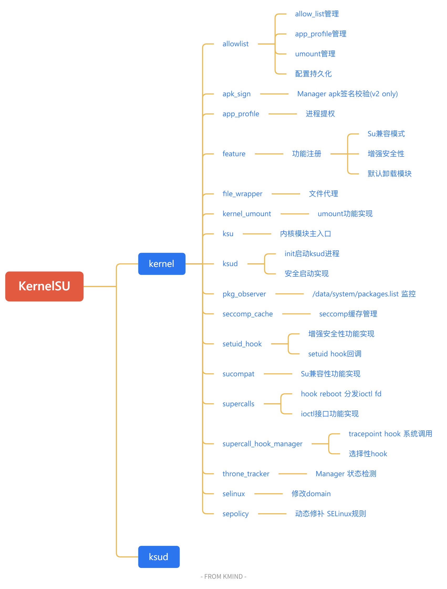
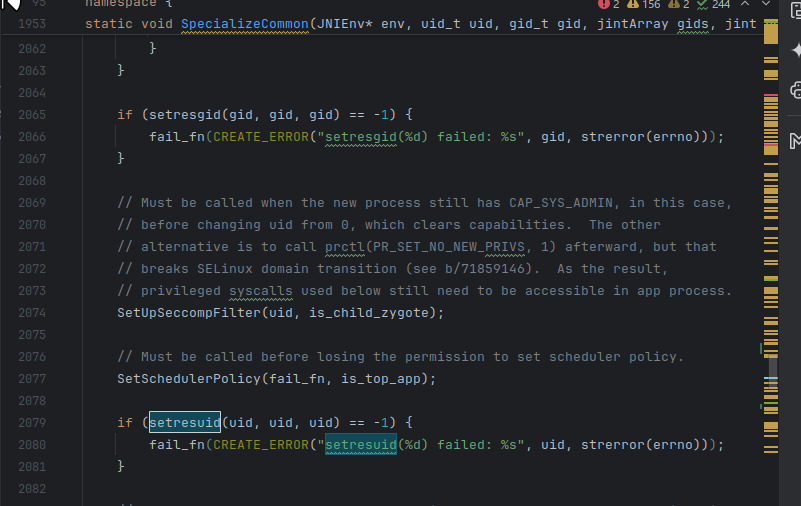
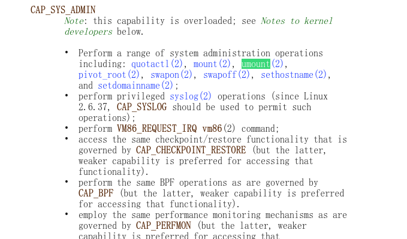

​`本文为一个新手阅读ksu源码过程中的随笔，不足之处还请纠正`

​`KernelSU`​ 基于commit：`cf0bb45f6b1b5275c040ff980e56cd630707cd04 (tag: v3.0.0)`

‍



# KernelSU

## kernel部分


### allowlist

```h
#ifndef __KSU_H_ALLOWLIST
#define __KSU_H_ALLOWLIST

#include <linux/types.h>
#include <linux/uidgid.h>
#include "app_profile.h"

#define PER_USER_RANGE 100000
#define FIRST_APPLICATION_UID 10000
#define LAST_APPLICATION_UID 19999
#define FIRST_ISOLATED_UID 99000
#define LAST_ISOLATED_UID 99999

void ksu_allowlist_init(void);//初始化allowlist链表

void ksu_allowlist_exit(void);//清理allowlist链表

void ksu_load_allow_list(void);//加载allowlist文件到链表，路径：/data/adb/ksu/.allowlist

void ksu_show_allow_list(void);//打印allowlist链表内容到日志

// Check if the uid is in allow list
bool __ksu_is_allow_uid(uid_t uid);
#define ksu_is_allow_uid(uid) unlikely(__ksu_is_allow_uid(uid))

// Check if the uid is in allow list, or current is ksu domain root
bool __ksu_is_allow_uid_for_current(uid_t uid);
#define ksu_is_allow_uid_for_current(uid) unlikely(__ksu_is_allow_uid_for_current(uid))

bool ksu_get_allow_list(int *array, int *length, bool allow);

void ksu_prune_allowlist(bool (*is_uid_exist)(uid_t, char *, void *), void *data);//清理无用的allowlist条目

bool ksu_get_app_profile(struct app_profile *);//获取指定uid的app profile
bool ksu_set_app_profile(struct app_profile *, bool persist);//设置指定uid的app profile

bool ksu_uid_should_umount(uid_t uid);//是否执行umount操作
struct root_profile *ksu_get_root_profile(uid_t uid);//获取授予root权限的app的app profile

static inline bool is_appuid(uid_t uid)
{
    uid_t appid = uid % PER_USER_RANGE;
    return appid >= FIRST_APPLICATION_UID && appid <= LAST_APPLICATION_UID;
}

static inline bool is_isolated_process(uid_t uid)
{
    uid_t appid = uid % PER_USER_RANGE;
    return appid >= FIRST_ISOLATED_UID && appid <= LAST_ISOLATED_UID;
}
#endif

```

这个模块是ksu权限管理的核心，实现了allow_list的管理

这之中主要使用了三种数据结构

```c
struct perm_data {
    struct list_head list;
    struct app_profile profile;
};
static struct list_head allow_list;

static uint8_t allow_list_bitmap[PAGE_SIZE] __read_mostly __aligned(PAGE_SIZE);

static int allow_list_arr[PAGE_SIZE / sizeof(int)] __read_mostly;
```

|数据结构|作用|特点|
| ------------| ---------------------------------------------------------| -----------------------------------------------------------|
|​`allow_list_bitmap`|**位图缓存**。专门用于 UID \< 32768 的普通应用。|**查询速度 O(1)** 。|
|​`allow_list_arr`|**数组缓存**。专门用于 UID \> 32768 的特殊应用（如多用户分身）。|**查询速度 O(n)** 。弥补位图范围的不足。|
|​`allow_list`(链表)|**完整数据库**。存储所有的`app_profile`配置细节。|**查询速度 O(n)** 。**存储全量信息**。包含 UID、包名、SELinux 域、Capabilities 等所有细节。|

前两者用于快速判定某个uid是否被manager配置（su, app_profile, umount）

allow_list这个链表存储了完整的app_profile信息，供其他模块调用获取某个uid的配置信息

### app_sign

```c
#ifndef __KSU_H_APK_V2_SIGN
#define __KSU_H_APK_V2_SIGN

#include <linux/types.h>

bool is_manager_apk(char *path);

#endif

```

只有一个功能，根据传入的apk来判断其是否为官方manager

```c
bool is_manager_apk(char *path)
{
    return check_v2_signature(path, EXPECTED_SIZE, EXPECTED_HASH);
}
```

```c
static __always_inline bool check_v2_signature(char *path,
                           unsigned expected_size,
                           const char *expected_sha256)
{
    unsigned char buffer[0x11] = { 0 };
    u32 size4;
    u64 size8, size_of_block;

    loff_t pos;

    bool v2_signing_valid = false;
    int v2_signing_blocks = 0;
    bool v3_signing_exist = false;
    bool v3_1_signing_exist = false;
	/*
		............
	*/

    if (v2_signing_valid) {
        int has_v1_signing = has_v1_signature_file(fp);
        if (has_v1_signing) {
            pr_err("Unexpected v1 signature scheme found!\n");
            filp_close(fp, 0);
            return false;
        }
    }
clean:
    filp_close(fp, 0);

    if (v3_signing_exist || v3_1_signing_exist) {
#ifdef CONFIG_KSU_DEBUG
        pr_err("Unexpected v3 signature scheme found!\n");
#endif
        return false;
    }

    return v2_signing_valid;
}
```

仅允许v2签名存在，v1/v3/v3.1均会直接返回false

### app_profile

```h
#ifndef __KSU_H_APP_PROFILE
#define __KSU_H_APP_PROFILE

#include <linux/types.h>

// Forward declarations
struct cred;

#define KSU_APP_PROFILE_VER 2
#define KSU_MAX_PACKAGE_NAME 256
// NGROUPS_MAX for Linux is 65535 generally, but we only supports 32 groups.
#define KSU_MAX_GROUPS 32
#define KSU_SELINUX_DOMAIN 64

struct root_profile {
	int32_t uid;
	int32_t gid;

	int32_t groups_count;
	int32_t groups[KSU_MAX_GROUPS];

	// kernel_cap_t is u32[2] for capabilities v3
	struct {
		u64 effective;
		u64 permitted;
		u64 inheritable;
	} capabilities;

	char selinux_domain[KSU_SELINUX_DOMAIN];

	int32_t namespaces;
};

struct non_root_profile {
	bool umount_modules;
};

struct app_profile {
	// It may be utilized for backward compatibility, although we have never explicitly made any promises regarding this.
	u32 version;

	// this is usually the package of the app, but can be other value for special apps
	char key[KSU_MAX_PACKAGE_NAME];
	int32_t current_uid;
	bool allow_su;

	union {
		struct {
			bool use_default;
			char template_name[KSU_MAX_PACKAGE_NAME];

			struct root_profile profile;
		} rp_config;

		struct {
			bool use_default;

			struct non_root_profile profile;
		} nrp_config;
	};
};

// Escalate current process to root with the appropriate profile
void escape_with_root_profile(void);

#endif

```

只有一个功能，将当前进程提权到 `app_profile` 中定义的权限

```c
void escape_with_root_profile(void)
{
	struct cred *cred;
	struct task_struct *p = current;
	struct task_struct *t;

	cred = prepare_creds();
	if (!cred) {
		pr_warn("prepare_creds failed!\n");
		return;
	}

	if (cred->euid.val == 0) {
		pr_warn("Already root, don't escape!\n");
		abort_creds(cred);
		return;
	}

	struct root_profile *profile = ksu_get_root_profile(cred->uid.val);

	cred->uid.val = profile->uid;
	cred->suid.val = profile->uid;
	cred->euid.val = profile->uid;
	cred->fsuid.val = profile->uid;

	cred->gid.val = profile->gid;
	cred->fsgid.val = profile->gid;
	cred->sgid.val = profile->gid;
	cred->egid.val = profile->gid;
	cred->securebits = 0;

	BUILD_BUG_ON(sizeof(profile->capabilities.effective) !=
		     sizeof(kernel_cap_t));

	// setup capabilities
	// we need CAP_DAC_READ_SEARCH becuase `/data/adb/ksud` is not accessible for non root process
	// we add it here but don't add it to cap_inhertiable, it would be dropped automaticly after exec!
	u64 cap_for_ksud = profile->capabilities.effective | CAP_DAC_READ_SEARCH;
	memcpy(&cred->cap_effective, &cap_for_ksud, sizeof(cred->cap_effective));
	memcpy(&cred->cap_permitted, &profile->capabilities.effective,
	       sizeof(cred->cap_permitted));
	memcpy(&cred->cap_bset, &profile->capabilities.effective,
	       sizeof(cred->cap_bset));

	setup_groups(profile, cred);

	commit_creds(cred);

	// Refer to kernel/seccomp.c: seccomp_set_mode_strict
	// When disabling Seccomp, ensure that current->sighand->siglock is held during the operation.
	spin_lock_irq(&current->sighand->siglock);
	disable_seccomp();
	spin_unlock_irq(&current->sighand->siglock);

	setup_selinux(profile->selinux_domain);

	for_each_thread (p, t) {
		ksu_set_task_tracepoint_flag(t);
	}
}
```

这实际突破了三种限制  **​`传统 Linux 权限`​**​   **​`Seccomp`​**​   **​`SELinux`​**

#### 传统linux权限

##### 设置uid / gid / group

[User identifier](https://en.wikipedia.org/wiki/User_identifier)

设置为profile中定义的uid gid group

##### 设置capabilities

[linux 安全特性 capability 能力级](https://zhuanlan.zhihu.com/p/24562897128)

设置为profile中定义的capabilities

这里有一处地方

```c
	// we need CAP_DAC_READ_SEARCH becuase `/data/adb/ksud` is not accessible for non root process
	// we add it here but don't add it to cap_inhertiable, it would be dropped automaticly after exec!
	u64 cap_for_ksud = profile->capabilities.effective | CAP_DAC_READ_SEARCH;
	memcpy(&cred->cap_effective, &cap_for_ksud, sizeof(cred->cap_effective));
```

> ​**​`cap_dac_read_search`​**​ **功能可让用户读取文件系统中的任意文件，包括 root 拥有的所有文件。**

并且这里没有把**​`cap_dac_read_search`​**​ 加入 `cap_inhertiable`​ （可继承集合），这使得进程在运行 ksud 后即刻失去了**​`cap_dac_read_search`​** 能力

##### 为什么要给进程添加**​`cap_dac_read_search`​** 能力？

实际上 ksu hook了`execve`​ 这个系统调用，重定向 `su`​ 和 `/system/bin/su`​ 命令到了 `/data/adb/ksud`

而 ksu 引入了 `app_profile`​ 机制，提权后并不一定是root进程，所以必须添加 **​`cap_dac_read_search`​**​ 能力保证执行su的进程均能访问到`/data/adb/ksud`

详见`syscall_hook_manager`模块

#### **Seccomp**

```c
static void disable_seccomp(void)
{
	assert_spin_locked(&current->sighand->siglock);
	// disable seccomp
#if defined(CONFIG_GENERIC_ENTRY) &&                                           \
	LINUX_VERSION_CODE >= KERNEL_VERSION(5, 11, 0)
	clear_syscall_work(SECCOMP);
#else
	clear_thread_flag(TIF_SECCOMP);
#endif

#ifdef CONFIG_SECCOMP
	current->seccomp.mode = 0;
	current->seccomp.filter = NULL;
	atomic_set(&current->seccomp.filter_count, 0);
#else
#endif
}
```

清除seccomp标志位并且直接关闭当前进程的seccomp

#### SELinux

调用 `setup_selinux` 更改domain

详见`selinux`

### feature

```c
#ifndef __KSU_H_FEATURE
#define __KSU_H_FEATURE

#include <linux/types.h>

enum ksu_feature_id {
    KSU_FEATURE_SU_COMPAT = 0,
    KSU_FEATURE_KERNEL_UMOUNT = 1,
    KSU_FEATURE_ENHANCED_SECURITY = 2,

    KSU_FEATURE_MAX
};

typedef int (*ksu_feature_get_t)(u64 *value);
typedef int (*ksu_feature_set_t)(u64 value);

struct ksu_feature_handler {
    u32 feature_id;
    const char *name;
    ksu_feature_get_t get_handler;
    ksu_feature_set_t set_handler;
};
//注册功能
int ksu_register_feature_handler(const struct ksu_feature_handler *handler);
//注销功能
int ksu_unregister_feature_handler(u32 feature_id);
//获取功能状态
int ksu_get_feature(u32 feature_id, u64 *value, bool *supported);
//设置功能状态
int ksu_set_feature(u32 feature_id, u64 value);

void ksu_feature_init(void);

void ksu_feature_exit(void);

#endif // __KSU_H_FEATURE

```

这个模块实现了一个可拓展的功能管理框架

目前有三个功能：

Su兼容模式    -> sucompat模块

内核umount  -> kernel_umount模块

增强安全性     -> setuid_hook模块

‍

manager通过ioctl来调用get_feature和set_feature来控制功能是否开启

详见supercalls模块

### kernel_umount

直接看功能实现函数

```c
int ksu_handle_umount(uid_t old_uid, uid_t new_uid)
{
    struct umount_tw *tw;

    // if there isn't any module mounted, just ignore it!
    if (!ksu_module_mounted) {
        return 0;
    }

    if (!ksu_kernel_umount_enabled) {
        return 0;
    }

    // There are 5 scenarios:
    // 1. Normal app: zygote -> appuid
    // 2. Isolated process forked from zygote: zygote -> isolated_process
    // 3. App zygote forked from zygote: zygote -> appuid
    // 4. Isolated process froked from app zygote: appuid -> isolated_process (already handled by 3)
    // 5. Isolated process froked from webview zygote (no need to handle, app cannot run custom code)
    if (!is_appuid(new_uid) && !is_isolated_process(new_uid)) {
        return 0;
    }

    if (!ksu_uid_should_umount(new_uid) && !is_isolated_process(new_uid)) {
        return 0;
    }

    // check old process's selinux context, if it is not zygote, ignore it!
    // because some su apps may setuid to untrusted_app but they are in global mount namespace
    // when we umount for such process, that is a disaster!
    // also handle case 4 and 5
    bool is_zygote_child = is_zygote(get_current_cred());
    if (!is_zygote_child) {
        pr_info("handle umount ignore non zygote child: %d\n", current->pid);
        return 0;
    }
    // umount the target mnt
    pr_info("handle umount for uid: %d, pid: %d\n", new_uid, current->pid);

    tw = kzalloc(sizeof(*tw), GFP_ATOMIC);
    if (!tw)
        return 0;

    tw->old_cred = get_current_cred();
    tw->cb.func = umount_tw_func;

    int err = task_work_add(current, &tw->cb, TWA_RESUME);
    if (err) {
        if (tw->old_cred) {
            put_cred(tw->old_cred);
        }
        kfree(tw);
        pr_warn("unmount add task_work failed\n");
    }

    return 0;
}
```

这个函数在`setuid`​这个系统调用被触发后调用，详见 `setuid_hook` 模块

注释列出了5中情形，其中只需要处理1、2、3三种即可

这里其实有一个问题， `task_work_add` 添加的回调，会在返回用户态前再执行，也就是说在这个回调被执行时，setuid系统调用已经执行完成

而在zygote孵化子进程的核心函数 SpecializeCommon中



注释说，在setuid的系统调用后，进程的权能将被清空



而进行 `mount/umount`​ 需要 `CAP_SYS_ADMIN` 这个权能

所以此时其实是没办法进行mount/umount操作的

```c
static void umount_tw_func(struct callback_head *cb)
{
    struct umount_tw *tw = container_of(cb, struct umount_tw, cb);
    const struct cred *saved = NULL;
    if (tw->old_cred) {
        saved = override_creds(tw->old_cred);
    }

    struct mount_entry *entry;
    down_read(&mount_list_lock);
    list_for_each_entry(entry, &mount_list, list) {
        pr_info("%s: unmounting: %s flags 0x%x\n", __func__, entry->umountable, entry->flags);
        try_umount(entry->umountable, entry->flags);
    }
    up_read(&mount_list_lock);

    if (saved)
        revert_creds(saved);

    if (tw->old_cred)
        put_cred(tw->old_cred);

    kfree(tw);
}

```

所以ksu提前备份了 `setuid`​ 之前的 `cred`​，在执行umount替换当前 `cred`​，执行完 `umount`​ 操作后再恢复 `cred`

这样就确保了能够正常进行umount操作

### ksu

```c
#include <linux/export.h>
#include <linux/fs.h>
#include <linux/kobject.h>
#include <linux/module.h>
#include <linux/workqueue.h>

#include "allowlist.h"
#include "feature.h"
#include "klog.h" // IWYU pragma: keep
#include "throne_tracker.h"
#include "syscall_hook_manager.h"
#include "ksud.h"
#include "supercalls.h"

int __init kernelsu_init(void)
{
#ifdef CONFIG_KSU_DEBUG
    pr_alert("*************************************************************");
    pr_alert("**     NOTICE NOTICE NOTICE NOTICE NOTICE NOTICE NOTICE    **");
    pr_alert("**                                                         **");
    pr_alert("**         You are running KernelSU in DEBUG mode          **");
    pr_alert("**                                                         **");
    pr_alert("**     NOTICE NOTICE NOTICE NOTICE NOTICE NOTICE NOTICE    **");
    pr_alert("*************************************************************");
#endif

    ksu_feature_init();

    ksu_supercalls_init();

    ksu_syscall_hook_manager_init();

    ksu_allowlist_init();

    ksu_throne_tracker_init();

    ksu_ksud_init();

#ifdef MODULE
#ifndef CONFIG_KSU_DEBUG
    kobject_del(&THIS_MODULE->mkobj.kobj);
#endif
#endif
    return 0;
}

extern void ksu_observer_exit(void);
void kernelsu_exit(void)
{
    ksu_allowlist_exit();

    ksu_throne_tracker_exit();

    ksu_observer_exit();

    ksu_ksud_exit();

    ksu_syscall_hook_manager_exit();

    ksu_supercalls_exit();

    ksu_feature_exit();
}

module_init(kernelsu_init);
module_exit(kernelsu_exit);

MODULE_LICENSE("GPL");
MODULE_AUTHOR("weishu");
MODULE_DESCRIPTION("Android KernelSU");
#if LINUX_VERSION_CODE >= KERNEL_VERSION(6, 13, 0)
MODULE_IMPORT_NS("VFS_internal_I_am_really_a_filesystem_and_am_NOT_a_driver");
#else
MODULE_IMPORT_NS(VFS_internal_I_am_really_a_filesystem_and_am_NOT_a_driver);
#endif


```

整个内核模块的入口和出口

```c
#ifdef MODULE
#ifndef CONFIG_KSU_DEBUG
    kobject_del(&THIS_MODULE->mkobj.kobj);
#endif
#endif
```

隐藏自身内核模块

### ksud

```c
#ifndef __KSU_H_KSUD
#define __KSU_H_KSUD

#include <linux/types.h>

#define KSUD_PATH "/data/adb/ksud"

void ksu_ksud_init();
void ksu_ksud_exit();

void on_post_fs_data(void);
void on_module_mounted(void);
void on_boot_completed(void);

bool ksu_is_safe_mode(void);

int nuke_ext4_sysfs(const char* mnt);

extern u32 ksu_file_sid;
extern bool ksu_module_mounted;
extern bool ksu_boot_completed;

#endif

```

主要实现了三类功能

#### init进程监控

```c
// IMPORTANT NOTE: the call from execve_handler_pre WON'T provided correct value for envp and flags in GKI version
int ksu_handle_execveat_ksud(int *fd, struct filename **filename_ptr,
                             struct user_arg_ptr *argv,
                             struct user_arg_ptr *envp, int *flags)
{
    struct filename *filename;

    static const char app_process[] = "/system/bin/app_process";
    static bool first_app_process = true;

    /* This applies to versions Android 10+ */
    static const char system_bin_init[] = "/system/bin/init";
    /* This applies to versions between Android 6 ~ 9  */
    static const char old_system_init[] = "/init";
    static bool init_second_stage_executed = false;

    if (!filename_ptr)
        return 0;

    filename = *filename_ptr;
    if (IS_ERR(filename)) {
        return 0;
    }

    if (unlikely(!memcmp(filename->name, system_bin_init,
                         sizeof(system_bin_init) - 1) &&
                 argv)) {
        // /system/bin/init executed
        int argc = count(*argv, MAX_ARG_STRINGS);
        pr_info("/system/bin/init argc: %d\n", argc);
        if (argc > 1 && !init_second_stage_executed) {
            const char __user *p = get_user_arg_ptr(*argv, 1);
            if (p && !IS_ERR(p)) {
                char first_arg[16];
                strncpy_from_user_nofault(first_arg, p, sizeof(first_arg));
                pr_info("/system/bin/init first arg: %s\n", first_arg);
                if (!strcmp(first_arg, "second_stage")) {
                    pr_info("/system/bin/init second_stage executed\n");
                    apply_kernelsu_rules();
                    init_second_stage_executed = true;
                }
            } else {
                pr_err("/system/bin/init parse args err!\n");
            }
        }
    } else if (unlikely(!memcmp(filename->name, old_system_init,
                                sizeof(old_system_init) - 1) &&
                        argv)) {
        // /init executed
        int argc = count(*argv, MAX_ARG_STRINGS);
        pr_info("/init argc: %d\n", argc);
        if (argc > 1 && !init_second_stage_executed) {
            /* This applies to versions between Android 6 ~ 7 */
            const char __user *p = get_user_arg_ptr(*argv, 1);
            if (p && !IS_ERR(p)) {
                char first_arg[16];
                strncpy_from_user_nofault(first_arg, p, sizeof(first_arg));
                pr_info("/init first arg: %s\n", first_arg);
                if (!strcmp(first_arg, "--second-stage")) {
                    pr_info("/init second_stage executed\n");
                    apply_kernelsu_rules();
                    init_second_stage_executed = true;
                }
            } else {
                pr_err("/init parse args err!\n");
            }
        } else if (argc == 1 && !init_second_stage_executed && envp) {
            /* This applies to versions between Android 8 ~ 9  */
            int envc = count(*envp, MAX_ARG_STRINGS);
            if (envc > 0) {
                int n;
                for (n = 1; n <= envc; n++) {
                    const char __user *p = get_user_arg_ptr(*envp, n);
                    if (!p || IS_ERR(p)) {
                        continue;
                    }
                    char env[256];
                    // Reading environment variable strings from user space
                    if (strncpy_from_user_nofault(env, p, sizeof(env)) < 0)
                        continue;
                    // Parsing environment variable names and values
                    char *env_name = env;
                    char *env_value = strchr(env, '=');
                    if (env_value == NULL)
                        continue;
                    // Replace equal sign with string terminator
                    *env_value = '\0';
                    env_value++;
                    // Check if the environment variable name and value are matching
                    if (!strcmp(env_name, "INIT_SECOND_STAGE") &&
                        (!strcmp(env_value, "1") ||
                         !strcmp(env_value, "true"))) {
                        pr_info("/init second_stage executed\n");
                        apply_kernelsu_rules();
                        init_second_stage_executed = true;
                    }
                }
            }
        }
    }

    if (unlikely(first_app_process && !memcmp(filename->name, app_process,
                                              sizeof(app_process) - 1))) {
        first_app_process = false;
        pr_info("exec app_process, /data prepared, second_stage: %d\n",
                init_second_stage_executed);
        struct task_struct *init_task;
        rcu_read_lock();
        init_task = rcu_dereference(current->real_parent);
        if (init_task) {
            task_work_add(init_task, &on_post_fs_data_cb, TWA_RESUME);
        }
        rcu_read_unlock();

        stop_execve_hook();
    }

    return 0;
}

static int sys_execve_handler_pre(struct kprobe *p, struct pt_regs *regs)
{
    struct pt_regs *real_regs = PT_REAL_REGS(regs);
    const char __user **filename_user =
        (const char **)&PT_REGS_PARM1(real_regs);
    const char __user *const __user *__argv =
        (const char __user *const __user *)PT_REGS_PARM2(real_regs);
    struct user_arg_ptr argv = { .ptr.native = __argv };
    struct filename filename_in, *filename_p;
    char path[32];
    long ret;
    unsigned long addr;
    const char __user *fn;

    if (!filename_user)
        return 0;

    addr = untagged_addr((unsigned long)*filename_user);
    fn = (const char __user *)addr;

    memset(path, 0, sizeof(path));
    ret = strncpy_from_user_nofault(path, fn, 32);
    if (ret < 0 && try_set_access_flag(addr)) {
        ret = strncpy_from_user_nofault(path, fn, 32);
    }
    if (ret < 0) {
        pr_err("Access filename failed for execve_handler_pre\n");
        return 0;
    }
    filename_in.name = path;

    filename_p = &filename_in;
    return ksu_handle_execveat_ksud(AT_FDCWD, &filename_p, &argv, NULL, NULL);
}

```

ksu hook了`sys_execve` 这个系统调用

‍

当执行init第二阶段时调用 `apply_kernelsu_rules` 来添加ksu自带的SELinux规则，详见SELinux模块

当执行到 `app_process` 说明init进程已完成，

此时调用`on_post_fs_data`​ 并且停止hook `sys_execve`

```c
void on_post_fs_data(void)
{
    static bool done = false;
    if (done) {
        pr_info("on_post_fs_data already done\n");
        return;
    }
    done = true;
    pr_info("on_post_fs_data!\n");
    ksu_load_allow_list();//加载ksu的配置列表
    ksu_observer_init();//开始监控manager是否存在
    // sanity check, this may influence the performance
    stop_input_hook();//停止安全模式案件监控

    ksu_file_sid = ksu_get_ksu_file_sid();
    pr_info("ksu_file sid: %d\n", ksu_file_sid);
}
```

#### ksud启动

```c
static int ksu_handle_vfs_read(struct file **file_ptr, char __user **buf_ptr,
                               size_t *count_ptr, loff_t **pos)
{
    struct file *file;
    char __user *buf;
    size_t count;

    if (strcmp(current->comm, "init")) {
        // we are only interest in `init` process
        return 0;
    }

    file = *file_ptr;
    if (IS_ERR(file)) {
        return 0;
    }

    if (!d_is_reg(file->f_path.dentry)) {
        return 0;
    }

    const char *short_name = file->f_path.dentry->d_name.name;
    if (strcmp(short_name, "atrace.rc")) {
        // we are only interest `atrace.rc` file name file
        return 0;
    }
    char path[256];
    char *dpath = d_path(&file->f_path, path, sizeof(path));

    if (IS_ERR(dpath)) {
        return 0;
    }

    if (strcmp(dpath, "/system/etc/init/atrace.rc")) {
        return 0;
    }

    // we only process the first read
    static bool rc_inserted = false;
    if (rc_inserted) {
        // we don't need this kprobe, unregister it!
        stop_vfs_read_hook();
        return 0;
    }
    rc_inserted = true;

    // now we can sure that the init process is reading
    // `/system/etc/init/atrace.rc`
    buf = *buf_ptr;
    count = *count_ptr;

    size_t rc_count = strlen(KERNEL_SU_RC);

    pr_info("vfs_read: %s, comm: %s, count: %zu, rc_count: %zu\n", dpath,
            current->comm, count, rc_count);

    if (count < rc_count) {
        pr_err("count: %zu < rc_count: %zu\n", count, rc_count);
        return 0;
    }

    size_t ret = copy_to_user(buf, KERNEL_SU_RC, rc_count);
    if (ret) {
        pr_err("copy ksud.rc failed: %zu\n", ret);
        return 0;
    }

    // we've succeed to insert ksud.rc, now we need to proxy the read and modify the result!
    // But, we can not modify the file_operations directly, because it's in read-only memory.
    // We just replace the whole file_operations with a proxy one.
    memcpy(&fops_proxy, file->f_op, sizeof(struct file_operations));
    orig_read = file->f_op->read;
    if (orig_read) {
        fops_proxy.read = read_proxy;
    }
    orig_read_iter = file->f_op->read_iter;
    if (orig_read_iter) {
        fops_proxy.read_iter = read_iter_proxy;
    }
    // replace the file_operations
    file->f_op = &fops_proxy;
    read_count_append = rc_count;

    *buf_ptr = buf + rc_count;
    *count_ptr = count - rc_count;

    return 0;
}
```

ksu hook了`sys_read`​ 这个系统调用，用来监控 `init` 过程中的文件读取

在 `init`​ 读取 `atrace.rc`​ 时，将 `KERNEL_SU_RC` 插入原本的rc中

由于我们无法直接操作file_operation结构体中的成员，所以我们必须直接替换file结构体中的`file_operation`​ 指针，指向我们自定义的`file_operation`结构体

```c
struct file {
	union {
		struct llist_node	f_llist;
		struct rcu_head 	f_rcuhead;
		unsigned int 		f_iocb_flags;
	};
	struct path		f_path;
	struct inode		*f_inode;	/* cached value */
	const struct file_operations	*f_op;      /*替换他*/

	/*
	 * Protects f_ep, f_flags.
	 * Must not be taken from IRQ context.
	 */
	spinlock_t		f_lock;
	atomic_long_t		f_count;
	unsigned int 		f_flags;
	fmode_t			f_mode;
	struct mutex		f_pos_lock;
	loff_t			f_pos;
	struct fown_struct	f_owner;
	const struct cred	*f_cred;
	struct file_ra_state	f_ra;

	u64			f_version;
#ifdef CONFIG_SECURITY
	void			*f_security;
#endif
	/* needed for tty driver, and maybe others */
	void			*private_data;

#ifdef CONFIG_EPOLL
	/* Used by fs/eventpoll.c to link all the hooks to this file */
	struct hlist_head	*f_ep;
#endif /* #ifdef CONFIG_EPOLL */
	struct address_space	*f_mapping;
	errseq_t		f_wb_err;
	errseq_t		f_sb_err; /* for syncfs */

	ANDROID_KABI_RESERVE(1);
	ANDROID_KABI_RESERVE(2);
}
```

```c
static ssize_t read_proxy(struct file *file, char __user *buf, size_t count,
                          loff_t *pos)
{
    bool first_read = file->f_pos == 0;
    ssize_t ret = orig_read(file, buf, count, pos);
    if (first_read) {
        pr_info("read_proxy append %ld + %ld\n", ret, read_count_append);
        ret += read_count_append;
    }
    return ret;
}

static ssize_t read_iter_proxy(struct kiocb *iocb, struct iov_iter *to)
{
    bool first_read = iocb->ki_pos == 0;
    ssize_t ret = orig_read_iter(iocb, to);
    if (first_read) {
        pr_info("read_iter_proxy append %ld + %ld\n", ret, read_count_append);
        ret += read_count_append;
    }
    return ret;
}
```

代理了read和read_iter使其返回正确的长度

```c
static const char KERNEL_SU_RC[] =
    "\n"

    "on post-fs-data\n"
    "    start logd\n"
    // We should wait for the post-fs-data finish
    "    exec u:r:su:s0 root -- " KSUD_PATH " post-fs-data\n"
    "\n"

    "on nonencrypted\n"
    "    exec u:r:su:s0 root -- " KSUD_PATH " services\n"
    "\n"

    "on property:vold.decrypt=trigger_restart_framework\n"
    "    exec u:r:su:s0 root -- " KSUD_PATH " services\n"
    "\n"

    "on property:sys.boot_completed=1\n"
    "    exec u:r:su:s0 root -- " KSUD_PATH " boot-completed\n"
    "\n"

    "\n";
```

这样， init在执行atrace.rc时，就会执行 `KERNEL_SU_RC` 的内容，在特定阶段启动ksud

#### 安全模式

```c
static struct kprobe input_event_kp = {
    .symbol_name = "input_event",
    .pre_handler = input_handle_event_handler_pre,
};
```

直接hook了input_event这个函数

```c
static unsigned int volumedown_pressed_count = 0;

static bool is_volumedown_enough(unsigned int count)
{
    return count >= 3;
}

int ksu_handle_input_handle_event(unsigned int *type, unsigned int *code,
                                  int *value)
{
    if (*type == EV_KEY && *code == KEY_VOLUMEDOWN) {
        int val = *value;
        pr_info("KEY_VOLUMEDOWN val: %d\n", val);
        if (val) {
            // key pressed, count it
            volumedown_pressed_count += 1;
            if (is_volumedown_enough(volumedown_pressed_count)) {
                stop_input_hook();
            }
        }
    }

    return 0;
}

bool ksu_is_safe_mode()
{
    static bool safe_mode = false;
    if (safe_mode) {
        // don't need to check again, userspace may call multiple times
        return true;
    }

    // stop hook first!
    stop_input_hook();

    pr_info("volumedown_pressed_count: %d\n", volumedown_pressed_count);
    if (is_volumedown_enough(volumedown_pressed_count)) {
        // pressed over 3 times
        pr_info("KEY_VOLUMEDOWN pressed max times, safe mode detected!\n");
        safe_mode = true;
        return true;
    }

    return false;
}
```

监控音量下键按下次数，次数达到三次就会进入安全模式，然后交由ksud执行安全模式的操作

### pkg_observer

```c
#define MASK_SYSTEM (FS_CREATE | FS_MOVE | FS_EVENT_ON_CHILD)

static struct watch_dir g_watch = { .path = "/data/system",
                    .mask = MASK_SYSTEM };

static int ksu_handle_inode_event(struct fsnotify_mark *mark, u32 mask,
                  struct inode *inode, struct inode *dir,
                  const struct qstr *file_name, u32 cookie)
{
    if (!file_name)
        return 0;
    if (mask & FS_ISDIR)
        return 0;
    if (file_name->len == 13 &&
        !memcmp(file_name->name, "packages.list", 13)) {
        pr_info("packages.list detected: %d\n", mask);
        track_throne(false);
    }
    return 0;
}

static const struct fsnotify_ops ksu_ops = {
    .handle_inode_event = ksu_handle_inode_event,
};


int ksu_observer_init(void)
{
    int ret = 0;

#if LINUX_VERSION_CODE >= KERNEL_VERSION(6, 0, 0)
    g = fsnotify_alloc_group(&ksu_ops, 0);
#else
    g = fsnotify_alloc_group(&ksu_ops);
#endif
    if (IS_ERR(g))
        return PTR_ERR(g);

    ret = watch_one_dir(&g_watch);
    pr_info("observer init done\n");
    return 0;
}
```

使用fsnotify监控了/data/system这个目录下文件/目录的创建移动

如果检测到`packages.list` 的变化，就会执行track_throne(false)

详见`throne_tracker`模块

### seccomp_cache

```c
#ifndef __KSU_H_KERNEL_COMPAT
#define __KSU_H_KERNEL_COMPAT

#include <linux/fs.h>
#include <linux/version.h>

extern void ksu_seccomp_clear_cache(struct seccomp_filter *filter, int nr);
extern void ksu_seccomp_allow_cache(struct seccomp_filter *filter, int nr);

#endif

```

用于清除/恢复seccomp的cache功能

### setuid_hook

```c
static bool ksu_enhanced_security_enabled = false;

static int enhanced_security_feature_get(u64 *value)
{
    *value = ksu_enhanced_security_enabled ? 1 : 0;
    return 0;
}

static int enhanced_security_feature_set(u64 value)
{
    bool enable = value != 0;
    ksu_enhanced_security_enabled = enable;
    pr_info("enhanced_security: set to %d\n", enable);
    return 0;
}

static const struct ksu_feature_handler enhanced_security_handler = {
    .feature_id = KSU_FEATURE_ENHANCED_SECURITY,
    .name = "enhanced_security",
    .get_handler = enhanced_security_feature_get,
    .set_handler = enhanced_security_feature_set,
};
```

主要是实现了增强安全性(enhanced_security)这个功能和未开启增强安全性时常规的提权

直接看功能实现函数

```c
int ksu_handle_setresuid(uid_t ruid, uid_t euid, uid_t suid)
{
    // we rely on the fact that zygote always call setresuid(3) with same uids
    uid_t new_uid = ruid;
    uid_t old_uid = current_uid().val;

    pr_info("handle_setresuid from %d to %d\n", old_uid, new_uid);

    // if old process is root, ignore it.
    if (old_uid != 0 && ksu_enhanced_security_enabled) {
        // disallow any non-ksu domain escalation from non-root to root!
        // euid is what we care about here as it controls permission
        if (unlikely(euid == 0)) {
            if (!is_ksu_domain()) {
                pr_warn("find suspicious EoP: %d %s, from %d to %d\n", 
                    current->pid, current->comm, old_uid, new_uid);
                force_sig(SIGKILL);
                return 0;
            }
        }
        // disallow appuid decrease to any other uid if it is not allowed to su
        if (is_appuid(old_uid)) {
            if (euid < current_euid().val && !ksu_is_allow_uid_for_current(old_uid)) {
                pr_warn("find suspicious EoP: %d %s, from %d to %d\n", 
                    current->pid, current->comm, old_uid, new_uid);
                force_sig(SIGKILL);
                return 0;
            }
        }
        return 0;
    }

    // if on private space, see if its possibly the manager
    if (new_uid > PER_USER_RANGE && new_uid % PER_USER_RANGE == ksu_get_manager_uid()) {
        ksu_set_manager_uid(new_uid);
    }

    if (ksu_get_manager_uid() == new_uid) {
        pr_info("install fd for manager: %d\n", new_uid);
        ksu_install_fd();
        spin_lock_irq(&current->sighand->siglock);
        ksu_seccomp_allow_cache(current->seccomp.filter, __NR_reboot);
        ksu_set_task_tracepoint_flag(current);
        spin_unlock_irq(&current->sighand->siglock);
        return 0;
    }

    if (ksu_is_allow_uid_for_current(new_uid)) {
        if (current->seccomp.mode == SECCOMP_MODE_FILTER &&
            current->seccomp.filter) {
            spin_lock_irq(&current->sighand->siglock);
            ksu_seccomp_allow_cache(current->seccomp.filter, __NR_reboot);
            spin_unlock_irq(&current->sighand->siglock);
        }
        ksu_set_task_tracepoint_flag(current);
    } else {
        ksu_clear_task_tracepoint_flag_if_needed(current);
    }

    // Handle kernel umount
    ksu_handle_umount(old_uid, new_uid);

    return 0;
}
```

开启增强安全性后，将会阻止`ksu_domain`​ 外的所有进程通过`setresuid`从非root提升到root

阻止所有app通过setresuid降低自己的euid

### sucompat

实现了su兼容性这个功能

模块内处理了三种系统调用

```c
#define SU_PATH "/system/bin/su"
int ksu_handle_faccessat(int *dfd, const char __user **filename_user, int *mode,
                         int *__unused_flags)
{
    const char su[] = SU_PATH;

    if (!ksu_is_allow_uid_for_current(current_uid().val)) {
        return 0;
    }

    char path[sizeof(su) + 1];
    memset(path, 0, sizeof(path));
    strncpy_from_user_nofault(path, *filename_user, sizeof(path));

    if (unlikely(!memcmp(path, su, sizeof(su)))) {
        pr_info("faccessat su->sh!\n");
        *filename_user = sh_user_path();
    }

    return 0;
}

int ksu_handle_stat(int *dfd, const char __user **filename_user, int *flags)
{
    // const char sh[] = SH_PATH;
    const char su[] = SU_PATH;

    if (!ksu_is_allow_uid_for_current(current_uid().val)) {
        return 0;
    }

    if (unlikely(!filename_user)) {
        return 0;
    }

    char path[sizeof(su) + 1];
    memset(path, 0, sizeof(path));
    strncpy_from_user_nofault(path, *filename_user, sizeof(path));

    if (unlikely(!memcmp(path, su, sizeof(su)))) {
        pr_info("newfstatat su->sh!\n");
        *filename_user = sh_user_path();
    }

    return 0;
}
```

在获取`/system/bin/su`​的属性时，实际上被替换为`/system/bin/sh` 的属性

```c
int ksu_handle_execve_sucompat(const char __user **filename_user,
                               void *__never_use_argv, void *__never_use_envp,
                               int *__never_use_flags)
{
    const char su[] = SU_PATH;
    const char __user *fn;
    char path[sizeof(su) + 1];
    long ret;
    unsigned long addr;

    if (unlikely(!filename_user))
        return 0;

    if (!ksu_is_allow_uid_for_current(current_uid().val))
        return 0;

    addr = untagged_addr((unsigned long)*filename_user);
    fn = (const char __user *)addr;
    memset(path, 0, sizeof(path));
    ret = strncpy_from_user_nofault(path, fn, sizeof(path));

    if (ret < 0 && try_set_access_flag(addr)) {
        ret = strncpy_from_user_nofault(path, fn, sizeof(path));
    }

    if (ret < 0 && preempt_count()) {
        /* This is crazy, but we know what we are doing:
         * Temporarily exit atomic context to handle page faults, then restore it */
        pr_info("Access filename failed, try rescue..\n");
        preempt_enable_no_resched_notrace();
        ret = strncpy_from_user(path, fn, sizeof(path));
        preempt_disable_notrace();
    }

    if (ret < 0) {
        pr_warn("Access filename when execve failed: %ld", ret);
        return 0;
    }

    if (likely(memcmp(path, su, sizeof(su))))
        return 0;

    pr_info("sys_execve su found\n");
    *filename_user = ksud_user_path();

    escape_with_root_profile();

    return 0;
}
```

当进程尝试执行`/system/bin/su` 时，filename被替换为ksud的路径，并且执行提权操作

​`ksu_su_compat_enabled`​实际上影响了`syscall_hook_manager`​模块中的`ksu_sys_enter_handler`函数

```c
tatic void ksu_sys_enter_handler(void *data, struct pt_regs *regs, long id)
{
	if (unlikely(check_syscall_fastpath(id))) {
		if (ksu_su_compat_enabled) {
			// Handle newfstatat
			if (id == __NR_newfstatat) {
				int *dfd = (int *)&PT_REGS_PARM1(regs);
				const char __user **filename_user =
					(const char __user **)&PT_REGS_PARM2(regs);
				int *flags = (int *)&PT_REGS_SYSCALL_PARM4(regs);
				ksu_handle_stat(dfd, filename_user, flags);
				return;
			}

			// Handle faccessat
			if (id == __NR_faccessat) {
				int *dfd = (int *)&PT_REGS_PARM1(regs);
				const char __user **filename_user =
					(const char __user **)&PT_REGS_PARM2(regs);
				int *mode = (int *)&PT_REGS_PARM3(regs);
				ksu_handle_faccessat(dfd, filename_user, mode, NULL);
				return;
			}

			// Handle execve
			if (id == __NR_execve) {
				const char __user **filename_user =
					(const char __user **)&PT_REGS_PARM1(regs);
				if (current->pid != 1 && is_init(get_current_cred())) {
					ksu_handle_init_mark_tracker(filename_user);
				} else {
                    ksu_handle_execve_sucompat(filename_user, NULL, NULL, NULL);
                }
				return;
			}
		}

        // Handle setresuid
		if (id == __NR_setresuid) {
			uid_t ruid = (uid_t)PT_REGS_PARM1(regs);
			uid_t euid = (uid_t)PT_REGS_PARM2(regs);
			uid_t suid = (uid_t)PT_REGS_PARM3(regs);
			ksu_handle_setresuid(ruid, euid, suid);
			return;
		}
	}
}
```

开启su兼容性将使得任何进程都无法通过su命令来获取root权限（已经提权过的进程不受影响）

### supercall

```c
bool ksu_su_compat_enabled __read_mostly = true;

static int su_compat_feature_get(u64 *value)
{
    *value = ksu_su_compat_enabled ? 1 : 0;
    return 0;
}

static int su_compat_feature_set(u64 value)
{
    bool enable = value != 0;
    ksu_su_compat_enabled = enable;
    pr_info("su_compat: set to %d\n", enable);
    return 0;
}

static const struct ksu_feature_handler su_compat_handler = {
    .feature_id = KSU_FEATURE_SU_COMPAT,
    .name = "su_compat",
    .get_handler = su_compat_feature_get,
    .set_handler = su_compat_feature_set,
};
```

这个模块巧妙地通过 hook `sys_reboot` 函数分发ioctl的匿名fd实现了用户态与内核态的通信

```c
// IOCTL handlers mapping table
static const struct ksu_ioctl_cmd_map ksu_ioctl_handlers[] = {
    { .cmd = KSU_IOCTL_GRANT_ROOT, .name = "GRANT_ROOT", .handler = do_grant_root, .perm_check = allowed_for_su },
    { .cmd = KSU_IOCTL_GET_INFO, .name = "GET_INFO", .handler = do_get_info, .perm_check = always_allow },
    { .cmd = KSU_IOCTL_REPORT_EVENT, .name = "REPORT_EVENT", .handler = do_report_event, .perm_check = only_root },
    { .cmd = KSU_IOCTL_SET_SEPOLICY, .name = "SET_SEPOLICY", .handler = do_set_sepolicy, .perm_check = only_root },
    { .cmd = KSU_IOCTL_CHECK_SAFEMODE, .name = "CHECK_SAFEMODE", .handler = do_check_safemode, .perm_check = always_allow },
    { .cmd = KSU_IOCTL_GET_ALLOW_LIST, .name = "GET_ALLOW_LIST", .handler = do_get_allow_list, .perm_check = manager_or_root },
    { .cmd = KSU_IOCTL_GET_DENY_LIST, .name = "GET_DENY_LIST", .handler = do_get_deny_list, .perm_check = manager_or_root },
    { .cmd = KSU_IOCTL_UID_GRANTED_ROOT, .name = "UID_GRANTED_ROOT", .handler = do_uid_granted_root, .perm_check = manager_or_root },
    { .cmd = KSU_IOCTL_UID_SHOULD_UMOUNT, .name = "UID_SHOULD_UMOUNT", .handler = do_uid_should_umount, .perm_check = manager_or_root },
    { .cmd = KSU_IOCTL_GET_MANAGER_UID, .name = "GET_MANAGER_UID", .handler = do_get_manager_uid, .perm_check = manager_or_root },
    { .cmd = KSU_IOCTL_GET_APP_PROFILE, .name = "GET_APP_PROFILE", .handler = do_get_app_profile, .perm_check = only_manager },
    { .cmd = KSU_IOCTL_SET_APP_PROFILE, .name = "SET_APP_PROFILE", .handler = do_set_app_profile, .perm_check = only_manager },
    { .cmd = KSU_IOCTL_GET_FEATURE, .name = "GET_FEATURE", .handler = do_get_feature, .perm_check = manager_or_root },
    { .cmd = KSU_IOCTL_SET_FEATURE, .name = "SET_FEATURE", .handler = do_set_feature, .perm_check = manager_or_root },
    { .cmd = KSU_IOCTL_GET_WRAPPER_FD, .name = "GET_WRAPPER_FD", .handler = do_get_wrapper_fd, .perm_check = manager_or_root },
    { .cmd = KSU_IOCTL_MANAGE_MARK, .name = "MANAGE_MARK", .handler = do_manage_mark, .perm_check = manager_or_root },
    { .cmd = KSU_IOCTL_NUKE_EXT4_SYSFS, .name = "NUKE_EXT4_SYSFS", .handler = do_nuke_ext4_sysfs, .perm_check = manager_or_root },
    { .cmd = KSU_IOCTL_ADD_TRY_UMOUNT, .name = "ADD_TRY_UMOUNT", .handler = add_try_umount, .perm_check = manager_or_root },
    { .cmd = 0, .name = NULL, .handler = NULL, .perm_check = NULL } // Sentinel
};
```

同时实现了相当多的命令，以及命令执行的权限校验机制

大部分命令都是直接调用其他模块的函数，不再分析

#### fd的分发

```c
// Install KSU fd to current process
int ksu_install_fd(void)
{
    struct file *filp;
    int fd;

    // Get unused fd
    fd = get_unused_fd_flags(O_CLOEXEC);
    if (fd < 0) {
        pr_err("ksu_install_fd: failed to get unused fd\n");
        return fd;
    }

    // Create anonymous inode file
    filp = anon_inode_getfile("[ksu_driver]", &anon_ksu_fops, NULL, O_RDWR | O_CLOEXEC);
    if (IS_ERR(filp)) {
        pr_err("ksu_install_fd: failed to create anon inode file\n");
        put_unused_fd(fd);
        return PTR_ERR(filp);
    }

    // Install fd
    fd_install(fd, filp);

    pr_info("ksu fd installed: %d for pid %d\n", fd, current->pid);

    return fd;
}

static void ksu_install_fd_tw_func(struct callback_head *cb)
{
    struct ksu_install_fd_tw *tw = container_of(cb, struct ksu_install_fd_tw, cb);
    int fd = ksu_install_fd();
    pr_info("[%d] install ksu fd: %d\n", current->pid, fd);

    if (copy_to_user(tw->outp, &fd, sizeof(fd))) {
        pr_err("install ksu fd reply err\n");
#if LINUX_VERSION_CODE >= KERNEL_VERSION(5, 11, 0)
        close_fd(fd);
#else
        ksys_close(fd);
#endif
    }

    kfree(tw);
}


static int reboot_handler_pre(struct kprobe *p, struct pt_regs *regs)
{
    struct pt_regs *real_regs = PT_REAL_REGS(regs);
    int magic1 = (int)PT_REGS_PARM1(real_regs);
    int magic2 = (int)PT_REGS_PARM2(real_regs);
    unsigned long arg4;

    // Check if this is a request to install KSU fd
    if (magic1 == KSU_INSTALL_MAGIC1 && magic2 == KSU_INSTALL_MAGIC2) {
        struct ksu_install_fd_tw *tw;

        arg4 = (unsigned long)PT_REGS_SYSCALL_PARM4(real_regs);

        tw = kzalloc(sizeof(*tw), GFP_ATOMIC);
        if (!tw)
            return 0;

        tw->outp = (int __user *)arg4;
        tw->cb.func = ksu_install_fd_tw_func;

        if (task_work_add(current, &tw->cb, TWA_RESUME)) {
            kfree(tw);
            pr_warn("install fd add task_work failed\n");
        }
    }

    return 0;
}

static struct kprobe reboot_kp = {
    .symbol_name = REBOOT_SYMBOL,
    .pre_handler = reboot_handler_pre,
};
```

hook 了`sys_reboot`， 首先检查传入的前两个参数是否为特定的Magic Num

如果检查通过，ksu将会创建匿名设备和fd,并且将这个fd与自定义的`file_operation`关联

最后将fd写入参数中，供用户态程序使用

#### 内核ioctl分发器

```c
// IOCTL dispatcher
static long anon_ksu_ioctl(struct file *filp, unsigned int cmd, unsigned long arg)
{
    void __user *argp = (void __user *)arg;
    int i;

#ifdef CONFIG_KSU_DEBUG
    pr_info("ksu ioctl: cmd=0x%x from uid=%d\n", cmd, current_uid().val);
#endif

    for (i = 0; ksu_ioctl_handlers[i].handler; i++) {
        if (cmd == ksu_ioctl_handlers[i].cmd) {
            // Check permission first
            if (ksu_ioctl_handlers[i].perm_check &&
                !ksu_ioctl_handlers[i].perm_check()) {
                pr_warn("ksu ioctl: permission denied for cmd=0x%x uid=%d\n",
                    cmd, current_uid().val);
                return -EPERM;
            }
            // Execute handler
            return ksu_ioctl_handlers[i].handler(argp);
        }
    }

    pr_warn("ksu ioctl: unsupported command 0x%x\n", cmd);
    return -ENOTTY;
}
```

根据传入的cmd来执行寻找制定命令，进行权限校验，并执行命令handler

### syscall_hook_manager

这个模块是系统调用的主拦截点，并且通过非常巧妙的方式修复了之前出现的侧信道检测问题

[KernelSU检测之“时间侧信道攻击”](https://bbs.kanxue.com/thread-288928.htm)

```c
void ksu_syscall_hook_manager_init(void)
{
	int ret;
	pr_info("hook_manager: ksu_hook_manager_init called\n");

#ifdef CONFIG_KRETPROBES
	// Register kretprobe for syscall_regfunc
	syscall_regfunc_rp = init_kretprobe("syscall_regfunc", syscall_regfunc_handler);
	// Register kretprobe for syscall_unregfunc
	syscall_unregfunc_rp = init_kretprobe("syscall_unregfunc", syscall_unregfunc_handler);
#endif

#ifdef CONFIG_HAVE_SYSCALL_TRACEPOINTS
	ret = register_trace_sys_enter(ksu_sys_enter_handler, NULL);
#ifndef CONFIG_KRETPROBES
	ksu_mark_running_process_locked();
#endif
	if (ret) {
		pr_err("hook_manager: failed to register sys_enter tracepoint: %d\n", ret);
	} else {
		pr_info("hook_manager: sys_enter tracepoint registered\n");
	}
#endif

	ksu_setuid_hook_init();
	ksu_sucompat_init();
}
```

​`syscall_hook_manager`​ 抛弃了之前直接使用`krpobe` hook系统调用的方式(性能较差)

转而通过TracePoints直接hook `sys_enter` ，根据参数来判断执行的系统调用

```c
static int syscall_regfunc_handler(struct kretprobe_instance *ri, struct pt_regs *regs)
{
	unsigned long flags;
	spin_lock_irqsave(&tracepoint_reg_lock, flags);
	if (tracepoint_reg_count < 1) {
		// while install our tracepoint, mark our processes
		ksu_mark_running_process_locked();
	} else if (tracepoint_reg_count == 1) {
		// while other tracepoint first added, mark all processes
		ksu_mark_all_process();
	}
	tracepoint_reg_count++;
	spin_unlock_irqrestore(&tracepoint_reg_lock, flags);
	return 0;
}

static int syscall_unregfunc_handler(struct kretprobe_instance *ri, struct pt_regs *regs)
{
	unsigned long flags;
	spin_lock_irqsave(&tracepoint_reg_lock, flags);
	tracepoint_reg_count--;
	if (tracepoint_reg_count <= 0) {
		// while no tracepoint left, unmark all processes
		ksu_unmark_all_process();
	} else if (tracepoint_reg_count == 1) {
		// while just our tracepoint left, unmark disallowed processes
		ksu_mark_running_process_locked();
	}
	spin_unlock_irqrestore(&tracepoint_reg_lock, flags);
	return 0;
}
```

同时，ksu使用了`kretprobe`​  hook注册 `tracepoints`​ 要经过的`syscall_regfunc`​ 和 `syscall_unregfunc` 函数

维护了 `tracepoint_reg_count`​ 用来判断当前是否只有ksu注册了`tracepoint`

为什么要这么做？

实际上，`tracepoints`​的生效依赖于进程的`thread_info`​ 中的 `SYSCALL_TRACEPOINT` 标志位

为了对抗侧信道检测，ksu会将所有非必要进程的 `SYSCALL_TRACEPOINT` 标志位置为0

这样，对于我们未授予权限的进程，根本不会触发这个tracepoint,自然也就无法通过执行时间侧信道检测ksu的存在

但是这里有一个问题，如果除了ksu还有别的tracepoint怎么办？

这时ksu会直接将所有进程的`SYSCALL_TRACEPOINT` 标志位置为1,以保证其他工具的正常使用

```c
// Tracepoint registration count management
// == 1: just us
// >  1: someone else is also using syscall tracepoint e.g. ftrace
static int tracepoint_reg_count = 0;
static DEFINE_SPINLOCK(tracepoint_reg_lock);

void ksu_clear_task_tracepoint_flag_if_needed(struct task_struct *t)
{
	unsigned long flags;
	spin_lock_irqsave(&tracepoint_reg_lock, flags);
	if (tracepoint_reg_count <= 1) {
		ksu_clear_task_tracepoint_flag(t);
	}
	spin_unlock_irqrestore(&tracepoint_reg_lock, flags);
}

// Process marking management
static void handle_process_mark(bool mark)
{
	struct task_struct *p, *t;
	read_lock(&tasklist_lock);
	for_each_process_thread(p, t) {
		if (mark)
			ksu_set_task_tracepoint_flag(t);
		else
			ksu_clear_task_tracepoint_flag(t);
	}
	read_unlock(&tasklist_lock);
}

void ksu_mark_all_process(void)
{
	handle_process_mark(true);
	pr_info("hook_manager: mark all user process done!\n");
}

void ksu_unmark_all_process(void)
{
	handle_process_mark(false);
	pr_info("hook_manager: unmark all user process done!\n");
}

static void ksu_mark_running_process_locked()
{
	struct task_struct *p, *t;
	read_lock(&tasklist_lock);
	for_each_process_thread (p, t) {
		if (!t->mm) { // only user processes
			continue;
		}
		int uid = task_uid(t).val;
        const struct cred *cred = get_task_cred(t);
		bool ksu_root_process =
			uid == 0 && is_task_ksu_domain(cred);
        bool is_zygote_process = is_zygote(cred);
        bool is_shell = uid == 2000;
        // before boot completed, we shall mark init for marking zygote
        bool is_init = t->pid == 1;
		if (ksu_root_process || is_zygote_process  || is_shell || is_init
            || ksu_is_allow_uid(uid)) {
			ksu_set_task_tracepoint_flag(t);
			pr_info("hook_manager: mark process: pid:%d, uid: %d, comm:%s\n",
					t->pid, uid, t->comm);
		} else {
			ksu_clear_task_tracepoint_flag(t);
			pr_info("hook_manager: unmark process: pid:%d, uid: %d, comm:%s\n",
					t->pid, uid, t->comm);
		}
        put_cred(cred);
	}
	read_unlock(&tasklist_lock);
}

void ksu_mark_running_process()
{
	unsigned long flags;
	spin_lock_irqsave(&tracepoint_reg_lock, flags);
	if (tracepoint_reg_count <= 1) {
		ksu_mark_running_process_locked();
	} else {
		pr_info("hook_manager: not mark running process since syscall tracepoint is in use\n");
	}
	spin_unlock_irqrestore(&tracepoint_reg_lock, flags);
}

// Get task mark status
// Returns: 1 if marked, 0 if not marked, -ESRCH if task not found
int ksu_get_task_mark(pid_t pid)
{
	struct task_struct *task;
	int marked = -ESRCH;

	rcu_read_lock();
	task = find_task_by_vpid(pid);
	if (task) {
		get_task_struct(task);
		rcu_read_unlock();
#if LINUX_VERSION_CODE >= KERNEL_VERSION(5, 11, 0)
		marked = test_task_syscall_work(task, SYSCALL_TRACEPOINT) ? 1 : 0;
#else
		marked = test_tsk_thread_flag(task, TIF_SYSCALL_TRACEPOINT) ? 1 : 0;
#endif
		put_task_struct(task);
	} else {
		rcu_read_unlock();
	}

	return marked;
}

// Set task mark status
// Returns: 0 on success, -ESRCH if task not found
int ksu_set_task_mark(pid_t pid, bool mark)
{
	struct task_struct *task;
	int ret = -ESRCH;

	rcu_read_lock();
	task = find_task_by_vpid(pid);
	if (task) {
		get_task_struct(task);
		rcu_read_unlock();
		if (mark) {
			ksu_set_task_tracepoint_flag(task);
			pr_info("hook_manager: marked task pid=%d comm=%s\n", pid, task->comm);
		} else {
			ksu_clear_task_tracepoint_flag(task);
			pr_info("hook_manager: unmarked task pid=%d comm=%s\n", pid, task->comm);
		}
		put_task_struct(task);
		ret = 0;
	} else {
		rcu_read_unlock();
	}

	return ret;
}

```

### throne_tacker

实现了两个功能，定位管理器和清理allow_list无用项

```c
void track_throne(bool prune_only)
{
    struct file *fp = filp_open(SYSTEM_PACKAGES_LIST_PATH, O_RDONLY, 0);
    if (IS_ERR(fp)) {
        pr_err("%s: open " SYSTEM_PACKAGES_LIST_PATH " failed: %ld\n", __func__,
               PTR_ERR(fp));
        return;
    }

    struct list_head uid_list;
    INIT_LIST_HEAD(&uid_list);

    char chr = 0;
    loff_t pos = 0;
    loff_t line_start = 0;
    char buf[KSU_MAX_PACKAGE_NAME];
    for (;;) {
        ssize_t count = kernel_read(fp, &chr, sizeof(chr), &pos);
        if (count != sizeof(chr))
            break;
        if (chr != '\n')
            continue;

        count = kernel_read(fp, buf, sizeof(buf), &line_start);

        struct uid_data *data = kzalloc(sizeof(struct uid_data), GFP_ATOMIC);
        if (!data) {
            filp_close(fp, 0);
            goto out;
        }

        char *tmp = buf;
        const char *delim = " ";
        char *package = strsep(&tmp, delim);
        char *uid = strsep(&tmp, delim);
        if (!uid || !package) {
            pr_err("update_uid: package or uid is NULL!\n");
            break;
        }

        u32 res;
        if (kstrtou32(uid, 10, &res)) {
            pr_err("update_uid: uid parse err\n");
            break;
        }
        data->uid = res;
        strncpy(data->package, package, KSU_MAX_PACKAGE_NAME);
        list_add_tail(&data->list, &uid_list);
        // reset line start
        line_start = pos;
    }
    filp_close(fp, 0);

    // now update uid list
    struct uid_data *np;
    struct uid_data *n;

    if (prune_only)
        goto prune;

    // first, check if manager_uid exist!
    bool manager_exist = false;
    list_for_each_entry (np, &uid_list, list) {
        // if manager is installed in work profile, the uid in packages.list is still equals main profile
        // don't delete it in this case!
        int manager_uid = ksu_get_manager_uid() % 100000;
        if (np->uid == manager_uid) {
            manager_exist = true;
            break;
        }
    }

    if (!manager_exist) {
        if (ksu_is_manager_uid_valid()) {
            pr_info("manager is uninstalled, invalidate it!\n");
            ksu_invalidate_manager_uid();
            goto prune;
        }
        pr_info("Searching manager...\n");
        search_manager("/data/app", 2, &uid_list);
        pr_info("Search manager finished\n");
    }

prune:
    // then prune the allowlist
    ksu_prune_allowlist(is_uid_exist, &uid_list);
out:
    // free uid_list
    list_for_each_entry_safe (np, n, &uid_list, list) {
        list_del(&np->list);
        kfree(np);
    }
}

```

首先，遍历了`packages.list` 获取所有app的包名和uid

随后使用两种寻找策略寻找manager_uid是否仍有效

如果无效则执行清除原有manager_uid

随后执行ksu_prune_allowlist清理allow_list

‍

### file_wrapper

可以看到，ksu添加了`ksu_file` 这个文件类型，并且授予所有主体权限

对传入的fd进行包装，把他包装为`ksu_file`，然后返回

最后使用dup2完成同步

此时，root shell和终端应用均能访问这三种fd,

[use proxy file for pts](https://github.com/tiann/KernelSU/pull/2886)

主要是为了解决类似 [Running pm from Termux fails](https://github.com/tiann/KernelSU/issues/1784) 类似的问题

假设一个以 `u:r:untrusted_app:s0` 域运行的终端应用，如Termux

他执行了su命令，此时在内核会被替换成execve("ksud"), ksud接着返回root shell

如果不做任何处理，作为应用的子进程，这个shell会沿用父进程的pts

而父进程的pts的SELinux上下文为`u:object_r:untrusted_app_all_devpts:s0`

root shell进程的域为su, 但是su这个主体并没有被授予 `untrusted_app_all_devpts` 的读写权限

```rust
[pixel@Britney setools]$ sesearch /home/pixel/Documents/evolutionX/out/target/product/oriole/vendor/etc/selinux/precompiled_sepolicy  -A -s su -t untrusted_app_all_devpts -c chr_file -p write
[pixel@Britney setools]$
```

所以此时的root shell是无法与我们的终端交互的，就会导致某些终端完全卡死，无法输入也无任何输出

为了解决这个问题，旧版的ksu直接hook了pts创建过程中调用的函数

```rust
int ksu_handle_devpts(struct inode *inode)
{
	if (!current->mm) {
		return 0;
	}

	uid_t uid = current_uid().val;
	if (uid % 100000 < 10000) {
		// not untrusted_app, ignore it
		return 0;
	}

	if (!ksu_is_allow_uid(uid))
		return 0;

	if (ksu_devpts_sid) {
#if LINUX_VERSION_CODE >= KERNEL_VERSION(5, 1, 0)
		struct inode_security_struct *sec = selinux_inode(inode);
#else
		struct inode_security_struct *sec =
			(struct inode_security_struct *)inode->i_security;
#endif
		if (sec) {
			sec->sid = ksu_devpts_sid;
		}
	}

	return 0;
}

#define DEVPTS_DOMAIN "u:object_r:devpts:s0"

u32 ksu_get_devpts_sid()
{
	u32 devpts_sid = 0;
	int err = security_secctx_to_secid(DEVPTS_DOMAIN, strlen(DEVPTS_DOMAIN),
					   &devpts_sid);
	if (err) {
		pr_info("get devpts sid err %d\n", err);
	}
	return devpts_sid;
}
```

强制替换pts的sid为ksu_devpts_sid，这样所有 `untrusted_app`​ 创建的终端 的SELinux上下文都会被改为`u:object_r:devpts:s0`

```shell
[pixel@Britney setools]$ sesearch /home/pixel/Documents/evolutionX/out/target/product/oriole/vendor/etc/selinux/precompiled_sepolicy  -A -s untrusted_app_all -t devpts -c chr_file -p write
allow appdomain devpts:chr_file { getattr ioctl read write };
[pixel@Britney setools]$ sesearch /home/pixel/Documents/evolutionX/out/target/product/oriole/vendor/etc/selinux/precompiled_sepolicy  -A -s su -t devpts -c chr_file -p write
allow appdomain devpts:chr_file { getattr ioctl read write };

```

​`su`​和`untrusted_app` 均有权访问

‍

在新版的ksu中，采取了另一种方法来突破这个限制（似乎有误，实际上测试下来发现仍然是直接修改的pts的sid？但是代码确实是这么写的啊）

在ksud的su.rs中

```rust
#[cfg(target_os = "android")]
fn wrap_tty(fd: c_int) {
    let inner_fn = move || -> Result<()> {
        if unsafe { libc::isatty(fd) != 1 } {
            return Ok(());
        }
        let new_fd = get_wrapped_fd(fd).context("get_wrapped_fd")?;
        if unsafe { libc::dup2(new_fd, fd) } == -1 {
            bail!("dup {new_fd} -> {fd} errno: {}", unsafe {
                *libc::__errno()
            });
        }
        unsafe { libc::close(new_fd) };
        Ok(())
    };

    if let Err(e) = inner_fn() {
        error!("wrap tty {fd}: {e:?}");
    }
}

#[cfg(not(any(target_os = "linux", target_os = "android")))]
pub fn root_shell() -> Result<()> {
    unimplemented!()
}

#[cfg(any(target_os = "linux", target_os = "android"))]
#[allow(clippy::similar_names)]
pub fn root_shell() -> Result<()> {
    // we are root now, this was set in kernel!
	
.................


    // escape from the current cgroup and become session leader
    // WARNING!!! This cause some root shell hang forever!
    // command = command.process_group(0);
    command = unsafe {
        command.pre_exec(move || {
            umask(0o22);
            utils::switch_cgroups();

            // switch to global mount namespace
            #[cfg(any(target_os = "linux", target_os = "android"))]
            if mount_master {
                let _ = utils::switch_mnt_ns(1);
            }

            #[cfg(target_os = "android")]
            if use_fd_wrapper {
                wrap_tty(0);
                wrap_tty(1);
                wrap_tty(2);
            }

            set_identity(uid, gid, &groups);

            Result::Ok(())
        })
    };

    command = command.args(args).arg0(arg0);
    Err(command.exec().into())
}
```

ksud会把原本的fd 0，1，2进行包装，也就是标准输入输出和错误

```c
static int do_get_wrapper_fd(void __user *arg) {
    if (!ksu_file_sid) {
        return -EINVAL;
    }

    struct ksu_get_wrapper_fd_cmd cmd;
    int ret;

    if (copy_from_user(&cmd, arg, sizeof(cmd))) {
        pr_err("get_wrapper_fd: copy_from_user failed\n");
        return -EFAULT;
    }

    struct file* f = fget(cmd.fd);
    if (!f) {
        return -EBADF;
    }

    struct ksu_file_wrapper *data = ksu_create_file_wrapper(f);
    if (data == NULL) {
        ret = -ENOMEM;
        goto put_orig_file;
    }

#if LINUX_VERSION_CODE >= KERNEL_VERSION(6, 12, 0)
#define getfd_secure anon_inode_create_getfd
#else
#define getfd_secure anon_inode_getfd_secure
#endif
    ret = getfd_secure("[ksu_fdwrapper]", &data->ops, data, f->f_flags, NULL);
    if (ret < 0) {
        pr_err("ksu_fdwrapper: getfd failed: %d\n", ret);
        goto put_wrapper_data;
    }
    struct file* pf = fget(ret);

    struct inode* wrapper_inode = file_inode(pf);
    // copy original inode mode
    wrapper_inode->i_mode = file_inode(f)->i_mode;
    struct inode_security_struct *sec = selinux_inode(wrapper_inode);
    if (sec) {
        sec->sid = ksu_file_sid;
    }

    fput(pf);
    goto put_orig_file;
put_wrapper_data:
    ksu_delete_file_wrapper(data);
put_orig_file:
    fput(f);

    return ret;
}
```

‍

```c
    // Create unconstrained file type
    ksu_type(db, KERNEL_SU_FILE, "file_type");
    ksu_typeattribute(db, KERNEL_SU_FILE, "mlstrustedobject");
    ksu_allow(db, ALL, KERNEL_SU_FILE, ALL, ALL);
```

‍

```rust
        if unsafe { libc::dup2(new_fd, fd) } == -1 {
            bail!("dup {new_fd} -> {fd} errno: {}", unsafe {
                *libc::__errno()
            });
        }
```

### SELinux

```c
#ifndef __KSU_H_SELINUX
#define __KSU_H_SELINUX

#include "linux/types.h"
#include "linux/version.h"
#include "linux/cred.h"

void setup_selinux(const char *);

void setenforce(bool);

bool getenforce();

bool is_task_ksu_domain(const struct cred* cred);

bool is_ksu_domain();

bool is_zygote(const struct cred* cred);

bool is_init(const struct cred* cred);

void apply_kernelsu_rules();

u32 ksu_get_ksu_file_sid();

int handle_sepolicy(unsigned long arg3, void __user *arg4);

#endif

void setup_selinux(const char *domain)
{
    if (transive_to_domain(domain)) {
        pr_err("transive domain failed.\n");
        return;
    }
}

```

主要实现了selinux Domain的切换和一些关于SELinux的工具函数

```c
static int transive_to_domain(const char *domain)
{
    struct cred *cred;
    struct task_security_struct *tsec;
    u32 sid;
    int error;

    cred = (struct cred *)__task_cred(current);

    tsec = cred->security;
    if (!tsec) {
        pr_err("tsec == NULL!\n");
        return -1;
    }

    error = security_secctx_to_secid(domain, strlen(domain), &sid);
    if (error) {
        pr_info("security_secctx_to_secid %s -> sid: %d, error: %d\n",
            domain, sid, error);
    }
    if (!error) {
        tsec->sid = sid;
        tsec->create_sid = 0;
        tsec->keycreate_sid = 0;
        tsec->sockcreate_sid = 0;
    }
    return error;
}
```

### sepolicy

```c
#ifndef __KSU_H_SEPOLICY
#define __KSU_H_SEPOLICY

#include <linux/types.h>

#include "ss/policydb.h"

// Operation on types
bool ksu_type(struct policydb *db, const char *name, const char *attr);
bool ksu_attribute(struct policydb *db, const char *name);
bool ksu_permissive(struct policydb *db, const char *type);
bool ksu_enforce(struct policydb *db, const char *type);
bool ksu_typeattribute(struct policydb *db, const char *type, const char *attr);
bool ksu_exists(struct policydb *db, const char *type);

// Access vector rules
bool ksu_allow(struct policydb *db, const char *src, const char *tgt,
           const char *cls, const char *perm);
bool ksu_deny(struct policydb *db, const char *src, const char *tgt,
          const char *cls, const char *perm);
bool ksu_auditallow(struct policydb *db, const char *src, const char *tgt,
            const char *cls, const char *perm);
bool ksu_dontaudit(struct policydb *db, const char *src, const char *tgt,
           const char *cls, const char *perm);

// Extended permissions access vector rules
bool ksu_allowxperm(struct policydb *db, const char *src, const char *tgt,
            const char *cls, const char *range);
bool ksu_auditallowxperm(struct policydb *db, const char *src, const char *tgt,
             const char *cls, const char *range);
bool ksu_dontauditxperm(struct policydb *db, const char *src, const char *tgt,
            const char *cls, const char *range);

// Type rules
bool ksu_type_transition(struct policydb *db, const char *src, const char *tgt,
             const char *cls, const char *def, const char *obj);
bool ksu_type_change(struct policydb *db, const char *src, const char *tgt,
             const char *cls, const char *def);
bool ksu_type_member(struct policydb *db, const char *src, const char *tgt,
             const char *cls, const char *def);

// File system labeling
bool ksu_genfscon(struct policydb *db, const char *fs_name, const char *path,
          const char *ctx);

#endif

```

实现了一套强大的policydb动态修补api，通过操纵内存中的policydb结构体，实现了动态修补SELinux规则

## ksud部分

`‍TODO`

### 

###
