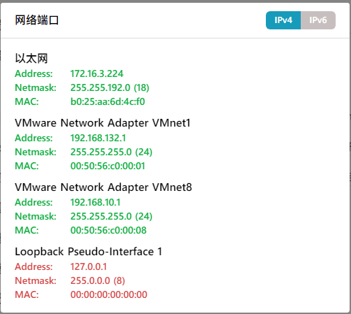
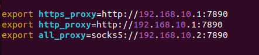

[ShapeShifter499/LG_v30-LineageOS_Manifest: Manifest needed to help build LineageOS for the LG v30](https://github.com/ShapeShifter499/LG_v30-LineageOS_Manifest)

# 编译环境搭建

## 配置

ubuntu 2204

​​

仅作示例，硬盘给 300g 差不多够

## 配置代理

​​

我是 nat 模式，用第三个

​​

终端代理设置

将下面加入环境变量

​​

## 依赖安装

```shell
$ sudo update-alternatives --config java

$ sudo apt-get install bc bison build-essential ccache curl flex g++-multilib gcc-multilib git gnupg gperf imagemagick lib32ncurses5-dev lib32readline-dev lib32z1-dev liblz4-tool libncurses5-dev libsdl1.2-dev libssl-dev libwxgtk3.0-gtk3-dev libxml2 libxml2-utils lzop pngcrush rsync schedtool squashfs-tools xsltproc zip zlib1g-dev python libncurses5 libtinfo5
```

## 配置 repo

```shell
$ mkdir -p ~/bin
$ curl https://storage.googleapis.com/git-repo-downloads/repo > ~/bin/repo
$ chmod a+x ~/bin/repo  $chmod a+x ~/bin/repo
```

### 将以下内容添加到 ~/.profile 以确保上述 “repo” 二进制文件始终可访问。

```shell
# set PATH so it includes user's private bin if it exists
if [ -d "$HOME/bin" ] ; then
    PATH="$HOME/bin:$PATH"
fi
```

## 配置 ccache

​`sudo vim ~/.bashrc`​

加入：

​`export USE_CCACHE=1`​

使改动生效:

​`source ~/.bashrc`​

执行：

​`ccache -M 50G`​

来设置缓存大小

× 注：ccache 默认在 home 目录，请确保 home 目录有足够的空间。如果想自定义 ccache 的目录，可以在`~/.bashrc`​ 文件里加入`export CCACHE_DIR=/path/to/.ccache`​。缓存大小根据自己硬盘大小设置，设置 25G 以上可以显著提高源码的构建速度。

## 拉取 lineage 源码

```shell
$ mkdir -p ~/android/lineage/.repo/local_manifests
$ wget -S https://raw.githubusercontent.com/ShapeShifter499/LG_v30-LineageOS_Manifest/lineage-17.1/lg_v30-joan.xml -O ~/android/lineage/.repo/local_manifests/lg_v30-joan.xml
```

```shell
$ repo sync
```

这一步需要几十 G 的空间，请先准备好

# 编译

进入源码根路径

执行

```shell
source build/envsetup.sh
lunch lineage_joan-userdebug
mka bacon
```

等待编译即可，第一次编译需要数个小时的时间
