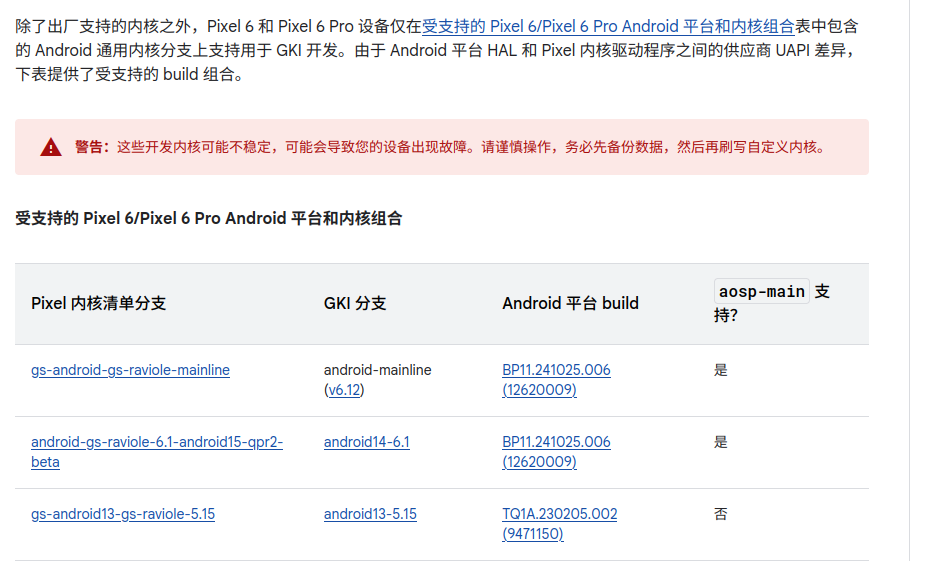

# AOSP14 编译

## 环境配置

### Repo

```Shell
curl https://storage.googleapis.com/git-repo-downloads/repo > /usr/local/bin/repo
chmod +x /usr/local/bin/repo
```

### Git

```Shell
sudo apt install git
```

### Platform tools

[developer.android.com](https://developer.android.com/tools/releases/platform-tools?hl=zh-cn)

建议使用比较新的，旧的可能不支持一些命令

## Repo 拉取 aosp 源码

```Shell
repo init -u http://mirrors.ustc.edu.cn/aosp/platform/manifest -b android-14.0.0_r34
#这里用了中科大的镜像源也可以之间使用google官方的https://android.googlesource.com/platform/manifest
repo --trace sync -c -j$(nproc --all) --no-tags
```

拉取需要的耗时很久，直到出现 repo sync has finished successfully 代表成功拉取

## 解压驱动

先在[source.android.com](https://source.android.com/docs/setup/reference/build-numbers?hl=zh-cn#source-code-tags-and-builds)中找到你拉取 aosp 版本对应的 build id


我拉取的是 android-14.0.0_r34，在[Nexus 和 Pixel 设备的驱动程序二进制文件 | Google Play services | Google for Developers](https://developers.google.cn/android/drivers?hl=zh-cn)中找到对应 build id 的驱动文件


解压，复制其中的 sh 文件到 aosp 源码根目录下，执行


读完 License 后输入 I ACCEPT 回车

## 编译 AOSP

### 设置环境

在源码根目录下执行

```Shell
source build/envsetup.sh
```

### 选择构建目标

与之前的版本不同，aosp14 使用 lunch 选择构建目标的规则变成了

```shell
lunch aosp_$device-$buildID-$version
```

device 为设备代号

buildID 取 build id 的前 4 位

version 可取 user userdebug eng

对应我编译的版本即是

```Shell
lunch aosp_oriole-ap1a-userdebug
```

### 开始编译

**aosp 编译对内存资源的消耗巨大！**

我在编译时最多消耗了约 40G 的内存，并且编译时建议使用纯命令行模式或者使用 ssh 连接，图形界面在低内存时极易崩溃

如果内存不足，请增加 swap 的大小以保证编译的正常进行

```shell
m
#直接执行m即可开始编译
#或者m -j16修改编译的线程数
```

编译时间取决于编译设备的性能，虚拟机可能要跑非常久，建议睡觉的时候跑

## 刷入编译好的 aosp

编译好的文件在 out/target/product/oriole 目录下

```Shell
adb reboot bootloader
ANDROID_PRODUCT_OUT=$aosp_PATH/out/target/product/oriole/ fastboot flashall -w
#将$aosp_PATH替换为自己的源码路径
#-w代表清除用户数据
```

如果不识别设备请更换数据线为

# 将内核升级到 6.1

## 前提



必须是特定的 build，这里的 build 只显示支持的最新版本(貌似 aosp 不受限制?没测试)

[构建 Pixel 内核 | Android Open Source Project](https://source.android.google.cn/docs/setup/build/building-pixel-kernels?hl=zh-cn#supported-kernel-branches)

上面编译的 AP1A.240505.004 正好是一个特定的版本

## Repo 拉取 kernel 源码

```Shell
repo init --depth=1 --u https://android.googlesource.com/kernel/manifest -b android14-gs-pixel-6.1
repo --trace sync -c -j$(nproc --all) --no-tags
```

### 更新供应商 ramdisk

这个直接参照官网操作即可

[构建 Pixel 内核 | Android Open Source Project](https://source.android.google.cn/docs/setup/build/building-pixel-kernels?hl=zh-cn#update_the_vendor_ramdisk)

pixel6 的路径是 prebuilts/boot-artifacts/ramdisks/vendor_ramdisk-**oriole.img**

## 编译内核

对于 5.15 及以上的内核的`build.sh`​ 脚本已替换为 [Kleaf](https://cs.android.com/android/kernel/superproject/+/common-android-mainline:build/kernel/kleaf/docs/kleaf.md?hl=zh-cn) 的新内核构建系统

```Shell
tools/bazel run --config=fast --config=stamp //private/google-modules/soc/gs:slider_dist
```

## 刷入内核

编译后的文件在 out/slider/dist 目录下

```Shell
adb reboot bootloader
fastboot flash boot boot.img
fastboot flash vendor_boot vendor_boot.img
fastboot flash dtbo dtbo.img
fastboot reboot fastboot
fastboot flash vendor_dlkm vendor_dlkm.img
```

## 加入 SUKISU

参照[github.com](https://github.com/MiRinFork/GKI_SukiSU_SUSFS)的 workflow

注意！目前 SUKISU 的 kernel_patch 在 pixel6 的 6.1 内核无法运行（至少对我来说是这样），可以编译完成后先 fastboot boot 一下测试是否可用

重新编译刷入即可

如果要使用内核模块，则需要重新编译 gki 内核刷入后再提取 boot 使用 apatch 修补（这里使用 SukiSU 的 kernel_patch 虽然可以开机，但是在一些情况下会导致 kernel panic 直接死机）

```Shell
repo init --depth=1 --u https://android.googlesource.com/kernel/manifest -b common-android14-6.1-2025-06
repo sync -j16
```

# 参考文档：

[Pixel 6Pro AOSP 源码在 Docker 内编译全过程](https://tig3rhu.github.io/2024/02/08/12__%E5%9C%A8Docker%E5%86%85%E7%BC%96%E8%AF%91AOSP%E5%85%A8%E8%BF%87%E7%A8%8B/)

[构建 Pixel 内核 | Android Open Source Project](https://source.android.google.cn/docs/setup/build/building-pixel-kernels?hl=zh-cn)

[blog.fangg3.com](https://blog.fangg3.com/article/1316990c-df87-8004-a5ac-f064158cbc6e)

[AOSP 代码环境配置 | kpa](https://kpa32.github.io/post/AOSP/AOSP-Pixel6-%E5%86%85%E6%A0%B8%E7%BC%96%E8%AF%91)

[GitHub - MiRinFork/GKI_SukiSU_SUSFS: 使用 SukiSU 和 SUSFS 的 GKI 内核](https://github.com/MiRinFork/GKI_SukiSU_SUSFS)

[Guide compile kernel Raviole from sources ! [ 5.10 &amp; 6.1 &amp; mainline ]](https://xdaforums.com/t/guide-compile-kernel-raviole-from-sources-5-10-6-1-mainline.4596285/)
