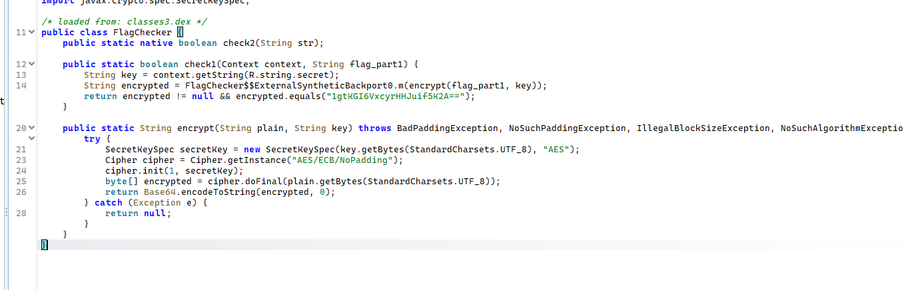
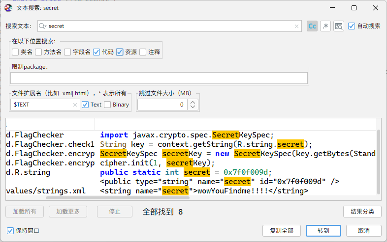
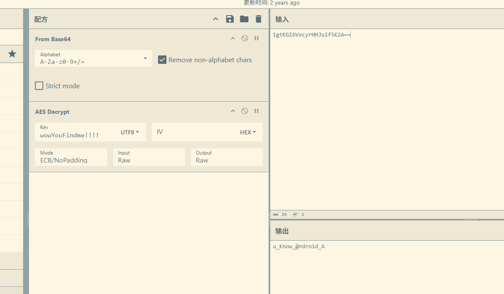
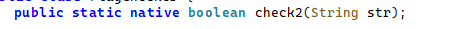
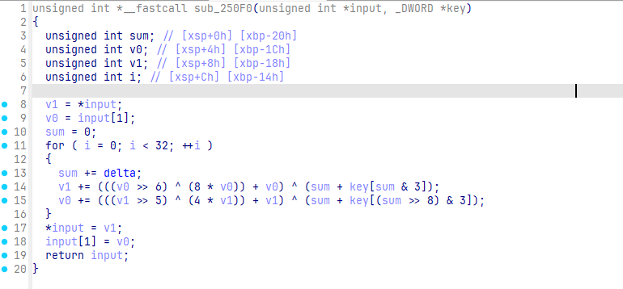
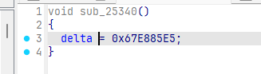

考察了基础的安卓逆向流程以及普通的xtea魔改，难度为简单
# ezAndroid
jadx打开程序，定位到Mainactivity直接来看程序流程

程序判断了输入flag的长度和格式，然后分割为两部分，交由FlagChecker类中的check函数校验
## check1

check1使用`AES/ECB/NoPadding`加密
key来自 `context.getString(R.string.secret);`

key：`wowYouFindme!!!!`
密文：`1gtKGI6VxcyrHHJuif5K2A==`
由于是直接调用标准库函数，所以标准算法直接解密即可

flag1：`u_Know_@ndro1d_A`
## check2

check2是native函数，在so中实现，找到对应函数

逻辑很清晰，输入经过`sub_250F0`处理后跟密文比较

​`sub_250F0`是一个被魔改过后的xtea，魔改了位移数，sum变化位置，还有delta
delta由全局变量存储，查找引用发现还有一个函数使用了delta



这个函数偷偷修改了delta的值
那为什么这个函数会被执行呢？

这个函数位于init_array段
[so逆向筑基-hook init init_array 和JNI_OnLoad - 简书](https://www.jianshu.com/p/59d1d3054abe)
在linker加载so文件时，会调用init init_array段的函数，是整个so最先被调用的函数
```c
#include <stdio.h>
#include <stdint.h>

void encipher(unsigned int num_rounds, uint32_t v[2], uint32_t const key[4])
{
  unsigned int i;
  uint32_t v0 = v[0], v1 = v[1], sum = 0, delta = 0x67e885e5;
  for (i = 0; i < num_rounds; i++)
  {
    sum += delta;
    v0 += (((v1 << 3) ^ (v1 >> 6)) + v1) ^ (sum + key[sum & 3]);
    v1 += (((v0 << 2) ^ (v0 >> 5)) + v0) ^ (sum + key[(sum >> 8) & 3]);
  }
  v[0] = v0;
  v[1] = v1;
}

void decipher(unsigned int num_rounds, uint32_t v[2], uint32_t const key[4])
{
  unsigned int i;
  uint32_t v0 = v[0], v1 = v[1], delta = 0x67e885e5, sum = delta * num_rounds;
  for (i = 0; i < num_rounds; i++)
  {
    v1 -= (((v0 << 2) ^ (v0 >> 5)) + v0) ^ (sum + key[(sum >> 8) & 3]);
    v0 -= (((v1 << 3) ^ (v1 >> 6)) + v1) ^ (sum + key[sum & 3]);
    sum -= delta;
  }
  v[0] = v0;
  v[1] = v1;
}

int main()
{
  uint32_t v[2] = {0xad05217d, 0xf7c0c3e2};
  uint8_t k[16] = {0x54, 0x68, 0x31, 0x73, 0x49, 0x73, 0x41, 0x6e, 0x33, 0x61, 0x73, 0x79, 0x43, 0x68, 0x61, 0x6c};
  unsigned int r = 32;
  decipher(r, v, (uint32_t *)k);
  printf("%s\n", v);
  return 0;
}
```
​`nd_xt3a!`
最终flag：VNCTF{`u_Know_@ndro1d_And_xt3a!`}