# Blutter 静态恢复数据

这道题的绝大部分 section 信息都被抹除，而 blutter 又依赖于 section 信息去定位 所需的 dart 信息，所以直接使用 blutter 去解析会直接报错


## 解决方案

### 1.修改 extract_dart_info.py 源码

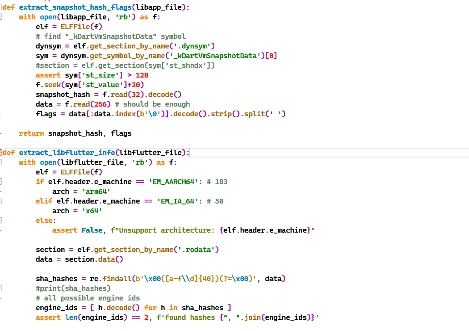

解析时会用到这两处，可以直接人工解析偏移然后填入，例如

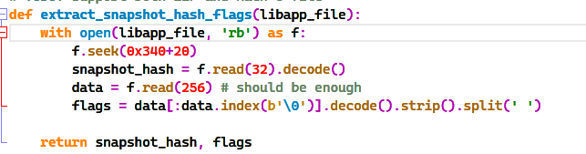

### 2.手动指定 dart 版本(官方 wp

从 blutter 源码来看

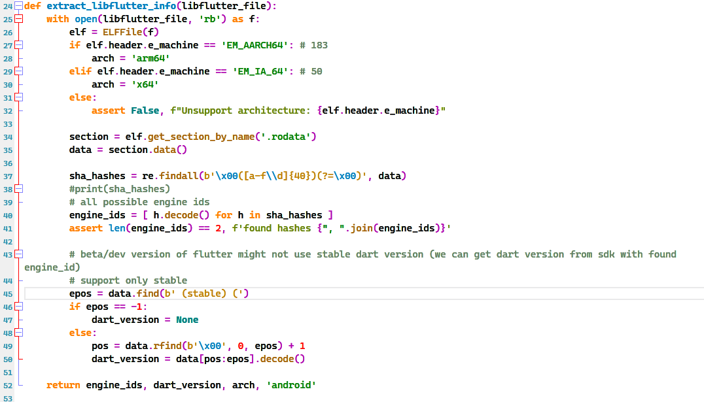

dart version 就在(stable) (这个字符串之前，直接从 libflutter.so 中即可获取 dart 版本

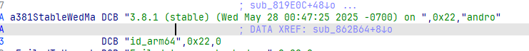

3.8.1_android_arm64

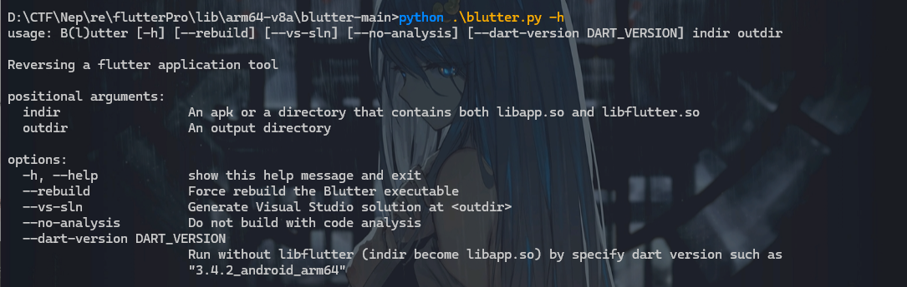

--dart-version DART_VERSION 参数来指定 dart 版本，指定版本后即可正常恢复

ida 版本若大于 9，由于 api 的变化，需要修复 addNames.py 才能在 ida9 以上恢复结构体，详见官方 wp

# 程序分析

函数过滤 flutterpro 即可找到 flutterpro 这个项目的函数

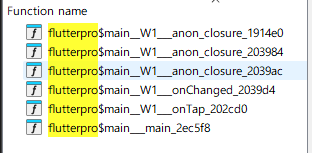

onTap 是按钮的点击事件回调函数，以这个函数为入口来分析

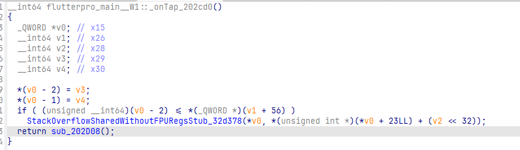

没什么东西，直接进 sub_202D08

这里 ida 的参数会识别不全，所以需要进入一次各个函数，返回后再点 f5 让 ida 重新分析

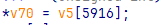

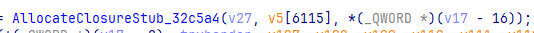

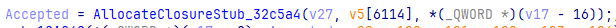

发现许多地方都对一个巨大的数组进行引用

这其实是在读取 dart 的常量表，修改 v5 的类型为 DartObjectPool\*，即可看到引用的各种常量

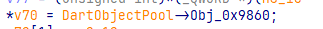

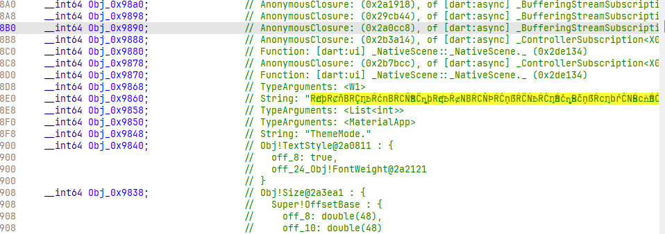

根据字符串，可以反推出这个函数的大致功能

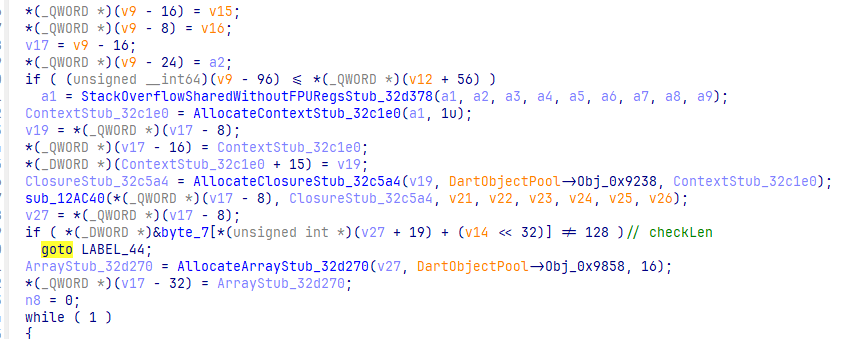

‍

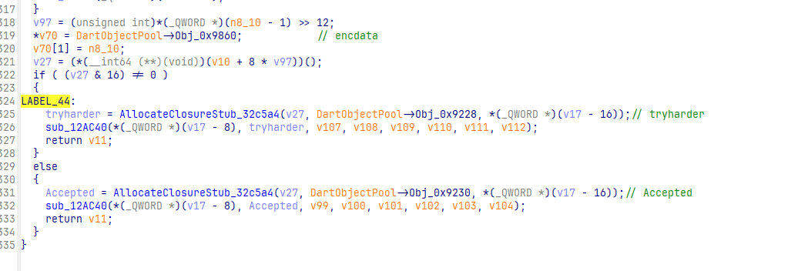

loadInput -> checkLen -> enc1 -> enc2 -> loadencData -> compare -> output

## checkLen

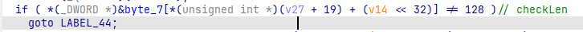

虽然看不太懂这是在做什么，不过他直接跳转到了

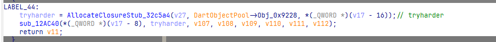

所以猜测他是在检查长度


frida hook 这里输出 w2 的值

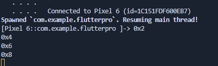

发现其实 w2 的值是真实长度\*2

那正确的长度应该为 64

## enc1

检查完长度之后，程序进入了两个 8\*8 的循环之中

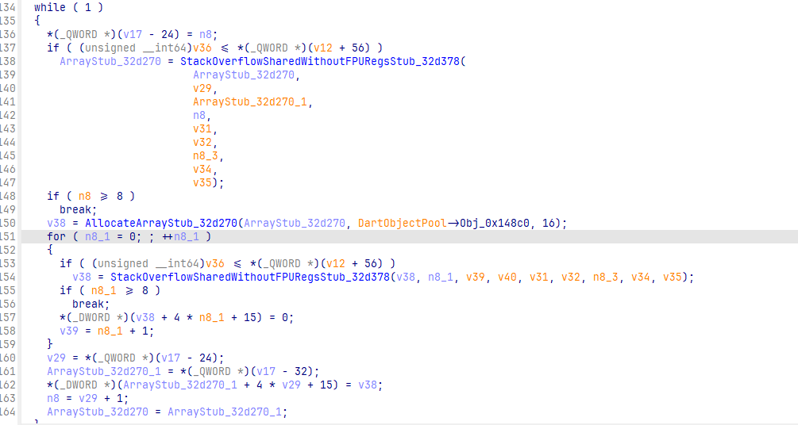

第一个循环貌似是在初始化一个二维数组，大小应该是 8\*8，初始值均为 8

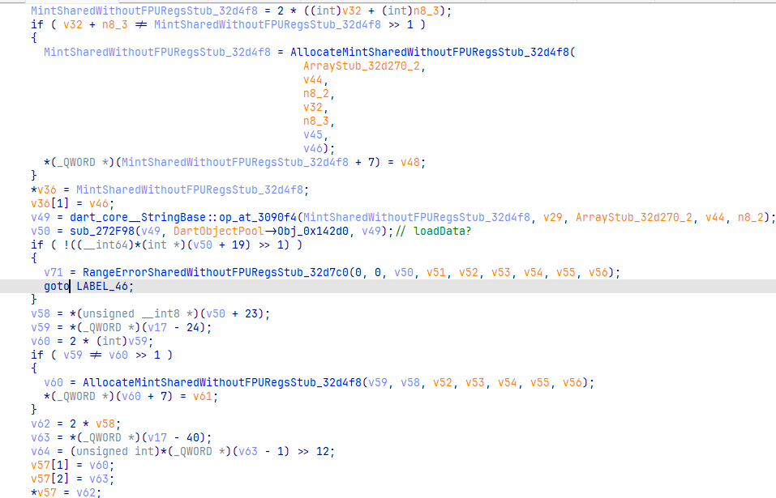

第二个循环貌似在加载某种数据到数组中

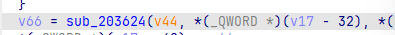

进入这个函数，发现又是一个 8\*8 的循环

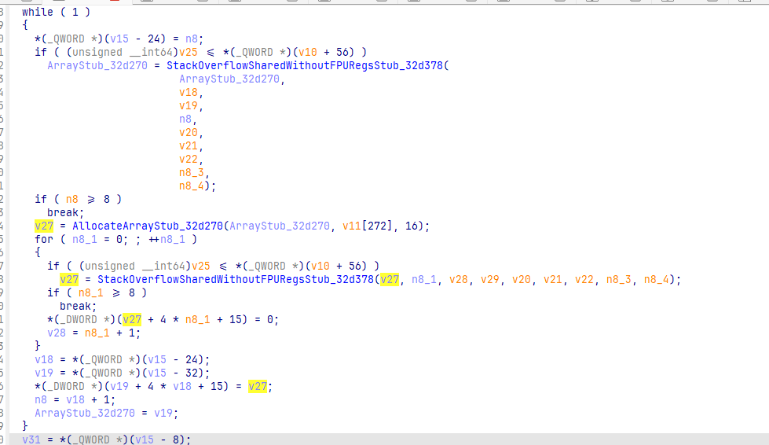

后面接着两个单独的循环，大概率是 ida 的分析问题，应该还是一个 8\*8 的循环

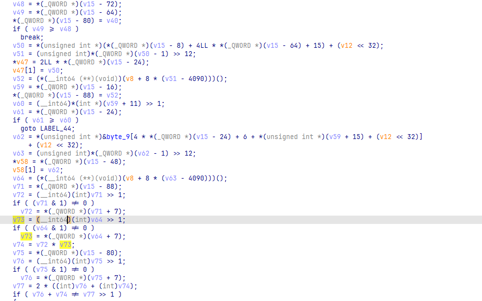

内层循环中有一大坨的数据运算，不过有一个相当显眼

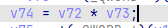

看起来是唯一一个正常的东西，直接 hook 这一处 mul

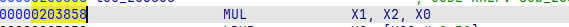

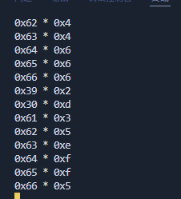

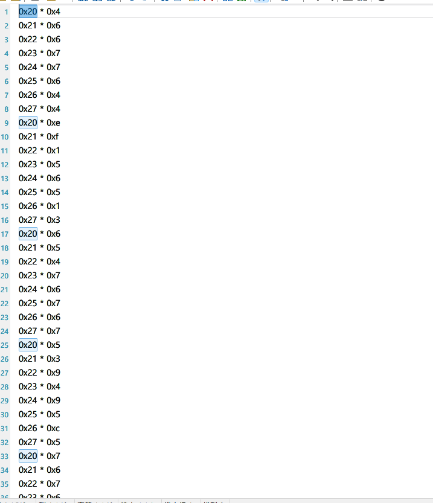

进行次数刚好为 512，很明显的矩阵乘法

那另一个矩阵即为 key

## enc2

发现密文长得非常奇怪

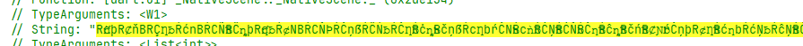

依托

往上找

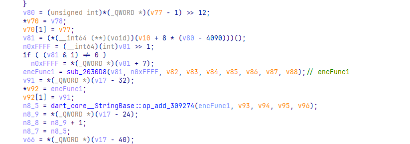

这个函数相当可疑

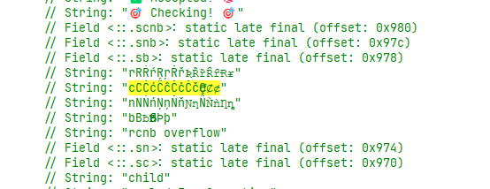

这个函数也引用了类似的字符串


直接搜索就能找到

RCNB 编码

## 解密

先进行 rcnb 解码

```python
import rcnb

data = rcnb.decodeBytes("RƇǹþRȻňBRÇȠƀŔćnBŔCÑƁRĈȵþRƇƞƀŔȼNBŔCŇÞŔĊņßŔĈŃƀŔĊȠƃŔċȵƄRčņßŔcȠbŕĊNƄŔcǹƃŔĆŅƁŔĆŇƅŔĊƞƁŔĉȵƁRčńƁRȻƝƅŕĊņþRȼȠƁŔćƞbŔćŅƀŔĉŅƁŔĊÑBRĊȵƁRȼȵƄŕćȵƀRȻņBŔćņƁŔCƞƁŔĈÑƀŔĉƞƄRĊnƃRȼņƃŕĆŃþRƇƝƄŔcnƁRÇnBRȻŅßŔcńƃRćǸƄRčŅÞŔċȠBŔcÑBŔĊńƀŔĈńƀŔĊńƃŔċnƃRƇņƀŔcňƁŕċÑƃŔCÑƀŔĈǹƁŔĉņßŔČŇƀŔČǹþRƇƝÞŔCňÞŕĊňƁ")

print(len(data))
numbers = [int.from_bytes(data[i:i+2], byteorder='big') for i in range(0, len(data) - 1, 2)]

print(numbers)
#[3879, 4271, 4182, 4951, 4753, 2999, 3842, 6611, 4718, 5457, 5122, 5534, 5695, 3657, 4630, 7665, 4624, 4843, 4866, 5493, 5393, 3633, 4286, 7709, 4483, 5040, 4992, 5293, 5501, 3293, 4495, 7342, 4251, 5003, 4743, 5202, 5345, 3154, 4404, 7079, 3835, 4503, 4051, 4247, 4534, 2815, 3648, 5681, 4601, 5432, 5132, 5434, 5554, 3802, 4573, 7904, 4752, 5223, 5307, 5762, 5829, 3838, 4728, 7723]
```

这里可以看出，得到 data 长度为 128，而输入为 64，所以每个输入字节对应到密文应该是两字节

所以得到的 numbers 即为矩阵相乘后的密文

矩阵乘法直接使用 z3 求解即可，key 为上文中的另一个矩阵

```python
from z3 import *
key = [0x4, 0x6, 0x6, 0x7, 0x7, 0x6, 0x4, 0x4, 0xe, 0xf, 0x1, 0x5, 0x6, 0x5, 0x1, 0x3, 0x6, 0x5, 0x4, 0x7, 0x6, 0x7, 0x6, 0x7, 0x5, 0x3, 0x9, 0x4, 0x9, 0x5, 0xc, 0x5, 0x7, 0x6, 0x7, 0x6, 0x6, 0x7, 0x7, 0x7, 0x5, 0x1, 0x3, 0x5, 0xc, 0x2, 0x3, 0x4, 0x7, 0x6, 0x4, 0x4, 0x4, 0x6, 0x6, 0x6, 0x2, 0xd, 0x3, 0x5, 0xe, 0xf, 0xf, 0x5, 0x4, 0x6, 0x6, 0x7, 0x7, 0x6, 0x4, 0x4, 0xe, 0xf, 0x1, 0x5, 0x6, 0x5, 0x1, 0x3, 0x6, 0x5, 0x4, 0x7, 0x6, 0x7, 0x6, 0x7, 0x5, 0x3, 0x9, 0x4, 0x9, 0x5, 0xc, 0x5, 0x7, 0x6, 0x7, 0x6, 0x6, 0x7, 0x7, 0x7, 0x5, 0x1, 0x3, 0x5, 0xc, 0x2, 0x3, 0x4, 0x7, 0x6, 0x4, 0x4, 0x4, 0x6, 0x6, 0x6, 0x2, 0xd, 0x3, 0x5, 0xe, 0xf, 0xf, 0x5, 0x4, 0x6, 0x6, 0x7, 0x7, 0x6, 0x4, 0x4, 0xe, 0xf, 0x1, 0x5, 0x6, 0x5, 0x1, 0x3, 0x6, 0x5, 0x4, 0x7, 0x6, 0x7, 0x6, 0x7, 0x5, 0x3, 0x9, 0x4, 0x9, 0x5, 0xc, 0x5, 0x7, 0x6, 0x7, 0x6, 0x6, 0x7, 0x7, 0x7, 0x5, 0x1, 0x3, 0x5, 0xc, 0x2, 0x3, 0x4, 0x7, 0x6, 0x4, 0x4, 0x4, 0x6, 0x6, 0x6, 0x2, 0xd, 0x3, 0x5, 0xe, 0xf, 0xf, 0x5, 0x4, 0x6, 0x6, 0x7, 0x7, 0x6, 0x4, 0x4, 0xe, 0xf, 0x1, 0x5, 0x6, 0x5, 0x1, 0x3, 0x6, 0x5, 0x4, 0x7, 0x6, 0x7, 0x6, 0x7, 0x5, 0x3, 0x9, 0x4, 0x9, 0x5, 0xc, 0x5, 0x7, 0x6, 0x7, 0x6, 0x6, 0x7, 0x7, 0x7, 0x5, 0x1, 0x3, 0x5, 0xc, 0x2, 0x3, 0x4, 0x7, 0x6, 0x4, 0x4, 0x4, 0x6, 0x6, 0x6, 0x2, 0xd, 0x3, 0x5, 0xe, 0xf, 0xf, 0x5, 0x4, 0x6, 0x6, 0x7, 0x7, 0x6, 0x4, 0x4, 0xe, 0xf, 0x1, 0x5, 0x6, 0x5, 0x1, 0x3, 0x6, 0x5, 0x4, 0x7, 0x6, 0x7, 0x6, 0x7, 0x5, 0x3, 0x9, 0x4, 0x9, 0x5, 0xc, 0x5, 0x7, 0x6, 0x7, 0x6, 0x6, 0x7, 0x7, 0x7, 0x5, 0x1, 0x3, 0x5, 0xc, 0x2, 0x3, 0x4, 0x7, 0x6, 0x4, 0x4, 0x4, 0x6, 0x6, 0x6, 0x2, 0xd, 0x3, 0x5, 0xe, 0xf, 0xf, 0x5, 0x4, 0x6, 0x6, 0x7, 0x7, 0x6, 0x4, 0x4, 0xe, 0xf, 0x1, 0x5, 0x6, 0x5, 0x1, 0x3, 0x6, 0x5, 0x4, 0x7, 0x6, 0x7, 0x6, 0x7, 0x5, 0x3, 0x9, 0x4, 0x9, 0x5, 0xc, 0x5, 0x7, 0x6, 0x7, 0x6, 0x6, 0x7, 0x7, 0x7, 0x5, 0x1, 0x3, 0x5, 0xc, 0x2, 0x3, 0x4, 0x7, 0x6, 0x4, 0x4, 0x4, 0x6, 0x6, 0x6, 0x2, 0xd, 0x3, 0x5, 0xe, 0xf, 0xf, 0x5, 0x4, 0x6, 0x6, 0x7, 0x7, 0x6, 0x4, 0x4, 0xe, 0xf, 0x1, 0x5, 0x6, 0x5, 0x1, 0x3, 0x6, 0x5, 0x4, 0x7, 0x6, 0x7, 0x6, 0x7, 0x5, 0x3, 0x9, 0x4, 0x9, 0x5, 0xc, 0x5, 0x7, 0x6, 0x7, 0x6, 0x6, 0x7, 0x7, 0x7, 0x5, 0x1, 0x3, 0x5, 0xc, 0x2, 0x3, 0x4, 0x7, 0x6, 0x4, 0x4, 0x4, 0x6, 0x6, 0x6, 0x2, 0xd, 0x3, 0x5, 0xe, 0xf, 0xf, 0x5, 0x4, 0x6, 0x6, 0x7, 0x7, 0x6, 0x4, 0x4, 0xe, 0xf, 0x1, 0x5, 0x6, 0x5, 0x1, 0x3, 0x6, 0x5, 0x4, 0x7, 0x6, 0x7, 0x6, 0x7, 0x5, 0x3, 0x9, 0x4, 0x9, 0x5, 0xc, 0x5, 0x7, 0x6, 0x7, 0x6, 0x6, 0x7, 0x7, 0x7, 0x5, 0x1, 0x3, 0x5, 0xc, 0x2, 0x3, 0x4, 0x7, 0x6, 0x4, 0x4, 0x4, 0x6, 0x6, 0x6, 0x2, 0xd, 0x3, 0x5, 0xe, 0xf, 0xf, 0x5]
enc = [3879, 4271, 4182, 4951, 4753, 2999, 3842, 6611, 4718, 5457, 5122, 5534, 5695, 3657, 4630, 7665, 4624, 4843, 4866, 5493, 5393, 3633, 4286, 7709, 4483, 5040, 4992, 5293, 5501, 3293, 4495, 7342, 4251, 5003, 4743, 5202, 5345, 3154, 4404, 7079, 3835, 4503, 4051, 4247, 4534, 2815, 3648, 5681, 4601, 5432, 5132, 5434, 5554, 3802, 4573, 7904, 4752, 5223, 5307, 5762, 5829, 3838, 4728, 7723]


for i in range(8):
    s = Solver()
    matrix = [Int(f"matrix_{m}") for m in range(8)]
    for j in range(8):
        sum=0
        for k in range(8):
            sum += matrix[k] * key[64 * i + 8 * j + k]
        s.add(sum == enc[8 * i + j])
    result = s.check()
    if result == sat:
        model = s.model()
        for i in matrix:
            print(chr(model[i].as_long()), end='')
    else:
        print("so sol")
```

最终得到 flag

​`NepCTF{ProtectedFlutterMakesBlutterADullTool???UseBlutterWisely}`​

‍
