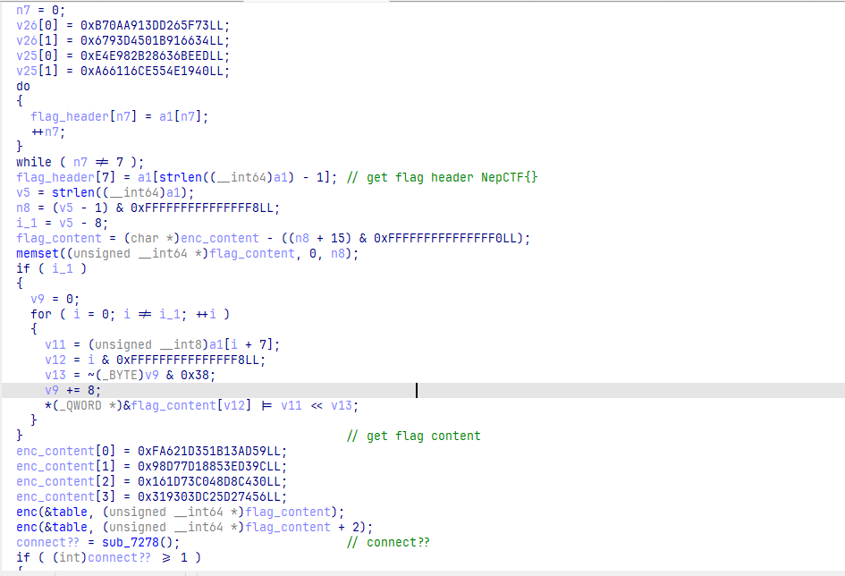
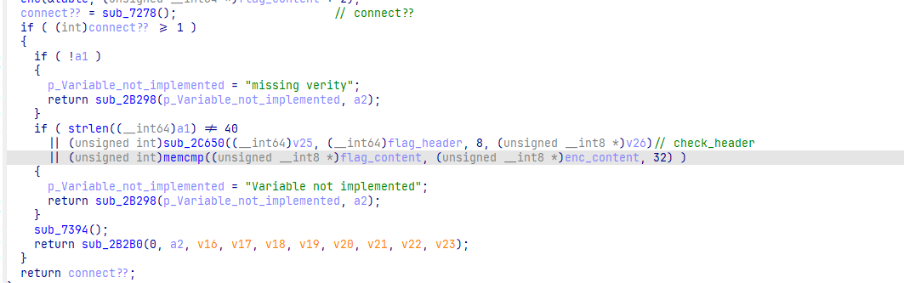
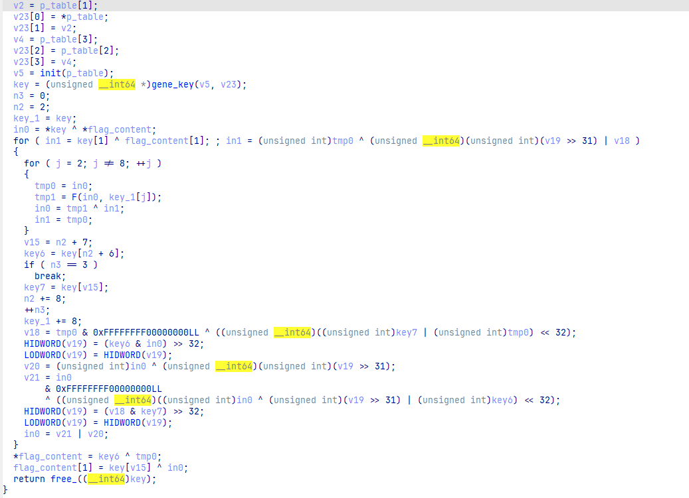
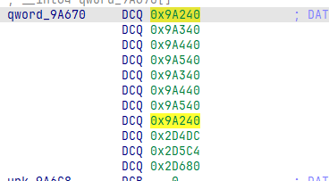
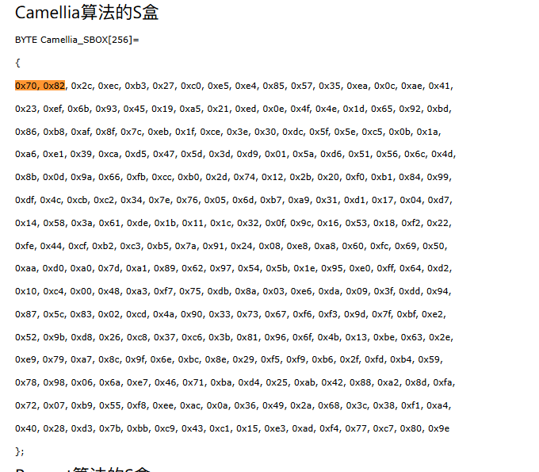
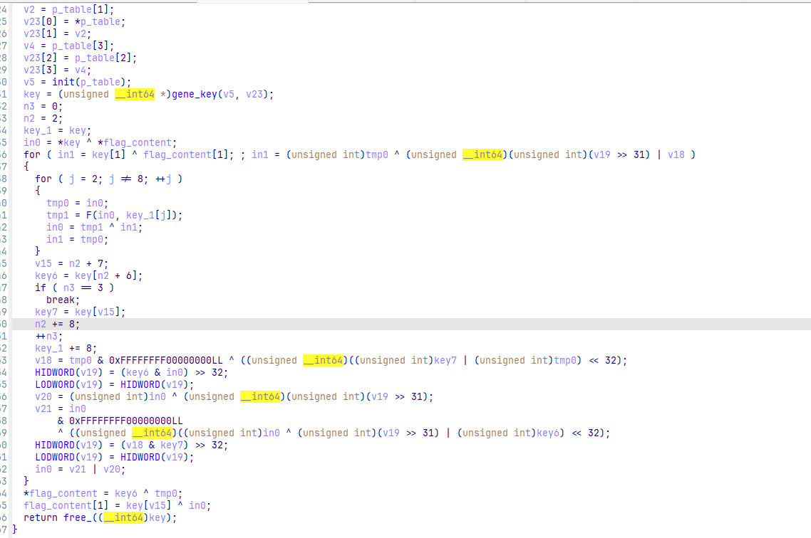

看到是uboot做的 一直想着用qemu来运行调试，结果unicorn可以直接模拟执行那个解锁验证函数，wp居然只给了模拟执行的脚本(悲

# 分析

题目给了安卓的boot文件，使用DNA3分割boot文件

[ColdWindScholar/D.N.A3: 【开源】安卓一般固件解包打包助手【 Droid Normal Assistant 】](https://github.com/ColdWindScholar/D.N.A3)


得到kernel，ida 以arm-little end 打开

借助加密特征或字符串即可找到verify函数(图中函数已被重命名)






flag头和flag内容是分开获取的

flag内容被转化为8字节一组

flag头的验证是一个aes相关的签名算法，不过头已知，不用管

## flag内容加密



enc函数并不是常见的几种对称加密算法，通过F函数中sbox的特征






我们可以得知，这个算法是Camellia加密算法



不过kernel中的算法全部以QWORD为单位，标准算法以DWORD为单位，不知是有意为之还是其他原因

而且Feistel的部分应该也有不同,索性直接实现了这个加密，keygen过程可以忽略，可以直接取生成后的key

利用官方WP的unicorn脚本得到trace WP->[NepCTF 2025 官方WP来了！](https://mp.weixin.qq.com/s?__biz=Mzk0MjU4OTUxMw==&mid=2247488726&idx=1&sn=206bad4d62e759ebe748e952d1477a3d&chksm=c314bede4a3d102d899c3e390e9e6a39759675bf54a0ebce8398780e8054e6614e198fa40337&mpshare=1&scene=23&srcid=0808Dt3NsP0XqLV8mIQSO3qJ&sharer_shareinfo=4c281ecade9ff3014273b8e5ca5f8496&sharer_shareinfo_first=4c281ecade9ff3014273b8e5ca5f8496#rd)

```python
	u64 key2[] = { 0xFF3F3D8DF9EA7283,  0x90390BCD16AB7911,  0x0E1665908E8C0394,  0xFDB12678909DFC10,  0xA1FB80C8B4157D9E, 0xB829D26A597778F9,  0x17DD570CB90CFCB7,  0x26F322CA6349501D,  0xC0645A0ABECF5C14,  0xE9352CBBBC7CD0FD,  0x23A300E53F6C499E,  0x24277F0403859964,  0x4E5072072179A2D5,  0x6F223FE7E7B1BF3D,  0x2E433F2DC9BCC8B2,  0x98D2540745F755C3,  0x390390BCD16AB791,  0x1FF3F3D8DF9EA728, 0xAFB3D7053A4D4B2E,  0xEF1F343F70191682,  0x4FDB12678909DFC1,  0x00E1665908E8C039,  0x2179A2D56F223FE7,  0xE7B1BF3D4E507207,  0xC9BCC8B298D25407,  0x45F755C32E433F2D, 0xE9352CBBBC7CD0FD,  0xC0645A0ABECF5C14,  0x916531A4A80E8BEE,  0xAB865C867E5B9379,
0xBC88FF9F9EC6FCF5,  0x3941C81C85E68B55,  0xFE08070B32C84746, 0x01CA7ED8933C484E };
```

然后就是利用trace辅助分析流程

得到加密流程

```c
u64 F(u64 x0, u64 x1) {
	uint64_t x8 = 0;
	uint64_t x10 = x1 ^ x0;
	uint64_t x11, x9;

	for (int i = 0; i < 8; i++) {
		x11 = x10;
		u8 index = (u8)(x11 >> 56);
		u8 val = table[i][index];
		x10 = val | (x11 << 8);
		x8 += 8;
	}

	x8 = (x11 << 16) & 0xFF00000000ULL;
	x8 |= (x10 << 40);
	x8 ^= x10;

	x9 = (x8 >> 16) & 0xFFFF0000ULL;
	x9 &= 0xFFFFFFFFFFFFFFFFULL;
	x9 |= (x8 >> 48) & 0xFFFFULL;
	x8 ^= x9;

	x9 = (x8 << 24) & 0xFFFFFF00000000ULL;
	x9 |= (x8 << 56);
	x9 ^= x8;
	u32 w10 = (u32)((x9 >> 8) & 0xFF000000);
	u32 w11 = (u32)((x9 >> 40));
	w10 |= w11;
	u32 w8 = (u32)x8;
	w8 ^= w10;
	x8 = w8;
	u64 result = (x8 << 32) | (x9 >> 32);
	return result;
}

u32 LeftRotate1(u32 x, u32 s) {
	return (((x) << (s)) | ((x) >> (32 - s)));
}

u64 enc1(u64 in0, u64 key) {
	u32 in0_high = in0 >> 32;
	u32 in0_low = in0 & 0xffffffff;
	u32 key_high = key >> 32;
	u32 key_low = key & 0xffffffff;
	u32 new_low, new_high, rot;
	rot = LeftRotate1((key_high & in0_high), 1);
	new_low = in0_low ^ rot;
	new_high = in0_high ^ (new_low | key_low);
	return (new_high << 32) | new_low;
}

u64 enc2(u64 tmp, u64 key) {
	u32 tmp_high = tmp >> 32;
	u32 tmp_low = tmp & 0xffffffff;
	u32 key_high = key >> 32;
	u32 key_low = key & 0xffffffff;
	u32 in1_high, in1_low;
	in1_low = tmp_low ^ LeftRotate1((tmp_high ^ (key_low | tmp_low)) & key_high, 1);
	in1_high = tmp_high ^ (key_low | tmp_low);
	return ((u64)in1_high << 32) | in1_low;
}

void camellia_encrypt(u64 plaintext[], u64 keytable[], u64 ciphertext[]) {
	int n3 = 0;
	u64 in0 = plaintext[0] ^ keytable[0];
	u64 in1 = plaintext[1] ^ keytable[1];
	u64 tmp0 = 0;
	u64* key = (u64*)keytable;
	u64 key6, key7;
	while (1) {
		for (int j = 2; j != 8; ++j)
		{
			tmp0 = in0;
			in0 = F(in0, key[j]) ^ in1;
			in1 = tmp0;
		}

		if (n3 == 3) {
			break;
		}
		n3++;
		key += 8;

		key6 = key[0];
		key7 = key[1];
		in0 = enc1(in0, key6);
		in1 = enc2(in1, key7);
	}
	key += 8;
	ciphertext[0] = key[0] ^ tmp0;
	ciphertext[1] = key[1] ^ in0;
}
```

# 解密

enc1 enc2显然可逆

Feistel反着写即可解密

```c
u64 F(u64 x0, u64 x1) {
	uint64_t x8 = 0;
	uint64_t x10 = x1 ^ x0;
	uint64_t x11, x9;

	for (int i = 0; i < 8; i++) {
		x11 = x10;
		u8 index = (u8)(x11 >> 56);
		u8 val = table[i][index];
		x10 = val | (x11 << 8);
		x8 += 8;
	}

	x8 = (x11 << 16) & 0xFF00000000ULL;
	x8 |= (x10 << 40);
	x8 ^= x10;

	x9 = (x8 >> 16) & 0xFFFF0000ULL;
	x9 &= 0xFFFFFFFFFFFFFFFFULL;
	x9 |= (x8 >> 48) & 0xFFFFULL;
	x8 ^= x9;

	x9 = (x8 << 24) & 0xFFFFFF00000000ULL;
	x9 |= (x8 << 56);
	x9 ^= x8;
	u32 w10 = (u32)((x9 >> 8) & 0xFF000000);
	u32 w11 = (u32)((x9 >> 40));
	w10 |= w11;
	u32 w8 = (u32)x8;
	w8 ^= w10;
	x8 = w8;
	u64 result = (x8 << 32) | (x9 >> 32);
	return result;
}

u32 LeftRotate1(u32 x, u32 s) {
	return (((x) << (s)) | ((x) >> (32 - s)));
}


u64 dec1(u64 in0, u64 key) {
	u32 in0_high = in0 >> 32;
	u32 in0_low = in0 & 0xffffffff;
	u32 key_high = key >> 32;
	u32 key_low = key & 0xffffffff;
	u32 old_low, old_high, rot;
	old_high = in0_high ^ (key_low | in0_low);
	rot = LeftRotate1((key_high & old_high), 1);
	old_low = in0_low ^ rot;
	return (u64)old_high << 32 | old_low;
}

u64 dec2(u64 in1, u64 key) {
	u32 in1_high = in1 >> 32;
	u32 in1_low = in1 & 0xffffffff;
	u32 key_high = key >> 32;
	u32 key_low = key & 0xffffffff;

	u32 R = LeftRotate1((in1_high & key_high), 1);
	u32 tmp_low = in1_low ^ R;
	u32 tmp_high = in1_high ^ (key_low | tmp_low);

	return ((u64)tmp_high << 32) | tmp_low;
}


void camellia_decrypt(u64 ciphertext[], u64 keytable[], u64 plaintext[]) {
	u64* key = (u64*)keytable + 32;
	u64 tmp0 = ciphertext[0] ^ key[0];
	u64 in0 = ciphertext[1] ^ key[1];
	u64 key6, key7;
	u64 in1 = tmp0;
	key -= 8;
	while (1) {
		for (int j = 7; j >= 2; j--) {

			in1 = in0 ^ F(tmp0, key[j]);

			in0 = tmp0;
			tmp0 = in1;
		}

		if (key == (u64*)keytable) {
			break;
		}

		key6 = key[0];
		key7 = key[1];

		in0 = dec1(in0, key6);
		tmp0 = dec2(in1, key7);
		key -= 8;
	}
	plaintext[0] = key[0] ^ in0;
	plaintext[1] = key[1] ^ in1;
}

```

‍

最终脚本

```c
#include <string.h>
#include <stdlib.h>
#include <stdint.h>
#include <stdio.h>

typedef unsigned int u32;
typedef unsigned char u8;
typedef uint64_t u64;

u8 table[8][256] = {
	{0x70,0x82,0x2C,0xEC,0xB3,0x27,0xC0,0xE5,0xE4,0x85,0x57,0x35,0xEA,0xC,0xAE,0x41,0x23,0xEF,0x6B,0x93,0x45,0x19,0xA5,0x21,0xED,0xE,0x4F,0x4E,0x1D,0x65,0x92,0xBD,0x86,0xB8,0xAF,0x8F,0x7C,0xEB,0x1F,0xCE,0x3E,0x30,0xDC,0x5F,0x5E,0xC5,0xB,0x1A,0xA6,0xE1,0x39,0xCA,0xD5,0x47,0x5D,0x3D,0xD9,0x1,0x5A,0xD6,0x51,0x56,0x6C,0x4D,0x8B,0xD,0x9A,0x66,0xFB,0xCC,0xB0,0x2D,0x74,0x12,0x2B,0x20,0xF0,0xB1,0x84,0x99,0xDF,0x4C,0xCB,0xC2,0x34,0x7E,0x76,0x5,0x6D,0xB7,0xA9,0x31,0xD1,0x17,0x4,0xD7,0x14,0x58,0x3A,0x61,0xDE,0x1B,0x11,0x1C,0x32,0xF,0x9C,0x16,0x53,0x18,0xF2,0x22,0xFE,0x44,0xCF,0xB2,0xC3,0xB5,0x7A,0x91,0x24,0x8,0xE8,0xA8,0x60,0xFC,0x69,0x50,0xAA,0xD0,0xA0,0x7D,0xA1,0x89,0x62,0x97,0x54,0x5B,0x1E,0x95,0xE0,0xFF,0x64,0xD2,0x10,0xC4,0x0,0x48,0xA3,0xF7,0x75,0xDB,0x8A,0x3,0xE6,0xDA,0x9,0x3F,0xDD,0x94,0x87,0x5C,0x83,0x2,0xCD,0x4A,0x90,0x33,0x73,0x67,0xF6,0xF3,0x9D,0x7F,0xBF,0xE2,0x52,0x9B,0xD8,0x26,0xC8,0x37,0xC6,0x3B,0x81,0x96,0x6F,0x4B,0x13,0xBE,0x63,0x2E,0xE9,0x79,0xA7,0x8C,0x9F,0x6E,0xBC,0x8E,0x29,0xF5,0xF9,0xB6,0x2F,0xFD,0xB4,0x59,0x78,0x98,0x6,0x6A,0xE7,0x46,0x71,0xBA,0xD4,0x25,0xAB,0x42,0x88,0xA2,0x8D,0xFA,0x72,0x7,0xB9,0x55,0xF8,0xEE,0xAC,0xA,0x36,0x49,0x2A,0x68,0x3C,0x38,0xF1,0xA4,0x40,0x28,0xD3,0x7B,0xBB,0xC9,0x43,0xC1,0x15,0xE3,0xAD,0xF4,0x77,0xC7,0x80,0x9E},
	{0xE0,0x5,0x58,0xD9,0x67,0x4E,0x81,0xCB,0xC9,0xB,0xAE,0x6A,0xD5,0x18,0x5D,0x82,0x46,0xDF,0xD6,0x27,0x8A,0x32,0x4B,0x42,0xDB,0x1C,0x9E,0x9C,0x3A,0xCA,0x25,0x7B,0xD,0x71,0x5F,0x1F,0xF8,0xD7,0x3E,0x9D,0x7C,0x60,0xB9,0xBE,0xBC,0x8B,0x16,0x34,0x4D,0xC3,0x72,0x95,0xAB,0x8E,0xBA,0x7A,0xB3,0x2,0xB4,0xAD,0xA2,0xAC,0xD8,0x9A,0x17,0x1A,0x35,0xCC,0xF7,0x99,0x61,0x5A,0xE8,0x24,0x56,0x40,0xE1,0x63,0x9,0x33,0xBF,0x98,0x97,0x85,0x68,0xFC,0xEC,0xA,0xDA,0x6F,0x53,0x62,0xA3,0x2E,0x8,0xAF,0x28,0xB0,0x74,0xC2,0xBD,0x36,0x22,0x38,0x64,0x1E,0x39,0x2C,0xA6,0x30,0xE5,0x44,0xFD,0x88,0x9F,0x65,0x87,0x6B,0xF4,0x23,0x48,0x10,0xD1,0x51,0xC0,0xF9,0xD2,0xA0,0x55,0xA1,0x41,0xFA,0x43,0x13,0xC4,0x2F,0xA8,0xB6,0x3C,0x2B,0xC1,0xFF,0xC8,0xA5,0x20,0x89,0x0,0x90,0x47,0xEF,0xEA,0xB7,0x15,0x6,0xCD,0xB5,0x12,0x7E,0xBB,0x29,0xF,0xB8,0x7,0x4,0x9B,0x94,0x21,0x66,0xE6,0xCE,0xED,0xE7,0x3B,0xFE,0x7F,0xC5,0xA4,0x37,0xB1,0x4C,0x91,0x6E,0x8D,0x76,0x3,0x2D,0xDE,0x96,0x26,0x7D,0xC6,0x5C,0xD3,0xF2,0x4F,0x19,0x3F,0xDC,0x79,0x1D,0x52,0xEB,0xF3,0x6D,0x5E,0xFB,0x69,0xB2,0xF0,0x31,0xC,0xD4,0xCF,0x8C,0xE2,0x75,0xA9,0x4A,0x57,0x84,0x11,0x45,0x1B,0xF5,0xE4,0xE,0x73,0xAA,0xF1,0xDD,0x59,0x14,0x6C,0x92,0x54,0xD0,0x78,0x70,0xE3,0x49,0x80,0x50,0xA7,0xF6,0x77,0x93,0x86,0x83,0x2A,0xC7,0x5B,0xE9,0xEE,0x8F,0x1,0x3D},
	{0x38,0x41,0x16,0x76,0xD9,0x93,0x60,0xF2,0x72,0xC2,0xAB,0x9A,0x75,0x6,0x57,0xA0,0x91,0xF7,0xB5,0xC9,0xA2,0x8C,0xD2,0x90,0xF6,0x7,0xA7,0x27,0x8E,0xB2,0x49,0xDE,0x43,0x5C,0xD7,0xC7,0x3E,0xF5,0x8F,0x67,0x1F,0x18,0x6E,0xAF,0x2F,0xE2,0x85,0xD,0x53,0xF0,0x9C,0x65,0xEA,0xA3,0xAE,0x9E,0xEC,0x80,0x2D,0x6B,0xA8,0x2B,0x36,0xA6,0xC5,0x86,0x4D,0x33,0xFD,0x66,0x58,0x96,0x3A,0x9,0x95,0x10,0x78,0xD8,0x42,0xCC,0xEF,0x26,0xE5,0x61,0x1A,0x3F,0x3B,0x82,0xB6,0xDB,0xD4,0x98,0xE8,0x8B,0x2,0xEB,0xA,0x2C,0x1D,0xB0,0x6F,0x8D,0x88,0xE,0x19,0x87,0x4E,0xB,0xA9,0xC,0x79,0x11,0x7F,0x22,0xE7,0x59,0xE1,0xDA,0x3D,0xC8,0x12,0x4,0x74,0x54,0x30,0x7E,0xB4,0x28,0x55,0x68,0x50,0xBE,0xD0,0xC4,0x31,0xCB,0x2A,0xAD,0xF,0xCA,0x70,0xFF,0x32,0x69,0x8,0x62,0x0,0x24,0xD1,0xFB,0xBA,0xED,0x45,0x81,0x73,0x6D,0x84,0x9F,0xEE,0x4A,0xC3,0x2E,0xC1,0x1,0xE6,0x25,0x48,0x99,0xB9,0xB3,0x7B,0xF9,0xCE,0xBF,0xDF,0x71,0x29,0xCD,0x6C,0x13,0x64,0x9B,0x63,0x9D,0xC0,0x4B,0xB7,0xA5,0x89,0x5F,0xB1,0x17,0xF4,0xBC,0xD3,0x46,0xCF,0x37,0x5E,0x47,0x94,0xFA,0xFC,0x5B,0x97,0xFE,0x5A,0xAC,0x3C,0x4C,0x3,0x35,0xF3,0x23,0xB8,0x5D,0x6A,0x92,0xD5,0x21,0x44,0x51,0xC6,0x7D,0x39,0x83,0xDC,0xAA,0x7C,0x77,0x56,0x5,0x1B,0xA4,0x15,0x34,0x1E,0x1C,0xF8,0x52,0x20,0x14,0xE9,0xBD,0xDD,0xE4,0xA1,0xE0,0x8A,0xF1,0xD6,0x7A,0xBB,0xE3,0x40,0x4F},
	{0x70,0x2C,0xB3,0xC0,0xE4,0x57,0xEA,0xAE,0x23,0x6B,0x45,0xA5,0xED,0x4F,0x1D,0x92,0x86,0xAF,0x7C,0x1F,0x3E,0xDC,0x5E,0xB,0xA6,0x39,0xD5,0x5D,0xD9,0x5A,0x51,0x6C,0x8B,0x9A,0xFB,0xB0,0x74,0x2B,0xF0,0x84,0xDF,0xCB,0x34,0x76,0x6D,0xA9,0xD1,0x4,0x14,0x3A,0xDE,0x11,0x32,0x9C,0x53,0xF2,0xFE,0xCF,0xC3,0x7A,0x24,0xE8,0x60,0x69,0xAA,0xA0,0xA1,0x62,0x54,0x1E,0xE0,0x64,0x10,0x0,0xA3,0x75,0x8A,0xE6,0x9,0xDD,0x87,0x83,0xCD,0x90,0x73,0xF6,0x9D,0xBF,0x52,0xD8,0xC8,0xC6,0x81,0x6F,0x13,0x63,0xE9,0xA7,0x9F,0xBC,0x29,0xF9,0x2F,0xB4,0x78,0x6,0xE7,0x71,0xD4,0xAB,0x88,0x8D,0x72,0xB9,0xF8,0xAC,0x36,0x2A,0x3C,0xF1,0x40,0xD3,0xBB,0x43,0x15,0xAD,0x77,0x80,0x82,0xEC,0x27,0xE5,0x85,0x35,0xC,0x41,0xEF,0x93,0x19,0x21,0xE,0x4E,0x65,0xBD,0xB8,0x8F,0xEB,0xCE,0x30,0x5F,0xC5,0x1A,0xE1,0xCA,0x47,0x3D,0x1,0xD6,0x56,0x4D,0xD,0x66,0xCC,0x2D,0x12,0x20,0xB1,0x99,0x4C,0xC2,0x7E,0x5,0xB7,0x31,0x17,0xD7,0x58,0x61,0x1B,0x1C,0xF,0x16,0x18,0x22,0x44,0xB2,0xB5,0x91,0x8,0xA8,0xFC,0x50,0xD0,0x7D,0x89,0x97,0x5B,0x95,0xFF,0xD2,0xC4,0x48,0xF7,0xDB,0x3,0xDA,0x3F,0x94,0x5C,0x2,0x4A,0x33,0x67,0xF3,0x7F,0xE2,0x9B,0x26,0x37,0x3B,0x96,0x4B,0xBE,0x2E,0x79,0x8C,0x6E,0x8E,0xF5,0xB6,0xFD,0x59,0x98,0x6A,0x46,0xBA,0x25,0x42,0xA2,0xFA,0x7,0x55,0xEE,0xA,0x49,0x68,0x38,0xA4,0x28,0x7B,0xC9,0xC1,0xE3,0xF4,0xC7,0x9E},
	{0xE0,0x5,0x58,0xD9,0x67,0x4E,0x81,0xCB,0xC9,0xB,0xAE,0x6A,0xD5,0x18,0x5D,0x82,0x46,0xDF,0xD6,0x27,0x8A,0x32,0x4B,0x42,0xDB,0x1C,0x9E,0x9C,0x3A,0xCA,0x25,0x7B,0xD,0x71,0x5F,0x1F,0xF8,0xD7,0x3E,0x9D,0x7C,0x60,0xB9,0xBE,0xBC,0x8B,0x16,0x34,0x4D,0xC3,0x72,0x95,0xAB,0x8E,0xBA,0x7A,0xB3,0x2,0xB4,0xAD,0xA2,0xAC,0xD8,0x9A,0x17,0x1A,0x35,0xCC,0xF7,0x99,0x61,0x5A,0xE8,0x24,0x56,0x40,0xE1,0x63,0x9,0x33,0xBF,0x98,0x97,0x85,0x68,0xFC,0xEC,0xA,0xDA,0x6F,0x53,0x62,0xA3,0x2E,0x8,0xAF,0x28,0xB0,0x74,0xC2,0xBD,0x36,0x22,0x38,0x64,0x1E,0x39,0x2C,0xA6,0x30,0xE5,0x44,0xFD,0x88,0x9F,0x65,0x87,0x6B,0xF4,0x23,0x48,0x10,0xD1,0x51,0xC0,0xF9,0xD2,0xA0,0x55,0xA1,0x41,0xFA,0x43,0x13,0xC4,0x2F,0xA8,0xB6,0x3C,0x2B,0xC1,0xFF,0xC8,0xA5,0x20,0x89,0x0,0x90,0x47,0xEF,0xEA,0xB7,0x15,0x6,0xCD,0xB5,0x12,0x7E,0xBB,0x29,0xF,0xB8,0x7,0x4,0x9B,0x94,0x21,0x66,0xE6,0xCE,0xED,0xE7,0x3B,0xFE,0x7F,0xC5,0xA4,0x37,0xB1,0x4C,0x91,0x6E,0x8D,0x76,0x3,0x2D,0xDE,0x96,0x26,0x7D,0xC6,0x5C,0xD3,0xF2,0x4F,0x19,0x3F,0xDC,0x79,0x1D,0x52,0xEB,0xF3,0x6D,0x5E,0xFB,0x69,0xB2,0xF0,0x31,0xC,0xD4,0xCF,0x8C,0xE2,0x75,0xA9,0x4A,0x57,0x84,0x11,0x45,0x1B,0xF5,0xE4,0xE,0x73,0xAA,0xF1,0xDD,0x59,0x14,0x6C,0x92,0x54,0xD0,0x78,0x70,0xE3,0x49,0x80,0x50,0xA7,0xF6,0x77,0x93,0x86,0x83,0x2A,0xC7,0x5B,0xE9,0xEE,0x8F,0x1,0x3D},
	{0x38,0x41,0x16,0x76,0xD9,0x93,0x60,0xF2,0x72,0xC2,0xAB,0x9A,0x75,0x6,0x57,0xA0,0x91,0xF7,0xB5,0xC9,0xA2,0x8C,0xD2,0x90,0xF6,0x7,0xA7,0x27,0x8E,0xB2,0x49,0xDE,0x43,0x5C,0xD7,0xC7,0x3E,0xF5,0x8F,0x67,0x1F,0x18,0x6E,0xAF,0x2F,0xE2,0x85,0xD,0x53,0xF0,0x9C,0x65,0xEA,0xA3,0xAE,0x9E,0xEC,0x80,0x2D,0x6B,0xA8,0x2B,0x36,0xA6,0xC5,0x86,0x4D,0x33,0xFD,0x66,0x58,0x96,0x3A,0x9,0x95,0x10,0x78,0xD8,0x42,0xCC,0xEF,0x26,0xE5,0x61,0x1A,0x3F,0x3B,0x82,0xB6,0xDB,0xD4,0x98,0xE8,0x8B,0x2,0xEB,0xA,0x2C,0x1D,0xB0,0x6F,0x8D,0x88,0xE,0x19,0x87,0x4E,0xB,0xA9,0xC,0x79,0x11,0x7F,0x22,0xE7,0x59,0xE1,0xDA,0x3D,0xC8,0x12,0x4,0x74,0x54,0x30,0x7E,0xB4,0x28,0x55,0x68,0x50,0xBE,0xD0,0xC4,0x31,0xCB,0x2A,0xAD,0xF,0xCA,0x70,0xFF,0x32,0x69,0x8,0x62,0x0,0x24,0xD1,0xFB,0xBA,0xED,0x45,0x81,0x73,0x6D,0x84,0x9F,0xEE,0x4A,0xC3,0x2E,0xC1,0x1,0xE6,0x25,0x48,0x99,0xB9,0xB3,0x7B,0xF9,0xCE,0xBF,0xDF,0x71,0x29,0xCD,0x6C,0x13,0x64,0x9B,0x63,0x9D,0xC0,0x4B,0xB7,0xA5,0x89,0x5F,0xB1,0x17,0xF4,0xBC,0xD3,0x46,0xCF,0x37,0x5E,0x47,0x94,0xFA,0xFC,0x5B,0x97,0xFE,0x5A,0xAC,0x3C,0x4C,0x3,0x35,0xF3,0x23,0xB8,0x5D,0x6A,0x92,0xD5,0x21,0x44,0x51,0xC6,0x7D,0x39,0x83,0xDC,0xAA,0x7C,0x77,0x56,0x5,0x1B,0xA4,0x15,0x34,0x1E,0x1C,0xF8,0x52,0x20,0x14,0xE9,0xBD,0xDD,0xE4,0xA1,0xE0,0x8A,0xF1,0xD6,0x7A,0xBB,0xE3,0x40,0x4F},
	{0x70,0x2C,0xB3,0xC0,0xE4,0x57,0xEA,0xAE,0x23,0x6B,0x45,0xA5,0xED,0x4F,0x1D,0x92,0x86,0xAF,0x7C,0x1F,0x3E,0xDC,0x5E,0xB,0xA6,0x39,0xD5,0x5D,0xD9,0x5A,0x51,0x6C,0x8B,0x9A,0xFB,0xB0,0x74,0x2B,0xF0,0x84,0xDF,0xCB,0x34,0x76,0x6D,0xA9,0xD1,0x4,0x14,0x3A,0xDE,0x11,0x32,0x9C,0x53,0xF2,0xFE,0xCF,0xC3,0x7A,0x24,0xE8,0x60,0x69,0xAA,0xA0,0xA1,0x62,0x54,0x1E,0xE0,0x64,0x10,0x0,0xA3,0x75,0x8A,0xE6,0x9,0xDD,0x87,0x83,0xCD,0x90,0x73,0xF6,0x9D,0xBF,0x52,0xD8,0xC8,0xC6,0x81,0x6F,0x13,0x63,0xE9,0xA7,0x9F,0xBC,0x29,0xF9,0x2F,0xB4,0x78,0x6,0xE7,0x71,0xD4,0xAB,0x88,0x8D,0x72,0xB9,0xF8,0xAC,0x36,0x2A,0x3C,0xF1,0x40,0xD3,0xBB,0x43,0x15,0xAD,0x77,0x80,0x82,0xEC,0x27,0xE5,0x85,0x35,0xC,0x41,0xEF,0x93,0x19,0x21,0xE,0x4E,0x65,0xBD,0xB8,0x8F,0xEB,0xCE,0x30,0x5F,0xC5,0x1A,0xE1,0xCA,0x47,0x3D,0x1,0xD6,0x56,0x4D,0xD,0x66,0xCC,0x2D,0x12,0x20,0xB1,0x99,0x4C,0xC2,0x7E,0x5,0xB7,0x31,0x17,0xD7,0x58,0x61,0x1B,0x1C,0xF,0x16,0x18,0x22,0x44,0xB2,0xB5,0x91,0x8,0xA8,0xFC,0x50,0xD0,0x7D,0x89,0x97,0x5B,0x95,0xFF,0xD2,0xC4,0x48,0xF7,0xDB,0x3,0xDA,0x3F,0x94,0x5C,0x2,0x4A,0x33,0x67,0xF3,0x7F,0xE2,0x9B,0x26,0x37,0x3B,0x96,0x4B,0xBE,0x2E,0x79,0x8C,0x6E,0x8E,0xF5,0xB6,0xFD,0x59,0x98,0x6A,0x46,0xBA,0x25,0x42,0xA2,0xFA,0x7,0x55,0xEE,0xA,0x49,0x68,0x38,0xA4,0x28,0x7B,0xC9,0xC1,0xE3,0xF4,0xC7,0x9E},
	{0x70,0x82,0x2C,0xEC,0xB3,0x27,0xC0,0xE5,0xE4,0x85,0x57,0x35,0xEA,0xC,0xAE,0x41,0x23,0xEF,0x6B,0x93,0x45,0x19,0xA5,0x21,0xED,0xE,0x4F,0x4E,0x1D,0x65,0x92,0xBD,0x86,0xB8,0xAF,0x8F,0x7C,0xEB,0x1F,0xCE,0x3E,0x30,0xDC,0x5F,0x5E,0xC5,0xB,0x1A,0xA6,0xE1,0x39,0xCA,0xD5,0x47,0x5D,0x3D,0xD9,0x1,0x5A,0xD6,0x51,0x56,0x6C,0x4D,0x8B,0xD,0x9A,0x66,0xFB,0xCC,0xB0,0x2D,0x74,0x12,0x2B,0x20,0xF0,0xB1,0x84,0x99,0xDF,0x4C,0xCB,0xC2,0x34,0x7E,0x76,0x5,0x6D,0xB7,0xA9,0x31,0xD1,0x17,0x4,0xD7,0x14,0x58,0x3A,0x61,0xDE,0x1B,0x11,0x1C,0x32,0xF,0x9C,0x16,0x53,0x18,0xF2,0x22,0xFE,0x44,0xCF,0xB2,0xC3,0xB5,0x7A,0x91,0x24,0x8,0xE8,0xA8,0x60,0xFC,0x69,0x50,0xAA,0xD0,0xA0,0x7D,0xA1,0x89,0x62,0x97,0x54,0x5B,0x1E,0x95,0xE0,0xFF,0x64,0xD2,0x10,0xC4,0x0,0x48,0xA3,0xF7,0x75,0xDB,0x8A,0x3,0xE6,0xDA,0x9,0x3F,0xDD,0x94,0x87,0x5C,0x83,0x2,0xCD,0x4A,0x90,0x33,0x73,0x67,0xF6,0xF3,0x9D,0x7F,0xBF,0xE2,0x52,0x9B,0xD8,0x26,0xC8,0x37,0xC6,0x3B,0x81,0x96,0x6F,0x4B,0x13,0xBE,0x63,0x2E,0xE9,0x79,0xA7,0x8C,0x9F,0x6E,0xBC,0x8E,0x29,0xF5,0xF9,0xB6,0x2F,0xFD,0xB4,0x59,0x78,0x98,0x6,0x6A,0xE7,0x46,0x71,0xBA,0xD4,0x25,0xAB,0x42,0x88,0xA2,0x8D,0xFA,0x72,0x7,0xB9,0x55,0xF8,0xEE,0xAC,0xA,0x36,0x49,0x2A,0x68,0x3C,0x38,0xF1,0xA4,0x40,0x28,0xD3,0x7B,0xBB,0xC9,0x43,0xC1,0x15,0xE3,0xAD,0xF4,0x77,0xC7,0x80,0x9E}
};

u64 F(u64 x0, u64 x1) {
	uint64_t x8 = 0;
	uint64_t x10 = x1 ^ x0;
	uint64_t x11, x9;

	for (int i = 0; i < 8; i++) {
		x11 = x10;
		u8 index = (u8)(x11 >> 56);
		u8 val = table[i][index];
		x10 = val | (x11 << 8);
		x8 += 8;
	}

	x8 = (x11 << 16) & 0xFF00000000ULL;
	x8 |= (x10 << 40);
	x8 ^= x10;

	x9 = (x8 >> 16) & 0xFFFF0000ULL;
	x9 &= 0xFFFFFFFFFFFFFFFFULL;
	x9 |= (x8 >> 48) & 0xFFFFULL;
	x8 ^= x9;

	x9 = (x8 << 24) & 0xFFFFFF00000000ULL;
	x9 |= (x8 << 56);
	x9 ^= x8;
	u32 w10 = (u32)((x9 >> 8) & 0xFF000000);
	u32 w11 = (u32)((x9 >> 40));
	w10 |= w11;
	u32 w8 = (u32)x8;
	w8 ^= w10;
	x8 = w8;
	u64 result = (x8 << 32) | (x9 >> 32);
	return result;
}

u32 LeftRotate1(u32 x, u32 s) {
	return (((x) << (s)) | ((x) >> (32 - s)));
}

u64 enc1(u64 in0, u64 key) {
	u32 in0_high = in0 >> 32;
	u32 in0_low = in0 & 0xffffffff;
	u32 key_high = key >> 32;
	u32 key_low = key & 0xffffffff;
	u32 new_low, new_high, rot;
	rot = LeftRotate1((key_high & in0_high), 1);
	new_low = in0_low ^ rot;
	new_high = in0_high ^ (new_low | key_low);
	return (new_high << 32) | new_low;
}

u64 dec1(u64 in0, u64 key) {
	u32 in0_high = in0 >> 32;
	u32 in0_low = in0 & 0xffffffff;
	u32 key_high = key >> 32;
	u32 key_low = key & 0xffffffff;
	u32 old_low, old_high, rot;
	old_high = in0_high ^ (key_low | in0_low);
	rot = LeftRotate1((key_high & old_high), 1);
	old_low = in0_low ^ rot;
	return (u64)old_high << 32 | old_low;
}

u64 enc2(u64 tmp, u64 key) {
	u32 tmp_high = tmp >> 32;
	u32 tmp_low = tmp & 0xffffffff;
	u32 key_high = key >> 32;
	u32 key_low = key & 0xffffffff;
	u32 in1_high, in1_low;
	in1_low = tmp_low ^ LeftRotate1((tmp_high ^ (key_low | tmp_low)) & key_high, 1);
	in1_high = tmp_high ^ (key_low | tmp_low);
	return ((u64)in1_high << 32) | in1_low;
}

u64 dec2(u64 in1, u64 key) {
	u32 in1_high = in1 >> 32;
	u32 in1_low = in1 & 0xffffffff;
	u32 key_high = key >> 32;
	u32 key_low = key & 0xffffffff;

	u32 R = LeftRotate1((in1_high & key_high), 1);
	u32 tmp_low = in1_low ^ R;
	u32 tmp_high = in1_high ^ (key_low | tmp_low);

	return ((u64)tmp_high << 32) | tmp_low;
}

void camellia_encrypt(u64 plaintext[], u64 keytable[], u64 ciphertext[]) {
	int n3 = 0;
	u64 in0 = plaintext[0] ^ keytable[0];
	u64 in1 = plaintext[1] ^ keytable[1];
	u64 tmp0 = 0;
	u64* key = (u64*)keytable;
	u64 key6, key7;
	while (1) {
		for (int j = 2; j != 8; ++j)
		{
			tmp0 = in0;
			in0 = F(in0, key[j]) ^ in1;
			in1 = tmp0;
		}

		if (n3 == 3) {
			break;
		}
		n3++;
		key += 8;

		key6 = key[0];
		key7 = key[1];
		//printf("key6 -> %llx key7 -> %llx tmp0 -> %llx\n", key6, key7, tmp0);
		in0 = enc1(in0, key6);
		in1 = enc2(in1, key7);
	}
	key += 8;
	//printf("key0 -> %llx key1 -> %llx", key[0], key[1]);
	ciphertext[0] = key[0] ^ tmp0;
	ciphertext[1] = key[1] ^ in0;
	//printf("\n%llx %llx\n", key[0], key[1]);
}

void camellia_decrypt(u64 ciphertext[], u64 keytable[], u64 plaintext[]) {
	u64* key = (u64*)keytable + 32;
	//printf("\n%llx %llx\n", key[0], key[1]);
	u64 tmp0 = ciphertext[0] ^ key[0];
	u64 in0 = ciphertext[1] ^ key[1];
	u64 key6, key7;
	u64 in1 = tmp0;
	key -= 8;
	while (1) {
		for (int j = 7; j >= 2; j--) {
			//printf("%llx %llx %llx\n", in0, in1, tmp0);

			in1 = in0 ^ F(tmp0, key[j]);

			in0 = tmp0;
			tmp0 = in1;
		}

		//printf("\n%llx %llx %llx\n", in0, in1, tmp0);

		if (key == (u64*)keytable) {
			break;
		}

		key6 = key[0];
		key7 = key[1];

		in0 = dec1(in0, key6);
		tmp0 = dec2(in1, key7);
		//printf("key6 -> %llx key7 -> %llx tmp0 -> %llx\n", key6, key7, tmp0);

		key -= 8;
	}
	plaintext[0] = key[0] ^ in0;
	plaintext[1] = key[1] ^ in1;
}

int main(int argc, char* argv[]) {
	u8 outb[32] = { 0,0,0,0,0,0,0,0,0,0,0,0,0,0,0,0 };
	u8 enc[32] = { 0x59,0xAD,0x13,0x1B,0x35,0x1D,0x62,0xFA,0x9C,0xD3,0x3E,0x85,0x18,0x7D,0xD7,0x98,0x30,0xC4,0xD8,0x48,0xC0,0x73,0x1D,0x16,0x56,0x74,0xD2,0x25,0xDC,0x3,0x93,0x31 };
	u64 key2[] = { 0xFF3F3D8DF9EA7283,  0x90390BCD16AB7911,  0x0E1665908E8C0394,  0xFDB12678909DFC10,  0xA1FB80C8B4157D9E, 0xB829D26A597778F9,  0x17DD570CB90CFCB7,  0x26F322CA6349501D,  0xC0645A0ABECF5C14,  0xE9352CBBBC7CD0FD,  0x23A300E53F6C499E,  0x24277F0403859964,  0x4E5072072179A2D5,  0x6F223FE7E7B1BF3D,  0x2E433F2DC9BCC8B2,  0x98D2540745F755C3,  0x390390BCD16AB791,  0x1FF3F3D8DF9EA728, 0xAFB3D7053A4D4B2E,  0xEF1F343F70191682,  0x4FDB12678909DFC1,  0x00E1665908E8C039,  0x2179A2D56F223FE7,  0xE7B1BF3D4E507207,  0xC9BCC8B298D25407,  0x45F755C32E433F2D, 0xE9352CBBBC7CD0FD,  0xC0645A0ABECF5C14,  0x916531A4A80E8BEE,  0xAB865C867E5B9379,
0xBC88FF9F9EC6FCF5,  0x3941C81C85E68B55,  0xFE08070B32C84746, 0x01CA7ED8933C484E };

	camellia_decrypt((u64*)enc, key2, (u64*)outb);
	camellia_decrypt((u64*)enc + 2, key2, (u64*)outb + 2);
	printf("NepCTF{");
	for (int i = 0; i < 4; i++) {
		for (int j = 0; j < 8; j++) {
			printf("%c", ((u8*)outb)[i * 8 + 7 - j]);
		}
	}
	printf("}\n");
}
```

得到flag `NepCTF{It_w1s_EAsy_B0Ot_fAstb0ot_vER1Ty}`​

‍
