## Realme

有两处反调试和 smc

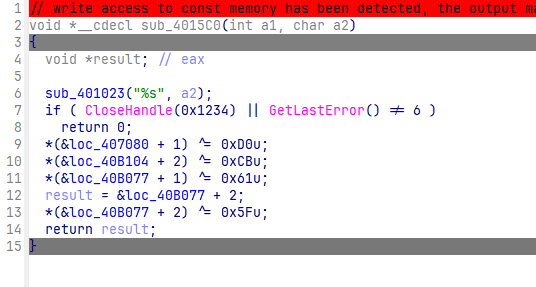

异常反调

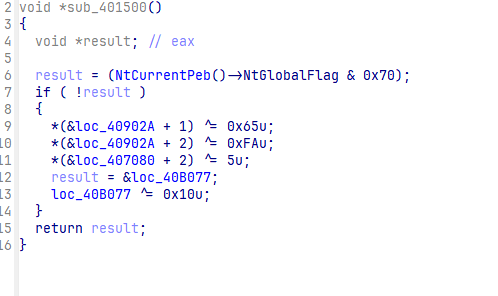

peb 反调

然后就能得到正确执行流

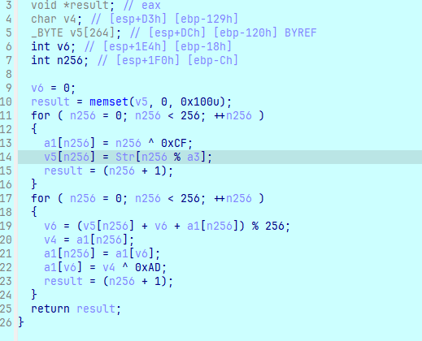

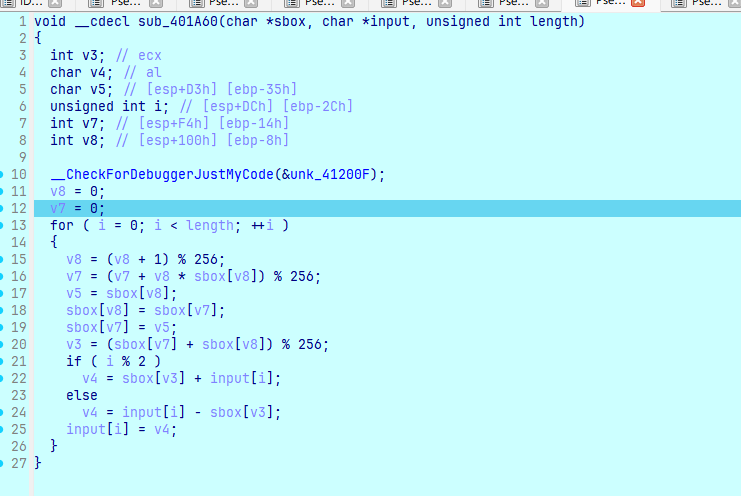

这里直接取 ksa 后的 sbox 了

```c
#include <stdio.h>

void dec(unsigned char *sbox, unsigned char *input, unsigned int length)
{
  int v3;
  char v4;
  char tmp;
  int v7;
  int v8;

  v8 = 0;
  v7 = 0;
  for (int i = 0; i < length; ++i)
  {
    v8 = (v8 + 1) % 256;
    v7 = (v7 + v8 * sbox[v8]) % 256;
    tmp = sbox[v8];
    sbox[v8] = sbox[v7];
    sbox[v7] = tmp;
    v3 = (sbox[v7] + sbox[v8]) % 256;
    if (i % 2)
      v4 = input[i] - sbox[v3];
    else
      v4 = input[i] + sbox[v3];
    input[i] = v4;
  }
}

int main()
{
  unsigned char sbox[256] = {0x35, 0xE9, 0x55, 0xD7, 0x6E, 0x5F, 0x47, 0x3D, 0xCC, 0x9D, 0xD2, 0x6B, 0xEB, 0x52, 0x97, 0x19, 0xD5, 0xC5, 0x80, 0xB, 0x64, 0x2B, 0xCD, 0xF6, 0x95, 0xB1, 0x31, 0x34, 0x31, 0x8, 0x43, 0xBE, 0x8C, 0x86, 0x16, 0x70, 0xFE, 0x36, 0x11, 0xFD, 0xA7, 0xB9, 0x55, 0xA0, 0x4E, 0x40, 0xDA, 0x8, 0x1F, 0x4B, 0xA2, 0x4C, 0x50, 0x47, 0x15, 0xCE, 0xC3, 0x8D, 0xB5, 0x0, 0xFB, 0x43, 0x7, 0x32, 0x1D, 0x5E, 0xDC, 0x4D, 0xF5, 0x19, 0x98, 0xF, 0x8D, 0xB0, 0xEC, 0x48, 0xAB, 0x92, 0x15, 0xD6, 0xDA, 0x6F, 0x1B, 0x85, 0x45, 0x4, 0x84, 0x8A, 0x5B, 0xE, 0x66, 0xB6, 0xA0, 0x1E, 0x2A, 0x6D, 0x3C, 0x8F, 0x26, 0xC7, 0x90, 0x89, 0xDC, 0x8B, 0x87, 0xE0, 0x82, 0x57, 0xCE, 0x66, 0x13, 0x4B, 0x49, 0x6A, 0x1F, 0x1A, 0x9, 0x32, 0x8E, 0x36, 0xAD, 0x65, 0x58, 0xBC, 0xD4, 0x5E, 0xD0, 0x2C, 0x68, 0xBF, 0xBD, 0xA1, 0x45, 0x17, 0x16, 0x5, 0x9A, 0x4C, 0xFC, 0xB, 0xB9, 0x49, 0xDB, 0x6F, 0x37, 0x27, 0x30, 0x51, 0x69, 0x61, 0xD5, 0x75, 0xD3, 0x74, 0xEB, 0x4F, 0x23, 0x54, 0xC, 0x1C, 0x70, 0xDE, 0xE9, 0x7F, 0x62, 0x25, 0xF4, 0x84, 0x3E, 0x2F, 0x76, 0x3, 0x7A, 0x79, 0x5F, 0xCA, 0x1, 0x7, 0x41, 0x57, 0xC4, 0x97, 0x4, 0x33, 0x6C, 0x42, 0x4E, 0x38, 0xE, 0xE7, 0x93, 0xE2, 0x64, 0x3F, 0xB7, 0x5C, 0x5D, 0xE5, 0x59, 0x8C, 0x6D, 0xED, 0x34, 0x85, 0xDF, 0x62, 0x91, 0x9, 0x94, 0xB3, 0x5, 0x2E, 0x18, 0xD8, 0xBF, 0x7E, 0xAC, 0xAE, 0x9E, 0xD6, 0xC1, 0x3B, 0x54, 0x72, 0x22, 0x5C, 0xE7, 0xD0, 0x6B, 0x25, 0xFE, 0xFF, 0xFB, 0x3B, 0x2D, 0x7C, 0x65, 0x5A, 0xCD, 0xF0, 0xBD, 0x67, 0x74, 0x17, 0x2, 0x42, 0x2C, 0x2E, 0x5A, 0xA7, 0xD1, 0x73, 0x94, 0xAF, 0x89, 0x6};
  unsigned char enc[] = {0x50, 0x59, 0xA2, 0x94, 0x2E, 0x8E, 0x5C, 0x95, 0x79, 0x16, 0xE5, 0x36, 0x60, 0xC7, 0xE8, 0x6, 0x33, 0x78, 0xF0, 0xD0, 0x36, 0xC8, 0x73, 0x1B, 0x65, 0x40, 0xB5, 0xD4, 0xE8, 0x9C, 0x65, 0xF4, 0xBA, 0x62, 0xD0};
  dec(sbox, enc, sizeof(enc));
  printf("%s\n", enc);
}
//NepCTF{Y0u_FiN1sH_Th1s_E3sy_Smc!!!}
```

## Crackme

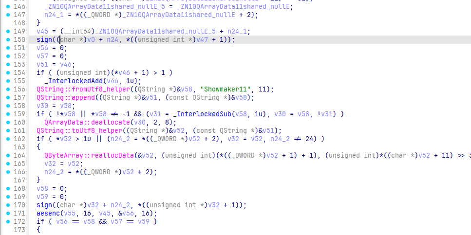

主程序逻辑很清晰，获取 name 的 sign 然后 再获取 name 后面加 Showmaker11 的 sign

然后把第一个 sign 做 key，第二个 sign 做密文进行 aes 加密然后验证

sign 和 aes 均来自 libcrypt.dll

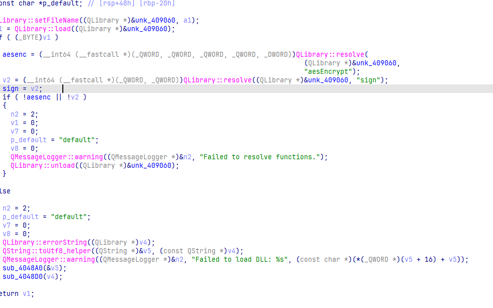

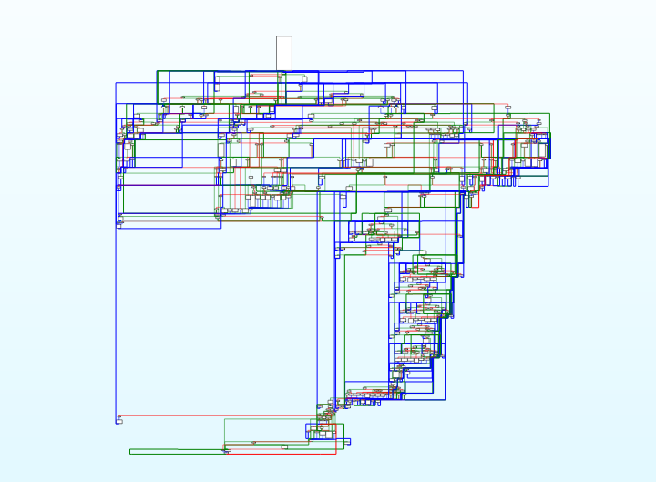

dll 被混淆了，还进行了字符串加密

通过解密后的字符串得到此题 aes128 的源码

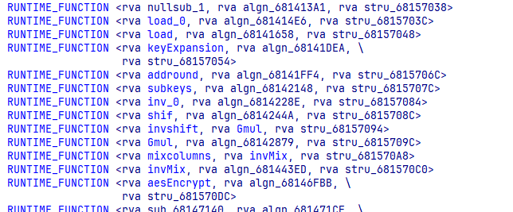

并且发现被内联的函数都被放在了一起

最终发现只在`mixColumns`​ 函数中加了一个异或


```c
#include <stdint.h>
#include <stdio.h>
#include <string.h>
#include <stdlib.h>
#include <windows.h>
#include <stdint.h>

typedef struct
{
  uint32_t eK[44], dK[44]; // encKey, decKey
  int Nr;                  // 10 rounds
} AesKey;

#define BLOCKSIZE 16 // AES-128分组长度为16字节

// uint8_t y[4] -> uint32_t x
#define LOAD32H(x, y)                                                             \
  do                                                                              \
  {                                                                               \
    (x) = ((uint32_t)((y)[0] & 0xff) << 24) | ((uint32_t)((y)[1] & 0xff) << 16) | \
          ((uint32_t)((y)[2] & 0xff) << 8) | ((uint32_t)((y)[3] & 0xff));         \
  } while (0)

// uint32_t x -> uint8_t y[4]
#define STORE32H(x, y)                      \
  do                                        \
  {                                         \
    (y)[0] = (uint8_t)(((x) >> 24) & 0xff); \
    (y)[1] = (uint8_t)(((x) >> 16) & 0xff); \
    (y)[2] = (uint8_t)(((x) >> 8) & 0xff);  \
    (y)[3] = (uint8_t)((x) & 0xff);         \
  } while (0)

// 从uint32_t x中提取从低位开始的第n个字节
#define BYTE(x, n) (((x) >> (8 * (n))) & 0xff)

// 密钥扩展中的SubWord(RotWord(temp),字节替换然后循环左移1位
#define MIX(x) (((S[BYTE(x, 2)] << 24) & 0xff000000) ^ ((S[BYTE(x, 1)] << 16) & 0xff0000) ^ \
                ((S[BYTE(x, 0)] << 8) & 0xff00) ^ (S[BYTE(x, 3)] & 0xff))

// uint32_t x循环左移n位
#define ROF32(x, n) (((x) << (n)) | ((x) >> (32 - (n))))
// uint32_t x循环右移n位
#define ROR32(x, n) (((x) >> (n)) | ((x) << (32 - (n))))

// AES-128轮常量,无符号长整型
static const uint32_t rcon[10] = {
    0x01000000UL, 0x02000000UL, 0x04000000UL, 0x08000000UL, 0x10000000UL,
    0x20000000UL, 0x40000000UL, 0x80000000UL, 0x1B000000UL, 0x36000000UL};
// S盒
unsigned char S[256] = {
    0x63, 0x7C, 0x77, 0x7B, 0xF2, 0x6B, 0x6F, 0xC5, 0x30, 0x01, 0x67, 0x2B, 0xFE, 0xD7, 0xAB, 0x76,
    0xCA, 0x82, 0xC9, 0x7D, 0xFA, 0x59, 0x47, 0xF0, 0xAD, 0xD4, 0xA2, 0xAF, 0x9C, 0xA4, 0x72, 0xC0,
    0xB7, 0xFD, 0x93, 0x26, 0x36, 0x3F, 0xF7, 0xCC, 0x34, 0xA5, 0xE5, 0xF1, 0x71, 0xD8, 0x31, 0x15,
    0x04, 0xC7, 0x23, 0xC3, 0x18, 0x96, 0x05, 0x9A, 0x07, 0x12, 0x80, 0xE2, 0xEB, 0x27, 0xB2, 0x75,
    0x09, 0x83, 0x2C, 0x1A, 0x1B, 0x6E, 0x5A, 0xA0, 0x52, 0x3B, 0xD6, 0xB3, 0x29, 0xE3, 0x2F, 0x84,
    0x53, 0xD1, 0x00, 0xED, 0x20, 0xFC, 0xB1, 0x5B, 0x6A, 0xCB, 0xBE, 0x39, 0x4A, 0x4C, 0x58, 0xCF,
    0xD0, 0xEF, 0xAA, 0xFB, 0x43, 0x4D, 0x33, 0x85, 0x45, 0xF9, 0x02, 0x7F, 0x50, 0x3C, 0x9F, 0xA8,
    0x51, 0xA3, 0x40, 0x8F, 0x92, 0x9D, 0x38, 0xF5, 0xBC, 0xB6, 0xDA, 0x21, 0x10, 0xFF, 0xF3, 0xD2,
    0xCD, 0x0C, 0x13, 0xEC, 0x5F, 0x97, 0x44, 0x17, 0xC4, 0xA7, 0x7E, 0x3D, 0x64, 0x5D, 0x19, 0x73,
    0x60, 0x81, 0x4F, 0xDC, 0x22, 0x2A, 0x90, 0x88, 0x46, 0xEE, 0xB8, 0x14, 0xDE, 0x5E, 0x0B, 0xDB,
    0xE0, 0x32, 0x3A, 0x0A, 0x49, 0x06, 0x24, 0x5C, 0xC2, 0xD3, 0xAC, 0x62, 0x91, 0x95, 0xE4, 0x79,
    0xE7, 0xC8, 0x37, 0x6D, 0x8D, 0xD5, 0x4E, 0xA9, 0x6C, 0x56, 0xF4, 0xEA, 0x65, 0x7A, 0xAE, 0x08,
    0xBA, 0x78, 0x25, 0x2E, 0x1C, 0xA6, 0xB4, 0xC6, 0xE8, 0xDD, 0x74, 0x1F, 0x4B, 0xBD, 0x8B, 0x8A,
    0x70, 0x3E, 0xB5, 0x66, 0x48, 0x03, 0xF6, 0x0E, 0x61, 0x35, 0x57, 0xB9, 0x86, 0xC1, 0x1D, 0x9E,
    0xE1, 0xF8, 0x98, 0x11, 0x69, 0xD9, 0x8E, 0x94, 0x9B, 0x1E, 0x87, 0xE9, 0xCE, 0x55, 0x28, 0xDF,
    0x8C, 0xA1, 0x89, 0x0D, 0xBF, 0xE6, 0x42, 0x68, 0x41, 0x99, 0x2D, 0x0F, 0xB0, 0x54, 0xBB, 0x16};

// 逆S盒
unsigned char inv_S[256] = {
    0x52, 0x09, 0x6A, 0xD5, 0x30, 0x36, 0xA5, 0x38, 0xBF, 0x40, 0xA3, 0x9E, 0x81, 0xF3, 0xD7, 0xFB,
    0x7C, 0xE3, 0x39, 0x82, 0x9B, 0x2F, 0xFF, 0x87, 0x34, 0x8E, 0x43, 0x44, 0xC4, 0xDE, 0xE9, 0xCB,
    0x54, 0x7B, 0x94, 0x32, 0xA6, 0xC2, 0x23, 0x3D, 0xEE, 0x4C, 0x95, 0x0B, 0x42, 0xFA, 0xC3, 0x4E,
    0x08, 0x2E, 0xA1, 0x66, 0x28, 0xD9, 0x24, 0xB2, 0x76, 0x5B, 0xA2, 0x49, 0x6D, 0x8B, 0xD1, 0x25,
    0x72, 0xF8, 0xF6, 0x64, 0x86, 0x68, 0x98, 0x16, 0xD4, 0xA4, 0x5C, 0xCC, 0x5D, 0x65, 0xB6, 0x92,
    0x6C, 0x70, 0x48, 0x50, 0xFD, 0xED, 0xB9, 0xDA, 0x5E, 0x15, 0x46, 0x57, 0xA7, 0x8D, 0x9D, 0x84,
    0x90, 0xD8, 0xAB, 0x00, 0x8C, 0xBC, 0xD3, 0x0A, 0xF7, 0xE4, 0x58, 0x05, 0xB8, 0xB3, 0x45, 0x06,
    0xD0, 0x2C, 0x1E, 0x8F, 0xCA, 0x3F, 0x0F, 0x02, 0xC1, 0xAF, 0xBD, 0x03, 0x01, 0x13, 0x8A, 0x6B,
    0x3A, 0x91, 0x11, 0x41, 0x4F, 0x67, 0xDC, 0xEA, 0x97, 0xF2, 0xCF, 0xCE, 0xF0, 0xB4, 0xE6, 0x73,
    0x96, 0xAC, 0x74, 0x22, 0xE7, 0xAD, 0x35, 0x85, 0xE2, 0xF9, 0x37, 0xE8, 0x1C, 0x75, 0xDF, 0x6E,
    0x47, 0xF1, 0x1A, 0x71, 0x1D, 0x29, 0xC5, 0x89, 0x6F, 0xB7, 0x62, 0x0E, 0xAA, 0x18, 0xBE, 0x1B,
    0xFC, 0x56, 0x3E, 0x4B, 0xC6, 0xD2, 0x79, 0x20, 0x9A, 0xDB, 0xC0, 0xFE, 0x78, 0xCD, 0x5A, 0xF4,
    0x1F, 0xDD, 0xA8, 0x33, 0x88, 0x07, 0xC7, 0x31, 0xB1, 0x12, 0x10, 0x59, 0x27, 0x80, 0xEC, 0x5F,
    0x60, 0x51, 0x7F, 0xA9, 0x19, 0xB5, 0x4A, 0x0D, 0x2D, 0xE5, 0x7A, 0x9F, 0x93, 0xC9, 0x9C, 0xEF,
    0xA0, 0xE0, 0x3B, 0x4D, 0xAE, 0x2A, 0xF5, 0xB0, 0xC8, 0xEB, 0xBB, 0x3C, 0x83, 0x53, 0x99, 0x61,
    0x17, 0x2B, 0x04, 0x7E, 0xBA, 0x77, 0xD6, 0x26, 0xE1, 0x69, 0x14, 0x63, 0x55, 0x21, 0x0C, 0x7D};

/* copy in[16] to state[4][4] */
int loadStateArray(uint8_t (*state)[4], const uint8_t *in)
{
  for (int i = 0; i < 4; ++i)
  {
    for (int j = 0; j < 4; ++j)
    {
      state[j][i] = *in++;
    }
  }
  return 0;
}

/* copy state[4][4] to out[16] */
int storeStateArray(uint8_t (*state)[4], uint8_t *out)
{
  for (int i = 0; i < 4; ++i)
  {
    for (int j = 0; j < 4; ++j)
    {
      *out++ = state[j][i];
    }
  }
  return 0;
}

// 密钥扩展，只接受16字初始密钥
int keyExpansion(const uint8_t *key, uint32_t keyLen, AesKey *aesKey)
{

  if (NULL == key || NULL == aesKey)
  {
    printf("keyExpansion param is NULL\n");
    return -1;
  }

  if (keyLen != 16)
  {
    printf("keyExpansion keyLen = %d, Not support.\n", keyLen);
    return -1;
  }

  uint32_t *w = aesKey->eK; // 加密密钥
  uint32_t *v = aesKey->dK; // 解密密钥

  // 扩展密钥长度44=4*(10+1)个字,原始密钥128位，4个32位字，Nb*(Nr+1)

  /* W[0-3],前4个字为原始密钥 */
  for (int i = 0; i < 4; ++i)
  {
    LOAD32H(w[i], key + 4 * i);
  }

  /* W[4-43] */
  // temp=w[i-1];tmp=SubWord(RotWord(temp))xor Rcon[i/4] xor w[i-Nk]
  for (int i = 0; i < 10; ++i)
  {
    w[4] = w[0] ^ MIX(w[3]) ^ rcon[i];
    w[5] = w[1] ^ w[4];
    w[6] = w[2] ^ w[5];
    w[7] = w[3] ^ w[6];
    w += 4;
  }

  w = aesKey->eK + 44 - 4;
  // 解密密钥矩阵为加密密钥矩阵的倒序，方便使用，把ek的11个矩阵倒序排列分配给dk作为解密密钥
  // 即dk[0-3]=ek[41-44], dk[4-7]=ek[37-40]... dk[41-44]=ek[0-3]
  for (int j = 0; j < 11; ++j)
  {
    for (int i = 0; i < 4; ++i)
    {
      v[i] = w[i];
    }
    w -= 4;
    v += 4;
  }

  return 0;
}

// 轮密钥加
int addRoundKey(uint8_t (*state)[4], const uint32_t *key)
{
  uint8_t k[4][4];

  /* i: row, j: col */
  for (int i = 0; i < 4; ++i)
  {
    for (int j = 0; j < 4; ++j)
    {
      k[i][j] = (uint8_t)BYTE(key[j], 3 - i); /* 把 uint32 key[4] 先转换为矩阵 uint8 k[4][4] */
      state[i][j] ^= k[i][j];
    }
  }

  return 0;
}

// 字节替换
int subBytes(uint8_t (*state)[4])
{
  /* i: row, j: col */
  for (int i = 0; i < 4; ++i)
  {
    for (int j = 0; j < 4; ++j)
    {
      state[i][j] = S[state[i][j]]; // 直接使用原始字节作为S盒数据下标
    }
  }

  return 0;
}

// 逆字节替换
int invSubBytes(uint8_t (*state)[4])
{
  /* i: row, j: col */
  for (int i = 0; i < 4; ++i)
  {
    for (int j = 0; j < 4; ++j)
    {
      state[i][j] = inv_S[state[i][j]];
    }
  }
  return 0;
}

// 行移位
int shiftRows(uint8_t (*state)[4])
{
  uint32_t block[4] = {0};

  /* i: row */
  for (int i = 0; i < 4; ++i)
  {
    // 便于行循环移位，先把一行4字节拼成uint_32结构，移位后再转成独立的4个字节uint8_t
    LOAD32H(block[i], state[i]);
    block[i] = ROF32(block[i], 8 * i); // block[i]循环左移8*i位，如第0行左移0位
    STORE32H(block[i], state[i]);
  }
  return 0;
}

// 逆行移位
int invShiftRows(uint8_t (*state)[4])
{
  uint32_t block[4] = {0};

  /* i: row */
  for (int i = 0; i < 4; ++i)
  {
    LOAD32H(block[i], state[i]);
    block[i] = ROR32(block[i], 8 * i);
    STORE32H(block[i], state[i]);
  }

  return 0;
}

/* Galois Field (256) Multiplication of two Bytes */
// 两字节的伽罗华域乘法运算
uint8_t GMul(uint8_t u, uint8_t v)
{
  uint8_t p = 0;

  for (int i = 0; i < 8; ++i)
  {
    if (u & 0x01)
    {
      p ^= v;
    }

    int flag = (v & 0x80);
    v <<= 1;
    if (flag)
    {
      v ^= 0x1B;
    }

    u >>= 1;
  }

  return p;
}

// 列混合
int mixColumns(uint8_t (*state)[4])
{
  uint8_t tmp[4][4];
  uint8_t M[4][4] = {{0x02, 0x03, 0x01, 0x01},
                     {0x01, 0x02, 0x03, 0x01},
                     {0x01, 0x01, 0x02, 0x03},
                     {0x03, 0x01, 0x01, 0x02}};

  /* copy state[4][4] to tmp[4][4] */
  for (int i = 0; i < 4; ++i)
  {
    for (int j = 0; j < 4; ++j)
    {
      tmp[i][j] = state[i][j];
    }
  }

  for (int i = 0; i < 4; ++i)
  {
    for (int j = 0; j < 4; ++j)
    { // 伽罗华域加法和乘法
      // state[i][j] = GMul(M[i][0], tmp[0][j]) ^ GMul(M[i][1], tmp[1][j])
      //     ^ GMul(M[i][2], tmp[2][j]) ^ GMul(M[i][3], tmp[3][j]);
      state[i][j] = GMul(M[i][0], tmp[0][j]) ^ GMul(M[i][1], tmp[1][j]) ^ GMul(M[i][2], tmp[2][j]) ^ GMul(M[i][3], tmp[3][j]) ^ 0x55;
    }
  }

  return 0;
}

// 逆列混合
int invMixColumns(uint8_t (*state)[4])
{
  uint8_t tmp[4][4];
  uint8_t M[4][4] = {{0x0E, 0x0B, 0x0D, 0x09},
                     {0x09, 0x0E, 0x0B, 0x0D},
                     {0x0D, 0x09, 0x0E, 0x0B},
                     {0x0B, 0x0D, 0x09, 0x0E}}; // 使用列混合矩阵的逆矩阵

  /* copy state[4][4] to tmp[4][4] */
  for (int i = 0; i < 4; ++i)
  {
    for (int j = 0; j < 4; ++j)
    {
      tmp[i][j] = state[i][j];
    }
  }

  for (int i = 0; i < 4; ++i)
  {
    for (int j = 0; j < 4; ++j)
    {
      state[i][j] = GMul(M[i][0], tmp[0][j]) ^ GMul(M[i][1], tmp[1][j]) ^ GMul(M[i][2], tmp[2][j]) ^ GMul(M[i][3], tmp[3][j]) ^ 0x55;
    }
  }

  return 0;
}

// AES-128加密接口，输入key应为16字节长度，输入长度应该是16字节整倍数，
// 这样输出长度与输入长度相同，函数调用外部为输出数据分配内存
int aesEncrypt(const uint8_t *key, uint32_t keyLen, const uint8_t *pt, uint8_t *ct, uint32_t len)
{
  AesKey aesKey;
  uint8_t *pos = ct;
  const uint32_t *rk = aesKey.eK; // 加密密钥指针
  uint8_t out[BLOCKSIZE] = {0};
  uint8_t actualKey[16] = {0};
  uint8_t state[4][4] = {0};

  if (NULL == key || NULL == pt || NULL == ct)
  {
    printf("param err.\n");
    return -1;
  }

  if (keyLen > 16)
  {
    printf("keyLen must be 16.\n");
    return -1;
  }

  if (len % BLOCKSIZE)
  {
    printf("inLen is invalid.\n");
    return -1;
  }

  memcpy(actualKey, key, keyLen);
  keyExpansion(actualKey, 16, &aesKey); // 密钥扩展

  // 使用ECB模式循环加密多个分组长度的数据
  for (int i = 0; i < len; i += BLOCKSIZE)
  {
    // 把16字节的明文转换为4x4状态矩阵来进行处理
    loadStateArray(state, pt);
    // 轮密钥加
    addRoundKey(state, rk);

    for (int j = 1; j < 10; ++j)
    {
      rk += 4;
      subBytes(state);        // 字节替换
      shiftRows(state);       // 行移位
      mixColumns(state);      // 列混合
      addRoundKey(state, rk); // 轮密钥加
    }

    subBytes(state);  // 字节替换
    shiftRows(state); // 行移位
    // 此处不进行列混合
    addRoundKey(state, rk + 4); // 轮密钥加

    // 把4x4状态矩阵转换为uint8_t一维数组输出保存
    storeStateArray(state, pos);

    pos += BLOCKSIZE; // 加密数据内存指针移动到下一个分组
    pt += BLOCKSIZE;  // 明文数据指针移动到下一个分组
    rk = aesKey.eK;   // 恢复rk指针到秘钥初始位置
  }
  return 0;
}

// AES128解密， 参数要求同加密
int aesDecrypt(const uint8_t *key, uint32_t keyLen, const uint8_t *ct, uint8_t *pt, uint32_t len)
{
  AesKey aesKey;
  uint8_t *pos = pt;
  const uint32_t *rk = aesKey.dK; // 解密密钥指针
  uint8_t out[BLOCKSIZE] = {0};
  uint8_t actualKey[16] = {0};
  uint8_t state[4][4] = {0};

  if (NULL == key || NULL == ct || NULL == pt)
  {
    printf("param err.\n");
    return -1;
  }

  if (keyLen > 16)
  {
    printf("keyLen must be 16.\n");
    return -1;
  }

  if (len % BLOCKSIZE)
  {
    printf("inLen is invalid.\n");
    return -1;
  }

  memcpy(actualKey, key, keyLen);
  keyExpansion(actualKey, 16, &aesKey); // 密钥扩展，同加密

  for (int i = 0; i < len; i += BLOCKSIZE)
  {
    // 把16字节的密文转换为4x4状态矩阵来进行处理
    loadStateArray(state, ct);
    // 轮密钥加，同加密
    addRoundKey(state, rk);

    for (int j = 1; j < 10; ++j)
    {
      rk += 4;
      invShiftRows(state);    // 逆行移位
      invSubBytes(state);     // 逆字节替换，这两步顺序可以颠倒
      addRoundKey(state, rk); // 轮密钥加，同加密
      invMixColumns(state);   // 逆列混合
    }

    invShiftRows(state); // 逆行移位
    invSubBytes(state);  // 逆字节替换
    // 此处没有逆列混合
    addRoundKey(state, rk + 4); // 轮密钥加，同加密

    storeStateArray(state, pos); // 保存明文数据
    pos += BLOCKSIZE;            // 输出数据内存指针移位分组长度
    ct += BLOCKSIZE;             // 输入数据内存指针移位分组长度
    rk = aesKey.dK;              // 恢复rk指针到秘钥初始位置
  }
  return 0;
}

void sign(unsigned char *in, int len, unsigned char *out)
{
  HINSTANCE hAes = LoadLibrary("libcrypto.dll");
  auto encrypt = (void (*)(unsigned char *, int, unsigned char *))GetProcAddress(hAes, "sign");
  if (!encrypt)
  {
    printf("GetProcAddress failed\n");
  }

  encrypt(in, len, out);
}

int main()
{
  uint8_t key[16] = {0x24, 0x25, 0x8A, 0x5B, 0x6A, 0x20, 0x62, 0x5D, 0xD2, 0x71, 0x64, 0x32, 0xFD, 0xE7, 0x5E, 0xC4};
  uint8_t pt[16] = {0xca, 0x02, 0xa1, 0xd4, 0x73, 0x4b, 0x36, 0x8f, 0x8a, 0x1d, 0x78, 0x5e, 0xdf, 0x13, 0xa4, 0xe2};
  uint8_t ct[16] = {0x22, 0xEB, 0xB5, 0x40, 0x91, 0x62, 0x9C, 0xF7, 0xE2, 0x13, 0xFF, 0xA8, 0x8C, 0x54, 0xD9, 0x80}; // 外部申请输出数据内存，用于加密后的数据
  uint8_t plain[16] = {0};
  unsigned char out[16] = {0};
  int len = 0;
  char raw[][100] = {"lixShowmaker11", "zhangqinShowmaker11", "yingchenShowmaker11", "esShowmaker11", "wangguiyingShowmaker11", "zhangqiangShowmaker11", "liuxiuyingShowmaker11", "iqShowmaker11", "lilizhangShowmaker11", "liuhuanShowmaker11", "liuylShowmaker11", "zhangliangShowmaker11", "wangfShowmaker11", "lixzShowmaker11", "liliShowmaker11", "lixiuhuaShowmaker11", "tliShowmaker11", "rmShowmaker11", "vxShowmaker11", "liujShowmaker11", "xiulanchenShowmaker11", "mhuangShowmaker11", "shuhuawangShowmaker11", "jianguoliShowmaker11", "kailiuShowmaker11", "zhiqiangzhangShowmaker11", "zgShowmaker11", "bliShowmaker11", "lwShowmaker11", "ioShowmaker11", "zbShowmaker11", "litShowmaker11", "chenqiangShowmaker11", "zhangguirongShowmaker11", "xiangliShowmaker11", "taowangShowmaker11", "manageShowmaker11", "mxShowmaker11", "lihShowmaker11", "loShowmaker11", "xmliShowmaker11", "jnShowmaker11", "hmzhangShowmaker11", "zhaoweiShowmaker11", "yumeiwangShowmaker11", "shuyingliShowmaker11", "slzhangShowmaker11", "binzhangShowmaker11", "zhangsShowmaker11", "keShowmaker11", "jingzhangShowmaker11", "aiShowmaker11", "pliuShowmaker11", "cmzhangShowmaker11", "guirongliShowmaker11", "mwangShowmaker11", "lixiangShowmaker11", "cliShowmaker11", "gfzhangShowmaker11", "alShowmaker11", "yangliShowmaker11", "lzhangShowmaker11", "anShowmaker11", "xlyangShowmaker11", "zhangyzShowmaker11", "waShowmaker11", "ldmShowmaker11", "zhanghmShowmaker11", "osShowmaker11", "lmaShowmaker11", "hoShowmaker11", "gwShowmaker11", "qiangchenShowmaker11", "wangguihuaShowmaker11", "jfwangShowmaker11", "gfliShowmaker11", "xywangShowmaker11", "drShowmaker11", "pgShowmaker11", "hxliShowmaker11", "yyangShowmaker11", "hsShowmaker11", "ymliuShowmaker11", "eeShowmaker11", "wjfShowmaker11", "fangchenShowmaker11", "chenxShowmaker11", "yxzShowmaker11", "chenhongShowmaker11", "adminrootShowmaker11", "qiangwangShowmaker11", "linliShowmaker11", "wangxiufangShowmaker11", "csShowmaker11", "liuyulanShowmaker11", "guizhenliuShowmaker11", "ryShowmaker11", "boyangShowmaker11", "haiyanliShowmaker11", "guilanliShowmaker11", "inkeyShowmaker11"};
  char raw1[][100] = {"lix", "zhangqin", "yingchen", "es", "wangguiying", "zhangqiang", "liuxiuying", "iq", "lilizhang", "liuhuan", "liuyl", "zhangliang", "wangf", "lixz", "lili", "lixiuhua", "tli", "rm", "vx", "liuj", "xiulanchen", "mhuang", "shuhuawang", "jianguoli", "kailiu", "zhiqiangzhang", "zg", "bli", "lw", "io", "zb", "lit", "chenqiang", "zhangguirong", "xiangli", "taowang", "manage", "mx", "lih", "lo", "xmli", "jn", "hmzhang", "zhaowei", "yumeiwang", "shuyingli", "slzhang", "binzhang", "zhangs", "ke", "jingzhang", "ai", "pliu", "cmzhang", "guirongli", "mwang", "lixiang", "cli", "gfzhang", "al", "yangli", "lzhang", "an", "xlyang", "zhangyz", "wa", "ldm", "zhanghm", "os", "lma", "ho", "gw", "qiangchen", "wangguihua", "jfwang", "gfli", "xywang", "dr", "pg", "hxli", "yyang", "hs", "ymliu", "ee", "wjf", "fangchen", "chenx", "yxz", "chenhong", "adminroot", "qiangwang", "linli", "wangxiufang", "cs", "liuyulan", "guizhenliu", "ry", "boyang", "haiyanli", "guilanli"};
  for (int i = 0; i < 100; i++)
  {
    len = strlen(raw[i]);
    sign(raw[i], len, out);
    sign(raw1[i], strlen(raw1[i]), key);
    memset(plain, 0, 16);
    aesDecrypt(key, 16, out, plain, 16);
    for (int j = 0; j < 16; j++)
    {
      printf("%02x", plain[j]);
    }
    printf("\n");
  }

  return 0;
}
//NepCTF{8e31cd81-4f34-8d31-f2eb-fa6a2d2319cb}
```

## QRS

绝大多数字符串均被加密

解密函数

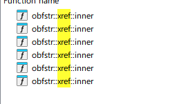

直接在解密函数处下断点，找到返回的 failed 后再向上回溯即可

最终在 0x14002B2D0 找到处理函数

在 0x14000FCE0 找到加密函数

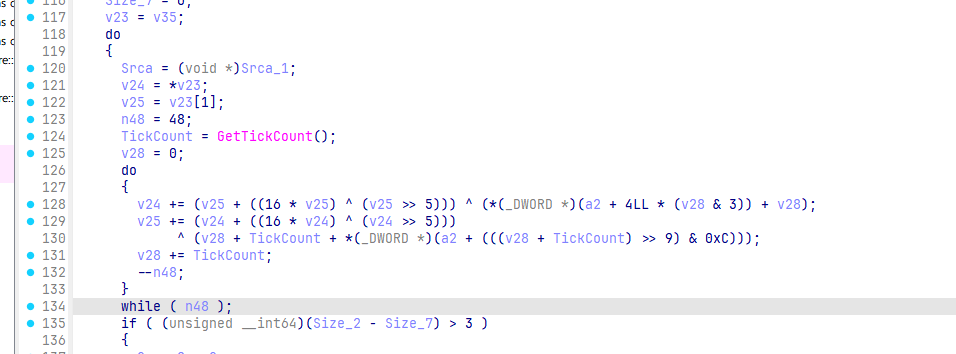

变种 xtea

```c
#include <stdio.h>
#include <stdint.h>

void encipher(unsigned int num_rounds, uint32_t v[2], uint32_t const key[4])
{
  unsigned int i;
  uint32_t v0 = v[0], v1 = v[1], sum = 0, delta = 0x68547369;
  for (i = 0; i < num_rounds; i++)
  {
    v0 += (((v1 << 4) ^ (v1 >> 5)) + v1) ^ (sum + key[sum & 3]);
    sum += delta;
    v1 += (((v0 << 4) ^ (v0 >> 5)) + v0) ^ (sum + key[(sum >> 11) & 3]);
  }
  v[0] = v0;
  v[1] = v1;
}

void decipher(unsigned int num_rounds, uint32_t v[2], uint32_t const key[4])
{
  unsigned int i;
  uint32_t v0 = v[0], v1 = v[1], delta = 0x68547369, sum = delta * num_rounds;
  for (i = 0; i < num_rounds; i++)
  {
    v1 -= (((v0 << 4) ^ (v0 >> 5)) + v0) ^ (sum + key[(sum >> 11) & 3]);
    sum -= delta;
    v0 -= (((v1 << 4) ^ (v1 >> 5)) + v1) ^ (sum + key[sum & 3]);
  }
  v[0] = v0;
  v[1] = v1;
}

int main()
{
  uint32_t k[4] = {0x1234567, 0x89ABCDEF, 0xFEDCBA98, 0x76543210};
  uint32_t enc[8] = {0x83EA621, 0xC745973C, 0xE3B77AE8, 0xCDEE8146, 0x7DC86B96, 0x6B8C9D3B, 0x79B14342, 0x2ECF0F0D};
  unsigned int r = 48;
  for (int i = 0; i < 4; i++)
  {
    decipher(r, &enc[2 * i], k);
  }
  for (int i = 0; i < 32; i++)
  {
    printf("%c", *((char *)enc + i));
  }
  return 0;
}
//a4747f82be106d3f8c4d747c744d7ee5
```

## SpeedMino-Warlock

根据提示找到[ethangreen-dev/lovely-injector at v0.8.0](https://github.com/ethangreen-dev/lovely-injector/tree/v0.8.0)

发现 version.dll 其实是一个 mod 的注入器

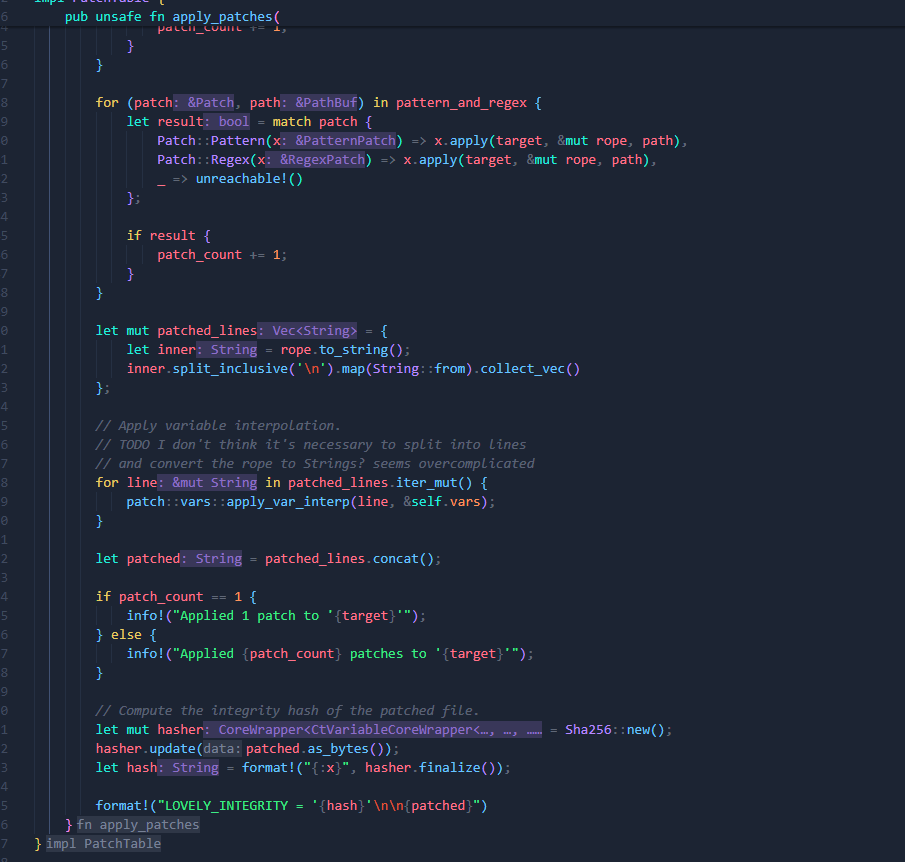

这是源码中应用 patch 的部分

通过字符串直接定位到关键位置

在 dll 的这个函数下断点

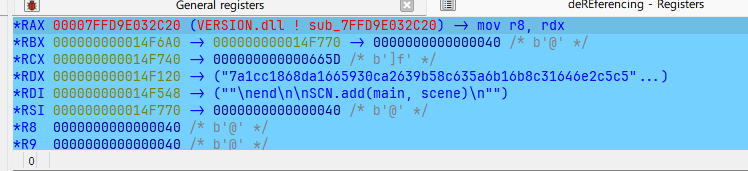

在加载 main.lua 的时候跳转到这个位置

可以看到刚才源代码中的 hash

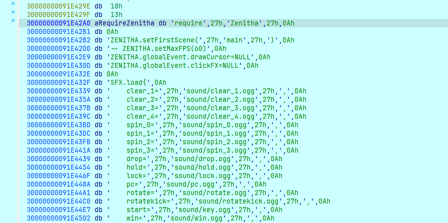

导出被修改的源码


找到被修改的部分

直接加载编译后的 lua 脚本进行验证

尝试了一堆反编译工具，最终找到[weaweawe01/luajit_decompile at 1.0](https://github.com/weaweawe01/luajit_decompile/tree/1.0)可以进行反编译

```lua
slot1 = function(slot0, slot1)
	slot2 = 0 + slot0 * 384 + slot1

	while true do
		slot3 = 2

		while true do
			if slot2 < slot3 * slot3 and (slot2 - 1) % 5 ~= 0 then
				return slot2
			end

			if slot2 % slot3 == 0 then
				break
			end

			slot3 = slot3 + 1
		end

		slot2 = slot2 + 1
	end

	return 383
end

slot2 = {
	36506,
	88774,
	438822,
	666001,
	109051,
	2124674,
	2767204,
	2610244,
	3272321,
	8662979,
	5131975,
	1034228,
	6712315,
	12760199,
	20058866,
	6854477,
	6126314,
	3871829,
	13815442,
	15034520,
	38884726,
	10742135,
	26199509,
	45230422,
	46725610,
	7627278,
	21052590,
	68432885,
	48719842,
	94974872,
	55215219,
	113201828,
	86070272,
	153897959,
	136736481,
	88243015,
	108020790,
	71691707,
	157143593,
	22399026,
	41588356,
	220309217,
	86844145,
	129645965,
	240111657,
	257783827,
	92900284,
	52969902,
	27539801,
	275411785,
	364406385,
	253200306,
	389008554,
	359199685,
	337450915
}

return (function (slot0)
	slot1 = 1
	slot2 = {
		359,
		383
	}

	if #uv0 ~= #slot0 then
		return false
	end

	for slot6 = 1, #slot0 do
		if (64 + slot0[slot6])^5 % (slot2[slot6] * slot2[slot6 + 1]) ~= uv0[slot6] then
			return false
		end

		slot2[slot6 + 2] = uv1(slot6, slot0[slot6])
	end

	return true
end)(slot0)

```

一个rsa 可以直接爆破

```lua
local uv0 = {
    36506, 88774, 438822, 666001, 109051, 2124674, 2767204, 2610244, 3272321, 8662979,
    5131975, 1034228, 6712315, 12760199, 20058866, 6854477, 6126314, 3871829, 13815442, 15034520,
    38884726, 10742135, 26199509, 45230422, 46725610, 7627278, 21052590, 68432885, 48719842, 94974872,
    55215219, 113201828, 86070272, 153897959, 136736481, 88243015, 108020790, 71691707, 157143593, 22399026,
    41588356, 220309217, 86844145, 129645965, 240111657, 257783827, 92900284, 52969902, 27539801, 275411785,
    364406385, 253200306, 389008554, 359199685, 337450915
}

local function uv1(i, val)
    local slot2 = i * 384 + val
    while true do
        local slot3 = 2
        while true do
            if slot2 < slot3 * slot3 and (slot2 - 1) % 5 ~= 0 then
                return slot2
            end
            if slot2 % slot3 == 0 then
                break
            end
            slot3 = slot3 + 1
        end
        slot2 = slot2 + 1
    end
end

local function solve()
    local slot2 = {359, 383}
    local slot0 = {}

    for i = 1, #uv0 do
        local found = false
        for x = 0, 383 do
            local val = (64 + x)^5 % (slot2[i] * slot2[i+1])
            if val == uv0[i] then
                slot0[i] = x
                slot2[i + 2] = uv1(i, x)
                found = true
                break
            end
        end
        if not found then
            error("Failed to find solution at index " .. i)
        end
    end

    return slot0
end

local result = solve()
for i, v in ipairs(result) do
    io.write(v)
    if i < #result then io.write(", ") end
end
io.write("\n")

```

运行得到密文

```
230, 210, 245, 223, 98, 97, 151, 114, 63, 90, 139, 78, 204, 42, 227, 68, 202, 55, 242, 163, 103, 108, 231, 197, 142, 255, 180, 98, 123, 0, 184, 145, 164, 171, 247, 41, 92, 21, 89, 100, 22, 125, 87, 98, 10, 142, 70, 107, 101, 142, 60, 65, 168, 214, 243
```

再根据 main.lua 的 rc4 解密

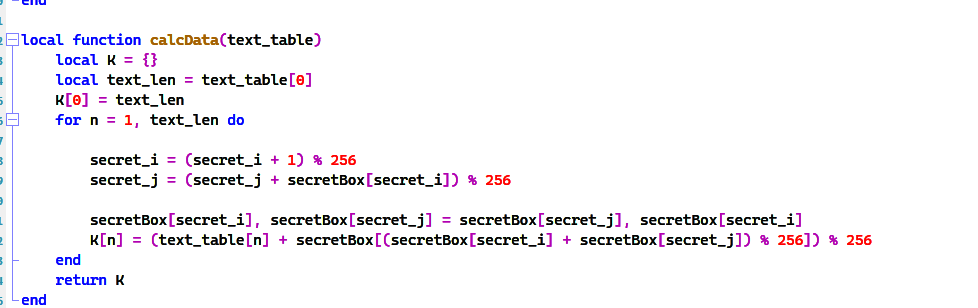

```c
#include <stdio.h>
#include <string.h>
unsigned char sbox[256] = {0};
void swap(unsigned char *a, unsigned char *b)
{
  unsigned char tmp = *a;
  *a = *b;
  *b = tmp;
}
void init_sbox(unsigned char key[])
{
  for (unsigned int i = 0; i < 256; i++)
    sbox[i] = i;
  unsigned int keyLen = strlen((char *)key);
  unsigned char Ttable[256] = {0};
  for (int i = 0; i < 256; i++)
    Ttable[i] = key[i % keyLen];
  for (int j = 0, i = 0; i < 256; i++)
  {
    j = (j + sbox[i] + key[i % keyLen]) % 256;
    swap(&sbox[i], &sbox[j]);
  }
}
void RC4(unsigned char data[])
{
  unsigned char k, i = 0, j = 0, t;
  unsigned int dataLen = 55;
  for (unsigned h = 0; h < dataLen; h++)
  {
    i = (i + 1) % 256;
    j = (j + sbox[i]) % 256;
    swap(&sbox[i], &sbox[j]);
    t = (sbox[i] + sbox[j]) % 256;
    k = sbox[t];
    data[h] = (data[h] - k + 256) % 256;
  }
}


int main()
{
  unsigned char key[] = {"Speedmino Created By MrZ and modified by zxc"};
  unsigned char enc[] = {230, 210, 245, 223, 98, 97, 151, 114, 63, 90, 139, 78, 204, 42, 227, 68, 202, 55, 242, 163, 103, 108, 231, 197, 142, 255, 180, 98, 123, 0, 184, 145, 164, 171, 247, 41, 92, 21, 89, 100, 22, 125, 87, 98, 10, 142, 70, 107, 101, 142, 60, 65, 168, 214, 243};
  init_sbox(key);
  RC4(enc);
  printf("%s", enc);

  return 0;
}

//NepCTF{Y0u_c4n_M0dDing_LOVE2D_g@mE_By_l0vely_iNjector!}
```

‍
