# 1.分析
## Flutter
依旧是blutter恢复符号
找到关键的函数
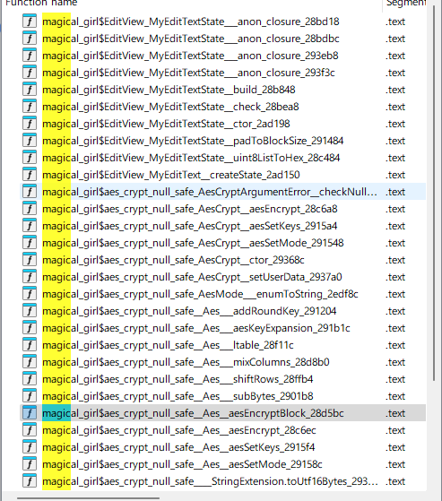
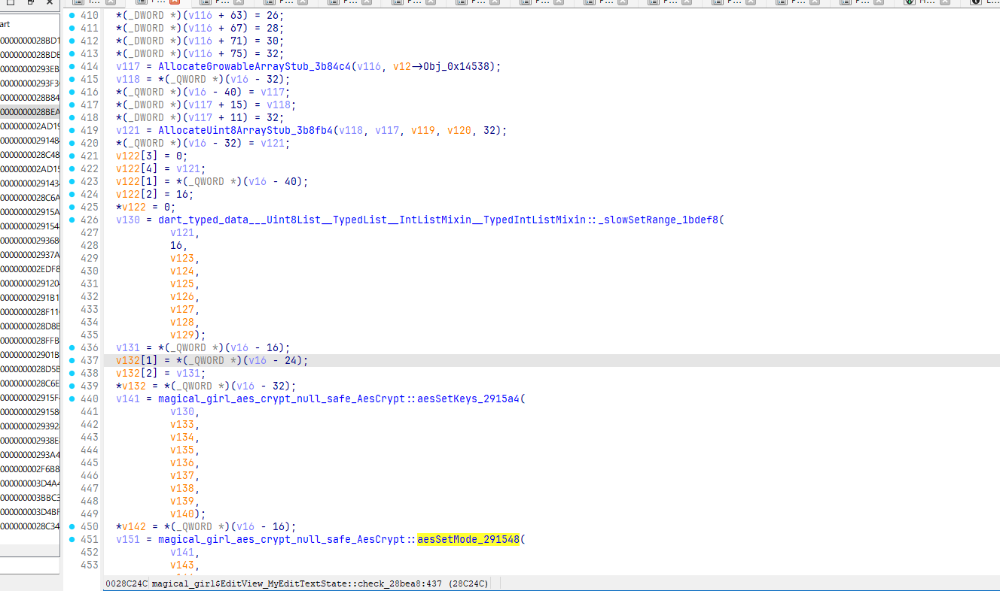
一大坨
不过可以看出是从另一个so获取key，然后setkeys
不过关于密码的逻辑不必关心，因为他会把key赋值给一个成员变量，我们后面可以直接读取到
继续往后看
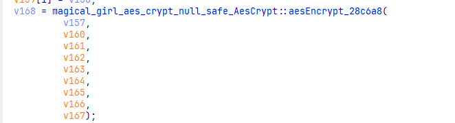
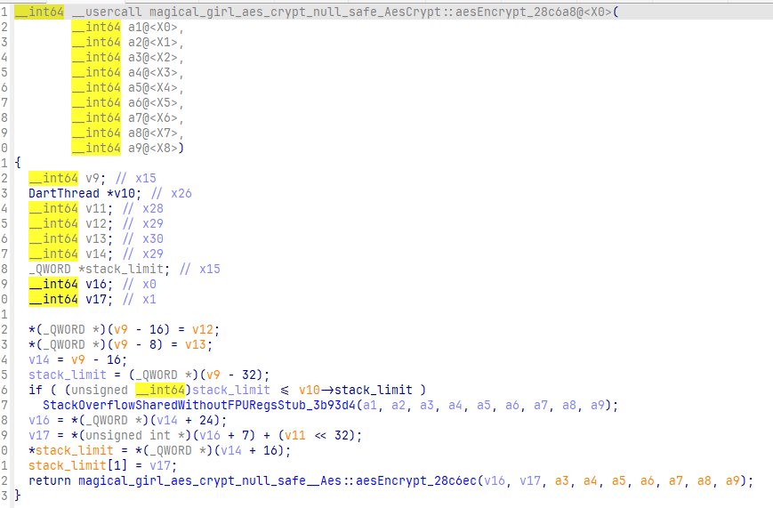
显然这里肯定会传一个类似实例的东西，借助blutter自带的frida脚本
```javascript
function onLibappLoaded() {
    const fn_addr = 0x28c6a8;
    Interceptor.attach(libapp.add(fn_addr), {
        onEnter: function () {
            init(this.context);
            let objPtr = getArg(this.context, 1);
            const [tptr, cls, values] = getTaggedObjectValue(objPtr);
            console.log(
                `${cls.name}@${tptr.toString().slice(2)} =`,
                JSON.stringify(values, null, 2)
            );
        },
    });
}
```
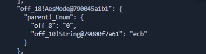
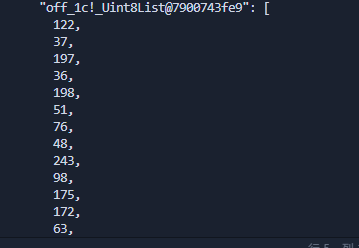
可以直接读到key和mode
不过试了一下，标准的aes ecb并不能产生相同结果
继续往下看
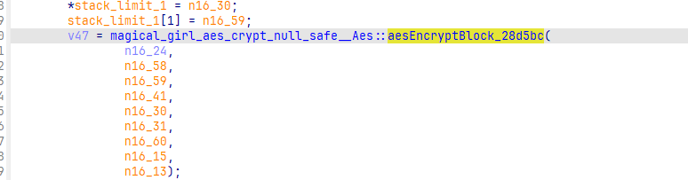
aesEncryptBlock这个函数是加密的主函数
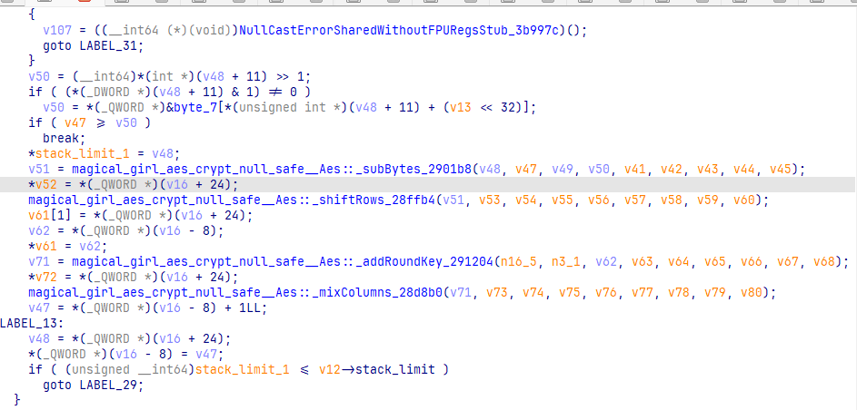
可以看出addRoundKey和mixColumns的顺序调换了
但是还是不能得到正确结果
继续往里翻

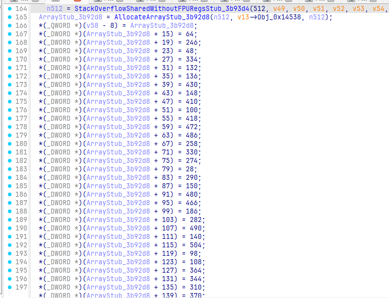
发现，subBytes， mixColumns， _ltable均有这种赋值操作，正好256个，疑似sbox
我们将这些值均除以2（flutter的整数貌似都是*2存储的）
测试下来，subBytes这里的是真正的sbox
```javascript
typedef struct
{
  uint32_t eK[44], dK[44]; // encKey, decKey
  int Nr;                  // 10 rounds
} AesKey;

#define BLOCKSIZE 16 // AES-128分组长度为16字节

// uint8_t y[4] -> uint32_t x
#define LOAD32H(x, y)                                                             \
  do                                                                              \
  {                                                                               \
    (x) = ((uint32_t)((y)[0] & 0xff) << 24) | ((uint32_t)((y)[1] & 0xff) << 16) | \
          ((uint32_t)((y)[2] & 0xff) << 8) | ((uint32_t)((y)[3] & 0xff));         \
  } while (0)

// uint32_t x -> uint8_t y[4]
#define STORE32H(x, y)                      \
  do                                        \
  {                                         \
    (y)[0] = (uint8_t)(((x) >> 24) & 0xff); \
    (y)[1] = (uint8_t)(((x) >> 16) & 0xff); \
    (y)[2] = (uint8_t)(((x) >> 8) & 0xff);  \
    (y)[3] = (uint8_t)((x) & 0xff);         \
  } while (0)

// 从uint32_t x中提取从低位开始的第n个字节
#define BYTE(x, n) (((x) >> (8 * (n))) & 0xff)

// 密钥扩展中的SubWord(RotWord(temp),字节替换然后循环左移1位
#define MIX(x) (((S[BYTE(x, 2)] << 24) & 0xff000000) ^ ((S[BYTE(x, 1)] << 16) & 0xff0000) ^ \
                ((S[BYTE(x, 0)] << 8) & 0xff00) ^ (S[BYTE(x, 3)] & 0xff))

// uint32_t x循环左移n位
#define ROF32(x, n) (((x) << (n)) | ((x) >> (32 - (n))))
// uint32_t x循环右移n位
#define ROR32(x, n) (((x) >> (n)) | ((x) << (32 - (n))))

// AES-128轮常量,无符号长整型
static const uint32_t rcon[10] = {
    0x01000000UL, 0x02000000UL, 0x04000000UL, 0x08000000UL, 0x10000000UL,
    0x20000000UL, 0x40000000UL, 0x80000000UL, 0x1B000000UL, 0x36000000UL};
// S盒
unsigned char S[256] = {32, 123, 24, 167, 66, 68, 215, 74, 205, 50, 209, 236, 243, 129, 165, 137, 14, 145, 75, 240, 233, 93, 141, 245, 70, 252, 49, 54, 182, 172, 155, 185, 38, 9, 230, 64, 212, 176, 81, 79, 156, 62, 231, 121, 48, 136, 177, 60, 122, 92, 211, 20, 90, 171, 86, 192, 4, 41, 208, 59, 31, 249, 163, 87, 0, 138, 132, 22, 244, 26, 234, 100, 166, 214, 46, 190, 47, 23, 196, 224, 30, 2, 58, 34, 143, 159, 203, 168, 44, 103, 52, 37, 213, 255, 239, 246, 226, 170, 217, 114, 254, 206, 161, 120, 133, 150, 42, 119, 202, 193, 55, 116, 162, 94, 108, 253, 184, 77, 125, 112, 179, 221, 207, 113, 115, 97, 248, 25, 72, 227, 99, 51, 61, 21, 174, 152, 229, 128, 189, 188, 130, 198, 148, 1, 228, 222, 6, 80, 149, 223, 71, 247, 144, 139, 69, 154, 110, 7, 173, 28, 53, 131, 104, 3, 111, 91, 183, 251, 29, 197, 16, 124, 216, 106, 204, 105, 142, 36, 76, 57, 180, 160, 11, 82, 232, 169, 178, 140, 10, 191, 40, 134, 109, 175, 218, 65, 250, 117, 181, 67, 195, 96, 98, 43, 85, 242, 158, 45, 18, 35, 13, 219, 107, 199, 56, 127, 95, 151, 8, 237, 225, 187, 238, 157, 210, 146, 73, 63, 220, 88, 135, 194, 186, 153, 201, 78, 241, 33, 235, 19, 101, 89, 118, 12, 200, 5, 164, 84, 147, 27, 102, 17, 39, 83, 126, 15};

// 逆S盒
unsigned char inv_S[256] = {64, 143, 81, 163, 56, 245, 146, 157, 218, 33, 188, 182, 243, 210, 16, 255, 170, 251, 208, 239, 51, 133, 67, 77, 2, 127, 69, 249, 159, 168, 80, 60, 0, 237, 83, 209, 177, 91, 32, 252, 190, 57, 106, 203, 88, 207, 74, 76, 44, 26, 9, 131, 90, 160, 27, 110, 214, 179, 82, 59, 47, 132, 41, 227, 35, 195, 4, 199, 5, 154, 24, 150, 128, 226, 7, 18, 178, 117, 235, 39, 147, 38, 183, 253, 247, 204, 54, 63, 229, 241, 52, 165, 49, 21, 113, 216, 201, 125, 202, 130, 71, 240, 250, 89, 162, 175, 173, 212, 114, 192, 156, 164, 119, 123, 99, 124, 111, 197, 242, 107, 103, 43, 48, 1, 171, 118, 254, 215, 137, 13, 140, 161, 66, 104, 191, 230, 45, 15, 65, 153, 187, 22, 176, 84, 152, 17, 225, 248, 142, 148, 105, 217, 135, 233, 155, 30, 40, 223, 206, 85, 181, 102, 112, 62, 246, 14, 72, 3, 87, 185, 97, 53, 29, 158, 134, 193, 37, 46, 186, 120, 180, 198, 28, 166, 116, 31, 232, 221, 139, 138, 75, 189, 55, 109, 231, 200, 78, 169, 141, 213, 244, 234, 108, 86, 174, 8, 101, 122, 58, 10, 224, 50, 36, 92, 73, 6, 172, 98, 194, 211, 228, 121, 145, 149, 79, 220, 96, 129, 144, 136, 34, 42, 184, 20, 70, 238, 11, 219, 222, 94, 19, 236, 205, 12, 68, 23, 95, 151, 126, 61, 196, 167, 25, 115, 100, 93};

/* copy in[16] to state[4][4] */
int loadStateArray(uint8_t (*state)[4], const uint8_t *in)
{
  for (int i = 0; i < 4; ++i)
  {
    for (int j = 0; j < 4; ++j)
    {
      state[j][i] = *in++;
    }
  }
  return 0;
}

/* copy state[4][4] to out[16] */
int storeStateArray(uint8_t (*state)[4], uint8_t *out)
{
  for (int i = 0; i < 4; ++i)
  {
    for (int j = 0; j < 4; ++j)
    {
      *out++ = state[j][i];
    }
  }
  return 0;
}

// 密钥扩展，只接受16字初始密钥
int keyExpansion(const uint8_t *key, uint32_t keyLen, AesKey *aesKey)
{

  if (NULL == key || NULL == aesKey)
  {
    printf("keyExpansion param is NULL\n");
    return -1;
  }

  if (keyLen != 16)
  {
    printf("keyExpansion keyLen = %d, Not support.\n", keyLen);
    return -1;
  }

  uint32_t *w = aesKey->eK; // 加密密钥
  uint32_t *v = aesKey->dK; // 解密密钥

  // 扩展密钥长度44=4*(10+1)个字,原始密钥128位，4个32位字，Nb*(Nr+1)

  /* W[0-3],前4个字为原始密钥 */
  for (int i = 0; i < 4; ++i)
  {
    LOAD32H(w[i], key + 4 * i);
  }

  /* W[4-43] */
  // temp=w[i-1];tmp=SubWord(RotWord(temp))xor Rcon[i/4] xor w[i-Nk]
  for (int i = 0; i < 10; ++i)
  {
    w[4] = w[0] ^ MIX(w[3]) ^ rcon[i];
    w[5] = w[1] ^ w[4];
    w[6] = w[2] ^ w[5];
    w[7] = w[3] ^ w[6];
    w += 4;
  }

  w = aesKey->eK + 44 - 4;
  // 解密密钥矩阵为加密密钥矩阵的倒序，方便使用，把ek的11个矩阵倒序排列分配给dk作为解密密钥
  // 即dk[0-3]=ek[41-44], dk[4-7]=ek[37-40]... dk[41-44]=ek[0-3]
  for (int j = 0; j < 11; ++j)
  {
    for (int i = 0; i < 4; ++i)
    {
      v[i] = w[i];
    }
    w -= 4;
    v += 4;
  }

  return 0;
}

// 轮密钥加
int addRoundKey(uint8_t (*state)[4], const uint32_t *key)
{
  uint8_t k[4][4];

  /* i: row, j: col */
  for (int i = 0; i < 4; ++i)
  {
    for (int j = 0; j < 4; ++j)
    {
      k[i][j] = (uint8_t)BYTE(key[j], 3 - i); /* 把 uint32 key[4] 先转换为矩阵 uint8 k[4][4] */
      state[i][j] ^= k[i][j];
    }
  }

  return 0;
}

// 字节替换
int subBytes(uint8_t (*state)[4])
{
  /* i: row, j: col */
  for (int i = 0; i < 4; ++i)
  {
    for (int j = 0; j < 4; ++j)
    {
      state[i][j] = S[state[i][j]]; // 直接使用原始字节作为S盒数据下标
    }
  }

  return 0;
}

// 逆字节替换
int invSubBytes(uint8_t (*state)[4])
{
  /* i: row, j: col */
  for (int i = 0; i < 4; ++i)
  {
    for (int j = 0; j < 4; ++j)
    {
      state[i][j] = inv_S[state[i][j]];
    }
  }
  return 0;
}

// 行移位
int shiftRows(uint8_t (*state)[4])
{
  uint32_t block[4] = {0};

  /* i: row */
  for (int i = 0; i < 4; ++i)
  {
    // 便于行循环移位，先把一行4字节拼成uint_32结构，移位后再转成独立的4个字节uint8_t
    LOAD32H(block[i], state[i]);
    block[i] = ROF32(block[i], 8 * i); // block[i]循环左移8*i位，如第0行左移0位
    STORE32H(block[i], state[i]);
  }
  return 0;
}

// 逆行移位
int invShiftRows(uint8_t (*state)[4])
{
  uint32_t block[4] = {0};

  /* i: row */
  for (int i = 0; i < 4; ++i)
  {
    LOAD32H(block[i], state[i]);
    block[i] = ROR32(block[i], 8 * i);
    STORE32H(block[i], state[i]);
  }

  return 0;
}

/* Galois Field (256) Multiplication of two Bytes */
// 两字节的伽罗华域乘法运算
uint8_t GMul(uint8_t u, uint8_t v)
{
  uint8_t p = 0;

  for (int i = 0; i < 8; ++i)
  {
    if (u & 0x01)
    {
      p ^= v;
    }

    int flag = (v & 0x80);
    v <<= 1;
    if (flag)
    {
      v ^= 0x1B;
    }

    u >>= 1;
  }

  return p;
}

// 列混合
int mixColumns(uint8_t (*state)[4])
{
  uint8_t tmp[4][4];
  uint8_t M[4][4] = {{0x02, 0x03, 0x01, 0x01},
                     {0x01, 0x02, 0x03, 0x01},
                     {0x01, 0x01, 0x02, 0x03},
                     {0x03, 0x01, 0x01, 0x02}};

  /* copy state[4][4] to tmp[4][4] */
  for (int i = 0; i < 4; ++i)
  {
    for (int j = 0; j < 4; ++j)
    {
      tmp[i][j] = state[i][j];
    }
  }

  for (int i = 0; i < 4; ++i)
  {
    for (int j = 0; j < 4; ++j)
    { // 伽罗华域加法和乘法
      state[i][j] = GMul(M[i][0], tmp[0][j]) ^ GMul(M[i][1], tmp[1][j]) ^ GMul(M[i][2], tmp[2][j]) ^ GMul(M[i][3], tmp[3][j]);
    }
  }

  return 0;
}

// 逆列混合
int invMixColumns(uint8_t (*state)[4])
{
  uint8_t tmp[4][4];
  uint8_t M[4][4] = {{0x0E, 0x0B, 0x0D, 0x09},
                     {0x09, 0x0E, 0x0B, 0x0D},
                     {0x0D, 0x09, 0x0E, 0x0B},
                     {0x0B, 0x0D, 0x09, 0x0E}}; // 使用列混合矩阵的逆矩阵

  /* copy state[4][4] to tmp[4][4] */
  for (int i = 0; i < 4; ++i)
  {
    for (int j = 0; j < 4; ++j)
    {
      tmp[i][j] = state[i][j];
    }
  }

  for (int i = 0; i < 4; ++i)
  {
    for (int j = 0; j < 4; ++j)
    {
      state[i][j] = GMul(M[i][0], tmp[0][j]) ^ GMul(M[i][1], tmp[1][j]) ^ GMul(M[i][2], tmp[2][j]) ^ GMul(M[i][3], tmp[3][j]);
    }
  }

  return 0;
}

// AES-128加密接口，输入key应为16字节长度，输入长度应该是16字节整倍数，
// 这样输出长度与输入长度相同，函数调用外部为输出数据分配内存
int aesEncrypt(const uint8_t *key, uint32_t keyLen, const uint8_t *pt, uint8_t *ct, uint32_t len)
{
  AesKey aesKey;
  uint8_t *pos = ct;
  const uint32_t *rk = aesKey.eK; // 加密密钥指针
  uint8_t out[BLOCKSIZE] = {0};
  uint8_t actualKey[16] = {0};
  uint8_t state[4][4] = {0};

  if (NULL == key || NULL == pt || NULL == ct)
  {
    printf("param err.\n");
    return -1;
  }

  if (keyLen > 16)
  {
    printf("keyLen must be 16.\n");
    return -1;
  }

  if (len % BLOCKSIZE)
  {
    printf("inLen is invalid.\n");
    return -1;
  }

  memcpy(actualKey, key, keyLen);
  keyExpansion(actualKey, 16, &aesKey); // 密钥扩展

  // 使用ECB模式循环加密多个分组长度的数据
  for (int i = 0; i < len; i += BLOCKSIZE)
  {
    // 把16字节的明文转换为4x4状态矩阵来进行处理
    loadStateArray(state, pt);
    // 轮密钥加
    addRoundKey(state, rk);

    for (int j = 1; j < 10; ++j)
    {
      rk += 4;
      subBytes(state);        // 字节替换
      shiftRows(state);       // 行移位
      addRoundKey(state, rk); // 轮密钥加
      mixColumns(state);      // 列混合
    }

    subBytes(state);  // 字节替换
    shiftRows(state); // 行移位
    // 此处不进行列混合
    addRoundKey(state, rk + 4); // 轮密钥加

    // 把4x4状态矩阵转换为uint8_t一维数组输出保存
    storeStateArray(state, pos);

    pos += BLOCKSIZE; // 加密数据内存指针移动到下一个分组
    pt += BLOCKSIZE;  // 明文数据指针移动到下一个分组
    rk = aesKey.eK;   // 恢复rk指针到秘钥初始位置
  }
  return 0;
}

// AES128解密， 参数要求同加密
int aesDecrypt(const uint8_t *key, uint32_t keyLen, const uint8_t *ct, uint8_t *pt, uint32_t len)
{
  AesKey aesKey;
  uint8_t *pos = pt;
  const uint32_t *rk = aesKey.dK; // 解密密钥指针
  uint8_t out[BLOCKSIZE] = {0};
  uint8_t actualKey[16] = {0};
  uint8_t state[4][4] = {0};

  if (NULL == key || NULL == ct || NULL == pt)
  {
    printf("param err.\n");
    return -1;
  }

  if (keyLen > 16)
  {
    printf("keyLen must be 16.\n");
    return -1;
  }

  if (len % BLOCKSIZE)
  {
    printf("inLen is invalid.\n");
    return -1;
  }

  memcpy(actualKey, key, keyLen);
  keyExpansion(actualKey, 16, &aesKey); // 密钥扩展，同加密

  for (int i = 0; i < len; i += BLOCKSIZE)
  {
    // 把16字节的密文转换为4x4状态矩阵来进行处理
    loadStateArray(state, ct);
    // 轮密钥加，同加密
    addRoundKey(state, rk);

    for (int j = 1; j < 10; ++j)
    {
      rk += 4;
      invShiftRows(state);    // 逆行移位
      invSubBytes(state);     // 逆字节替换，这两步顺序可以颠倒
      invMixColumns(state);   // 逆列混合
      addRoundKey(state, rk); // 轮密钥加，同加密
    }

    invShiftRows(state); // 逆行移位
    invSubBytes(state);  // 逆字节替换
    // 此处没有逆列混合
    addRoundKey(state, rk + 4); // 轮密钥加，同加密

    storeStateArray(state, pos); // 保存明文数据
    pos += BLOCKSIZE;            // 输出数据内存指针移位分组长度
    ct += BLOCKSIZE;             // 输入数据内存指针移位分组长度
    rk = aesKey.dK;              // 恢复rk指针到秘钥初始位置
  }
  return 0;
}

```
## xxtea
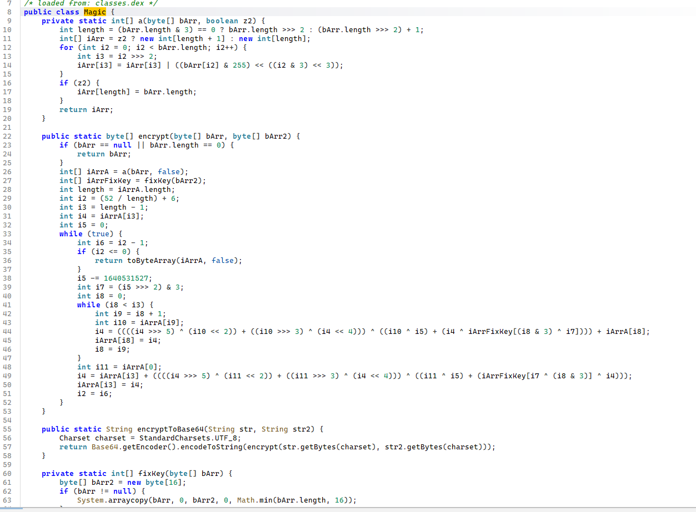
看起来是标准的xxtea，不过测试的时候死活对不上，猜测可能是被改掉/被hook了
然后发现libnative_add.so在init_proc中进行了一些操作，而且字符串均被加密了
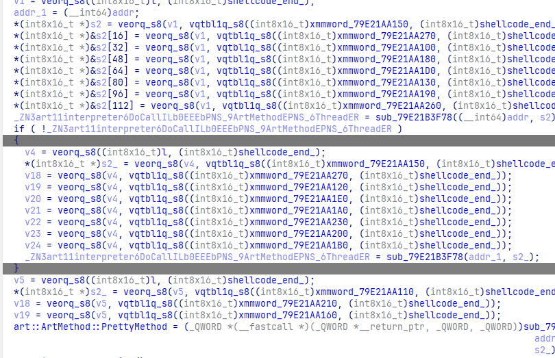
hook恢复出来
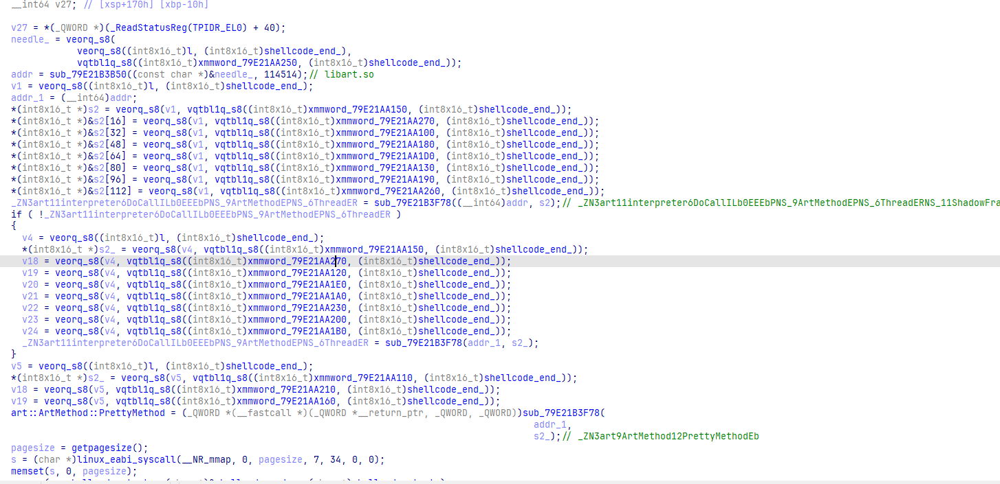
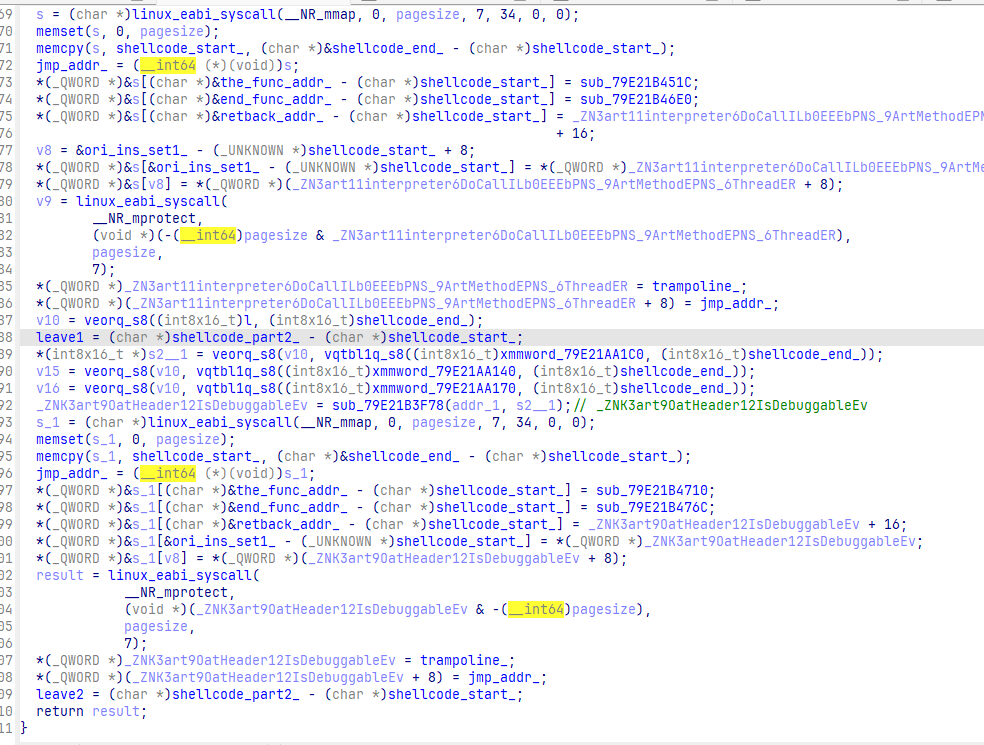
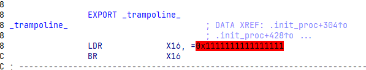
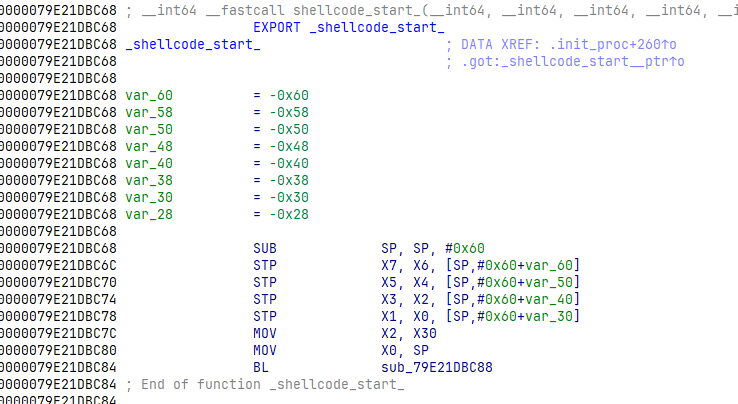
显然是对DoCall这个函数进行hook
不过回调函数在哪呢？？
既然回调函数要被执行，那他的地址就必然会被写入这些跳板指令中
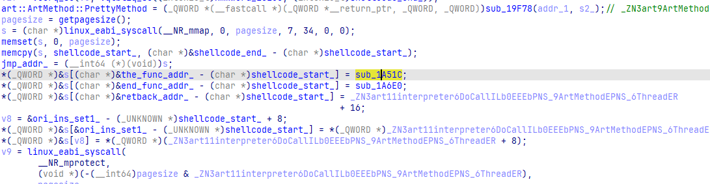
sub_1A51C正是hook的回调函数
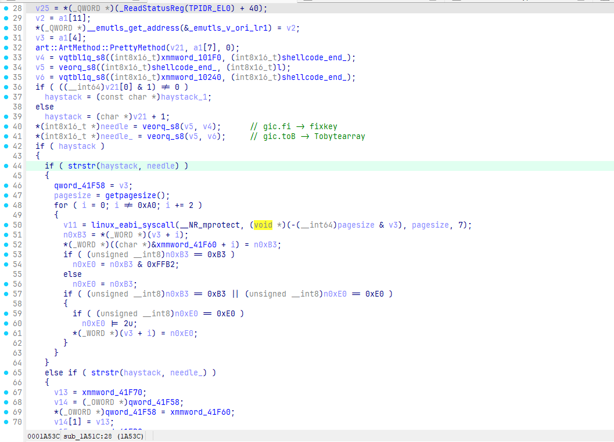
通过调试，我们发现他匹配了fixkey和Tobytearray这两个函数
在进入fixkey函数时，
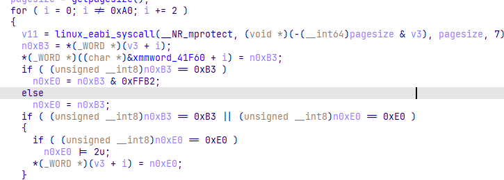
获取修改了一些东西，通过调试，我们发现v3正是指向字节码的指针，修改了几个字节码，我们把它改回去
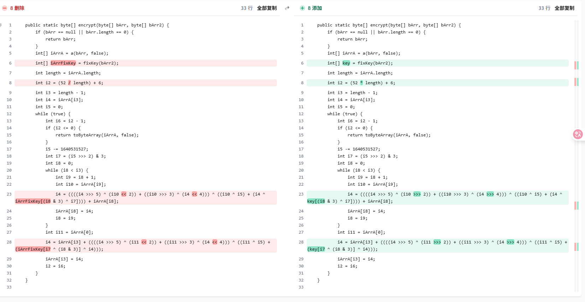
那执行到Tobytearray的时候发生了什么？

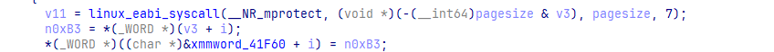
xmmword_41F60保存了原始的字节码，在执行Tobytearray时会把字节码写回去，所以如果要去dump的话，时机要求还是挺高的
```c
#define DELTA 1640531527
#define MX (((z >> 5 ^ y >> 2) + (y >> 3 ^ z >> 4)) ^ ((sum ^ y) + (key[(p & 3) ^ e] ^ z)))

void btea(uint32_t *v, int n, uint32_t const key[4])
{
  uint32_t y, z, sum;
  unsigned p, rounds, e;
  if (n > 1) /* Coding Part */
  {
    rounds = 6 + 52 * n;
    sum = 0;
    z = v[n - 1];
    do
    {
      sum -= DELTA;
      e = (sum >> 2) & 3;
      for (p = 0; p < n - 1; p++)
      {
        y = v[p + 1];
        z = v[p] += MX;
      }
      y = v[0];
      z = v[n - 1] += MX;
    } while (--rounds);
  }
  else if (n < -1) /* Decoding Part */
  {
    n = -n;
    rounds = 6 + 52 * n;
    sum = rounds * (~DELTA + 1);
    y = v[0];
    do
    {
      e = (sum >> 2) & 3;
      for (p = n - 1; p > 0; p--)
      {
        z = v[p - 1];
        y = v[p] -= MX;
      }
      z = v[n - 1];
      y = v[0] -= MX;
      sum += DELTA;
    } while (--rounds);
  }
}
```
## 密文？？？
没找到密文check的地方，只找到了一个类似密文的东西，最后发现确实就是他
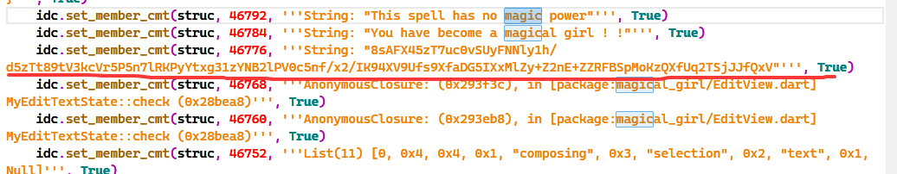
# 2.解密
```c
#include <stdio.h>
#include <stdint.h>
#include <string.h>
#define DELTA 1640531527
#define MX (((z >> 5 ^ y >> 2) + (y >> 3 ^ z >> 4)) ^ ((sum ^ y) + (key[(p & 3) ^ e] ^ z)))

void btea(uint32_t *v, int n, uint32_t const key[4])
{
  uint32_t y, z, sum;
  unsigned p, rounds, e;
  if (n > 1) /* Coding Part */
  {
    rounds = 6 + 52 * n;
    sum = 0;
    z = v[n - 1];
    do
    {
      sum -= DELTA;
      e = (sum >> 2) & 3;
      for (p = 0; p < n - 1; p++)
      {
        y = v[p + 1];
        z = v[p] += MX;
      }
      y = v[0];
      z = v[n - 1] += MX;
    } while (--rounds);
  }
  else if (n < -1) /* Decoding Part */
  {
    n = -n;
    rounds = 6 + 52 * n;
    sum = rounds * (~DELTA + 1);
    y = v[0];
    do
    {
      e = (sum >> 2) & 3;
      for (p = n - 1; p > 0; p--)
      {
        z = v[p - 1];
        y = v[p] -= MX;
      }
      z = v[n - 1];
      y = v[0] -= MX;
      sum += DELTA;
    } while (--rounds);
  }
}

typedef struct
{
  uint32_t eK[44], dK[44]; // encKey, decKey
  int Nr;                  // 10 rounds
} AesKey;

#define BLOCKSIZE 16 // AES-128分组长度为16字节

// uint8_t y[4] -> uint32_t x
#define LOAD32H(x, y)                                                             \
  do                                                                              \
  {                                                                               \
    (x) = ((uint32_t)((y)[0] & 0xff) << 24) | ((uint32_t)((y)[1] & 0xff) << 16) | \
          ((uint32_t)((y)[2] & 0xff) << 8) | ((uint32_t)((y)[3] & 0xff));         \
  } while (0)

// uint32_t x -> uint8_t y[4]
#define STORE32H(x, y)                      \
  do                                        \
  {                                         \
    (y)[0] = (uint8_t)(((x) >> 24) & 0xff); \
    (y)[1] = (uint8_t)(((x) >> 16) & 0xff); \
    (y)[2] = (uint8_t)(((x) >> 8) & 0xff);  \
    (y)[3] = (uint8_t)((x) & 0xff);         \
  } while (0)

// 从uint32_t x中提取从低位开始的第n个字节
#define BYTE(x, n) (((x) >> (8 * (n))) & 0xff)

// 密钥扩展中的SubWord(RotWord(temp),字节替换然后循环左移1位
#define MIX(x) (((S[BYTE(x, 2)] << 24) & 0xff000000) ^ ((S[BYTE(x, 1)] << 16) & 0xff0000) ^ \
                ((S[BYTE(x, 0)] << 8) & 0xff00) ^ (S[BYTE(x, 3)] & 0xff))

// uint32_t x循环左移n位
#define ROF32(x, n) (((x) << (n)) | ((x) >> (32 - (n))))
// uint32_t x循环右移n位
#define ROR32(x, n) (((x) >> (n)) | ((x) << (32 - (n))))

// AES-128轮常量,无符号长整型
static const uint32_t rcon[10] = {
    0x01000000UL, 0x02000000UL, 0x04000000UL, 0x08000000UL, 0x10000000UL,
    0x20000000UL, 0x40000000UL, 0x80000000UL, 0x1B000000UL, 0x36000000UL};
// S盒
unsigned char S[256] = {32, 123, 24, 167, 66, 68, 215, 74, 205, 50, 209, 236, 243, 129, 165, 137, 14, 145, 75, 240, 233, 93, 141, 245, 70, 252, 49, 54, 182, 172, 155, 185, 38, 9, 230, 64, 212, 176, 81, 79, 156, 62, 231, 121, 48, 136, 177, 60, 122, 92, 211, 20, 90, 171, 86, 192, 4, 41, 208, 59, 31, 249, 163, 87, 0, 138, 132, 22, 244, 26, 234, 100, 166, 214, 46, 190, 47, 23, 196, 224, 30, 2, 58, 34, 143, 159, 203, 168, 44, 103, 52, 37, 213, 255, 239, 246, 226, 170, 217, 114, 254, 206, 161, 120, 133, 150, 42, 119, 202, 193, 55, 116, 162, 94, 108, 253, 184, 77, 125, 112, 179, 221, 207, 113, 115, 97, 248, 25, 72, 227, 99, 51, 61, 21, 174, 152, 229, 128, 189, 188, 130, 198, 148, 1, 228, 222, 6, 80, 149, 223, 71, 247, 144, 139, 69, 154, 110, 7, 173, 28, 53, 131, 104, 3, 111, 91, 183, 251, 29, 197, 16, 124, 216, 106, 204, 105, 142, 36, 76, 57, 180, 160, 11, 82, 232, 169, 178, 140, 10, 191, 40, 134, 109, 175, 218, 65, 250, 117, 181, 67, 195, 96, 98, 43, 85, 242, 158, 45, 18, 35, 13, 219, 107, 199, 56, 127, 95, 151, 8, 237, 225, 187, 238, 157, 210, 146, 73, 63, 220, 88, 135, 194, 186, 153, 201, 78, 241, 33, 235, 19, 101, 89, 118, 12, 200, 5, 164, 84, 147, 27, 102, 17, 39, 83, 126, 15};

// 逆S盒
unsigned char inv_S[256] = {64, 143, 81, 163, 56, 245, 146, 157, 218, 33, 188, 182, 243, 210, 16, 255, 170, 251, 208, 239, 51, 133, 67, 77, 2, 127, 69, 249, 159, 168, 80, 60, 0, 237, 83, 209, 177, 91, 32, 252, 190, 57, 106, 203, 88, 207, 74, 76, 44, 26, 9, 131, 90, 160, 27, 110, 214, 179, 82, 59, 47, 132, 41, 227, 35, 195, 4, 199, 5, 154, 24, 150, 128, 226, 7, 18, 178, 117, 235, 39, 147, 38, 183, 253, 247, 204, 54, 63, 229, 241, 52, 165, 49, 21, 113, 216, 201, 125, 202, 130, 71, 240, 250, 89, 162, 175, 173, 212, 114, 192, 156, 164, 119, 123, 99, 124, 111, 197, 242, 107, 103, 43, 48, 1, 171, 118, 254, 215, 137, 13, 140, 161, 66, 104, 191, 230, 45, 15, 65, 153, 187, 22, 176, 84, 152, 17, 225, 248, 142, 148, 105, 217, 135, 233, 155, 30, 40, 223, 206, 85, 181, 102, 112, 62, 246, 14, 72, 3, 87, 185, 97, 53, 29, 158, 134, 193, 37, 46, 186, 120, 180, 198, 28, 166, 116, 31, 232, 221, 139, 138, 75, 189, 55, 109, 231, 200, 78, 169, 141, 213, 244, 234, 108, 86, 174, 8, 101, 122, 58, 10, 224, 50, 36, 92, 73, 6, 172, 98, 194, 211, 228, 121, 145, 149, 79, 220, 96, 129, 144, 136, 34, 42, 184, 20, 70, 238, 11, 219, 222, 94, 19, 236, 205, 12, 68, 23, 95, 151, 126, 61, 196, 167, 25, 115, 100, 93};

/* copy in[16] to state[4][4] */
int loadStateArray(uint8_t (*state)[4], const uint8_t *in)
{
  for (int i = 0; i < 4; ++i)
  {
    for (int j = 0; j < 4; ++j)
    {
      state[j][i] = *in++;
    }
  }
  return 0;
}

/* copy state[4][4] to out[16] */
int storeStateArray(uint8_t (*state)[4], uint8_t *out)
{
  for (int i = 0; i < 4; ++i)
  {
    for (int j = 0; j < 4; ++j)
    {
      *out++ = state[j][i];
    }
  }
  return 0;
}

// 密钥扩展，只接受16字初始密钥
int keyExpansion(const uint8_t *key, uint32_t keyLen, AesKey *aesKey)
{

  if (NULL == key || NULL == aesKey)
  {
    printf("keyExpansion param is NULL\n");
    return -1;
  }

  if (keyLen != 16)
  {
    printf("keyExpansion keyLen = %d, Not support.\n", keyLen);
    return -1;
  }

  uint32_t *w = aesKey->eK; // 加密密钥
  uint32_t *v = aesKey->dK; // 解密密钥

  // 扩展密钥长度44=4*(10+1)个字,原始密钥128位，4个32位字，Nb*(Nr+1)

  /* W[0-3],前4个字为原始密钥 */
  for (int i = 0; i < 4; ++i)
  {
    LOAD32H(w[i], key + 4 * i);
  }

  /* W[4-43] */
  // temp=w[i-1];tmp=SubWord(RotWord(temp))xor Rcon[i/4] xor w[i-Nk]
  for (int i = 0; i < 10; ++i)
  {
    w[4] = w[0] ^ MIX(w[3]) ^ rcon[i];
    w[5] = w[1] ^ w[4];
    w[6] = w[2] ^ w[5];
    w[7] = w[3] ^ w[6];
    w += 4;
  }

  w = aesKey->eK + 44 - 4;
  // 解密密钥矩阵为加密密钥矩阵的倒序，方便使用，把ek的11个矩阵倒序排列分配给dk作为解密密钥
  // 即dk[0-3]=ek[41-44], dk[4-7]=ek[37-40]... dk[41-44]=ek[0-3]
  for (int j = 0; j < 11; ++j)
  {
    for (int i = 0; i < 4; ++i)
    {
      v[i] = w[i];
    }
    w -= 4;
    v += 4;
  }

  return 0;
}

// 轮密钥加
int addRoundKey(uint8_t (*state)[4], const uint32_t *key)
{
  uint8_t k[4][4];

  /* i: row, j: col */
  for (int i = 0; i < 4; ++i)
  {
    for (int j = 0; j < 4; ++j)
    {
      k[i][j] = (uint8_t)BYTE(key[j], 3 - i); /* 把 uint32 key[4] 先转换为矩阵 uint8 k[4][4] */
      state[i][j] ^= k[i][j];
    }
  }

  return 0;
}

// 字节替换
int subBytes(uint8_t (*state)[4])
{
  /* i: row, j: col */
  for (int i = 0; i < 4; ++i)
  {
    for (int j = 0; j < 4; ++j)
    {
      state[i][j] = S[state[i][j]]; // 直接使用原始字节作为S盒数据下标
    }
  }

  return 0;
}

// 逆字节替换
int invSubBytes(uint8_t (*state)[4])
{
  /* i: row, j: col */
  for (int i = 0; i < 4; ++i)
  {
    for (int j = 0; j < 4; ++j)
    {
      state[i][j] = inv_S[state[i][j]];
    }
  }
  return 0;
}

// 行移位
int shiftRows(uint8_t (*state)[4])
{
  uint32_t block[4] = {0};

  /* i: row */
  for (int i = 0; i < 4; ++i)
  {
    // 便于行循环移位，先把一行4字节拼成uint_32结构，移位后再转成独立的4个字节uint8_t
    LOAD32H(block[i], state[i]);
    block[i] = ROF32(block[i], 8 * i); // block[i]循环左移8*i位，如第0行左移0位
    STORE32H(block[i], state[i]);
  }
  return 0;
}

// 逆行移位
int invShiftRows(uint8_t (*state)[4])
{
  uint32_t block[4] = {0};

  /* i: row */
  for (int i = 0; i < 4; ++i)
  {
    LOAD32H(block[i], state[i]);
    block[i] = ROR32(block[i], 8 * i);
    STORE32H(block[i], state[i]);
  }

  return 0;
}

/* Galois Field (256) Multiplication of two Bytes */
// 两字节的伽罗华域乘法运算
uint8_t GMul(uint8_t u, uint8_t v)
{
  uint8_t p = 0;

  for (int i = 0; i < 8; ++i)
  {
    if (u & 0x01)
    {
      p ^= v;
    }

    int flag = (v & 0x80);
    v <<= 1;
    if (flag)
    {
      v ^= 0x1B;
    }

    u >>= 1;
  }

  return p;
}

// 列混合
int mixColumns(uint8_t (*state)[4])
{
  uint8_t tmp[4][4];
  uint8_t M[4][4] = {{0x02, 0x03, 0x01, 0x01},
                     {0x01, 0x02, 0x03, 0x01},
                     {0x01, 0x01, 0x02, 0x03},
                     {0x03, 0x01, 0x01, 0x02}};

  /* copy state[4][4] to tmp[4][4] */
  for (int i = 0; i < 4; ++i)
  {
    for (int j = 0; j < 4; ++j)
    {
      tmp[i][j] = state[i][j];
    }
  }

  for (int i = 0; i < 4; ++i)
  {
    for (int j = 0; j < 4; ++j)
    { // 伽罗华域加法和乘法
      state[i][j] = GMul(M[i][0], tmp[0][j]) ^ GMul(M[i][1], tmp[1][j]) ^ GMul(M[i][2], tmp[2][j]) ^ GMul(M[i][3], tmp[3][j]);
    }
  }

  return 0;
}

// 逆列混合
int invMixColumns(uint8_t (*state)[4])
{
  uint8_t tmp[4][4];
  uint8_t M[4][4] = {{0x0E, 0x0B, 0x0D, 0x09},
                     {0x09, 0x0E, 0x0B, 0x0D},
                     {0x0D, 0x09, 0x0E, 0x0B},
                     {0x0B, 0x0D, 0x09, 0x0E}}; // 使用列混合矩阵的逆矩阵

  /* copy state[4][4] to tmp[4][4] */
  for (int i = 0; i < 4; ++i)
  {
    for (int j = 0; j < 4; ++j)
    {
      tmp[i][j] = state[i][j];
    }
  }

  for (int i = 0; i < 4; ++i)
  {
    for (int j = 0; j < 4; ++j)
    {
      state[i][j] = GMul(M[i][0], tmp[0][j]) ^ GMul(M[i][1], tmp[1][j]) ^ GMul(M[i][2], tmp[2][j]) ^ GMul(M[i][3], tmp[3][j]);
    }
  }

  return 0;
}

// AES-128加密接口，输入key应为16字节长度，输入长度应该是16字节整倍数，
// 这样输出长度与输入长度相同，函数调用外部为输出数据分配内存
int aesEncrypt(const uint8_t *key, uint32_t keyLen, const uint8_t *pt, uint8_t *ct, uint32_t len)
{
  AesKey aesKey;
  uint8_t *pos = ct;
  const uint32_t *rk = aesKey.eK; // 加密密钥指针
  uint8_t out[BLOCKSIZE] = {0};
  uint8_t actualKey[16] = {0};
  uint8_t state[4][4] = {0};

  if (NULL == key || NULL == pt || NULL == ct)
  {
    printf("param err.\n");
    return -1;
  }

  if (keyLen > 16)
  {
    printf("keyLen must be 16.\n");
    return -1;
  }

  if (len % BLOCKSIZE)
  {
    printf("inLen is invalid.\n");
    return -1;
  }

  memcpy(actualKey, key, keyLen);
  keyExpansion(actualKey, 16, &aesKey); // 密钥扩展

  // 使用ECB模式循环加密多个分组长度的数据
  for (int i = 0; i < len; i += BLOCKSIZE)
  {
    // 把16字节的明文转换为4x4状态矩阵来进行处理
    loadStateArray(state, pt);
    // 轮密钥加
    addRoundKey(state, rk);

    for (int j = 1; j < 10; ++j)
    {
      rk += 4;
      subBytes(state);        // 字节替换
      shiftRows(state);       // 行移位
      addRoundKey(state, rk); // 轮密钥加
      mixColumns(state);      // 列混合
    }

    subBytes(state);  // 字节替换
    shiftRows(state); // 行移位
    // 此处不进行列混合
    addRoundKey(state, rk + 4); // 轮密钥加

    // 把4x4状态矩阵转换为uint8_t一维数组输出保存
    storeStateArray(state, pos);

    pos += BLOCKSIZE; // 加密数据内存指针移动到下一个分组
    pt += BLOCKSIZE;  // 明文数据指针移动到下一个分组
    rk = aesKey.eK;   // 恢复rk指针到秘钥初始位置
  }
  return 0;
}

// AES128解密， 参数要求同加密
int aesDecrypt(const uint8_t *key, uint32_t keyLen, const uint8_t *ct, uint8_t *pt, uint32_t len)
{
  AesKey aesKey;
  uint8_t *pos = pt;
  const uint32_t *rk = aesKey.dK; // 解密密钥指针
  uint8_t out[BLOCKSIZE] = {0};
  uint8_t actualKey[16] = {0};
  uint8_t state[4][4] = {0};

  if (NULL == key || NULL == ct || NULL == pt)
  {
    printf("param err.\n");
    return -1;
  }

  if (keyLen > 16)
  {
    printf("keyLen must be 16.\n");
    return -1;
  }

  if (len % BLOCKSIZE)
  {
    printf("inLen is invalid.\n");
    return -1;
  }

  memcpy(actualKey, key, keyLen);
  keyExpansion(actualKey, 16, &aesKey); // 密钥扩展，同加密

  for (int i = 0; i < len; i += BLOCKSIZE)
  {
    // 把16字节的密文转换为4x4状态矩阵来进行处理
    loadStateArray(state, ct);
    // 轮密钥加，同加密
    addRoundKey(state, rk);

    for (int j = 1; j < 10; ++j)
    {
      rk += 4;
      invShiftRows(state);    // 逆行移位
      invSubBytes(state);     // 逆字节替换，这两步顺序可以颠倒
      invMixColumns(state);   // 逆列混合
      addRoundKey(state, rk); // 轮密钥加，同加密
    }

    invShiftRows(state); // 逆行移位
    invSubBytes(state);  // 逆字节替换
    // 此处没有逆列混合
    addRoundKey(state, rk + 4); // 轮密钥加，同加密

    storeStateArray(state, pos); // 保存明文数据
    pos += BLOCKSIZE;            // 输出数据内存指针移位分组长度
    ct += BLOCKSIZE;             // 输入数据内存指针移位分组长度
    rk = aesKey.dK;              // 恢复rk指针到秘钥初始位置
  }
  return 0;
}

int main()
{

  unsigned char enc[] = {0xf2, 0xc0, 0x05, 0x5f, 0x8e, 0x73, 0x4f, 0xbb, 0x9c, 0xd2, 0xf4, 0x94, 0xc8, 0x53, 0x4d, 0x97, 0x2d, 0x61, 0xfd, 0xde, 0x73, 0x4e, 0xdf, 0x3d, 0xb5, 0x5d, 0xe4, 0x71, 0x5a, 0xf9, 0x3f, 0x99, 0xfb, 0x95, 0x12, 0x8f, 0xc9, 0x8b, 0x71, 0x83, 0x7d, 0x73, 0x60, 0xd0, 0x76, 0x94, 0xf5, 0x74, 0x73, 0x99, 0xdf, 0xff, 0x1d, 0xbf, 0x20, 0xaf, 0x78, 0x5d, 0x5f, 0x54, 0x7e, 0xcf, 0x57, 0x7d, 0xa0, 0xc6, 0xe4, 0x85, 0xf1, 0x32, 0x56, 0x72, 0xf9, 0x9d, 0xa7, 0x13, 0xe6, 0x59, 0x44, 0x50, 0x52, 0xa4, 0xca, 0x0a, 0xcd, 0x05, 0xdf, 0x52, 0xad, 0x93, 0x4a, 0x32, 0x49, 0x7d, 0x0c, 0x55, 0x0};
  uint32_t v[] = {1650877538, 875968049, 842479969, 1714696806, 862139446, 1667380838, 912679474, 1631019828};
  uint32_t k[4] = {842610225, 57, 0, 0};
  int n = 24;
  n = 24;
  btea((uint32_t *)enc, -n, k);
  printf("xxtea -> %s\n", enc);
  unsigned char encrypted[] = {0xb0, 0xca, 0x9f, 0xa0, 0xa3, 0xee, 0x7e, 0x58, 0x1c, 0x46, 0xc8, 0xca, 0x69, 0x2f, 0xc9, 0xb1, 0x2a, 0xd4, 0x33, 0xf8, 0xa3, 0x23, 0x2c, 0xb6, 0xd7, 0x3b, 0x54, 0xcf, 0x82, 0xe8, 0x0c, 0x71, 0x53, 0xba, 0x9b, 0xb1, 0xb2, 0xda, 0x3e, 0x43, 0xbe, 0x66, 0x7d, 0x65, 0xdc, 0x10, 0xe5, 0xd5, 0x0};
  unsigned char key[] = {0x7a, 0x25, 0xc5, 0x24, 0xc6, 0x33, 0x4c, 0x30, 0xf3, 0x62, 0xaf, 0xac, 0x3f, 0x23, 0x03, 0xd5};
  unsigned char decrypted[16] = {0};
  aesDecrypt(key, 16, encrypted, decrypted, 48);
  printf("aes ecb -> %s", decrypted);
  return 0;
}
```
​`WMCTF{I_R4@11y_w@n7_70 _84c0m4_@_m@gic@1_Gir1}`​
