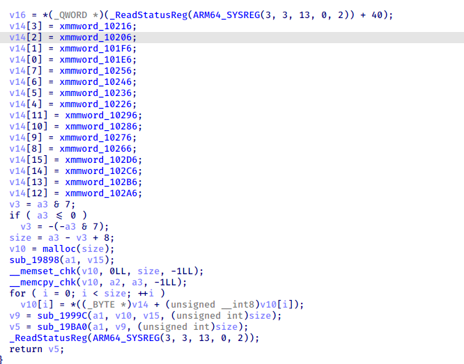
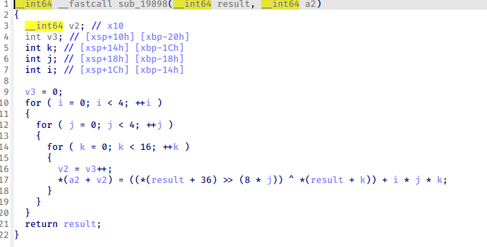
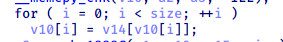
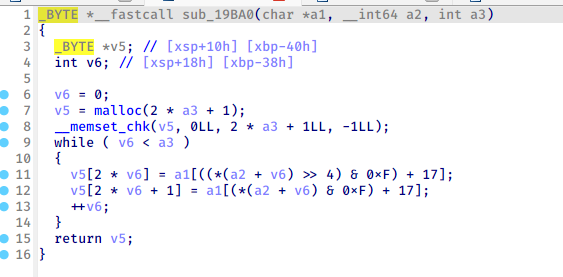
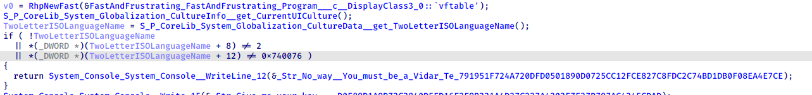
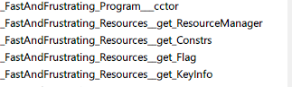
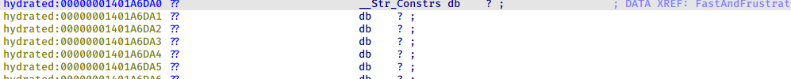
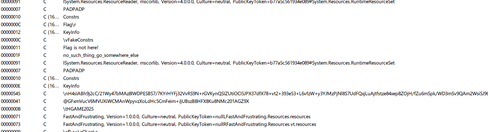
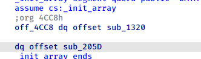
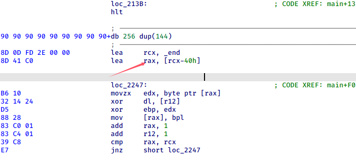

> week2 的题更加难绷啊,感觉大脑被论剑了（呜呜呜

# RE

## `Signin`​

主要是过掉反调试

1.xxtea 加密的 key 由一段程序的硬编码计算而来

​​

而软件断点的原理是用一条软件断点指令替代断点地址所在位置的操作码字节，也就是说通过软件断点得到的 key 是错误的

2.硬件断点的检测

​​

这里的 qword_1400BB880 即为 delta,Dr 寄存器是调试寄存器，储存我们的硬件断点，也就是说 delta 为 0 时才是正常状态

过掉反调试，标准 xxtea，直接解密即可

```c
#include <stdio.h>
#include <stdlib.h>
#include <stdint.h>
#define delta 0
#define DELTA 0
#define MX (((z>>5^y<<2) + (y>>3^z<<4)) ^ ((sum^y) + (key[(p&3)^e] ^ z)))

void btea(uint32_t *v, int n, uint32_t const key[4])
{
    uint32_t y, z, sum;
    unsigned p, rounds, e;
    if (n > 1)            /* Coding Part */
    {
        rounds = 11;
        sum = 0;
        z = v[n-1];
        do
        {
            sum += DELTA;
            e = (sum >> 2) & 3;
            for (p=0; p<n-1; p++)
            {
                y = v[p+1];
                z = v[p] += MX;
            }
            y = v[0];
            z = v[n-1] += MX;
        }
        while (--rounds);
    }
    else if (n < -1)      /* Decoding Part */
    {
        n = -n;
        rounds = 11;
        sum = rounds*DELTA;
        y = v[0];
        do
        {
            e = (sum >> 2) & 3;
            for (p=n-1; p>0; p--)
            {
                z = v[p-1];
                y = v[p] -= MX;
            }
            z = v[n-1];
            y = v[0] -= MX;
            sum -= DELTA;
        }
        while (--rounds);
    }
}


int main()
{
    unsigned int v[] = {0x3050EA23, 0x47514C00, 0x2B769CEE, 0x1794E6D5, 0xB3E42BED, 0x61D536CB, 0x7CA0C2C0, 0x5ED767FE,
        0xC579E0AF};
    unsigned int key[4] = {0x97A25FB5, 0xE1756DBA, 0xA143464A, 0x5A8F284F};

    btea(v,-9,key);
    for(int i=0;i<9;i++)
    {
        printf("%c%c%c%c",*((char*)&v[i]+0),*((char*)&v[i]+1),*((char*)&v[i]+2),*((char*)&v[i]+3));
    }
    return 0;
}
```

## `Mysterious signals`​

Java 层很简单没什么东西

​​

b 是类似签名(最后发现是把密文 16 进制转为字符串)的东西 c 函数是字符串解密函数

c 函数就不分析了，用不到

通过动态注册找到 b 函数，发现是几层加密叠叠乐

key0 的生成，这里注意反调试

​​

​​

进入主加密函数，这里的 v14 其实就是 aes 加密的 sbox，作为 key1

​​

​​

紧接着又生成了一个 key2

​​

第一步加密用 key1(sbox)进行换表

​​

第二步加密用 key2 进行变异 tea 加密

​​

第三步把 16 进制转换为字符串

​​

exp 写的是依托，见谅

```c
#include <stdio.h>
#include <stdint.h>

void encrypt (uint32_t *v,uint32_t *k ){
	uint32_t v0=v[0],v1=v[1],sum=0,i;
	uint32_t delta=0x9e3779b9;
	for(i=0;i<32;i++){
		v0 += (v1>>3)^(v1*4)^(sum+k[2*i])^v1;
		v1 += (v0>>5)^(v0*16)^(sum+k[(2*i+1)])^v0;
		sum += delta;
	}
	// printf("\n%X\n",sum);
	v[0]=v0;v[1]=v1;
}


void decrypt (uint32_t *v,uint32_t *k){
	uint32_t delta=0x9e3779b9;
	uint32_t v0=v[0],v1=v[1],sum=0xC6EF3720,i;

	for (i = 0 ; i < 32 ; i++){
		sum-=delta;
		int idx = 31 - i;
		v1-=(v0>>5)^(v0*16)^(sum+k[(2*idx+1)])^v0;
		v0-=(v1>>3)^(v1*4)^(sum+k[2*idx])^v1;
	}
	v[0]=v0;v[1]=v1;
}

int main()
{
	uint32_t k[]={0x75277321,0x76702174,0x72257326,0x7075217c,0x2500456,0x1075603,0x5520451,0x702560b,0x13411547,0x10164712,0x14431540,0x1613471a,0x20722674,0x23257421,0x27702673,0x25207429,0x75277321,0x76702174,0x72257326,0x7075217c,0x5520556,0x80d5b07,0x105c0d59,0x16106317,0x19451747,0x1e22511a,0x2a572750,0x342f6132,0x29782974,0x3837832d,0x488e418b,0x524a9b4d,0x75277321,0x76702174,0x72257326,0x7075217c,0x8540656,0xf13600b,0x1b661661,0x251e7023,0x1f491947,0x2c2e5b22,0x406b3960,0x524b7b4a,0x327e2c74,0x4d499239,0x69ac5ca3,0x7f74c271,0x75277321,0x76702174,0x72257326,0x7075217c,0xb560756,0x1619650f,0x26701f69,0x342c7d2f,0x254d1b47,0x3a3a652a,0x567f4b70,0x70679562,0x3b842f74,0x625ba145,0x8aca77bb,0xac9ee995},v1[]={0xd61f184b,0xa952b8f8,0x774a3ae2,0x90f6e576,0x1a34715b,0xa594f1f8,0x90d207db,0x4055262d,0xc9e12213,0xd0ea9a1,0x9c807686,0x62474808};


	for (int i = 0; i < 6 ;i++) {
		decrypt(&v1[2*i],k);
	printf("0x%X,0x%X,",v1[2*i],v1[2*i+1]);
	}
	return 0;
}
```

```python
import struct
table = list("0123456789abcdef")
enc = list("4b181fd6f8b852a9e23a4a7776e5f6905b71341af8f194a5db07d2902d2655401322e1c9a1a90e0d8676809c08484762")

plain3 = [0x3CEF8545,0xAA9A214D,0x18969A4D,0x23D8C712,0xD81223C3,0xAAC30418,0x230712D8,0x7EFD812,0x23180433,0xAAC34343,0x63FF04EF,0x63636363]

char_list = []
for num in plain3:
    byte1 = (num >> 24) & 0xFF
    byte2 = (num >> 16) & 0xFF
    byte3 = (num >> 8) & 0xFF
    byte4 = num & 0xFF

    print(hex(byte4))
    print(hex(byte3))
    print(hex(byte2))
    print(hex(byte1))


for i in range(len(enc1)//2):
    for j in range(256):
        if enc1[2*i] == table[(j>>4)&0xf] and enc1[2*i+1] == table[j&0xf]:
            print(j,end=',')
print()

# v2 = v3++;
        # *(a2 + v2) = ((*(result + 36) >> (8 * j)) ^ *(result + k)) + i * j * k;
key1 = []

key0=list("e7c10e42b7a68e14")
key = 0x11223344
v3 = 0
for i in range(4):
    for j in range(4):
        for k in range(16):
            key1.append((((key>>(8*j))^ord(key0[k]))+i*j*k)&0xff)
# print(key1)


plain1=[]

for i in range(48):
    v9 = 0;
    v8 = 0;
    for j in range(16):
        if enc[i] == table[j]:
            v9 = j
            break
    for j in range(16):
        if enc[i+1] == table[j]:
            v8 = j
            break
    plain1.append((v8 & 0xF) + 16 * v9)

# for i in range(12):
#     print(hex(struct.unpack('>I', bytes(plain1)[4*i:4*i+4])[0]),end=',')

print()
# print(plain1)


v10=[0x45,0x85,0xef,0x3c,0x4d,0x21,0x9a,0xaa,0x4d,0x9a,0x96,0x18,0x12,0xc7,0xd8,0x23,0xc3,0x23,0x12,0xd8,0x18,0x04,0xc3,0xaa,0xd8,0x12,0x07,0x23,0x12,0xd8,0xef,0x07,0x33,0x04,0x18,0x23,0x43,0x43,0xc3,0xaa,0xef,0x04,0xff,0x63,0x63,0x63,0x63,0x63]
sbox=[  0x63, 0x7C, 0x77, 0x7B, 0xF2, 0x6B, 0x6F, 0xC5, 0x30, 0x01,
  0x67, 0x2B, 0xFE, 0xD7, 0xAB, 0x76, 0xCA, 0x82, 0xC9, 0x7D,
  0xFA, 0x59, 0x47, 0xF0, 0xAD, 0xD4, 0xA2, 0xAF, 0x9C, 0xA4,
  0x72, 0xC0, 0xB7, 0xFD, 0x93, 0x26, 0x36, 0x3F, 0xF7, 0xCC,
  0x34, 0xA5, 0xE5, 0xF1, 0x71, 0xD8, 0x31, 0x15, 0x04, 0xC7,
  0x23, 0xC3, 0x18, 0x96, 0x05, 0x9A, 0x07, 0x12, 0x80, 0xE2,
  0xEB, 0x27, 0xB2, 0x75, 0x09, 0x83, 0x2C, 0x1A, 0x1B, 0x6E,
  0x5A, 0xA0, 0x52, 0x3B, 0xD6, 0xB3, 0x29, 0xE3, 0x2F, 0x84,
  0x53, 0xD1, 0x00, 0xED, 0x20, 0xFC, 0xB1, 0x5B, 0x6A, 0xCB,
  0xBE, 0x39, 0x4A, 0x4C, 0x58, 0xCF, 0xD0, 0xEF, 0xAA, 0xFB,
  0x43, 0x4D, 0x33, 0x85, 0x45, 0xF9, 0x02, 0x7F, 0x50, 0x3C,
  0x9F, 0xA8, 0x51, 0xA3, 0x40, 0x8F, 0x92, 0x9D, 0x38, 0xF5,
  0xBC, 0xB6, 0xDA, 0x21, 0x10, 0xFF, 0xF3, 0xD2, 0xCD, 0x0C,
  0x13, 0xEC, 0x5F, 0x97, 0x44, 0x17, 0xC4, 0xA7, 0x7E, 0x3D,
  0x64, 0x5D, 0x19, 0x73, 0x60, 0x81, 0x4F, 0xDC, 0x22, 0x2A,
  0x90, 0x88, 0x46, 0xEE, 0xB8, 0x14, 0xDE, 0x5E, 0x0B, 0xDB,
  0xE0, 0x32, 0x3A, 0x0A, 0x49, 0x06, 0x24, 0x5C, 0xC2, 0xD3,
  0xAC, 0x62, 0x91, 0x95, 0xE4, 0x79, 0xE7, 0xC8, 0x37, 0x6D,
  0x8D, 0xD5, 0x4E, 0xA9, 0x6C, 0x56, 0xF4, 0xEA, 0x65, 0x7A,
  0xAE, 0x08, 0xBA, 0x78, 0x25, 0x2E, 0x1C, 0xA6, 0xB4, 0xC6,
  0xE8, 0xDD, 0x74, 0x1F, 0x4B, 0xBD, 0x8B, 0x8A, 0x70, 0x3E,
  0xB5, 0x66, 0x48, 0x03, 0xF6, 0x0E, 0x61, 0x35, 0x57, 0xB9,
  0x86, 0xC1, 0x1D, 0x9E, 0xE1, 0xF8, 0x98, 0x11, 0x69, 0xD9,
  0x8E, 0x94, 0x9B, 0x1E, 0x87, 0xE9, 0xCE, 0x55, 0x28, 0xDF,
  0x8C, 0xA1, 0x89, 0x0D, 0xBF, 0xE6, 0x42, 0x68, 0x41, 0x99,
  0x2D, 0x0F, 0xB0, 0x54, 0xBB, 0x16]


for i in v10:
    for j in range(256):
        if i == sbox[j]:
            print(chr(j),end='')
            break

```

## `Fast and frustrating`​

aot 逆向，相当逆天，死去的线性代数又开始攻击我了

​主逻辑所在位置

​​

这里是第一次验证，验证了当前语言所属国家名称（这个 api 好像在 win11 aot 下有问题 无法返回正常值，不使用 aot 编译就能得到不清楚什么问题，而且好像没有缩写是 vt 的国家吧？？？）

​​

这里取出了一个字符串进行 base64 解码，gunzip 和反序列化操作得到一个 Constrs 对象

​​

字符串来自 Resouces 类下的 get 函数

​​

​​

但是这个字符串并未初始化，进字符串搜索

​​

成功找到

​​

给了一个 27\*27 的矩阵还有一个向量

​​

这里的一大坨我是没看懂，不过我猜可能是输入变成向量和矩阵相乘等于给出的向量

z3 解出结果，key 为 CompressedEmbeddedResources，按理来说，输入 key 应该就会得到 flag,但是报错了？！！

​​

在这里其实存在两种语言，只有 vt 这个语言才能正常进行解密

虽然我们绕过了最开始的语言检测，但是系统识别到的语言没有改变，也就不会加载 FastAndFrustrating.Resources.vt.resources 对应的正确数据，所以我们应该找到一种方法绕过这种机制

翻看 net 的源码发现

​​

通过修改 ResFileExtension 即可走正常的执行流

​​

这里注意修改 0xd 那里，这是字符串长度

​​

## ​`Nop'd`​

​`这个更是烧脑`​

​​

main 函数 fork 了一个子进程，让子进程执行游戏，父进程 ptrace 子进程，这样就没办法对子线程进行调试了

​​

​​

构造函数指定了 main 函数终止后的函数，

​​

这个函数进行了一系列复杂的操作，很难看懂，不过他使用 ptrace 读取和修改了数据，那我们就可以使用 LD_PRELOAD 这一特性对其读写内容进行监听

```c
#include <stdio.h>
#include <stdlib.h>
#include <string.h>
#include <dlfcn.h>
#define PTRACE_TRACEME		   0
#define PTRACE_PEEKTEXT		   1
#define PTRACE_PEEKDATA		   2
#define PTRACE_PEEKUSR		   3
#define PTRACE_POKETEXT		   4
#define PTRACE_POKEDATA		   5
#define PTRACE_POKEUSR		   6
#define PTRACE_CONT		   7
#define PTRACE_KILL		   8
#define PTRACE_SINGLESTEP	   9
#define PTRACE_GETREGS		12
#define PTRACE_SETREGS		13
#define PTRACE_GETXTREGS	18
#define PTRACE_SETXTREGS	19
#define PTRACE_GETHBPREGS	20
#define PTRACE_SETHBPREGS	21
#define PTRACE_GETFDPIC		22
# define R15	0
# define R14	1
# define R13	2
# define R12	3
# define RBP	4
# define RBX	5
# define R11	6
# define R10	7
# define R9	8
# define R8	9
# define RAX	10
# define RCX	11
# define RDX	12
# define RSI	13
# define RDI	14
# define ORIG_RAX 15
# define RIP	16
# define CS	17
# define EFLAGS	18
# define RSP	19
# define SS	20
# define FS_BASE 21
# define GS_BASE 22
# define DS	23
# define ES	24
# define FS	25
# define GS	26
void AppendDataToFile(char* msg)
{
    FILE* fp = fopen("./1.txt", "a+");
    if (fp==0)
    {
        printf("can't open log file\n");
        return;
    }
    fseek(fp, 0, SEEK_END);
    fwrite(msg, strlen(msg), 1, fp);
    fclose(fp);


}


long ptrace(int request, int pid, void *addr, void *data) {
    char msg[100]={0};
    unsigned long addr1 = 0x555555554000+0x5100;
    long int (*orig_ptrace)(int request, int pid, void *addr, void *data);
    orig_ptrace = dlsym((void *) -1, "ptrace");
    long int result = orig_ptrace(request, pid, addr, data);
    // sprintf(msg,"pid -> %d\n",pid);
    // AppendDataToFile(msg);
    // sprintf(msg,"request -> %d\n",request);
    // AppendDataToFile(msg);
    if (request == PTRACE_SETREGS){
        unsigned long rip = *((unsigned long*)data + 16)- 0x555555554000;
        sprintf(msg,"SETREGS: rip: 0x%lx\n", rip);
        AppendDataToFile(msg);
        unsigned long r12 = *((unsigned long*)data + 3)- 0x555555554000;
        sprintf(msg,"SETREGS: r12: 0x%lx\n", r12);
        AppendDataToFile(msg);
        unsigned long rax = *((unsigned long*)data + 10);
        sprintf(msg,"SETREGS: rax: %ld\n", rax);
        //sprintf(msg,"SETREGS: rip: 0x%lx\n", rip);
    } else if (request == PTRACE_POKETEXT|| request == PTRACE_POKEDATA){
        sprintf(msg,"POKETEXT: (addr , data) = (0x%lx , 0x%lx)\n", (unsigned long)addr- 0x555555554000, (unsigned long)data);
    } else if (request == PTRACE_PEEKTEXT|| request == PTRACE_PEEKDATA) {
        sprintf(msg,"PEEKTEXT: (addr , data) = (0x%lx , 0x%lx)\n", (unsigned long)addr- 0x555555554000, (unsigned long)result);
    }
    if (strlen(msg)!=0) {
        AppendDataToFile(msg);
    }
    return result;
}


int memcmp(const void *str1, const void *str2, size_t n)
 {
    char msg[100]={0};
    sprintf(msg,"memcmp -> %lX -- %lX-- len -> %d\n",*(unsigned long *)str1,*(unsigned long *)str2,n);
    AppendDataToFile(msg);
    int (*orig_memcmp)(const void *str1, const void *str2, size_t n);
    orig_memcmp = dlsym((void *) -1, "memcmp");
    //orig_memcmp(str1,str2,n)
    return 0;
}
```

这里直接使用 pwntools 把地址随机化关闭

运行即可得到日志

分析日志我们发现，launcher 从 syscall 旁边读取数据，经过运算得到 opcode，然后取出 game 中保存的数据进行操作

​​

观察几个加密函数

​​

发现一处简单的运算，还原后发现是 chacha20 加密的特征

既然这样，那我们就可以直接取出最后一次生成的矩阵直接用来加密

​​

不过在 launcher 中我们并未找到最后一步的加密，难道在 game 中吗？？

​​

果然，这里的 rax 指向我们的输入，下面跟生成的矩阵和一个值异或

这里的值其实就是​

可以将 rax 打印出来验证

取出值解密即可

```python
key = [0x4a,0x69,0x5b,0x2a,0xf3,0x87,0x56,0x46,0xf3,0x7,0x74,0xc6,0x65,0x73,0xd6,0x16,0x45,0xfe,0xd9,0x98,0x3,0x76,0xb3,0x6d,0x50,0xe0,0x96,0xf7,0x4c,0xbc,0xb0,0xa4,0xea,0xf2,0xdc,0x93,0xd8,0x38,0x8,0xa7,0x23,0xde,0x6b,0x3b,0x87,0x84,0x6e,0xd1,0x4,0x4d,0xc3,0x2a,0x56,0x3f,0xee,0x8,0xa3,0xd8,0x76,0xe6,0x6b,0xbc,0x48,0xca]

delta = 70

enc = [0x64, 0x6A, 0x50, 0x17, 0x81, 0x7D, 0x6F, 0x1A, 0x87, 0xB1,
  0xA4, 0x00, 0x09, 0x03, 0xF8, 0x8D, 0xF8, 0x6B, 0xDF, 0x32,
  0x5F, 0x40, 0x90, 0x9C, 0xB8, 0x3D, 0x86, 0x13, 0x26, 0xB7,
  0x63, 0xF7, 0x74, 0xE8, 0x53, 0xED, 0x58, 0x20, 0x4F, 0xD9,
  0x99, 0x26, 0x21, 0x37, 0xDE, 0x35, 0x76, 0xC8, 0xBC, 0xD0,
  0x6E]


for i in range(51):
  enc[i]=enc[i]^key[i]^delta
  delta=(delta^key[i]^enc[i])
  print(chr(enc[i]),end='')


```

‍

‍
