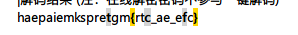
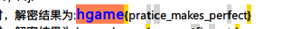
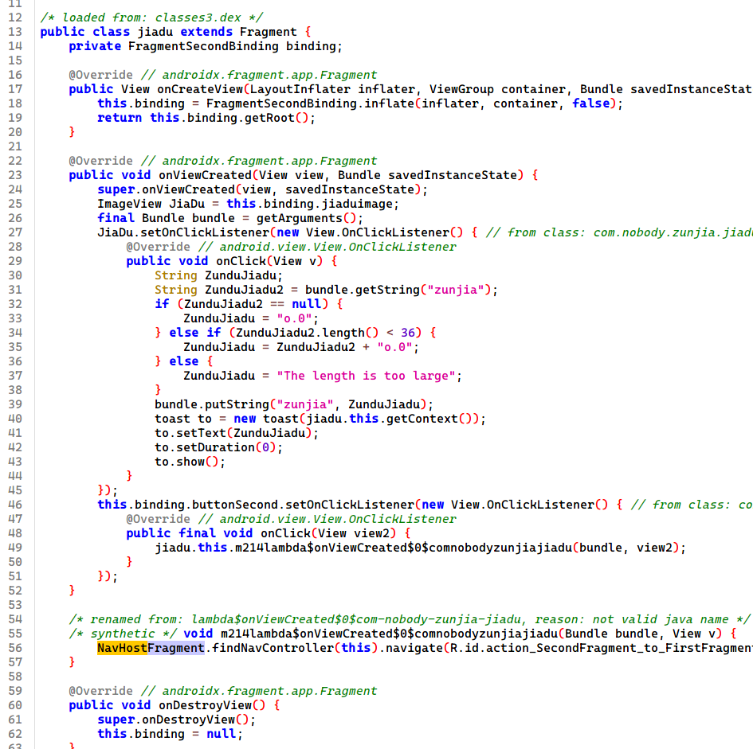
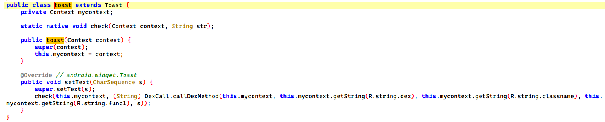
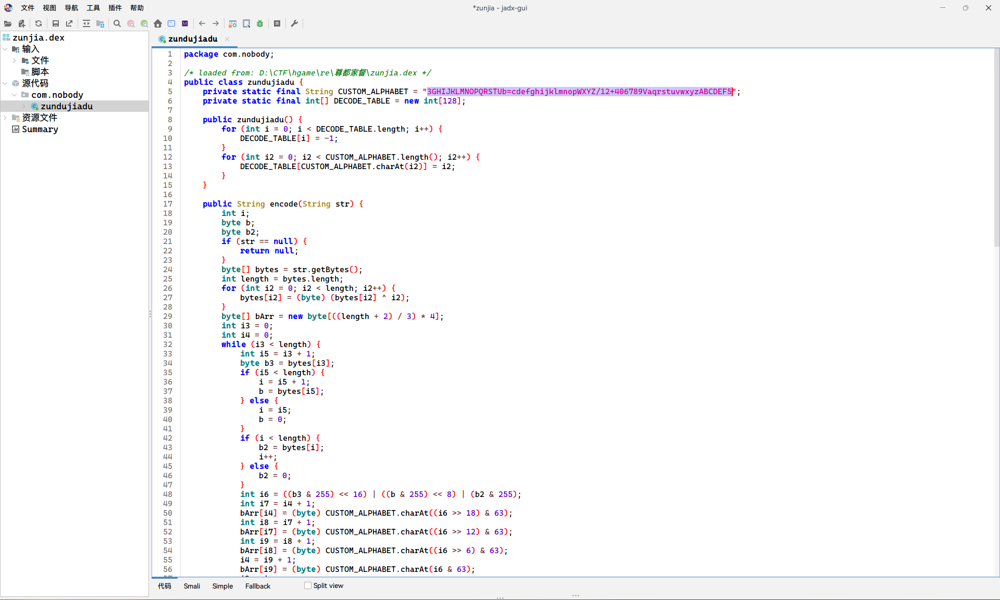
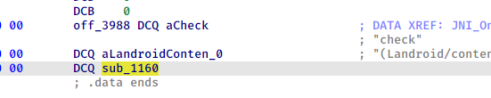
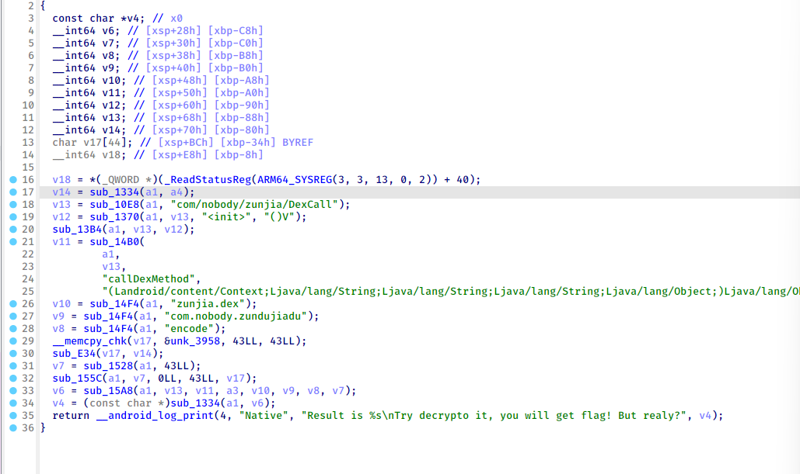
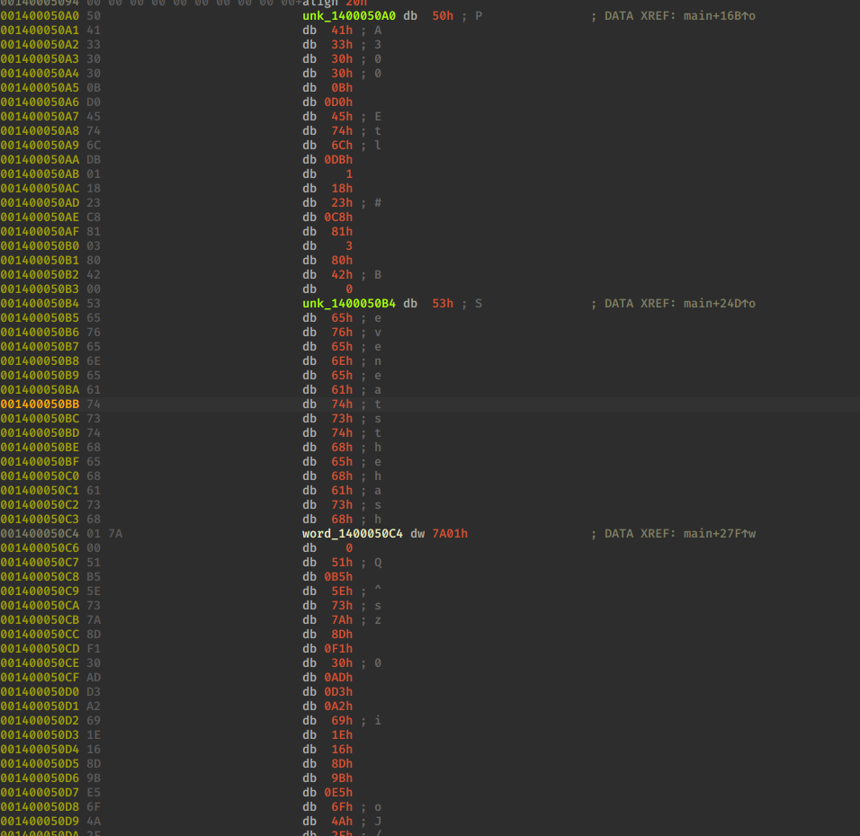
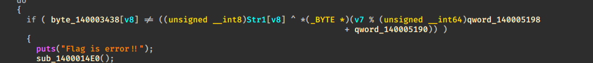

# Misc

## ​`Computer cleaner`​

检材删掉了（呜呜呜，硬盘要被我塞满了

vmware 打开虚拟机发现 apache2 服务，找到 log，发现 php 得到第一段 flag

直接访问攻击者 ip 得到第二段

log 里面看到对一个文件进行操作，得到第三段 flag

‍

# WEB

## ​`Level 24 Pacman`​

js 被混淆了，不过只看字符串发现几个 base64 加密后的字符串，尝试解密

​​

​​

# RE

## ​`尊嘟假嘟`​

jadx 打开，分析下

1 个 activity 有两种`Fragment`​

​​

一个尊都一个假嘟

看下具体逻辑

​​

按钮和 ImageView 注册了点击事件，还有个自定义 toast，进去看下

​​

发现关键 check，跟进

​​

动态加载 dex

​​

assets 里面发现加密后的 dex

这里其实方法有很多

1.frida hook loadDexFile 通杀动态加载 dex

2.修改 smali，不让 dex 删除

3.分析 so 算法，进行解密

4.内存 dump

​​

一个 base64 算法

接下来分析 check

​​

jni_onload 动态注册，init_array 也没有骚操作

​​

算法挺简单的，标准 rc4

​​

密码是这里的 ZunduJiadu 经过上面的 base64 算法编码的结果

密码不确定，只能爆破了

```java
import java.util.Arrays;

public class Main {
    static String str1 = "0.o";
    static String str2 = "o.0";
    static String str3 = "The length is too large";
    public static void main(String[] args) {
        zundujiadu zundujiadu = new zundujiadu();
        generate("",0);
        generate(str3,9);
    }

    public static String generate(String str,int i) {
        if (i==12) {
            return str;
        }

        System.out.println(zundujiadu.encode(str+str1.toString()));
        System.out.println(zundujiadu.encode(str+str2.toString()));

        generate(str+str1,i+1);
        generate(str+str2,i+1);
        return str;
    }
}
```

获取所有可能的 key，批量解密，得到 flag

‍

‍

## `Turtle`​

有个 upx 壳，修复了特征 upx -d 还是脱不下来，只好手脱了，参考[upx 手动脱壳及其 UPX 修改的特征.note](https://note.youdao.com/ynoteshare/index.html?id=4cf3674c623238e8c9afba857c1755d1&type=note&_time=1738644658827)

​​

经过了两次 rc4，直接解密即可

```python
def rc4_decrypt(cipher, key):
    S = list(range(256))
    j = 0
    # KSA
    for i in range(256):
        j = (j + S[i] + key[i % len(key)]) % 256
        S[i], S[j] = S[j], S[i]

    # PRGA
    i = j = 0
    plain = []
    for byte in cipher:
        i = (i + 1) % 256
        j = (j + S[i]) % 256
        S[i], S[j] = S[j], S[i]
        k = S[(S[i] + S[j]) % 256]
        plain.append(byte ^ k)
    return bytes(plain)

# 解密Key
key1 = b"yekyek"
cipher_key = bytes([0xCD, 0x8F, 0x25, 0x3D, 0xE1, 0x51, 0x4A])
decrypted_key = rc4_decrypt(cipher_key, key1)
print(f"Decrypted Key: {decrypted_key}")

def rc4_decryp1(cipher, key):
    S = list(range(256))
    j = 0
    # KSA
    for i in range(256):
        j = (j + S[i] + key[i % len(key)]) % 256
        S[i], S[j] = S[j], S[i]

    # PRGA
    i = j = 0
    plain = []
    for byte in cipher:
        i = (i + 1) % 256
        j = (j + S[i]) % 256
        S[i], S[j] = S[j], S[i]
        k = S[(S[i] + S[j]) % 256]
        plain.append((byte + k)%256)
    return bytes(plain)
# 解密Flag
cipher_flag = bytes([
  0xF8, 0xD5, 0x62, 0xCF, 0x43, 0xBA, 0xC2, 0x23, 0x15, 0x4A,
  0x51, 0x10, 0x27, 0x10, 0xB1, 0xCF, 0xC4, 0x09, 0xFE, 0xE3,
  0x9F, 0x49, 0x87, 0xEA, 0x59, 0xC2, 0x07, 0x3B, 0xA9, 0x11,
  0xC1, 0xBC, 0xFD, 0x4B, 0x57, 0xC4, 0x7E, 0xD0, 0xAA, 0x0A
])
decrypted_flag = rc4_decryp1(cipher_flag, decrypted_key)
print(f"Decrypted Flag: {decrypted_flag.decode()}")
```

## ​`Delta Erro0000ors`​

非常好的题，使我的大脑旋转

exe 有个 try catch 修复一下

​​

加载了 msdelta，进行动态的修补，delta 被硬编码在文件中

​​

注意到储存 md5 的地方信息已经被修改，那就要绕过校验或者干掉校验

[Windows 差异化补丁 MSDelta 之研究 | Ikoct 的饮冰室](https://1k0ct.github.io/2024/04/29/Windows%E5%B7%AE%E5%BC%82%E5%8C%96%E8%A1%A5%E4%B8%81MSDelta%E4%B9%8B%E7%A0%94%E7%A9%B6/)

本来想绕过的，没想到不太行（我是采购呜呜呜

只能 patch 掉 msdelta 校验的地方了，由于是微软的 dll，所以网上可以直接下载 dll 的 pdb 辅助分析

最终在 compo::CheckBuffersIdentityFactory::CheckBuffersIdentityComponent::InternalProcess 找到校验处

patch 掉 if 判断即可干掉校验

​​

最后根据判断这个解密（这里别忘记 String 最后的\0
