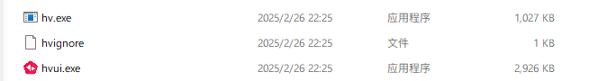
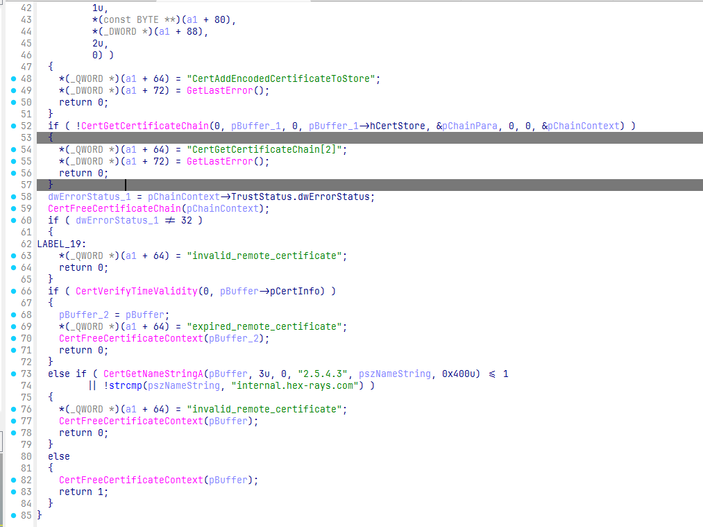
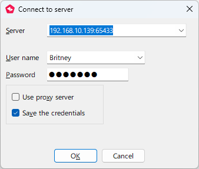
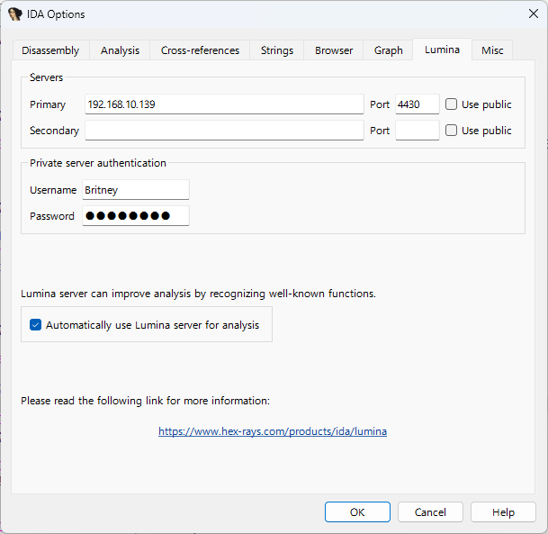
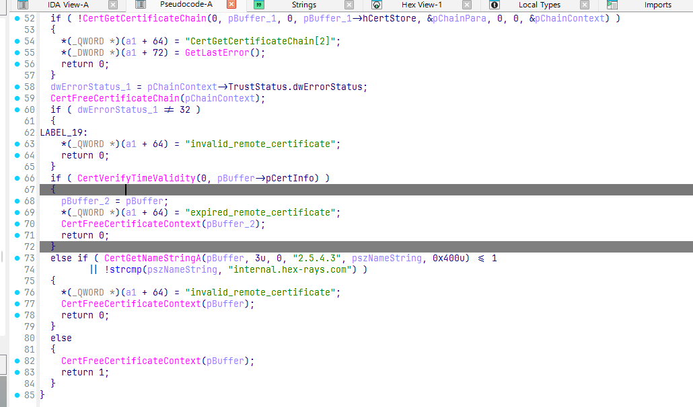
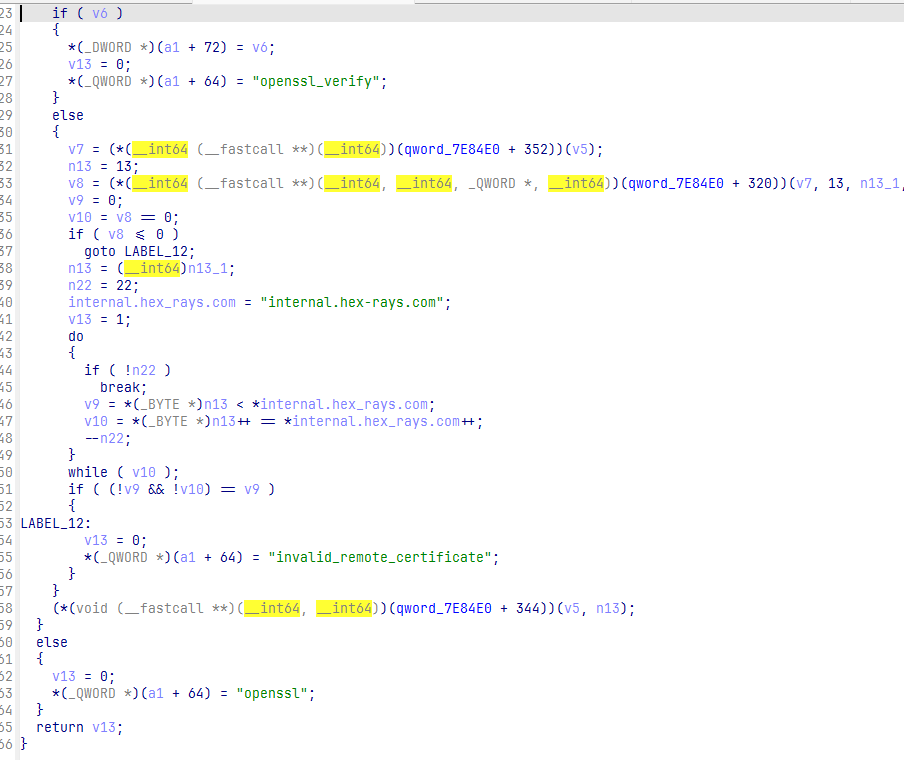
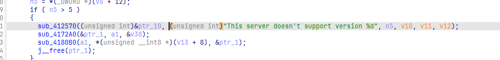

​[`[下载]hexvault\_server\_90\_cracked-安全工具-看雪论坛-安全社区|非营利性质技术交流社区`](https://bbs.kanxue.com/thread-283770.htm)​
​[`IDA Pro 9.0 RC1 Lumina Server Cracked-安全工具-看雪论坛-安全社区|非营利性质技术交流社区`](https://bbs.kanxue.com/thread-283761.htm)​
本次搭建的环境使用的是`Ubuntu22.04`​
官方文档[`Teams server | Hex-Rays Docs`](https://docs.hex-rays.com/admin-guide/teams-server)​
# Vault Server
## 1.创建用户
​`其实不创建应该也可以，不过创建了可以省很多步骤`​
​`这里的用户名可以自定义，记得后面的操作都把用户名改掉`​
```shell
sudo useradd -r -s /usr/sbin/nologin -d /opt/hexvault -M hexvault
```
把压缩包文件全部放到/opt/hexvault
注意：`/opt/hexvault`​文件夹及其子文件夹和子文件，所有者都必须是`hexvault`​，否则服务器可能初始化不了
## 2.修改配置文件
修改hexvault.conf中`Data Source`​为hexvault用户的工作目录
修改`teams_server.hexlic`​ `vault_server.crt`​ `vault_server.key`​ `hexvault.conf`​ 的权限为640
```shell
chmod 640 teams_server.hexlic
chmod 640 vault_server.*
chmod 640 hexvault.conf
```
## 3.创建数据库
```shell
sudo -u hexvault ./vault_server --config-file hexvault.conf --vault-dir ./files --recreate-schema
```
## 4.测试服务器
```shell
sudo -u hexvault ./vault_server --config-file hexvault.conf \
  --certchain-file vault_server.crt --privkey-file vault_server.key \
  --license-file teams_server.hexlic --vault-dir ./files
```
## 5.添加服务
修改`hexvault.service`​为自己的配置，参考：
```conf
# Place this file in /lib/systemd/system/

[Unit]
Description=Hex-Rays vault daemon

[Service]
Type=simple
Environment=INSTALL_PATH=/opt/hexvault
ExecStart=/opt/hexvault/vault_server -f ${INSTALL_PATH}/hexvault.conf -l ${INSTALL_PATH}/logs/vault_server.log -c ${INSTALL_PATH}/hexvault.crt -k ${INSTALL_PATH}/hexvault.key -L ${INSTALL_PATH}/hexvault.lic -d ${INSTALL_PATH}/files
User=hexvault

[Install]
WantedBy=multi-user.target

```
添加到系统服务并启动
```shell
sudo cp hexvault.service /etc/systemd/system/
sudo systemctl enable hexvault.service
sudo systemctl start hexvault.service
```
# Vault Client
Client默认是开启TLS的，使用crack包里自带的证书始终无法连接，自己生成的证书也无法连接，索性直接干掉client的TLS校验

hv和hvui即为Vault的Client，两者的校验相同，可以用相同方式去掉

借助字符串可以找到校验位置
把`invalid_remote_certificate`​和`expired_remote_certificate`​ 的路径全部patch掉，patch掉即可连接

第一个登入服务器的人会被设置为管理员
# Lumina Server
## 1.创建用户
```shell
sudo useradd -r -s /usr/sbin/nologin -d /opt/lumina -M lumina
```
把压缩包文件全部放到/opt/lumina
注意：`/opt/lumina`​文件夹及其子文件夹和子文件，所有者都必须是`lumina`​，否则服务器可能初始化不了
## 2.初始化SQL数据库
​`mysql和mariadb都可`​
```shell
>sudo mysql -uroot -p
[sudo] password for aundro:
Enter password:
Welcome to the MySQL monitor.  Commands end with ; or \g.
Your MySQL connection id is 14306
Server version: 10.1.48-MySQL-0+deb9u2 Debian 9.13

Copyright (c) 2000, 2018, Oracle, MySQL Corporation Ab and others.

Type 'help;' or '\h' for help. Type '\c' to clear the current input statement.

MySQL [(none)]> create user lumina@localhost;
Query OK, 0 rows affected (0.00 sec)

MySQL [(none)]> set password for lumina@localhost = PASSWORD('<snipped>');
Query OK, 0 rows affected (0.00 sec)

MySQL [(none)]> grant all on *.* to lumina@localhost;
Query OK, 0 rows affected (0.00 sec)

MySQL [(none)]> ALTER USER lumina@localhost IDENTIFIED WITH mysql_native_password BY '<snipped>';
Query OK, 0 rows affected (0.00 sec)

MySQL [(none)]> create database lumina;
Query OK, 1 row affected (0.00 sec)

MySQL [(none)]> [Ctrl+C] Bye
```
​`MySQL [(none)]> set password for lumina@localhost = PASSWORD('<snipped>');`​
这一步，如果是高版本`mysql`​或者`mariadb`​则要改为
​`ALTER USER 'lumina'@'127.0.0.1' IDENTIFIED BY '<snipped>';`​
## 3.修改配置文件
需要把`lumina.conf`​ 中的数据库配置改为第二步中设置的
如果要使用`vault`​进行身份验证，则需要指定`vault`​服务地址
```shell
VAULT_HOST="192.168.10.139:65433"
```
修改`lumina_server.hexlic`​ `lumina_server.crt`​ `lumina_server.key`​ `lumina.conf`​ 的权限为640
```shell
chmod 640 lumina_server.hexlic
chmod 640 lumina_server.*
chmod 640 lumina.conf
```
## 4.创建数据库
```shell
sudo -u lumina ./lumina_server --config-file lumina.conf \
                                --certchain-file lumina_server.crt \
                                --privkey-file lumina_server.key \
                                --recreate-schema lumina
```
​`recreate-schema`​ 指定的是身份校验模式，可以选择 `lumina`​ 和 `vault`​
如果选择 `vault`​ 还需要对`lumina`​ 服务器进行patch，详见 `Lumina和Vault的连接问题`​
## 5.测试服务器
```shell
sudo -u lumina ./lumina_server --config-file lumina.conf \
                      --certchain-file lumina_server.crt \
                      --privkey-file lumina_server.key
```
## 6.添加服务
修改`hexvault.service`​为自己的配置，参考：
```conf
# This is an example systemd service definition for a default installation.
# Edit this file and copy it to /etc/systemd/system/lumina.service, then handle
# it as any systemd service.

[Unit]
Description=Lumina daemon
Wants=network-online.target
After=network-online.target
After=mysql.service
After=mariadb.service

[Service]
Type=simple
ExecStart=/opt/lumina/lumina_server -f /opt/lumina/lumina.conf -p 65433 -D /opt/lumina/badreqs -l /opt/lumina/logs/lumina_server.log -c /opt/lumina/lumina_server.crt -k /opt/lumina/lumina_server.key -p 4430
User=lumina

[Install]
WantedBy=multi-user.target

```
添加到系统服务并启动
```shell
sudo cp lumina.service /etc/systemd/system/
sudo systemctl enable lumina.service
sudo systemctl start lumina.service
```
# Lumina Client
Lumina Client是内置在ida中的，在任务栏可以看到

在 `Optons->General->Lumina`​ 可以设置`Lumina`​服务器地址和登录账户

Lumina Client同样存在TLS校验，同样patch去除


同样借助字符串定位到校验位置

把`invalid_remote_certificate`​和`expired_remote_certificate`​ 的路径全部patch掉
# Lumina和Vault的连接问题
当Lumina使用Vault进行身份验证时，Lumina也使用了TLS

依旧是字符串定位，patch掉所有返回0的路径即可，这样Lumina才能正常连接到Vault
# Lumina的版本问题
此次泄露的是9.0版本
Lumina不允许不支持的高版本连接低版本，但是相邻版本间还是能通用的

patch掉即可，测试9.2可以正常连接